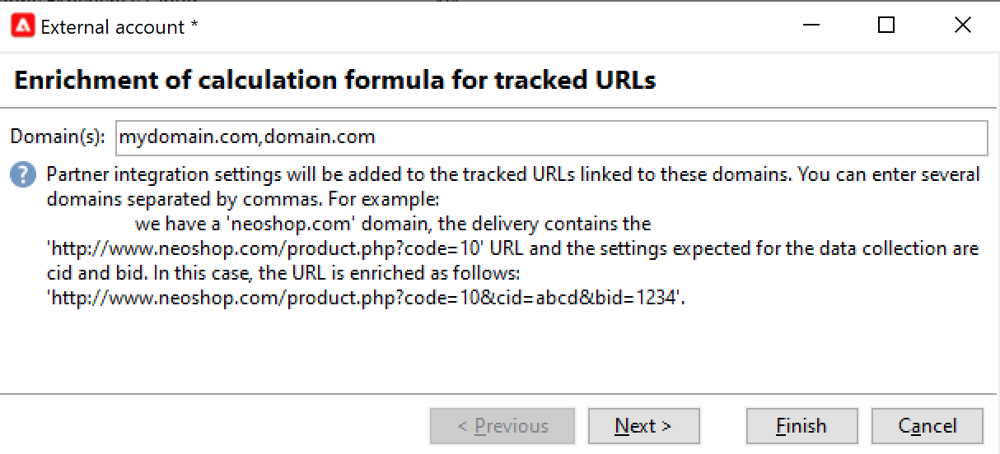
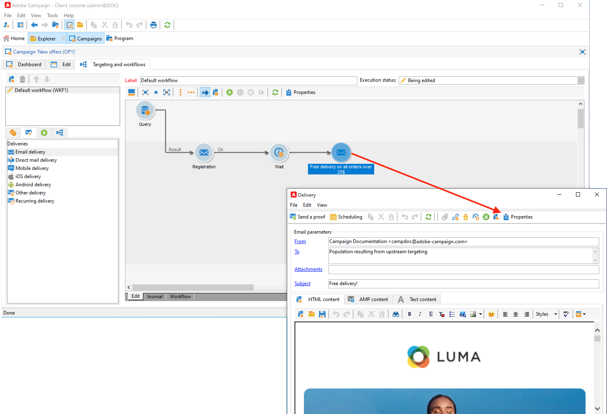

# Campaign 및 Adobe Analytics 작업

Campaign과 Analytics를 통합하도록 Adobe Analytics을 구성할 수 있습니다.

이 통합을 통해 Adobe Campaign 및 Adobe Analytics은 **웹 분석 커넥터** 추가 기능. 이 통합은 Adobe Campaign에서 게재한 이메일 캠페인의 지표와 특성을 Adobe Analytics으로 보냅니다.

  관리 Cloud Service 사용자는 [연락처 Adobe](../start/campaign-faq.md#support) Adobe Experience Cloud 서비스 및 솔루션과 Campaign을 연결합니다. Web Analytics 커넥터 추가 기능은 전용 패키지를 통해 환경에 설치해야 합니다.

Adobe Campaign에는 Adobe Analytics 커넥터를 사용하여 인터넷 대상자를 측정하는 방법(웹 분석)이 있습니다. Adobe Campaign은 웹 분석 도구를 통해 지표와 캠페인 속성을 Analytics에 전달할 수 있습니다.

각 도구의 동작 둘레는 다음과 같습니다.

* **Adobe Analytics** Adobe Campaign으로 시작한 이메일 캠페인을 표시합니다.

* **Adobe Campaign** 지표 및 캠페인 속성을 커넥터로 전송하면 커넥터가 이 속성을 웹 분석 도구에 전달합니다

>[!CAUTION]
>
>Adobe Analytics 커넥터는 트랜잭션 메시지(메시지 센터)와 호환되지 않습니다.

Campaign-Analytics 연결을 설정하려면 다음 작업을 수행해야 합니다.

1. [Adobe Analytics에서 보고서 세트 만들기](#report-suite-analytics)
1. [전환 변수 및 성공 이벤트 구성](#configure-conversion-success)
1. [Adobe Campaign 에서 외부 계정 구성](#external-account-ac)

## Analytics 보고서 세트 만들기 {#report-suite-analytics}

다음을 만들려면 **[!UICONTROL Report suite]** 위치: [!DNL Adobe Analytics]을(를) 클릭하고 아래 단계를 수행합니다.

1. [!DNL Adobe Analytics]에서 **[!UICONTROL Admin tab]**&#x200B;을 선택한 다음 **[!UICONTROL All admin]**&#x200B;를 클릭합니다.

   

1. **[!UICONTROL Report suites]**&#x200B;를 클릭합니다.

   

1. **[!UICONTROL Report suite manager]** 페이지에서 **[!UICONTROL Create new]**&#x200B;를 클릭한 다음 **[!UICONTROL Report suite]**&#x200B;를 클릭합니다.

   **[!UICONTROL Report suite]** 만들기에 대한 자세한 절차는 이 [섹션](https://experienceleague.adobe.com/docs/analytics/admin/manage-report-suites/new-report-suite/t-create-a-report-suite.html#prerequisites)을 참조하십시오.

   

1. 템플릿을 선택합니다.

1. 다음 정보로 새 보고서 세트를 구성합니다.

   * **[!UICONTROL Report Suite ID]**
   * **[!UICONTROL Site Title]**
   * **[!UICONTROL Time Zone]**
   * **[!UICONTROL Go Live Date]**
   * **[!UICONTROL Estimated Page Views Per Day]**

   

1. 구성된 경우 **[!UICONTROL Create report suite]**&#x200B;를 클릭합니다.

## 전환 변수 및 성공 이벤트 구성 {#configure-conversion-success}

**[!UICONTROL Report suite]**&#x200B;를 작성한 후 다음과 같이 **[!UICONTROL Conversion variables]** 및 **[!UICONTROL Success events]**&#x200B;를 구성해야 합니다.

1. 이전에 구성한 **[!UICONTROL Report suite]**&#x200B;를 선택합니다.

1. **[!UICONTROL Edit settings]** 버튼에서, **[!UICONTROL Conversion]** > **[!UICONTROL Conversion variables]**&#x200B;를 선택합니다.

   

1. 이메일 캠페인의 영향을 측정하는 데 필요한 식별자, 즉, 내부 캠페인 이름(cid) 및 iNmsBroadlog(bid) 테이블 ID를 만들려면 **[!UICONTROL Add new]**&#x200B;를 클릭합니다.

   **[!UICONTROL Conversion variables]**&#x200B;을(를) 편집하는 방법에 대해 알아보려면 이 [섹션](https://experienceleague.adobe.com/docs/analytics/admin/admin-tools/conversion-variables/t-conversion-variables-admin.html#admin-tools)을 참조하십시오.

   

1. 구성을 완료하면 **[!UICONTROL Save]** 을(를) 클릭합니다.

1. 그런 다음 **[!UICONTROL Success events]**&#x200B;을(를) 만들려면 **[!UICONTROL Edit settings]** 버튼에서 **[!UICONTROL Conversion]** > **[!UICONTROL Success events]**&#x200B;을(를) 선택합니다.

   

1. **[!UICONTROL Add new]**&#x200B;을(를) 클릭하여 다음 **[!UICONTROL Success events]**&#x200B;을(를) 구성합니다.

   * **[!UICONTROL Clicked]**
   * **[!UICONTROL Opened]**
   * **[!UICONTROL Person clicks]**
   * **[!UICONTROL Processed]**
   * **[!UICONTROL Scheduled]**
   * **[!UICONTROL Sent]**
   * **[!UICONTROL Total bounces]**
   * **[!UICONTROL Unique Clicks]**
   * **[!UICONTROL Unique Opens]**
   * **[!UICONTROL Unsubscribed]**

   **[!UICONTROL Success events]**&#x200B;를 구성하는 방법에 대해 알아보려면 이 [섹션](https://experienceleague.adobe.com/docs/analytics/admin/admin-tools/success-events/t-success-events.html#admin-tools)을 참조하십시오.

   

1. 구성을 완료하면 **[!UICONTROL Save]** 을(를) 클릭합니다.

보고서 세트가 구성되면 다음을 구성해야 합니다 **[!UICONTROL External accounts]** Adobe Campaign.

## Campaign 외부 계정 구성 {#external-account-ac}

이제 두 솔루션 간에 동기화를 활성화하려면 Adobe Campaign에서 **[!UICONTROL Web Analytics]** 외부 계정을 구성해야 합니다.

외부 계정을 구성할 때 **[!UICONTROL Report suite]**, **[!UICONTROL Conversion variables]** 또는 **[!UICONTROL Success events]** 중 하나가 표시되지 않으면 사용자와 연결된 **[!UICONTROL Product profile]**&#x200B;에서 새로 만든 이 구성 요소에 대한 권한이 누락되었음을 의미합니다.

자세한 내용은 [Adobe Analytics용 제품 프로필](https://experienceleague.adobe.com/docs/analytics/admin/admin-console/permissions/product-profile.html#product-profile-admins) 페이지를 참조하십시오.

1. Adobe Campaign 트리의 **[!UICONTROL Administration]** > **[!UICONTROL Platform]** > **[!UICONTROL External accounts]** 폴더로 이동하여 **[!UICONTROL New]**&#x200B;을(를) 클릭합니다.

   

1. 드롭다운 목록을 사용하여 **[!UICONTROL Web Analytics]** 유형과 **[!UICONTROL Adobe Analytics]**&#x200B;을(를) **[!UICONTROL Integration]** 드롭다운에서 선택합니다.

   

1. **[!UICONTROL Integration]** 드롭다운 옆에 있는 **[!UICONTROL Configure]** 을(를) 클릭합니다.

1. **[!UICONTROL Configure Analytics integration]** 창에서 앞서 만든 보고서 세트 중 다음 정보를 제공하는 세트와 외부 계정을 매핑합니다.

   * **[!UICONTROL E-Mail]**
   * **[!UICONTROL IMS Org]**
   * **[!UICONTROL Analytics Company]**
   * **[!UICONTROL Report Suite]**

1. **[!UICONTROL eVars]** 카테고리에서 [!DNL Adobe Analytics]에 구성된 두 **[!UICONTROL Conversion variables]**&#x200B;을(를) 매핑합니다.

   

1. **[!UICONTROL Events]** 카테고리에서 [!DNL Adobe Analytics]에 구성된 10개의 **[!UICONTROL Success events]**&#x200B;을(를) 매핑합니다.

1. 구성을 완료하면 **[!UICONTROL Submit]** 을(를) 클릭합니다. Adobe Campaign은 매핑된 Analytics **[!UICONTROL Report Suite]**&#x200B;에 **[!UICONTROL Data source]**, **[!UICONTROL Calculated metrics]**, **[!UICONTROL Remarketing segments]** 및 **[!UICONTROL Classifications]**&#x200B;을(를) 만듭니다.

   [!DNL Adobe Analytics]와(과) Adobe Campaign 간의 동기화가 완료되면 창을 닫을 수 있습니다.

1. 설정은 **[!UICONTROL Configure Analytics integration]** 창의 **[!UICONTROL Data Settings]** 탭에서 볼 수 있습니다.

   **[!UICONTROL Sync]** 버튼을 사용하면 [!DNL Adobe Campaign]이(가) [!DNL Adobe Analytics]에서 수행한 이름 변경 사항을 동기화합니다. 구성 요소가 [!DNL Adobe Analytics]에서 삭제되면 구성 요소는 [!DNL Adobe Campaign]에서 취소되거나 **을 찾을 수 없음** 메시지와 함께 표시됩니다.

   

   >[!NOTE]
   >
   > 이 Campaign v8 버전에서는 세그먼트를 추가하거나 제거할 수 없습니다.

1. **[!UICONTROL External account]**&#x200B;에서 **[!UICONTROL Enrich the formula...]** 링크를 클릭하여 URL 계산 공식을 변경해서 웹 분석 도구 통합 정보(캠페인 ID)와 활동을 추적해야 하는 사이트의 도메인을 지정합니다.

   

1. 사이트의 도메인 이름을 지정합니다.

   

1. **[!UICONTROL Next]**&#x200B;을(를) 클릭하고 도메인 이름이 저장되었는지 확인합니다.

   

1. 필요한 경우 계산 공식에 과부하를 걸 수 있습니다. 이렇게 하려면 상자를 선택하고 창에서 바로 공식을 편집합니다.

   >[!IMPORTANT]
   >
   >이 구성 모드는 전문가 사용자용으로 예약되어 있습니다. 이 수식에 오류가 발생하면 이메일 게재가 중지될 수 있습니다.

1. **[!UICONTROL Advanced]** 탭에서는 더 많은 기술 설정을 구성하거나 수정할 수 있습니다.

   * **[!UICONTROL Lifespan]**: 기술 워크플로우로 Adobe Campaign에서 웹 이벤트가 복구되는 지연 시간(일)을 지정할 수 있도록 해줍니다. 기본값: 180일.
   * **[!UICONTROL Persistence]**: 모든 웹 이벤트(예: 구매)가 리마케팅 캠페인에 귀속될 수 있는 기간을 지정할 수 있습니다. 기본값: 7일.

>[!NOTE]
>
>여러 대상 측정 도구를 사용하는 경우 외부 계정을 만들 때 **[!UICONTROL Partners]** 드롭다운 목록에서 **[!UICONTROL Other]**&#x200B;을(를) 선택할 수 있습니다. 게재 속성에서 하나의 외부 계정만 참조할 수 있습니다.따라서 Adobe에서 기대하는 매개 변수와 사용된 다른 모든 측정 도구를 추가하여 추적된 URL의 공식을 조정해야 합니다.

## 웹 분석 프로세스의 기술 워크플로우 {#technical-workflows-of-web-analytics-processes}

Adobe Campaign과 Adobe Analytics 간의 데이터 교환은 백그라운드 작업으로 실행되는 기술 워크플로우에서 처리합니다.

이 워크플로우는 캠페인 탐색기 트리의 **[!UICONTROL Administration]** > **[!UICONTROL Production]** > **[!UICONTROL Technical workflows]** > **[!UICONTROL Web analytics process]** 폴더를 삭제합니다.

다음 **[!UICONTROL Sending of indicators and campaign attributes]** 워크플로우를 사용하면 Adobe Analytics Connector를 사용하여 Adobe Campaign을 통해 Adobe Experience Cloud으로 이메일 캠페인 지표를 보낼 수 있습니다. 이 워크플로우는 매일 오전 4시에 트리거되며 데이터를 Analytics에 전송하는 데 24시간이 걸릴 수 있습니다.

이 워크플로우를 다시 시작하지 않아야 합니다. 그렇지 않으면 Analytics 결과를 왜곡할 수 있는 모든 이전 데이터가 다시 전송됩니다.

관련 지표는 다음과 같습니다.

* **[!UICONTROL Messages to deliver]** (@toDeliver)
* **[!UICONTROL Processed]** (@processed)
* **[!UICONTROL Success]** (@success)
* **[!UICONTROL Total count of opens]** (@totalRecipientOpen)
* **[!UICONTROL Recipients who have opened]** (@recipientOpen)
* **[!UICONTROL Total number of recipients who clicked]** (@totalRecipientClick)
* **[!UICONTROL People who clicked]** (@personClick)
* **[!UICONTROL Number of distinct clicks]** (@recipientClick)
* **[!UICONTROL Opt-Out]** (@optOut)
* **[!UICONTROL Errors]** (@error)

>[!NOTE]
>
>전송된 데이터는 지표 데이터에서 음수 값을 초래할 수 있는 마지막 스냅샷을 기반으로 하는 델타입니다.

전송된 속성은 다음과 같습니다.

* **[!UICONTROL Internal name]** (@internalName)
* **[!UICONTROL Label]** (@label)
* **[!UICONTROL Label]** (operation/@label): **Campaign** 패키지가 설치된 경우에만
* **[!UICONTROL Nature]** (operation/@nature): **Campaign** 패키지가 설치된 경우에만
* **[!UICONTROL Tag 1]** (webAnalytics/@tag1)
* **[!UICONTROL Tag 2]** (webAnalytics/@tag2)
* **[!UICONTROL Tag 3]** (webAnalytics/@tag3)
* **[!UICONTROL Contact date]** (scheduling/@contactDate)

## 게재 추적 {#tracking-deliveries-in-adobe-campaign}

Adobe Campaign에서 게재를 보낸 후 Adobe Experience Cloud가 사이트에서 활동을 추적할 수 있도록 하려면 게재 속성에서 일치하는 커넥터를 참조해야 합니다. 그렇게 하려면 다음 단계를 적용합니다.

1. 추적할 캠페인 게재를 엽니다.

   

1. 게재 속성을 엽니다.
1. **[!UICONTROL Web Analytics]** 탭으로 이동하여 이전에 만든 외부 계정을 선택합니다. 을(를) 참조하십시오 [Adobe Campaign에서 외부 계정 구성](#external-account-ac).

   

1. 이제 Adobe Analytics에서 게재를 보내고 보고서에 액세스할 수 있습니다.

**관련 항목**

* [Campaign - Experience Cloud 트리거 통합](ac-triggers.md)
