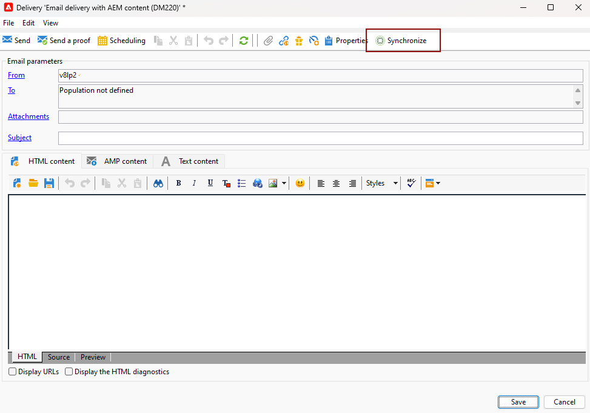
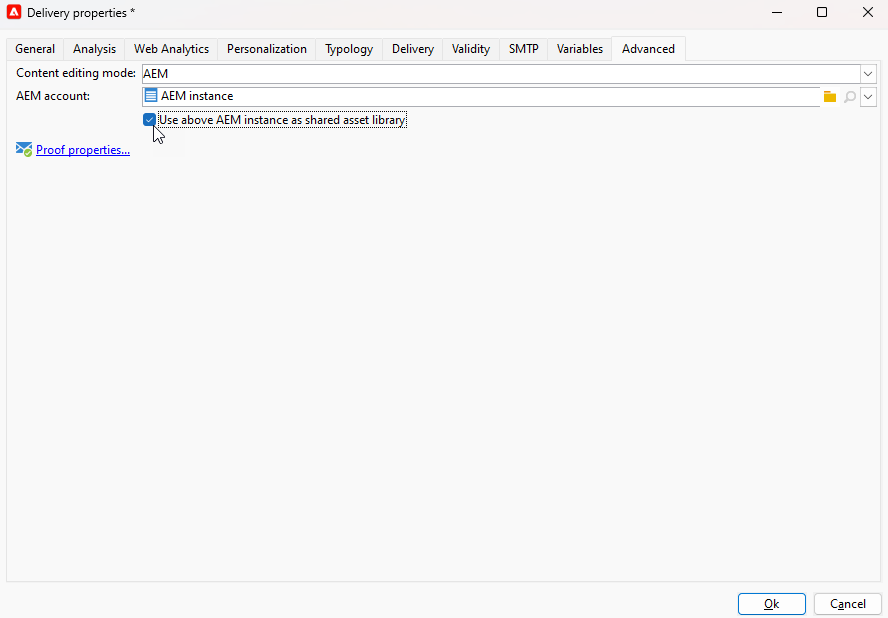

# Campaign 및 Adobe Experience Manager 작업 {#ac-aem}

Adobe Campaign과 Adobe Experience Manager 간의 통합을 통해 이메일 게재의 콘텐츠와 양식을 Adobe Experience Manager에서 직접 관리할 수 있습니다. 다음을 가져올 수 있습니다. **Adobe Experience Manager** 콘텐츠를 Campaign에 포함하거나 다음을 연결합니다. **Adobe Experience Manager as a Cloud service** 계정을 통해 웹 인터페이스에서 직접 콘텐츠를 편집할 수 있습니다.

 [Campaign 웹 인터페이스 내에서 Adobe Experience Manager을 Cloud Service 콘텐츠로 편집하는 방법에 대해 알아봅니다](https://experienceleague.adobe.com/docs/campaign-web/v8/integrations/aem-content.html?lang=en)

 [이 문서에서 Adobe Experience Manager에 대해 자세히 알아보기](https://experienceleague.adobe.com/docs/experience-manager-65/administering/integration/campaignonpremise.html#aem-and-adobe-campaign-integration-workflow)

## Adobe Experience Manager에서 컨텐츠 가져오기 {#integrating-with-aem}

  관리 Cloud Service 사용자는 [연락처 Adobe](../start/campaign-faq.md#support) Adobe Experience Manager을 Campaign과 통합하기 위해

예를 들어 이 통합을 사용하여 Adobe Experience Manager에서 뉴스레터를 생성하고 이메일 캠페인의 일부로 Adobe Campaign에서 사용할 수 있습니다.

**Adobe Experience Manager에서:**

1. 다음으로 이동 [!DNL Adobe Experience Manager] 작성자 인스턴스를 클릭하고 페이지의 왼쪽 상단 모서리에 있는 Adobe 경험 을 클릭합니다. 선택 **[!UICONTROL Sites]** 메뉴에서 삭제할 수 있습니다.

   

1. 액세스 **[!UICONTROL Campaigns > Name of your brand (here we.Shopping) > Main Area > Email]**.

1. 클릭 **[!UICONTROL Create]** 및 선택 **[!UICONTROL Page]** 드롭다운 메뉴를 통해 액세스합니다.

   

1. 다음 항목 선택 **[!UICONTROL Adobe Campaign Email]** 템플릿을 만들고 뉴스레터 이름을 지정합니다.

1. 페이지를 만든 후 **[!UICONTROL Page information]** 메뉴 및 클릭 **[!UICONTROL Open Properties]**.

   

1. Adobe Campaign의 개인화 필드와 같은 구성 요소를 추가하여 이메일 콘텐츠를 사용자 지정합니다. [자세히 알아보기](https://experienceleague.adobe.com/docs/experience-manager-65/content/sites/authoring/aem-adobe-campaign/campaign.html?lang=en#editing-email-content)

1. 이메일이 준비되면 다음 위치로 이동합니다. **[!UICONTROL Page information]** 메뉴 및 클릭 **[!UICONTROL Start workflow]**.

   

1. 첫 번째 드롭다운에서 **[!UICONTROL Approve Adobe Campaign]** 워크플로우 모델로 사용하고 클릭 **[!UICONTROL Start workflow]**.

   

1. 페이지 맨 위에 다음과 같은 내용이 면책조항이 나타납니다. `This page is subject to the workflow Approve for Adobe Campaign`. 클릭 **[!UICONTROL Complete]** 면책조항 옆에 있는 을 클릭하여 검토를 확인하고 **[!UICONTROL Ok]**.

1. 클릭 **[!UICONTROL Complete]** 다시 한 번 선택 **[!UICONTROL Newsletter approval]** 다음에서 **[!UICONTROL Next Step]** 드롭다운.

   

이제 뉴스레터가 준비되었으며 Adobe Campaign에서 동기화되었습니다.

**Adobe Campaign에서:**

1. 다음에서 **[!UICONTROL Campaigns]** 탭을 클릭하고 **[!UICONTROL Deliveries]** 그러면 **[!UICONTROL Create]**.

1. 다음을 선택합니다. **[!UICONTROL Email delivery with AEM content (mailAEMContent)]** 템플릿 위치: **[!UICONTROL Delivery template]** 드롭다운 메뉴.

   

1. 추가 **[!UICONTROL Label]** 게재 후 클릭 **[!UICONTROL Continue]**.

1. 클릭 **[!UICONTROL Synchronize]** 을 클릭하여 AEM 게재에 액세스합니다.

   인터페이스에 단추가 표시되지 않으면 다음 위치로 이동하십시오. **[!UICONTROL Properties]** 버튼 및 액세스 **[!UICONTROL Advanced]** 탭. 다음을 확인합니다. **[!UICONTROL Content editing mode]** 필드가 다음으로 구성됨: **[!UICONTROL AEM]**&#x200B;을 클릭하고 AEM 인스턴스 세부 사항을 **[!UICONTROL AEM account]** 필드.

   

1. 이전에 만든 AEM 게재 선택 [!DNL Adobe Experience Manager] 을(를) 클릭하여 확인 **[!UICONTROL Ok]**.

   

1. 을(를) 클릭하여 **[!UICONTROL Refresh content]** AEM 게재를 수정할 때마다 단추

   

1. Experience Manager과 캠페인 간의 연결을 제거하려면 **[!UICONTROL Desynchronize]**.

이제 이메일을 대상자에게 보낼 준비가 되었습니다.

## Adobe Experience Manager Assets 라이브러리에서 자산 가져오기 {#assets-library}

에서 직접 에셋을 삽입할 수도 있습니다. [!DNL Adobe Experience Manager Assets Library] Adobe Campaign에서 이메일 또는 랜딩 페이지를 편집하는 동안. 이 기능은에 자세히 설명되어 있습니다. [Adobe Experience Manager Assets 설명서](https://experienceleague.adobe.com/docs/experience-manager-65/content/assets/managing/manage-assets.html?lang=en).

**Adobe Experience Manager에서:**

1. 다음으로 이동 [!DNL Adobe Experience Manager] 작성자 인스턴스를 클릭하고 페이지의 왼쪽 상단 모서리에 있는 Adobe 경험 을 클릭합니다. 선택 **[!UICONTROL Assets]** `>` **[!UICONTROL Files]** 메뉴에서 삭제할 수 있습니다.

   

1. 클릭 **만들기** 그러면 **파일** 에셋을 로 가져오려면 **Adobe Experience Manager Assets 라이브러리**. [자세히 알아보기](https://experienceleague.adobe.com/docs/experience-manager-65/content/assets/managing/manage-assets.html?lang=en#uploading-assets)

   

1. 필요한 경우 에셋 이름을 변경하고 을 선택합니다. **업로드**.

이제 에셋이 **Adobe Experience Manager Assets 라이브러리**.

**Adobe Campaign에서:**

1. Adobe Campaign에서 를 찾아 새 게재를 만듭니다. **캠페인** 탭을 클릭하고 **게재** 을(를) 클릭하고 **만들기** 기존 게재 목록 위에 있는 단추입니다.

   

1. 선택 **게재 템플릿**&#x200B;그런 다음 게재 이름을 지정합니다.

1. 메시지 콘텐츠를 정의하고 개인화합니다. [자세히 알아보기](../send/email.md)

1. 을(를) 사용하려면 **Adobe Experience Manager Assets 라이브러리**, 액세스 **[!UICONTROL Properties]** AEM 게재 후 선택 **[!UICONTROL Advanced]** 탭.

   다음 항목 선택 **AEM 계정** 및 활성화 **[!UICONTROL Use above AEM instance as shared asset library]** 옵션을 선택합니다.

   

1. 다음에서 **이미지** 아이콘, 액세스 **[!UICONTROL Select a shared asset]** 메뉴 아래의 제품에서 사용할 수 있습니다.

   

1. 선택 창에서 **Adobe Experience Manager Assets 라이브러리**, 그런 다음 **선택**.

   

이제 에셋이 이메일 게재에 업로드됩니다. 이제 타겟 대상을 지정하고, 게재를 확인하고, 전송을 진행할 수 있습니다.
