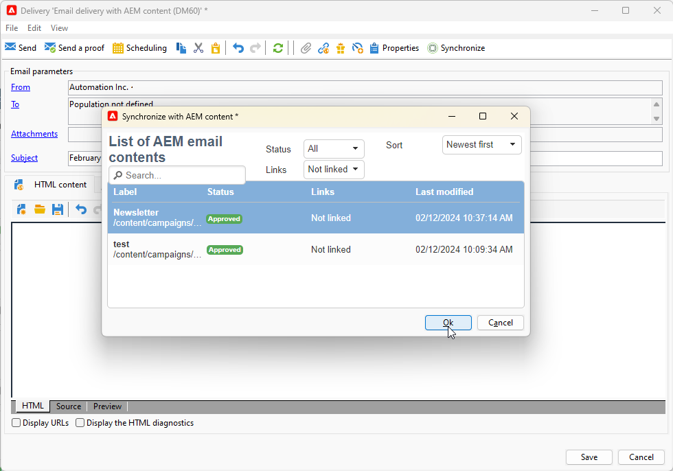
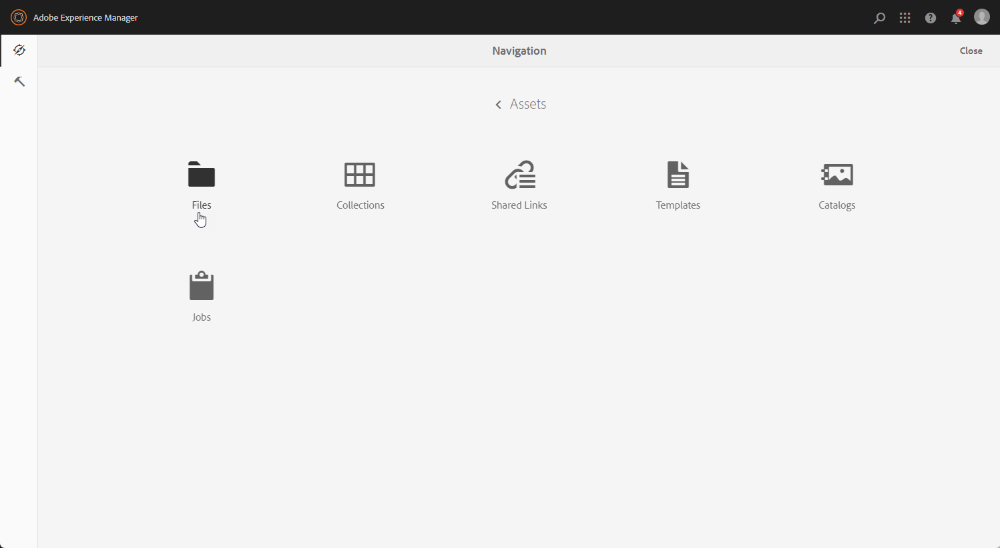

# Campaign 및 Adobe Experience Manager 작업 {#ac-aem}

Adobe Campaign과 Adobe Experience Manager 간의 통합을 통해 이메일 게재의 콘텐츠와 양식을 Adobe Experience Manager에서 직접 관리할 수 있습니다. **Adobe Experience Manager** 콘텐츠를 Campaign으로 가져오거나 **Adobe Experience Manager as a Cloud Service** 계정에 연결할 수 있는 옵션이 있으므로 웹 인터페이스에서 직접 콘텐츠를 편집할 수 있습니다.

[Campaign 웹 인터페이스 내에서 Cloud Service 콘텐츠로 Adobe Experience Manager을 편집하는 방법을 알아봅니다](https://experienceleague.adobe.com/docs/campaign-web/v8/integrations/aem-content.html){target="_blank"}.

[이 문서에서 Adobe Experience Manager에 대해 자세히 알아보세요](https://experienceleague.adobe.com/docs/experience-manager-65/administering/integration/campaignonpremise.html#aem-and-adobe-campaign-integration-workflow){target="_blank"}.

>[!NOTE]
>
>관리 Cloud Service 사용자는 Adobe Experience Manager을 Campaign과 통합하려면 [Adobe에게 문의](../start/campaign-faq.md#support)하십시오.

## Adobe Experience Manager에서 컨텐츠 가져오기 {#integrating-with-aem}

예를 들어 이 통합을 사용하여 Adobe Experience Manager에서 뉴스레터를 생성하고 이메일 캠페인의 일부로 Adobe Campaign에서 사용할 수 있습니다.

**Adobe Experience Manager에서:**

1. [!DNL Adobe Experience Manager] 작성자 인스턴스로 이동하여 페이지의 왼쪽 상단에 있는 경험 Adobe 를 클릭합니다. 메뉴에서 **[!UICONTROL Sites]**&#x200B;을(를) 선택합니다.

   

1. **[!UICONTROL Campaigns > Name of your brand (here we.Shopping) > Main Area > Email]**&#x200B;에 액세스합니다.

1. **[!UICONTROL Create]**&#x200B;을(를) 클릭하고 드롭다운 메뉴에서 **[!UICONTROL Page]**&#x200B;을(를) 선택합니다.

   

1. **[!UICONTROL Adobe Campaign Email]** 템플릿을 선택하고 뉴스레터 이름을 지정합니다.

1. 페이지를 만든 후 **[!UICONTROL Page information]** 메뉴에 액세스하고 **[!UICONTROL Open Properties]**&#x200B;을(를) 클릭합니다.

   

1. Adobe Campaign의 개인화 필드와 같은 구성 요소를 추가하여 이메일 콘텐츠를 사용자 지정합니다. 자세한 내용은 [Adobe Experience Manager 설명서](https://experienceleague.adobe.com/docs/experience-manager-65/content/sites/authoring/aem-adobe-campaign/campaign.html#editing-email-content){target="_blank"}를 참조하세요.

1. 전자 메일이 준비되면 **[!UICONTROL Page information]** 메뉴로 이동하여 **[!UICONTROL Start workflow]**&#x200B;을(를) 클릭합니다.

   

1. 첫 번째 드롭다운에서 **[!UICONTROL Approve Adobe Campaign]**&#x200B;을(를) 워크플로 모델로 선택하고 **[!UICONTROL Start workflow]**&#x200B;을(를) 클릭합니다.

   

1. 페이지 맨 위에 `This page is subject to the workflow Approve for Adobe Campaign`을(를) 나타내는 면책조항이 나타납니다. 면책조항 옆의 **[!UICONTROL Complete]**&#x200B;을(를) 클릭하여 검토를 확인하고 **[!UICONTROL Ok]**&#x200B;을(를) 클릭합니다.

1. **[!UICONTROL Complete]**&#x200B;을(를) 다시 클릭하고 **[!UICONTROL Next Step]** 드롭다운에서 **[!UICONTROL Newsletter approval]**&#x200B;을(를) 선택합니다.

   

이제 뉴스레터가 준비되었으며 Adobe Campaign에서 동기화되었습니다.

**Adobe Campaign에서:**

1. **[!UICONTROL Campaigns]** 탭에서 **[!UICONTROL Deliveries]**&#x200B;을(를) 클릭한 다음 **[!UICONTROL Create]**&#x200B;을(를) 클릭합니다.

1. **[!UICONTROL Delivery template]** 드롭다운 메뉴에서 **[!UICONTROL Email delivery with AEM content (mailAEMContent)]** 템플릿을 선택합니다.

   

1. 게재에 **[!UICONTROL Label]**&#x200B;을(를) 추가하고 **[!UICONTROL Continue]**&#x200B;을(를) 클릭합니다.

1. AEM 게재에 액세스하려면 **[!UICONTROL Synchronize]**&#x200B;을(를) 클릭하십시오.

   인터페이스에 단추가 표시되지 않으면 **[!UICONTROL Properties]** 단추로 이동하여 **[!UICONTROL Advanced]** 탭에 액세스합니다. **[!UICONTROL Content editing mode]** 필드가 **[!UICONTROL AEM]**(으)로 구성되어 있는지 확인하고 **[!UICONTROL AEM account]** 필드에 AEM 인스턴스 세부 정보를 입력하십시오.

   

1. [!DNL Adobe Experience Manager]에서 이전에 만든 AEM 게재를 선택하고 **[!UICONTROL Ok]**&#x200B;을(를) 클릭하여 확인합니다.

   

1. AEM 게재를 수정할 때마다 **[!UICONTROL Refresh content]** 단추를 클릭해야 합니다.

   

1. Experience Manager과 캠페인 간의 연결을 제거하려면 **[!UICONTROL Desynchronize]**&#x200B;을(를) 클릭하십시오.

이제 이메일을 대상자에게 보낼 준비가 되었습니다.

## Adobe Experience Manager Assets 라이브러리에서 자산 가져오기 {#assets-library}

Adobe Campaign에서 전자 메일 또는 랜딩 페이지를 편집하는 동안 [!DNL Adobe Experience Manager Assets Library]에서 직접 자산을 삽입할 수도 있습니다. 이 기능은 [Adobe Experience Manager Assets 설명서](https://experienceleague.adobe.com/docs/experience-manager-65/content/assets/managing/manage-assets.html){target="_blank"}에 자세히 설명되어 있습니다.

**Adobe Experience Manager에서:**

1. [!DNL Adobe Experience Manager] 작성자 인스턴스로 이동하여 페이지의 왼쪽 상단에 있는 경험 Adobe 를 클릭합니다. 메뉴에서 **[!UICONTROL Assets]** `>` **[!UICONTROL Files]**&#x200B;을(를) 선택합니다.

   

1. **만들기**&#x200B;를 클릭한 다음 **파일**&#x200B;을 클릭하여 자산을 **Adobe Experience Manager Assets 라이브러리**&#x200B;로 가져옵니다. 자세한 내용은 [Adobe Experience Manager 설명서](https://experienceleague.adobe.com/docs/experience-manager-65/content/assets/managing/manage-assets.html#uploading-assets){target="_blank"}를 참조하세요.

   

1. 필요한 경우 에셋 이름을 변경하고 **업로드**&#x200B;를 선택합니다.

이제 에셋이 **Adobe Experience Manager Assets 라이브러리**&#x200B;에 업로드되었습니다.

**Adobe Campaign에서:**

1. Adobe Campaign에서 **캠페인** 탭으로 이동하여 새 게재를 만들고 **게재**&#x200B;를 클릭한 다음 기존 게재 목록 위에 있는 **만들기** 단추를 클릭합니다.

   

1. **게재 템플릿**&#x200B;을 선택한 다음 게재 이름을 지정합니다.

1. 메시지 콘텐츠를 정의하고 개인화합니다. [자세히 알아보기](../send/email.md)

1. **Adobe Experience Manager Assets 라이브러리**&#x200B;를 사용하려면 AEM 게재의 **[!UICONTROL Properties]**&#x200B;에 액세스하여 **[!UICONTROL Advanced]** 탭을 선택하십시오.

   **AEM 계정**&#x200B;을(를) 선택하고 **[!UICONTROL Use above AEM instance as shared asset library]** 옵션을 활성화하십시오.

   

1. **이미지** 아이콘에서 **[!UICONTROL Select a shared asset]** 메뉴에 액세스합니다.

   

1. 선택 창에서 **Adobe Experience Manager Assets 라이브러리**&#x200B;의 이미지를 선택한 다음 **선택**&#x200B;합니다.

   

이제 에셋이 이메일 게재에 업로드됩니다. 이제 타겟 대상을 지정하고, 게재를 확인하고, 전송을 진행할 수 있습니다.
