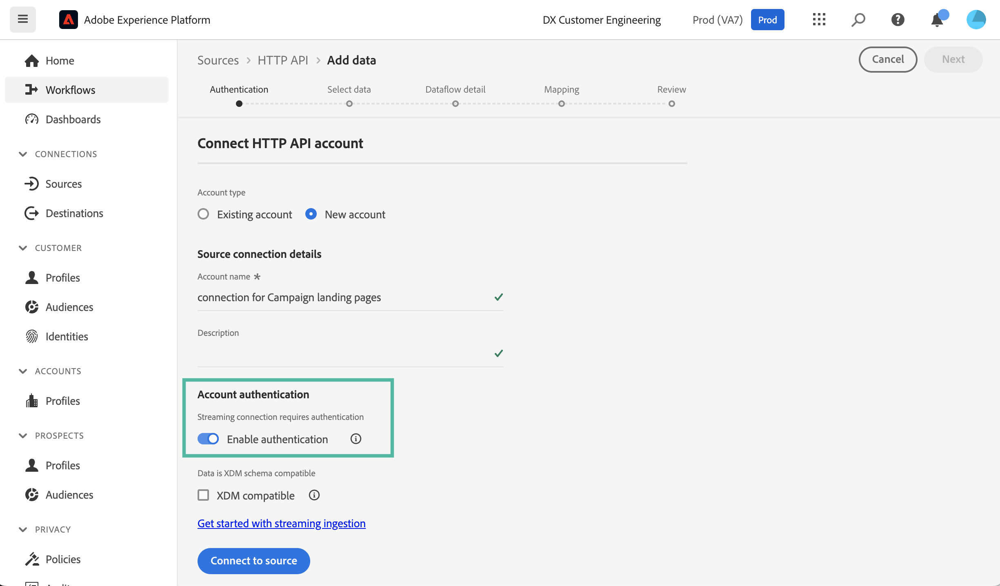
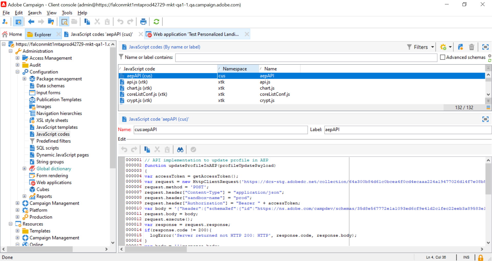

# Adobe Campaign 랜딩 페이지에서 Adobe Experience Platform 프로필 업데이트 {#ac-aep-lp}

Adobe Campaign과 Adobe Experience Platform을 통합하면 Adobe Campaign 랜딩 페이지와 Adobe Experience Platform 간에 프로필 데이터를 원활하게 동기화할 수 있습니다. 이 통합을 통해 다음과 같은 작업을 수행할 수 있습니다.

* Adobe Experience Platform 프로필 속성을 검색하여 Adobe Campaign 랜딩 페이지에 업데이트된 정보를 표시합니다.
* 업데이트된 프로필 속성을 Adobe Experience Platform으로 다시 보내어 랜딩 페이지에서 채워지고 제출된 사항을 기반으로 해당 속성을 업데이트합니다.

이 통합을 설정하는 주요 단계는 다음과 같습니다.

<table>
<tr>
<td><p><a href="#oauth">OAuth 연결 설정</a></p></td>
<td><p><a href="#source">HTTP API Source 연결 만들기</a></p></td>
<td><p><a href="#xtk">Campaign에서 인증 옵션 추가</a></p></td>
<td><p><a href="#javascript">Campaign에서 JavaScript 코드 추가</a></p></td>
<td><p><a href="#script">랜딩 페이지 워크플로우 구성</a></p></td>
</table>

## Oauth 연결 설정 {#oauth}

Adobe Cloud Platform API는 인증 및 권한 부여에 OAuth 2.0 프로토콜을 사용합니다. API 호출을 사용하여 Adobe Experience Platform을 Adobe Campaign에 연결하려면 Adobe Developer Console에서 만든 OAuth 통합을 사용하여 액세스 토큰을 생성해야 합니다.

이렇게 하려면 다음 단계를 수행합니다.

1. Adobe Developer Console에 액세스
1. Adobe Experience Platform API 제품을 사용하여 새 API 연결을 만듭니다. OAuth 2.0 액세스 토큰을 얻는 방법에 대한 자세한 단계는 [Adobe Developer Console 설명서](https://developer.adobe.com/developer-console/docs/guides/authentication/Tools/OAuthPlayground/)에서 확인할 수 있습니다.
1. 연결이 만들어지면 **[!UICONTROL OAuth Server-to-Server]** 메뉴로 이동하여 인증을 위해 Campaign에 필요한 아래 세부 정보를 복사합니다.

   * `CLIENT ID`
   * `CLIENT SECRET`
   * `ORGANIZATION ID`

   {width="70%"}

Oauth 연결이 구성되었으므로 이제 새 **[!UICONTROL HTTP API]** Source 연결을 만들고 구성하여 Adobe Campaign을 Adobe Experience Platform에 연결합니다.

## HTTP API Source 연결 만들기 {#source}

OAuth 연결을 통해 다음 단계는 Adobe Experience Platform에서 **[!UICONTROL HTTP API]** Source 연결을 만드는 것입니다. 이 연결을 통해 API를 사용하여 Adobe Experience Platform에 데이터를 스트리밍할 수 있습니다. 다음 단계를 수행하십시오.

1. Adobe Experience Platform **[!UICONTROL Sources]**(으)로 이동하여 **[!UICONTROL HTTP API]** 원본을 검색한 다음 **[!UICONTROL Add data]**&#x200B;을(를) 클릭합니다.

   {width="70%"}

1. 필요에 따라 연결을 구성합니다. HTTP API 연결을 구성하는 방법에 대한 자세한 내용은 [Adobe Experience Platform 소스 설명서](https://experienceleague.adobe.com/docs/experience-platform/sources/ui-tutorials/create/streaming/http.html){target="_blank"}를 참조하세요.

   **[!UICONTROL Authentication]** 단계에서 OAuth 통합을 통해 이전에 생성된 액세스 토큰을 사용하여 인증하려면 **[!UICONTROL Enable authentication]** 옵션을 켜십시오.

   {width="70%"}

1. 소스 연결이 구성되면 스트리밍 끝점이 표시됩니다. 이 끝점은 데이터를 Adobe Experience Platform에 수집하는 데 필요합니다.

   {width="70%"}

   **[!UICONTROL Dataflows]** 탭에서 새로 만든 데이터 흐름을 열어 Adobe Experience Platform에 수집된 데이터 형식 샘플에 액세스할 수도 있습니다.

   {width="70%"}

HTTP API Source 연결이 설정되었으므로 이제 Adobe Experience Platform에 연결할 수 있도록 Adobe Campaign에 특정 옵션을 추가해야 합니다.

## Adobe Campaign에서 인증 옵션 추가 {#xtk}

HTTP API Source 연결이 구성되면 Adobe Campaign에 특정 옵션을 추가하여 Adobe Experience Platform에 연결할 수 있도록 해야 합니다. 이 작업은 Campaign 관리 메뉴에서 수행하거나 특정 **[!UICONTROL JavaScript code]** 활동을 추가하여 랜딩 페이지 워크플로를 실행할 때 수행할 수 있습니다.

아래 탭을 탐색하여 두 가지 방법을 알아보십시오.

>[!BEGINTABS]

>[!TAB 관리 메뉴에서 옵션 추가]

1. **[!UICONTROL Administration]** > **[!UICONTROL Platform]** > **[!UICONTROL Options]** 메뉴로 이동합니다.
1. Adobe Developer Console의 해당 값과 함께 다음 옵션을 추가합니다.

   * IMS_CLIENT_ID = cryptString(클라이언트 ID)
   * IMS_CLIENT_SECRET = cryptString(클라이언트 암호)
   * IMS_ORG_ID = 조직 ID
   * IMS_CLIENT_API_KEY = cryptString(클라이언트 ID)

   {width="70%"}

   >[!NOTE]
   >
   >cryptString() 함수는 인증 데이터를 암호화하는 데 사용됩니다.

>[!TAB JavaScript 코드 활동을 사용하여 옵션 추가]

랜딩 페이지 워크플로우를 실행할 때 이러한 옵션을 자동으로 구성하려면 아래 코드를 사용하여 워크플로우에 **[!UICONTROL JavaScript code]** 활동을 추가합니다. [JavaScript 코드 활동을 구성하는 방법을 알아봅니다](https://experienceleague.adobe.com/docs/campaign/automation/workflows/wf-activities/action-activities/sql-code-and-JavaScript-code.html#JavaScript-code){target="_blank"}.

워크플로우 실행 시 옵션은 제공된 값으로 Campaign 콘솔에 자동으로 만들어집니다.

```javascript
loadLibrary("xtk:shared/nl.js");
loadLibrary("xtk:shared/xtk.js");
loadLibrary("xtk:shared/json2.js");
loadLibrary("xtk:common.js");

function setAuthCredentials()
{
setOption("IMS_CLIENT_ID", cryptString('CLIENT ID'));
setOption("IMS_CLIENT_SECRET", cryptString('CLIENT SECRET'));
setOption("IMS_ORG_ID", cryptString('ORGANIZATION ID'));
setOption("IMS_CLIENT_API_KEY", cryptString('CLIENT ID'));
}
```

>[!ENDTABS]

이제 인증 옵션이 Campaign에 구성되었으므로 랜딩 페이지에서 Campaign과 Adobe Experience Platform 간에 데이터를 동기화할 수 있는 사용자 지정 JavaScript 코드를 만들어야 합니다.

## 워크플로우 실행 시 옵션 추가 {#javacript}

랜딩 페이지와 Adobe Experience Platform 간에 데이터를 동기화할 수 있으려면 사용자 지정 JavaScript 코드를 Adobe Campaign에 추가해야 합니다. 다음 단계를 수행하십시오.

1. **[!UICONTROL Administration]** > **[!UICONTROL Configuration]** > **[!UICONTROL JavaScript codes]** 메뉴로 이동합니다.
1. 새 JavaScript 코드를 만들고 아래 코드 조각을 복사하여 붙여넣습니다.

   >[!NOTE]
   >
   >액세스 토큰 및 인증 데이터는 이전에 설정한 옵션에서 자동으로 검색됩니다.

   {width="70%"}

+++  스크립트 1 - Experience Platform에서 프로필 속성 로드

   이 코드는 랜딩 페이지를 로드하기 전에 Adobe Experience Platform에 프로필이 있는지 확인합니다. 프로필 속성을 검색하고 랜딩 페이지의 해당 필드에 표시합니다.

   ```javascript
   // API implementation to read profile from AEP
   function getProfileInfo(email)
   {
   var accessToken = getAccessToken();
   var request = new HttpClientRequest(('https://platform-stage.adobe.io/data/core/ups/access/entities?schema.name=_xdm.context.profile&entityId=' + email + '&entityIdNS=email&fields=identities,consents.marketing'));
   request.method = 'GET';
   request.header["Content-Type"] = "application/json";
   request.header["sandbox-name"] = "prod";
   request.header["x-gw-ims-org-id"] = getOption('IMS_ORG_ID');
   request.header["x-api-key"] = getOption('IMS_CLIENT_API_KEY');
   request.header["Authorization"] = "Bearer " + accessToken;
   request.execute();
   return request.response;
   }
   ```

+++

+++ 스크립트 2 - Experience Platform 프로필 속성 업데이트

   이 코드는 Adobe Experience Platform의 프로필 속성을 랜딩 페이지에 제출된 값으로 업데이트합니다.

   ```javascript
   // API implementation to update profile in AEP
   loadLibrary("xtk:shared/nl.js");
   loadLibrary("xtk:shared/xtk.js");
   loadLibrary("xtk:shared/json2.js");
   loadLibrary("xtk:common.js");
   
   function updateProfileInAEP(profileUpdatePayload)
   {
   var accessToken = getAccessToken();
   var request = new HttpClientRequest('https://dcs-stg.adobedc.net/collection/64a300b84d61c0bcea4f0cd4ecaaa224a19477026d14f7e08b5408ffaf5e6162?syncValidation=false');
   request.method = 'POST';
   request.header["Content-Type"] = "application/json";
   request.header["sandbox-name"] = "prod";
   request.header["Authorization"] = "Bearer " + accessToken;
   var body = '{"header":{"schemaRef":{"id":"https://ns.adobe.com/campdev/schemas/35d8e567772e1a1093ed6cf9e41d2c1fec22eeb3a89583e1","contentType":"application/vnd.adobe.xed-full+json;version=1.0"},"imsOrgId":"A1F66F0D5C47D1950A494133@AdobeOrg","datasetId":"63c7fa2a20cce11b98cccb41","source":{"name":"testHTTPSourcesVinay - 03/06/2023 5:43 PM"}},"body":{"xdmMeta":{"schemaRef":{"id":"https://ns.adobe.com/campdev/schemas/35d8e567772e1a1093ed6cf9e41d2c1fec22eeb3a89583e1","contentType":"application/vnd.adobe.xed-full+json;version=1.0"}},"xdmEntity":' + profileUpdatePayload +'}}';
   request.body = body;
   request.execute();
   return request.response;
   }
   
   
   // Get Access token from OAuth-Server-to-server API call
   function getAccessToken() {
   var clientId = decryptString(getOption('IMS_CLIENT_ID'));
   var clientSecret = decryptString(getOption('IMS_CLIENT_SECRET'));
   var request = new HttpClientRequest(('https://ims-na1-stg1.adobelogin.com/ims/token/v2?grant_type=client_credentials' + '&client_id=' + clientId + '&client_secret=' + clientSecret + '&scope=openid,session,AdobeID,read_organizations,additional_info.projectedProductContext'));
   request.method = 'POST';
   request.execute();
   var response = request.response;
   if(response.code != 200){
   logError('GetAccessToken failed,', response.code, response.body);
   return;
   }
   var body = ''+response.body;
   var parsedResponse = JSON.parse(body);
   var accessToken = parsedResponse.access_token;
   logInfo("Access token generated successfully");
   return accessToken;
   }
   ```

+++

이제 사용자 지정 JavaScript 코드가 Adobe Campaign에 생성되었으므로 데이터 동기화에 이러한 JavaScript 코드를 사용하도록 랜딩 페이지를 포함하는 워크플로우를 구성할 수 있습니다.

## 랜딩 페이지 워크플로우 구성 {#script}

Adobe Campaign에 추가된 JavaScript 코드를 사용하여 **[!UICONTROL JavaScript code]** 활동을 사용하여 랜딩 페이지 워크플로에 활용할 수 있습니다.

* 랜딩 페이지를 로드하기 전에 Experience Platform에서 데이터를 로드하려면 랜딩 페이지 활동 앞에 **[!UICONTROL JavaScript code]** 활동을 추가하고 붙여넣기 스크립트 1을 복사합니다.

+++ 스크립트 1 - Experience Platform에서 프로필 속성 로드

  ```javascript
  // Script code to read profile from AEP.
  
  logInfo("Loading profile from AEP");
  loadLibrary("cus:aepAPI");
  var recipient=ctx.recipient;
  var email = recipient.@email;
  var response = getProfileInfo(email);
  ctx.isAEPProfileExists = 1;
  
  if(response.code == 404){
  ctx.isAEPProfileExists = 0
  logInfo("Profile with email" + email + " not found in AEP, ignoring the update activity");
  }
  else if(response.code == 200){
  var body = ''+response.body;
  var parsedResponse = JSON.parse(body);
  for (var key in parsedResponse) {
      var value =  parsedResponse[key];
      var marketing = value.entity.consents.marketing;
      logInfo("User Consent Details : " + JSON.stringify(marketing));   
      if(marketing.hasOwnProperty('email')&&marketing.email.hasOwnProperty('val')&&marketing.email.val=='n'){
      ctx.recipient.@blackListEmail = 1;
      }
      if(marketing.hasOwnProperty('sms')&&marketing.sms.hasOwnProperty('val')&&marketing.sms.val=='n'){
      ctx.recipient.@blackListMobile = 1;
      }
      if(marketing.hasOwnProperty('push')&&marketing.push.hasOwnProperty('val')&&marketing.push.val=='n'){
      ctx.recipient.@blackListPostalMail = 1;
      }
  } 
  }
  ```

+++

* Experience Platform 프로필 속성을 랜딩 페이지에 제출된 데이터로 업데이트하려면 랜딩 페이지 활동 뒤에 **[!UICONTROL JavaScript code]** 활동을 추가하고 붙여넣기 스크립트 2를 복사합니다.

+++ 스크립트 2 - Experience Platform 프로필 속성 업데이트

  ```javascript
  // Script code to update profile in AEP and ACC.
  
  logInfo("Executing script to update AEP profile.");
  
  // Loading aepAPI library JS code
  loadLibrary("cus:aepAPI");
  
  var recipient=ctx.recipient
  
  // Update profile only if it exists in AEP
  if(ctx.isAEPProfileExists==1){
  
  var email = recipient.@email
  logInfo(email);
  logInfo(recipient.@blackListEmail);
  logInfo(recipient.@blackListMobile);
  logInfo(recipient.@blackListPostalMail);
  
  var optOutPayload = new Array();
  
  if(recipient.@blackListEmail==1){
      optOutPayload.push('"email":{"val":"n"}');
  }
  else
      optOutPayload.push('"email":{"val":"y"}');
  
  if(recipient.@blackListMobile==1){
      optOutPayload.push('"sms":{"val":"n"}');
  }
  else
      optOutPayload.push('"sms":{"val":"y"}');
  
  if(recipient.@blackListPostalMail==1){
      optOutPayload.push('"push":{"val":"n"}');
  }
  else
      optOutPayload.push('"push":{"val":"y"}');
  
  var profileUpdatePayload = '{'+ '"personalEmail":{"address":' + '\"' + email + '\"' + '},' +'"consents":{"marketing":{' + optOutPayload.toString() + '}}}';
  
  var response = updateProfileInAEP(profileUpdatePayload);
  if(response.code == 200){
  var body = '' + response.body;
  logInfo("AEP Profile Updated successfully, Response " + body);
  // Update ACC profile 
  recipient.@xtkschema = "nms:recipient";
  recipient.@_operation = "update";
  recipient.@_key="@id";
  xtk.session.Write(recipient);
  logInfo("ACC Profile Updated successfully");
  }
  else{
      logError('Server Error: ', response.code, response.body);
  } 
  }
  else {
  logInfo("Ignoring AEP profile update as profile doesn't exists.");
  
  // Update ACC profile   
  recipient.@xtkschema = "nms:recipient";
  recipient.@_operation = "update";
  recipient.@_key="@id";  
  xtk.session.Write(recipient);
  logInfo("ACC Profile Updated successfully");
  }
  ```

+++

>[!CAUTION]
>
>특정 요구 사항에 따라 각 스크립트에서 페이로드를 사용자 정의해야 합니다.
>
>랜딩 페이지 활동 전에 스크립트를 추가하지 않으면 Adobe Experience Platform에서 프로필 존재 검사가 수행되지 않습니다. 랜딩 페이지가 제출되고 프로필이 존재하지 않으면 랜딩 페이지의 속성으로 Adobe Experience Platform에 생성됩니다.

다음은 랜딩 페이지 전후에 JavaScript 코드 활동을 사용하는 샘플 워크플로우입니다.

{width="70%"}

다음은 Adobe Experience Platform에서 프로필 속성을 업데이트하도록 구성된 랜딩 페이지 및 JavaScript 코드 활동의 예입니다.

{width="70%"}

{width="70%" zoomable="yes"}

### 추가 정보

* [JavaScript 코드 활동 구성](../../automation/workflow/sql-code-and-javascript-code.md#javascript-code)
* [랜딩 페이지 만들기](https://experienceleague.adobe.com/docs/campaign-classic/using/designing-content/editing-html-content/creating-a-landing-page.html){target="_blank"}
* [구독 및 구독 취소 관리](../start/subscriptions.md)
