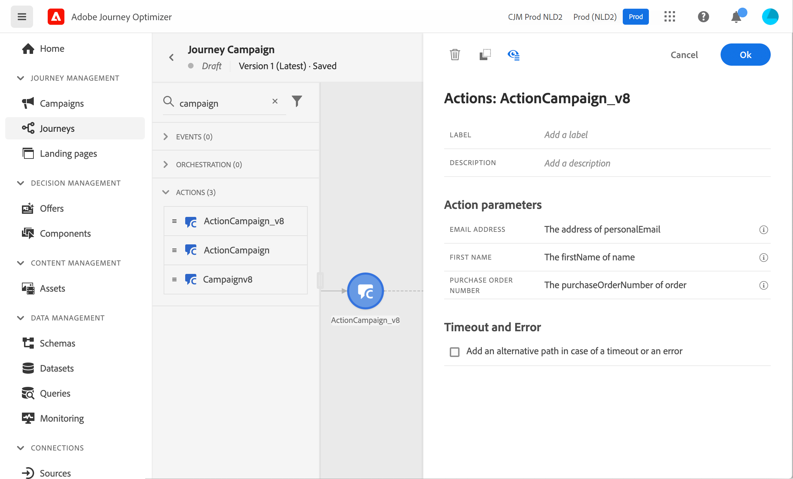

# Campaign을 Adobe Journey Optimizer과 함께 사용하기

Adobe Campaign과 Adobe Journey Optimizer 간의 통합을 통해 Adobe Journey Optimizer에서 고객 여정을 오케스트레이션하고 Adobe Campaign 트랜잭션 메시지 기능을 사용하여 이메일, 푸시 알림 및/또는 SMS를 전송할 수 있습니다.

기본 단계는 Campaign에서 트랜잭션 메시지 템플릿을 만든 다음, 이벤트, 작업을 만들고 Adobe Journey Optimizer에서 여정을 디자인하는 것입니다.

 [이 종단간 샘플에서 이 통합을 살펴보십시오](https://experienceleague.adobe.com/docs/journey-optimizer/using/orchestrate-journeys/about-journey-building/using-adobe-campaign-classic.html){target="_blank"}.

 [Journey Optimizer 설명서에서 자세히 알아보기](https://experienceleague.adobe.com/docs/journey-optimizer/using/orchestrate-journeys/about-journey-building/using-adobe-campaign-classic.html?lang=en){target="_blank"}.
