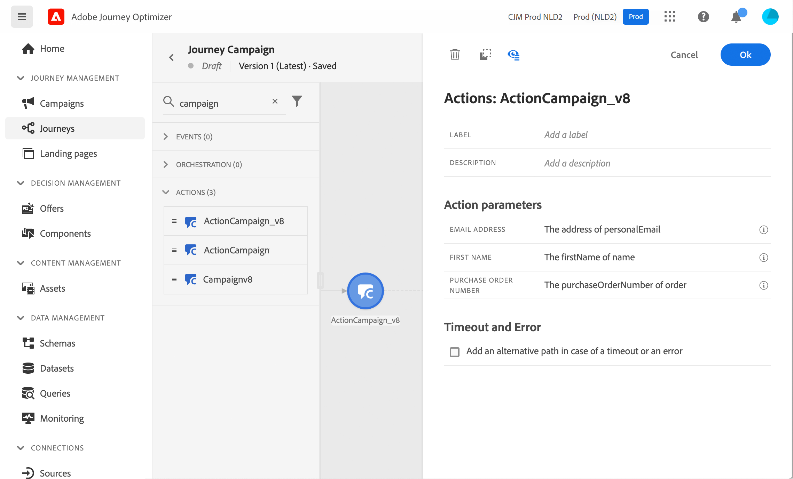

# Campaign 및 Adobe Journey Optimizer 작업

Adobe Campaign과 Adobe Journey Optimizer 간의 통합을 통해 Adobe Journey Optimizer에서 고객 여정을 조정하고 Adobe Campaign 트랜잭션 메시지 기능을 사용하여 이메일, 푸시 알림 및/또는 SMS를 전송할 수 있습니다.

기본 단계는 Campaign에서 트랜잭션 메시지 템플릿을 만든 다음 Adobe Journey Optimizer에서 이벤트, 작업 및 여정 디자인을 만드는 것입니다.

[이 전체 샘플에서 이 통합을 살펴보세요](https://experienceleague.adobe.com/en/docs/journey-optimizer/using/orchestrate-journeys/journey-use-cases/business-use-cases/ajo-ac){target="_blank"}.

[Journey Optimizer 설명서에서 자세히 알아보기](https://experienceleague.adobe.com/en/docs/journey-optimizer/using/orchestrate-journeys/about-journey-building/using-adobe-campaign-v7-v8){target="_blank"}.
