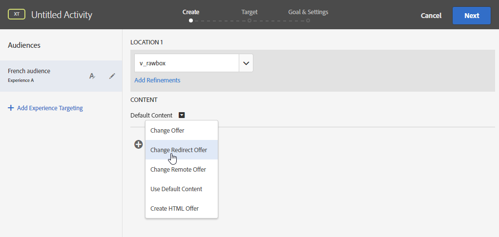

# Campaign 및 Adobe Target 작업

Campaign과 Target을 연결하여 Adobe Campaign 이메일 게재에 Adobe Target의 오퍼를 포함합니다.

이 통합은 다음과 같이 사용 사례를 구현하는 데 도움이 됩니다. 수신자가 Adobe Campaign을 통해 보낸 이메일을 열면 Adobe Target을 호출하여 콘텐츠의 동적 버전을 표시할 수 있습니다. 이 동적 버전은 이메일을 만들 때 미리 지정된 규칙에 따라 계산됩니다.

>[!NOTE]
>* 통합은 정적 이미지만 지원합니다. 다른 유형의 콘텐츠는 개인화할 수 없습니다.
>
>* 관리 Cloud Service 사용자는 Campaign으로 Experience Cloud 트리거를 구현하려면 [Adobe에게 문의](../start/campaign-faq.md#support)하십시오.

Adobe Target에서는 다음 유형의 데이터를 사용할 수 있습니다.

* Adobe Campaign 데이터베이스의 데이터
* 사용된 데이터에 법적 제한이 적용되지 않는 경우에만 Adobe Target에서 방문자 ID에 연결된 세그먼트입니다
* Adobe Target 데이터: 사용자 에이전트, IP 주소, 지역화 데이터

## 다이내믹 콘텐츠 삽입

아래 예에서는 Adobe Target의 **동적 오퍼**&#x200B;를 Adobe Campaign 이메일에 통합하는 방법을 알아봅니다.

수신자의 국가에 따라 이미지가 동적으로 변경되는 메시지를 만들려고 합니다. 데이터는 각 mbox 요청과 함께 전송되며 방문자의 IP 주소에 따라 다릅니다.

이 이메일에서는 다음 사용자 경험에 따라 이미지 중 하나가 동적으로 변경되기를 원합니다.

* 이메일이 프랑스에서 오픈되었습니다.
* 이메일은 미국에서 열립니다.
* 이러한 조건이 적용되지 않으면 기본 이미지가 표시됩니다.

Adobe Campaign 및 Adobe Target에서 다음 단계를 수행해야 합니다.

1. [이메일에 동적 오퍼 삽입](#inserting-dynamic-offer)
1. [리디렉션 오퍼 만들기](#create-redirect-offers)
1. [대상자 만들기](#audiences-target)
1. [경험 타깃팅 활동 만들기](#creating-targeting-activity)
1. [메시지 미리 보기 및 보내기](#preview-send-email)

### 이메일에 동적 오퍼 삽입 {#inserting-dynamic-offer}

Adobe Campaign에서 타겟과 이메일의 콘텐츠를 정의합니다. Adobe Target에서 동적 이미지를 삽입할 수 있습니다.

이렇게 하려면 기본 이미지의 URL, 위치 이름 및 Adobe Target으로 전송할 필드를 지정합니다.

Adobe Campaign에서는 Target의 동적 이미지를 이메일에 삽입하는 두 가지 방법이 있습니다.

* 디지털 콘텐츠 편집기를 사용하는 경우 기존 이미지를 선택하고 도구 모음에서 **[!UICONTROL Insert]** > **[!UICONTROL Dynamic image served by Adobe Target]**&#x200B;을(를) 선택합니다.

  

* 표준 편집기를 사용하는 경우 이미지를 삽입할 위치에 커서를 놓고 개인화 드롭다운 메뉴에서 **[!UICONTROL Include]** > **[!UICONTROL Dynamic image served by Adobe Target...]**&#x200B;을(를) 선택합니다.

  

그런 다음 이미지 매개 변수를 정의할 수 있습니다.

* **[!UICONTROL Default image]**&#x200B;의 URL은 조건이 충족되지 않을 때 표시되는 이미지입니다. Assets 라이브러리에서 이미지를 선택할 수도 있습니다.
* **[!UICONTROL Target location]**&#x200B;은(는) 동적 오퍼의 위치 이름입니다. Adobe Target 활동에서 이 위치를 선택해야 합니다.
* **[!UICONTROL Landing Page]**&#x200B;을(를) 사용하면 기본 이미지를 기본 랜딩 페이지로 리디렉션할 수 있습니다. 이 URL은 기본 이미지가 최종 이메일에 표시되는 경우에만 적용됩니다. 선택 사항입니다.
* **[!UICONTROL Additional decision parameters]**&#x200B;은(는) Adobe Target 세그먼트에 정의된 필드와 Adobe Campaign 필드 간의 매핑을 정의합니다. 사용된 Adobe Campaign 필드는 rawbox에 지정했어야 합니다. 이 예제에서는 국가 필드를 추가했습니다.

Adobe Target의 설정에서 Enterprise 권한을 사용하는 경우 이 필드에 해당 속성을 추가합니다. [Adobe Target 설명서](https://experienceleague.adobe.com/en/docs/target/using/administer/manage-users/enterprise/properties-overview#administer){target="_blank"}에서 Target Enterprise 권한에 대해 자세히 알아보세요.

### 리디렉션 오퍼 만들기 {#create-redirect-offers}

Adobe Target에서 오퍼의 다른 버전을 만들 수 있습니다. 각 사용자 경험에 따라 리디렉션 오퍼를 만들고 표시할 이미지를 지정할 수 있습니다.

이 경우 두 개의 리디렉션 오퍼가 필요하며, 세 번째 리디렉션 오퍼(기본 오퍼)는 Adobe Campaign에서 정의해야 합니다.

1. Target Standard에서 새 리디렉션 오퍼를 만들려면 **[!UICONTROL Content]** 탭에서 **[!UICONTROL Code offers]**&#x200B;을(를) 클릭합니다.

1. **[!UICONTROL Create]**&#x200B;을(를) 클릭한 뒤 **[!UICONTROL Redirect Offer]**&#x200B;을(를) 클릭합니다.

   

1. 오퍼 이름과 이미지 URL을 입력합니다.

   

1. 나머지 리디렉션 오퍼에 대해서도 동일한 절차를 수행합니다. 자세한 정보는 이 [Adobe Target 설명서](https://experienceleague.adobe.com/docs/target/using/experiences/offers/offer-redirect.html#experiences){target="_blank"}를 참조하세요.

### 대상자 만들기 {#audiences-target}

Adobe Target에서는 두 대상을 만들어 오퍼를 방문하는 사람을 전달할 다른 콘텐츠에 대해 분류해야 합니다. 각 대상자에 대해 규칙을 추가하여 오퍼를 볼 수 있는 사람을 정의합니다.

1. Target에서 새 대상을 만들려면 **[!UICONTROL Audiences]** 탭에서 **[!UICONTROL Create Audience]**&#x200B;을(를) 클릭합니다.

   

1. 대상에 이름을 추가합니다.

   

1. **[!UICONTROL Add a rule]**&#x200B;을(를) 클릭하고 범주를 선택합니다. 규칙은 특정 기준을 사용하여 방문자를 타깃팅합니다. 조건을 추가하거나 다른 범주에서 새 규칙을 만들어 규칙을 세분화할 수 있습니다.

1. 나머지 대상에 대해서도 동일한 절차를 따르십시오.

### 경험 타깃팅 활동 만들기 {#creating-targeting-activity}

Adobe Target에서 경험 타깃팅 활동을 만들고, 다양한 경험을 정의하고, 해당 오퍼와 연결해야 합니다.

먼저 대상을 정의해야 합니다.

1. 경험 타깃팅 활동을 만들려면 **[!UICONTROL Activities]** 탭에서 **[!UICONTROL Create Activity]**&#x200B;을(를) 클릭한 다음 **[!UICONTROL Experience Targeting]**&#x200B;을(를) 클릭합니다.

   

1. **[!UICONTROL Form]**&#x200B;을(를) **[!UICONTROL Experience Composer]**(으)로 선택합니다.

1. **[!UICONTROL Change audience]** 단추를 클릭하여 대상을 선택합니다.

   

1. 이전 단계에서 만든 대상자를 선택합니다.

   

1. **[!UICONTROL Add Experience Targeting]**&#x200B;을(를) 클릭하여 다른 경험을 만듭니다.

그런 다음 각 대상에 대한 콘텐츠를 추가합니다.

1. Adobe Campaign에서 동적 오퍼를 삽입할 때 선택한 위치 이름을 선택합니다.

   

1. 드롭다운 단추를 클릭하고 **[!UICONTROL Change Redirect Offer]**&#x200B;을(를) 선택합니다.

   

1. 이전에 만든 리디렉션 오퍼를 선택합니다.

   

1. 두 번째 경험에 대해서도 동일한 단계를 수행합니다.

**[!UICONTROL Target]** 창에 활동이 요약됩니다. 필요한 경우 다른 경험을 추가할 수 있습니다.

**[!UICONTROL Goal & Settings]** 창을 사용하면 우선 순위, 목표 또는 기간을 설정하여 활동을 개인화할 수 있습니다.

**[!UICONTROL Reporting Settings]** 섹션을 사용하면 작업을 선택하고 목표 달성 시기를 결정할 매개 변수를 편집할 수 있습니다.

## 메시지 미리 보기 및 보내기 {#preview-send-email}

이제 Adobe Campaign에서 이메일을 미리 보고 다른 수신자에서 해당 렌더링을 테스트할 수 있습니다.

생성된 다양한 경험에 따라 이미지가 변경되는 것을 볼 수 있습니다.

이제 Target의 다이내믹 오퍼를 포함하여 이메일을 보낼 준비가 되었습니다.

