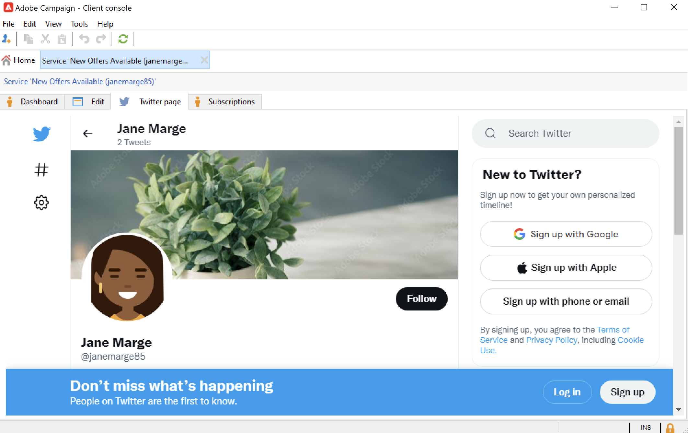

# Campaign을 X와 함께 사용하기(Twitter) {#tw-ac-ovv}

**소셜 네트워크 관리(소셜 마케팅)** 모듈을 사용하면 X(이전 Twitter)를 통해 고객과 상호 작용할 수 있습니다. 이 기능을 사용하여 다음을 수행할 수 있습니다.

* 메시지 게시 및 DM 보내기 - Adobe Campaign 소셜 마케팅을 사용하여 X에 메시지를 게시합니다. 모든 팔로워에게 직접 메시지를 보낼 수도 있습니다.

* 새 연락처 수집 - Adobe Campaign Social Marketing을 사용하면 새로운 연락처를 쉽게 확보할 수 있습니다. 사용자에게 연락하여 프로필 정보를 공유할지 물어보십시오. 수락하면 Adobe Campaign이 데이터를 자동으로 복구하므로 타겟팅 캠페인을 수행하고, 가능한 경우 크로스 채널 전략을 구현할 수 있습니다.

>[!NOTE]
>
>Managed Cloud Services 사용자는 Campaign을 X와 연결하려면 [Adobe에 문의](../start/campaign-faq.md#support)하십시오. **소셜 네트워크 관리(소셜 마케팅)** 추가 기능은 전용 패키지를 통해 환경에 설치해야 하며 Twitter 외부 계정을 구성해야 합니다.

X 계정에 트윗을 게시하도록 Adobe Campaign을 구성하려면 이러한 계정에 대해 Adobe Campaign에 쓰기 액세스 권한을 위임하십시오. 이렇게 하려면 다음을 수행해야 합니다.

1. X 계정을 만들고 개발자 계정에 등록합니다. [자세히 알아보기](#dev-account)
1. (선택 사항) 증명을 보낼 테스트 X 계정을 만듭니다. [자세히 알아보기](#tw-test-account)
1. X 애플리케이션을 만듭니다(X 계정당 하나의 앱). [자세히 알아보기](#create-an-app-on-twitter)
1. **[!UICONTROL Twitter]**&#x200B;에 대한 새 서비스를 만듭니다(X 계정당 서비스 하나). [자세히 알아보기](#create-tw-service)
1. X 계정을 Campaign과 동기화합니다. [자세히 알아보기](#synchro-tw-accounts)

## X 개발자 계정 {#dev-account}

이 통합을 시작하려면 [X 개발자 계정](https://developer.twitter.com){target="_blank"}에 등록해야 합니다.

Campaign은 X API의 1.1 버전을 사용합니다. 이 기능을 사용하려면 개발자 포털을 통해 관리자 권한으로 액세스 권한을 신청해야 합니다. 이 페이지에서 [X 관리자 권한 ](https://developer.twitter.com/en/portal/products/elevated){target="_blank"}에 대해 자세히 알아보세요.

## X에서 응용 프로그램 만들기 {#create-an-app-on-twitter}

관리자 권한 승인을 받았으면 X 애플리케이션을 만들어 Adobe Campaign에서 X 계정에 게시물을 만들 수 있습니다. 이렇게 하려면 아래 단계를 수행합니다.

1. X 계정에 로그온합니다.
1. [X 개발자 포털](https://developer.twitter.com/en/apps){target="_blank"}에 연결합니다.
1. **앱 만들기**&#x200B;를 선택합니다.
1. X 도우미가 프로세스를 안내하도록 합니다.
1. Adobe Campaign에서 계정에 게시물을 만들 수 있도록 하려면 앱의 사용자 인증 설정 섹션에서 **앱 권한**&#x200B;을 편집하세요. **읽기, 쓰기 및 다이렉트 메시지**&#x200B;을(를) 선택하십시오.

   

1. **앱 유형** 섹션에서 **웹 앱, 자동화된 앱 또는 봇**&#x200B;을 선택합니다. **콜백 URL** 필드를 비워 두고 구성을 저장할 수 있습니다.

   

1. 앱 대시보드로 돌아가서 앱을 선택하고 **키 및 토큰** 탭으로 이동합니다. **액세스 토큰 및 암호**&#x200B;에서 **읽기, 쓰기 및 다이렉트 메시지** 권한이 언급되지 않은 경우 앱의 토큰 및 암호를 다시 생성해야 합니다. 생성 시 모든 키와 토큰을 저장해야 합니다. Campaign Twitter 서비스를 구성하려면 ID가 필요합니다.

   

>[!NOTE]
>
>X 계정당 하나의 애플리케이션이 필요합니다. 따라서 증명을 테스트 계정으로 보내려면 다른 테스트 애플리케이션을 만들어야 합니다.
>

## Campaign에서 Twitter 서비스 만들기 {#create-tw-service}

Campaign 인스턴스를 X 계정과 연결하려면 **Twitter** 서비스를 만들고 Campaign에 쓰기 권한을 위임하세요.

>[!CAUTION]
>
>X 계정당 하나의 **Twitter** 서비스를 만듭니다. 따라서 증명을 [테스트 계정](#tw-test-account)에 보내려면 다른 테스트 서비스를 만들어야 합니다.
>
>각 **Twitter** 서비스는 중간 소싱(MID) 인스턴스에 Adobe에서 만들어야 합니다. Adobe 담당자에게 문의하여 환경을 구성하십시오.
>

설정을 입력하려면 Adobe Campaign 클라이언트 콘솔과 X 앱 권한 모두에 액세스해야 합니다.

1. **Adobe Campaign**&#x200B;에서 **[!UICONTROL Profiles and targets]** 탭으로 이동하여 **[!UICONTROL Services and Subscriptions]** 링크를 선택합니다
1. 새 서비스를 만듭니다.
1. **[!UICONTROL Twitter]** 유형을 선택하십시오.
1. 서비스의 레이블 및 내부 이름을 입력합니다.

   >[!CAUTION]
   >
   >서비스의 **[!UICONTROL Internal name]**&#x200B;은(는) X 계정과 정확히 같은 이름이어야 합니다.
   >

1. 기본적으로 팔로워는 **[!UICONTROL Visitors]** 폴더에 저장됩니다. **[!UICONTROL Visitor folder]** 필드에서 다른 위치를 선택할 수 있습니다. [자세히 알아보기](../send/twitter.md#direct-tw-messages)

   

   >[!NOTE]
   >
   >**[!UICONTROL Synchronize subscriptions]** 옵션은 기본적으로 활성화되어 있습니다. 이 옵션은 X 팔로워 목록을 자동으로 복구하여 [직접 메시지를 보낼 수 있습니다](../send/twitter.md#direct-tw-messages). 동기화는 [전용 기술 워크플로우](#synchro-tw-accounts)에서 수행됩니다.

1. X 앱에서 **API 키** 및 **[API 키 암호]** 필드의 내용을 복사하여 Campaign **Twitter** 서비스의 **[!UICONTROL Consumer key]** 및 **[!UICONTROL Consumer secret]** 필드에 붙여넣으십시오.

1. X 앱에서 **액세스 토큰** 및 **액세스 토큰 암호** 필드의 내용을 복사하여 Campaign **Twitter** 서비스의 **[!UICONTROL Access token]** 및 **[!UICONTROL Access token secret]** 필드에 붙여넣으십시오.

1. Campaign 클라이언트 콘솔에서 **[!UICONTROL Save]**&#x200B;을(를) 클릭합니다. 이제 Adobe Campaign에 대한 쓰기 액세스 권한을 위임했습니다.

설정을 확인하려면 다음을 수행할 수 있습니다.

* 방금 만든 **Twitter** 서비스를 편집합니다.
* **[!UICONTROL Twitter page]** 탭을 탐색합니다. Twitter 계정이 표시되어야 합니다.
  

## X 계정 동기화 {#synchro-tw-accounts}

전용 기술 워크플로우를 통해 Campaign과 X 간의 동기화를 관리합니다. 이러한 워크플로는 **[!UICONTROL Administration > Production > Technical workflows > Managing social networks]** 폴더에 저장됩니다.

기본적으로 중지됩니다. **소셜 마케팅** 모듈 사용을 시작할 때 수동으로 시작해야 합니다.

**[!UICONTROL Synchronization of Twitter accounts]** 기술 워크플로우는 Adobe Campaign의 X 계정을 동기화합니다. 이 워크플로우는 X 팔로우어 목록을 복구하여 사용자에게 다이렉트 메시지를 보낼 수 있습니다. [자세히 알아보기](../send/twitter.md#direct-tw-messages)

기본적으로 이 워크플로우는 매주 목요일 오전 7시 30분에 트리거됩니다. 이 통합을 구현하고 있으므로 언제든지 **[!UICONTROL Execute pending task(s) now]** 옵션을 사용하여 워크플로를 시작할 수 있습니다.  스케줄러를 편집하여 워크플로 트리거 빈도를 변경할 수도 있습니다. [이 페이지](../../automation/workflow/scheduler.md)에서 자세히 알아보십시오.

>[!CAUTION]
>
>X 구독자 목록을 복구하려면 계정에 연결된 서비스에 대해 **[!UICONTROL Twitter account synchronization]** 옵션을 선택해야 합니다. [자세히 알아보기](#create-tw-service)

팔로워는 특정 테이블인 방문자 테이블에 저장됩니다. X 팔로워 목록을 표시하려면 **[!UICONTROL Profiles and Targets > Visitors]**&#x200B;을(를) 찾습니다.

각 팔로워에 대해 Adobe Campaign은 다음 정보를 저장합니다.

* **[!UICONTROL Origin]**: 트위터
* **[!UICONTROL External ID]**: 사용자 식별자
* **[!UICONTROL Username]**: 사용자의 계정 이름
* **[!UICONTROL Full name]**: 사용자 이름
* **[!UICONTROL Number of friends]**: 팔로우어 수
* **[!UICONTROL Checked]**: 이 필드는 사용자에게 확인된 Twitter 계정이 있는지 여부를 나타냅니다.

이 구성이 완료되면 X 계정에 게시물을 만들고 팔로워에게 직접 메시지를 보낼 수 있습니다. [자세히 알아보기](../send/twitter.md)

## X에서 테스트 계정 만들기 {#tw-test-account}

X 계정 외에 [트윗 증명](../send/twitter.md#send-tw-proofs)을 보내는 데 사용할 수 있는 개인 X 계정을 만드십시오. 이렇게 하려면 아래 단계를 수행합니다.

1. 새 X 계정을 만듭니다.
1. **설정** 계정에 액세스하십시오.
1. **개인 정보 보호 및 안전** 및 **대상자 및 태그 지정**&#x200B;으로 이동하여 **게시물 보호** 옵션을 확인하세요. 귀하의 게시물 및 기타 계정 정보는 귀하를 따르는 사람에게만 표시됩니다.

위에서 설명한 대로 이 테스트 계정으로 작동하도록 X 앱 및 Campaign 서비스를 구성합니다.
