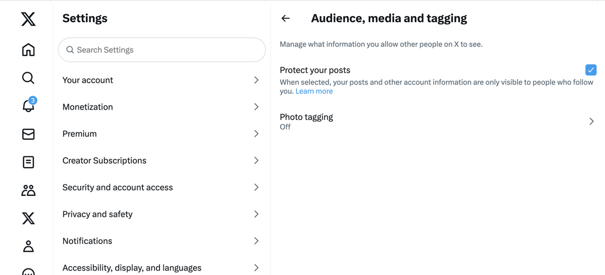

# Campaign을 X와 함께 사용하기(Twitter) {#tw-ac-ovv}

다음 **소셜 네트워크 관리(소셜 마케팅)** 모듈을 사용하면 X(이전의 Twitter)를 통해 고객과 상호 작용할 수 있습니다. 이 기능을 사용하여 다음을 수행할 수 있습니다.

* 메시지 게시 및 DM 보내기 - Adobe Campaign 소셜 마케팅을 사용하여 X에 메시지를 게시합니다. 모든 팔로워에게 직접 메시지를 보낼 수도 있습니다.

* 새 연락처 수집 - Adobe Campaign Social Marketing을 사용하면 새로운 연락처를 쉽게 확보할 수 있습니다. 사용자에게 연락하여 프로필 정보를 공유할지 물어보십시오. 수락하면 Adobe Campaign이 데이터를 자동으로 복구하므로 타겟팅 캠페인을 수행하고, 가능한 경우 크로스 채널 전략을 구현할 수 있습니다.

>[!NOTE]
>
>관리 Cloud Service 사용자는 [연락처 Adobe](../start/campaign-faq.md#support) Campaign을 X와 연결합니다.  **소셜 네트워크 관리(소셜 마케팅)** 전용 패키지를 통해 환경에 추가 기능을 설치하고 외부 계정 Twitter을 구성해야 합니다.

X 계정에 트윗을 게시하도록 Adobe Campaign을 구성하려면 이러한 계정에 대해 Adobe Campaign에 쓰기 액세스 권한을 위임하십시오. 이렇게 하려면 다음을 수행해야 합니다.

1. X 계정을 만들고 개발자 계정에 등록합니다. [자세히 알아보기](#dev-account)
1. (선택 사항) 증명을 보낼 테스트 X 계정을 만듭니다. [자세히 알아보기](#tw-test-account)
1. X 애플리케이션을 만듭니다(X 계정당 하나의 앱). [자세히 알아보기](#create-an-app-on-twitter)
1. 다음에 대한 새 서비스 만들기 **[!UICONTROL Twitter]** (X 계정당 서비스 1개). [자세히 알아보기](#create-tw-service)
1. X 계정을 Campaign과 동기화합니다. [자세히 알아보기](#synchro-tw-accounts)

## X 개발자 계정 {#dev-account}

이 통합을 시작하려면 다음에 등록해야 합니다. [X 개발자 계정](https://developer.twitter.com){target="_blank"}.

Campaign은 X API의 1.1 버전을 사용합니다. 이 기능을 사용하려면 개발자 포털을 통해 관리자 권한으로 액세스 권한을 신청해야 합니다. X 관리자 권한 액세스에 대해 자세히 알아보기 [이 페이지에서](https://developer.twitter.com/en/portal/products/elevated){target="_blank"}.

## X에서 응용 프로그램 만들기 {#create-an-app-on-twitter}

관리자 권한 승인을 받았으면 X 애플리케이션을 만들어 Adobe Campaign에서 X 계정에 게시물을 만들 수 있습니다. 이렇게 하려면 아래 단계를 수행합니다.

1. X 계정에 로그온합니다.
1. 연결 대상 [X 개발자 포털](https://developer.twitter.com/en/apps){target="_blank"}.
1. 선택 **앱 만들기**.
1. X 도우미가 프로세스를 안내하도록 합니다.
1. Adobe Campaign에서 계정에 게시물을 만들도록 허용하려면 을(를) 편집하십시오. **앱 권한** 앱의 사용자 인증 설정 섹션에서 다음을 수행합니다. 선택 **읽기, 쓰기 및 다이렉트 메시지**.

   

1. 다음에서 **앱 유형** 섹션, 선택 **웹 앱, 자동화된 앱 또는 보트**. 다음을 떠나실 수 있습니다. **콜백 URL** 필드가 비어 있고 구성을 저장합니다.

   

1. 앱 대시보드로 돌아가서 앱을 선택하고 **키 및 토큰** 탭. 아래 **액세스 토큰 및 암호**&#x200B;인 경우 **읽기, 쓰기 및 다이렉트 메시지** 권한이 언급되지 않았습니다. 앱의 토큰 및 암호를 다시 생성해야 합니다. 생성 시 모든 키와 토큰을 저장해야 합니다. Campaign Twitter 서비스를 구성하려면 ID가 필요합니다.

   

>[!NOTE]
>
>X 계정당 하나의 애플리케이션이 필요합니다. 따라서 증명을 테스트 계정으로 보내려면 다른 테스트 애플리케이션을 만들어야 합니다.
>

## Campaign에서 Twitter 서비스 만들기 {#create-tw-service}

Campaign 인스턴스를 X 계정과 연결하려면 **Twitter** Campaign에 대한 서비스 및 쓰기 위임 액세스 권한.

>[!CAUTION]
>
>1개 만들기 **Twitter** X 계정당 서비스. 따라서 증명을 보낼 다른 테스트 서비스를 만들어야 합니다. [테스트 계정](#tw-test-account).
>
>각 **Twitter** 서비스는 MID 인스턴스의 Adobe에 의해서도 생성되어야 합니다. 환경을 구성하려면 Adobe 담당자에게 문의하십시오.
>

설정을 입력하려면 Adobe Campaign 클라이언트 콘솔과 X 앱 권한 모두에 액세스해야 합니다.

1. 위치 **Adobe Campaign**&#x200B;로 이동하여 **[!UICONTROL Profiles and targets]** 탭을 클릭하고 **[!UICONTROL Services and Subscriptions]** 링크
1. 새 서비스를 만듭니다.
1. 다음 항목 선택 **[!UICONTROL Twitter]** 유형.
1. 서비스의 레이블 및 내부 이름을 입력합니다.

   >[!CAUTION]
   >
   >다음 **[!UICONTROL Internal name]** 서비스 이름은 X 계정과 정확히 같아야 합니다.
   >

1. 기본적으로 팔로워는 **[!UICONTROL Visitors]** 폴더를 삭제합니다. 다음 목록에서 다른 위치를 선택할 수 있습니다. **[!UICONTROL Visitor folder]** 필드. [자세히 알아보기](../send/twitter.md#direct-tw-messages)

   

   >[!NOTE]
   >
   >다음 **[!UICONTROL Synchronize subscriptions]** 옵션이 기본적으로 활성화되어 있습니다. 이 옵션은 X 팔로워 목록을 자동으로 복구하여 다음을 수행할 수 있습니다. [다이렉트 메시지 보내기](../send/twitter.md#direct-tw-messages). 동기화는 [전용 기술 워크플로우](#synchro-tw-accounts).

1. X 앱에서 의 콘텐츠를 복사합니다. **API 키** 및 **[API 키 암호]** 필드를 붙여 넣습니다. **[!UICONTROL Consumer key]** 및 **[!UICONTROL Consumer secret]** 캠페인의 필드 **Twitter** 서비스.

1. X 앱에서 의 콘텐츠를 복사합니다. **액세스 토큰** 및 **액세스 토큰 암호** 필드를 붙여 넣습니다. **[!UICONTROL Access token]** 및 **[!UICONTROL Access token secret]** 캠페인의 필드 **Twitter** 서비스.

1. Campaign 클라이언트 콘솔에서 다음을 클릭합니다. **[!UICONTROL Save]**. 이제 Adobe Campaign에 대한 쓰기 액세스 권한을 위임했습니다.

설정을 확인하려면 다음을 수행할 수 있습니다.

* 편집 **Twitter** 방금 만든 서비스입니다.
* 찾아보기 **[!UICONTROL Twitter page]** 탭: Twitter 계정이 표시됩니다.
  

## X 계정 동기화 {#synchro-tw-accounts}

전용 기술 워크플로우를 통해 Campaign과 X 간의 동기화를 관리합니다. 이러한 워크플로는에 저장됩니다. **[!UICONTROL Administration > Production > Technical workflows > Managing social networks]** 폴더를 삭제합니다.

기본적으로 중지됩니다. 사용을 시작할 때 수동으로 시작해야 합니다. **소셜 마케팅** 모듈.

다음 **[!UICONTROL Synchronization of Twitter accounts]** 기술 워크플로우는 Adobe Campaign의 X 계정을 동기화합니다. 이 워크플로우는 X 팔로우어 목록을 복구하여 사용자에게 다이렉트 메시지를 보낼 수 있습니다. [자세히 알아보기](../send/twitter.md#direct-tw-messages)

기본적으로 이 워크플로우는 매주 목요일 오전 7시 30분에 트리거됩니다. 다음을 사용할 수 있습니다. **[!UICONTROL Execute pending task(s) now]** 이 통합을 구현할 때 언제든지 워크플로우를 시작하는 옵션입니다.  스케줄러를 편집하여 워크플로 트리거 빈도를 변경할 수도 있습니다. [이 페이지](../../automation/workflow/scheduler.md)에서 자세히 알아보십시오.

>[!CAUTION]
>
>X 구독자 목록을 복구하려면 **[!UICONTROL Twitter account synchronization]** 계정에 연결된 서비스에 대한 옵션을 선택해야 합니다. [자세히 알아보기](#create-tw-service)

팔로워는 특정 테이블인 방문자 테이블에 저장됩니다. X 팔로워 목록을 표시하려면 **[!UICONTROL Profiles and Targets > Visitors]**.

각 팔로워에 대해 Adobe Campaign은 다음 정보를 저장합니다.

* **[!UICONTROL Origin]**: TWITTER
* **[!UICONTROL External ID]**: 사용자 식별자
* **[!UICONTROL Username]**: 사용자의 계정 이름
* **[!UICONTROL Full name]**: 사용자 이름
* **[!UICONTROL Number of friends]**: 팔로우어 수
* **[!UICONTROL Checked]**: 이 필드는 사용자에게 확인된 Twitter 계정이 있는지 여부를 나타냅니다

이 구성이 완료되면 X 계정에 게시물을 만들고 팔로워에게 직접 메시지를 보낼 수 있습니다. [자세히 알아보기](../send/twitter.md)

## X에서 테스트 계정 만들기 {#tw-test-account}

X 계정 외에 전송에 사용할 수 있는 개인 X 계정을 만듭니다. [트윗 증명](../send/twitter.md#send-tw-proofs). 이렇게 하려면 아래 단계를 수행합니다.

1. 새 X 계정을 만듭니다.
1. 계정 액세스  **설정**.
1. 다음으로 이동 **개인 정보 및 안전** 및 **대상자 및 태깅** 및 확인 **게시물 Protect** 옵션을 선택합니다. 귀하의 게시물 및 기타 계정 정보는 귀하를 따르는 사람에게만 표시됩니다.

위에서 설명한 대로 이 테스트 계정으로 작동하도록 X 앱 및 Campaign 서비스를 구성합니다.
