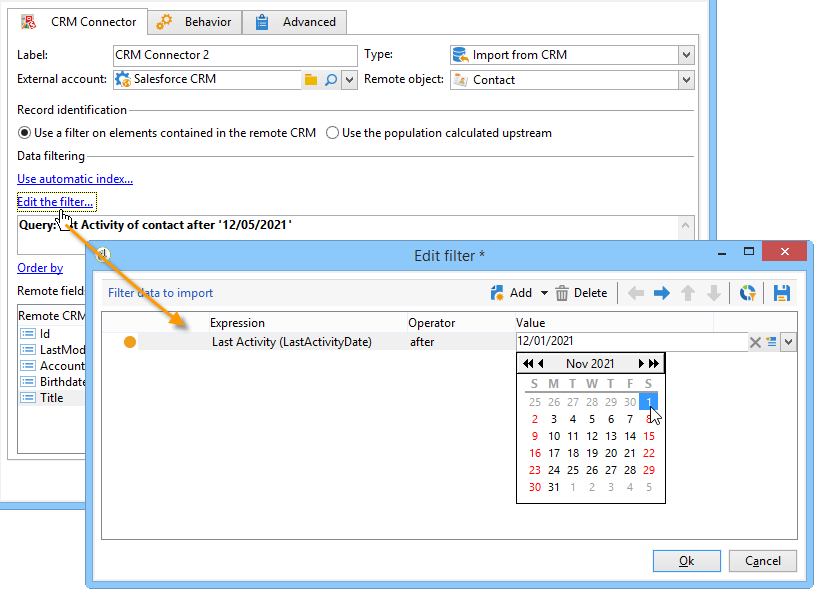
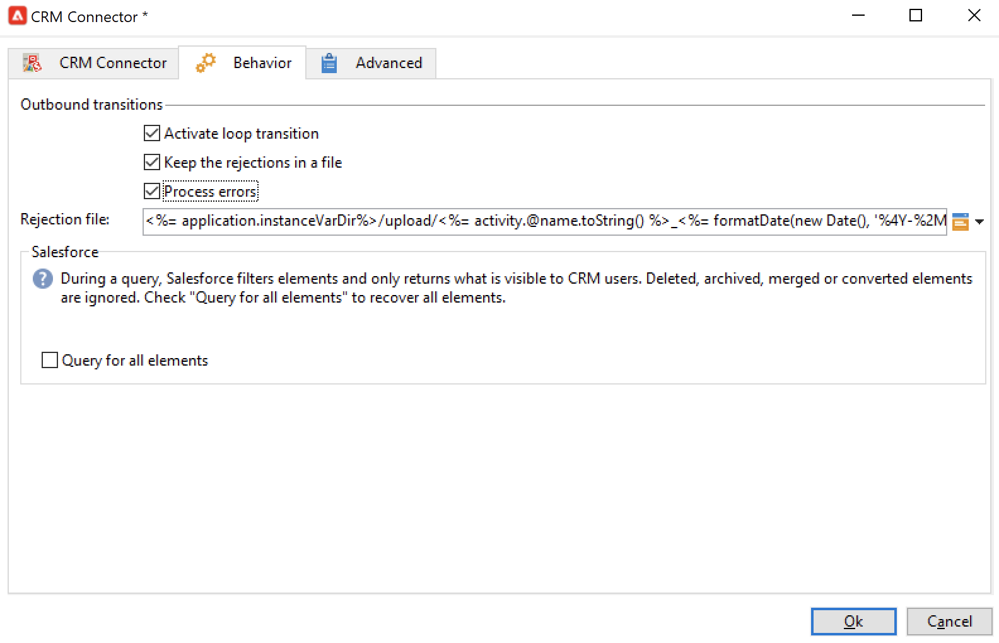

# Campaign과 CRM 간의 데이터 동기화 {#data-synchronization}

Adobe Campaign과 CRM 간의 데이터 동기화는 **CRM 커넥터** 워크플로우 활동에서 관리합니다.

예를 들어 Microsoft Dynamics 데이터를 Adobe Campaign으로 가져오려면 다음 유형의 워크플로우를 만듭니다.

이 워크플로는 Microsoft Dynamics를 통해 연락처를 가져와 기존 Adobe Campaign 데이터와 동기화하고 중복된 연락처를 삭제하고 Adobe Campaign 데이터베이스를 업데이트합니다.

데이터를 동기화하려면 **[!UICONTROL CRM Connector]** 활동을 구성해야 합니다.

이 활동을 통해 다음을 수행할 수 있습니다.

* CRM에서 가져오기 - [자세히 알아보기](#importing-from-the-crm)
* CRM으로 내보내기 - [자세히 알아보기](#exporting-to-the-crm)
* CRM에서 삭제된 개체 가져오기 - [자세히 알아보기](#importing-objects-deleted-in-the-crm)
* CRM에서 개체 삭제 - [자세히 알아보기](#deleting-objects-in-the-crm)

동기화를 구성할 CRM과 일치하는 외부 계정을 선택한 다음 동기화할 개체(계정, 기회, 리드, 연락처 등)를 선택합니다.

이 활동의 구성은 수행할 프로세스에 따라 다릅니다. 다양한 구성은 아래에 자세히 설명되어 있습니다.

## CRM에서 가져오기 {#importing-from-the-crm}

Adobe Campaign에서 CRM을 통해 데이터를 가져오려면 다음 유형의 워크플로우를 만들어야 합니다.

1. **[!UICONTROL Import from the CRM]** 작업을 선택하십시오.
1. **[!UICONTROL Remote object]** 드롭다운 목록에서 가져올 개체를 선택합니다. 이 개체는 커넥터 구성 중에 Adobe Campaign에서 만든 표 중 하나와 일치합니다.
1. **[!UICONTROL Remote fields]** 섹션에서 가져올 필드를 입력합니다.

   필드를 추가하려면 도구 모음에서 **[!UICONTROL Add]** 단추를 클릭한 다음 **[!UICONTROL Edit expression]** 아이콘을 클릭합니다.

   필요한 경우 **[!UICONTROL Conversion]** 열의 드롭다운 목록을 사용하여 데이터 형식을 변경합니다. 가능한 변환 형식은 [이 섹션](#data-format)에 자세히 설명되어 있습니다.

   >[!CAUTION]
   >
   >CRM 및 Adobe Campaign의 오브젝트를 연결하려면 CRM의 레코드 식별자가 필요합니다. 상자가 승인되면 자동으로 추가됩니다.
   >
   >증분 데이터 가져오기에 대해서도 CRM측의 마지막 수정 날짜가 필수입니다.

1. 필요에 따라 가져올 데이터를 필터링할 수 있습니다. 이렇게 하려면 **[!UICONTROL Edit the filter...]** 링크를 클릭하십시오.

   다음 예에서는 Adobe Campaign이 2021년 11월 1일 이후 일부 활동이 기록된 연락처만 가져옵니다.

   

   >[!CAUTION]
   >
   >데이터 필터링 모드와 관련된 제한 사항은 [이 섹션](#filtering-data)에 자세히 설명되어 있습니다.

1. 날짜와 마지막 수정 사항에 따라 CRM과 Adobe Campaign 간의 증분 개체 동기화를 자동으로 관리하려면 **[!UICONTROL Use automatic index...]** 옵션을 선택하십시오.

   이 작업에 대한 자세한 정보는 [이 섹션](#variable-management)을 참조하십시오.

### 변수 관리 {#variable-management}

마지막 가져오기 이후 수정된 개체만 수집하려면 **[!UICONTROL Automatic index]** 옵션을 활성화하십시오.

마지막 동기화 날짜는 기본적으로 구성 창에 지정된 옵션에 저장됩니다. **LASTIMPORT_&lt;%=instance.internalName%>_&lt;%=activityName%>**.

>[!NOTE]
>
>이 메모는 일반 **[!UICONTROL CRM Connector]** 활동에만 적용됩니다. 다른 CRM 활동의 경우 프로세스는 자동입니다.
>
>이 옵션은 **[!UICONTROL Administration]** > **[!UICONTROL Platform]** > **[!UICONTROL Options]**&#x200B;에서 수동으로 만들고 채워야 합니다. 이 옵션은 텍스트 옵션이어야 하며 해당 값은 **`yyyy/MM/dd hh:mm:ss`** 형식과 일치해야 합니다.
> 
>추가 가져오기를 수행하려면 이 옵션을 수동으로 업데이트해야 합니다.

가장 최근의 변경 사항을 식별하기 위해 고려할 원격 CRM 필드를 지정할 수 있습니다.

기본적으로 다음 필드가 지정된 순서로 사용됩니다.

* Microsoft Dynamics: **수정 완료**,
* Salesforce.com의 경우: **LastModifiedDate**, **SystemModstamp**.

**[!UICONTROL Automatic index]** 옵션을 활성화하면 **[!UICONTROL JavaScript code]** 유형 활동을 통해 동기화 워크플로우에서 사용할 수 있는 세 가지 변수가 생성됩니다. 이러한 활동은 다음과 같습니다.

* **vars.crmOptionName**: 마지막 가져오기 날짜가 포함된 옵션의 이름입니다.
* **vars.crmStartImport**: 마지막 데이터 가져오기 시작일(포함).
* **vars.crmEndDate**: 마지막 데이터 가져오기의 종료일(제외됨).

  >[!NOTE]
  >
  >이 날짜는 **`yyyy/MM/dd hh:mm:ss`** 형식으로 표시됩니다.

### 데이터 필터링 {#filtering-data}

다양한 CRM을 효율적으로 사용하려면 다음 규칙을 사용하여 필터를 만들어야 합니다.

* 각 필터링 수준은 한 가지 유형의 연산자만 사용할 수 있습니다.
* AND NOT 연산자는 지원되지 않습니다.
* 비교에는 null 값(&#39;is empty&#39;/&#39;is not empty&#39; type) 또는 숫자만 포함될 수 있습니다. 이는 값(오른쪽 열)이 평가되며 이 평가의 결과가 숫자여야 함을 의미합니다. 따라서 JOIN 유형 비교는 지원되지 않습니다.
* 오른쪽 열에 포함된 값은 JavaScript에서 평가됩니다.
* 조인 비교는 지원되지 않습니다.
* 왼쪽 열의 식은 필드여야 합니다. 여러 표현식, 숫자 등의 조합이 될 수 없습니다.

### 정렬 기준 {#order-by}

Microsoft Dynamics 및 Salesforce.com에서 가져올 원격 필드를 오름차순 또는 내림차순으로 정렬할 수 있습니다.

이렇게 하려면 **[!UICONTROL Order by]** 링크를 클릭하고 열을 목록에 추가합니다.

목록의 열 순서는 정렬 순서입니다.

### 레코드 식별 {#record-identification}

CRM에 포함되고 필터링될 수 있는 요소를 가져오지 않고 워크플로우에서 미리 계산된 모집단을 사용할 수 있습니다.

이렇게 하려면 **[!UICONTROL Use the population calculated upstream]** 옵션을 선택하고 원격 식별자가 포함된 필드를 지정합니다.

그런 다음 아래 표시된 대로 가져올 인바운드 모집단의 필드를 선택합니다.

## CRM으로 내보내기 {#exporting-to-the-crm}

Adobe Campaign 데이터를 CRM으로 내보내 전체 콘텐츠를 CRM 데이터베이스에 복사합니다.

데이터를 CRM으로 내보내려면 다음 유형의 워크플로우를 만듭니다.

1. **[!UICONTROL Export to CRM]** 작업을 선택하십시오.
1. **[!UICONTROL Remote object]** 드롭다운 목록으로 이동하여 내보낼 개체를 선택합니다. 이 개체는 커넥터 구성 중에 Adobe Campaign에서 만든 표 중 하나와 일치합니다.

   >[!CAUTION]
   >
   >**[!UICONTROL CRM Connector]** 활동의 내보내기 기능은 CRM의 필드를 삽입하거나 업데이트할 수 있습니다. CRM에서 필드 업데이트를 활성화하려면 원격 테이블의 기본 키를 지정하십시오. 키가 없으면 데이터가 업데이트되지 않고 삽입됩니다.

1. 더 빠른 내보내기를 수행하려면 **[!UICONTROL Export in Batches]** 옵션을 선택하십시오.

   

1. **[!UICONTROL Mapping]** 섹션에서 **[!UICONTROL New]**&#x200B;을(를) 클릭하여 내보낼 필드와 CRM의 매핑을 지정합니다.

   필드를 추가하려면 도구 모음에서 **[!UICONTROL Add]** 단추를 클릭한 다음 **[!UICONTROL Edit expression]** 아이콘을 클릭합니다.

   >[!NOTE]
   >
   >필드에 대해 정의된 일치 항목이 없으면 값을 업데이트할 수 없습니다. 해당 값은 CRM에 직접 삽입됩니다.

   필요한 경우 **[!UICONTROL Conversion]** 열의 드롭다운 목록을 사용하여 데이터 형식을 변경합니다. 가능한 변환 형식은 [이 섹션](#data-format)에 자세히 설명되어 있습니다.

   >[!NOTE]
   >
   >내보낼 레코드 목록과 내보내기 결과는 워크플로우가 완료되거나 다시 시작될 때까지 액세스 가능한 상태로 유지되는 임시 파일에 저장됩니다. 이를 통해 오류 발생 시 프로세스를 안전하게 시작할 수 있습니다.

## 추가 구성 {#additional-configurations}

### 데이터 형식 {#data-format}

데이터 형식을 CRM으로 가져오거나 CRM에서 가져올 때 즉시 변환할 수 있습니다.

이렇게 하려면 일치 열에 적용할 변환을 선택합니다.

**[!UICONTROL Default]** 모드는 자동 데이터 변환을 적용하며, 대부분의 경우 이 변환은 데이터의 복사/붙여넣기와 같습니다. 하지만 시간대 관리가 적용됩니다.

다른 가능한 전환은 다음과 같습니다.

* **[!UICONTROL Date only]**: 날짜 + 시간 유형 필드를 삭제합니다.
* **[!UICONTROL Without time offset]**: 기본 모드에서 적용된 표준 시간대 관리를 취소합니다.
* **[!UICONTROL Copy/Paste]**: 문자열(변환 없음)과 같은 원시 데이터를 사용합니다.

### 오류 처리 중 {#error-processing}

데이터 가져오기 또는 내보내기 프레임워크 내에서 특정 프로세스를 오류와 거부에 적용할 수 있습니다. 이렇게 하려면 **[!UICONTROL Behavior]** 탭에서 **[!UICONTROL Keep the rejections in a file]** 및 **[!UICONTROL Process errors]** 옵션을 선택하십시오.

이러한 옵션은 관련 출력 전환을 추가합니다.

그런 다음 데이터를 처리할 관련 활동을 삽입합니다. 예를 들어 **대기** 활동을 추가하고 오류 재시도를 예약합니다.

**[!UICONTROL Reject]** 출력 전환을 사용하면 오류 메시지 및 코드와 관련된 특정 열이 포함된 출력 스키마에 액세스할 수 있습니다. Salesforce.com의 경우 이 열은 **errorSymbol**(오류 기호, 오류 코드와 다름), **errorMessage**(오류 컨텍스트에 대한 설명)입니다.

## CRM에서 삭제된 오브젝트 가져오기 {#importing-objects-deleted-in-the-crm}

CRM에서 삭제된 오브젝트를 Adobe Campaign으로 가져올 수 있습니다.

1. **[!UICONTROL Import objects deleted in the CRM]** 작업을 선택하십시오.
1. **[!UICONTROL Remote object]** 드롭다운 목록으로 이동하여 프로세스와 관련된 개체를 선택하십시오. 이 개체는 커넥터 구성 중에 Adobe Campaign에서 만든 표 중 하나와 일치합니다.
1. **[!UICONTROL Start date]** 및 **[!UICONTROL End date]** 필드(날짜가 포함됨)에서 고려할 삭제 기간을 지정하십시오.

   >[!CAUTION]
   >
   >삭제 기간은 CRM별 제한 사항과 일치해야 합니다. 예를 들어 Salesforce.com의 경우 30일 전에 삭제된 요소는 복구할 수 없습니다.

## CRM의 오브젝트 삭제 {#deleting-objects-in-the-crm}

CRM의 개체를 삭제하려면 삭제할 원격 요소의 기본 키를 지정하십시오.

**[!UICONTROL Behavior]** 탭에서 거부 처리를 활성화할 수 있습니다. 이 옵션은 **[!UICONTROL CRM connector]** 활동에 대한 두 번째 출력 전환을 생성합니다. 자세한 내용은 [오류 처리](#error-processing)를 참조하세요.
