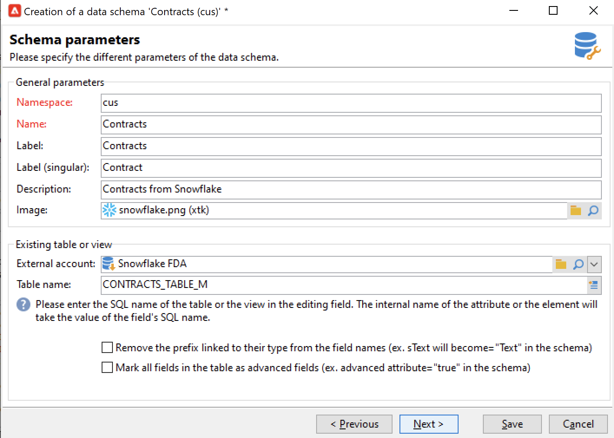

# FDA(Federated Data Access){#gs-fda}

FDA 커넥터(Federated Data Access)를 사용하여 Campaign을 하나 이상의 **외부 데이터베이스**&#x200B;에 연결하고 Campaign Cloud 데이터베이스 데이터에 영향을 주지 않고 Campaign에 저장된 정보를 처리합니다. 그런 다음 Adobe Campaign 데이터의 구조를 변경하지 않고 외부 데이터에 액세스할 수 있습니다.

>[!NOTE]
>
>FDA용 호환 데이터베이스는 [호환성 매트릭스](../start/compatibility-matrix.md)에 나열되어 있습니다.

Campaign FDA 옵션을 사용하면 데이터 모델을 타사 데이터베이스에서 확장할 수 있습니다. 대상 테이블의 구조를 자동으로 감지하고 SQL 소스의 데이터를 사용합니다.

특정 **권한**&#x200B;은 [!DNL Adobe Campaign] 및 외부 데이터베이스에서 함께 상호 작용해야 합니다. 자세한 내용은 [이 섹션](#fda-permissions)을 참조하십시오.

## 모범 사례 및 제한 사항

* **외부 데이터로 이메일 개인화 최적화**

   전용 워크플로우에서 메시지 개인화를 미리 처리할 수 있습니다. 이렇게 하려면 게재 속성의 **[!UICONTROL Analysis]** 탭에서 사용할 수 있는 **[!UICONTROL Prepare the personalization data with a workflow]** 옵션을 사용합니다.

   게재 분석 중에 이 옵션은 외부 데이터베이스에 연결된 테이블의 데이터를 포함하여 대상에 연결된 모든 데이터를 임시 테이블에 저장하는 워크플로우를 자동으로 만들고 실행합니다.

   이 옵션은 개인화 단계를 실행할 때 성능을 크게 향상시킵니다.

* **FDA 제한 사항**

   FDA 옵션은 워크플로우에서 일괄 처리 모드에서 외부 데이터베이스의 데이터를 조작하기 위해 수행됩니다. 성능 문제를 방지하려면 다음과 같이 단일 작업 컨텍스트에서 FDA 모듈을 사용하지 않는 것이 좋습니다. 개인화, 상호 작용, 실시간 메시징 등.

   Adobe Campaign과 외부 데이터베이스를 모두 가능한 한 사용해야 하는 작업을 방지합니다. 이렇게 하려면 다음을 수행할 수 있습니다.

   * Adobe Campaign 데이터베이스를 외부 데이터베이스로 내보내고 외부 데이터베이스에서만 작업을 수행한 후에 결과를 Adobe Campaign으로 다시 가져옵니다.

   * 외부 Adobe Campaign 데이터베이스에서 데이터를 수집하고 작업을 로컬로 실행합니다.

   외부 데이터베이스의 데이터를 사용하여 게재에서 개인화를 수행하려는 경우 워크플로우에서 사용할 데이터를 수집하여 임시 테이블에서 사용할 수 있도록 하십시오. 그런 다음 임시 테이블의 데이터를 사용하여 게재를 개인화합니다.

   FDA 옵션은 사용하는 외부 데이터베이스 시스템의 제한을 따릅니다.

## 구성 단계{#fda-configuration-steps}

FDA를 사용하여 외부 데이터베이스에 대한 액세스를 설정하려면 구성 단계는 다음과 같습니다.

1. Adobe Managed Services 사용자는 Adobe에 문의하여 Campaign 인스턴스에 드라이버를 설치하십시오.
1. 드라이버가 설치되면 Adobe Campaign 서버에서 데이터베이스에 해당하는 외부 계정을 설정하고 외부 계정을 테스트합니다. [자세히 알아보기](#fda-external-account)
1. Adobe Campaign에서 외부 데이터베이스의 스키마를 만듭니다. 외부 데이터베이스의 데이터 구조를 식별할 수 있습니다. [자세히 알아보기](#create-data-schema)
1. 필요한 경우 이전에 만든 스키마에서 새 대상 매핑을 만듭니다. 게재 수신자가 외부 데이터베이스에서 온 경우 필요합니다. 이 구현에는 메시지 개인화와 관련된 제한 사항이 포함되어 있습니다. [자세히 알아보기](#define-data-mapping)

## 외부 데이터베이스 외부 계정{#fda-external-account}

Campaign 인스턴스를 외부 데이터베이스에 연결하려면 특정 외부 계정을 만들어야 합니다.

이를 실현하려면 아래 단계를 수행하십시오.

1. Campaign **[!UICONTROL Explorer]**&#x200B;에서 **[!UICONTROL Administration]** `>` **[!UICONTROL Platform]** `>` **[!UICONTROL External accounts]**&#x200B;로 이동합니다.

1. **[!UICONTROL New]**&#x200B;를 클릭합니다.

   >[!NOTE]
   >
   > 활성화하려면 **[!UICONTROL Enabled]** 옵션을 선택해야 합니다. 필요한 경우 구성을 삭제하지 않고 이 데이터베이스에 대한 액세스를 비활성화하려면 이 옵션을 선택 취소합니다.

1. 외부 계정의 **[!UICONTROL Type]**(으)로 **[!UICONTROL External database]**&#x200B;을(를) 선택합니다.

1. 드롭다운 목록에서 외부 데이터베이스를 선택하고 외부 계정을 구성합니다. 다음을 지정해야 합니다.

   * **[!UICONTROL Server]**: 서버의 URL

   * **[!UICONTROL Account]**: 사용자의 이름

   * **[!UICONTROL Password]**: 사용자 계정 암호

   * **[!UICONTROL Database]**: 데이터베이스 이름

      

1. **[!UICONTROL Parameters]** 탭을 클릭한 다음 **[!UICONTROL Deploy functions]** 버튼을 클릭하여 함수를 만듭니다.

1. 매개 변수가 입력되면 **[!UICONTROL Test the connection]** 버튼을 클릭하여 승인합니다.

1. Adobe Campaign이 이 데이터베이스에 액세스할 수 있도록 하려면 SQL 함수를 배포해야 합니다. **[!UICONTROL Parameters]** 탭을 클릭한 다음 **[!UICONTROL Deploy functions]** 버튼을 클릭합니다.

**[!UICONTROL Parameters]** 탭에서 테이블 및 인덱스에 대한 특정 작업 테이블스페이스를 정의할 수 있습니다.

[!DNL Snowflake]의 경우 커넥터가 다음 옵션을 지원합니다.

| 옵션 | 설명 |
|---|---|
| 작업 스키마 | 작업 테이블에 사용할 데이터베이스 스키마 |
| 데이터 웨어하우스 | 사용할 기본 웨어하우스의 이름입니다. 사용자의 기본값을 덮어씁니다. |
| 표준 시간대 이름 | 기본적으로 비어 있음: Campaign Classic 앱 서버의 시스템 시간대가 사용됨을 의미합니다. 옵션을 사용하여 TIMEZONE 세션 매개 변수를 강제 적용할 수 있습니다.  자세한 정보는 이 [페이지](https://docs.snowflake.net/manuals/sql-reference/parameters.html#timezone)를 참조하십시오. |
| WeekStart | WEEK_START 세션 매개 변수입니다. 기본적으로 0으로 설정됩니다.  자세한 정보는 이 [페이지](https://docs.snowflake.com/en/sql-reference/parameters.html#week-start)를 참조하십시오. |
| UseCachedResult | USE_CACHED_RESULTS 세션 매개변수 기본적으로 TRUE로 설정됩니다. 이 옵션을 사용하여 캐시된 Snowflake 결과를 비활성화할 수 있습니다.  자세한 정보는 이 [페이지](https://docs.snowflake.net/manuals/user-guide/querying-persisted-results.html)를 참조하십시오. |

## 데이터 스키마 만들기{#create-data-schema}

Adobe Campaign에서 외부 데이터베이스의 스키마를 만들려면 아래 단계를 수행하십시오.

1. 데이터 스키마 목록 위에 있는 **[!UICONTROL New]** 단추를 클릭하고 **[!UICONTROL Access external data]** 을 선택합니다.

   

1. 스키마에 대한 이름과 설명을 입력하고 데이터베이스에 연결할 외부 계정을 선택합니다. 이렇게 하면 외부 베이스에서 사용할 수 있는 테이블 목록에 액세스할 수 있습니다. 수집할 데이터가 포함된 테이블을 선택합니다.

   

1. **[!UICONTROL OK]** 을 클릭하여 확인합니다. Adobe Campaign은 선택한 테이블의 구조를 자동으로 감지하고 논리 스키마를 생성합니다. Adobe Campaign은 링크를 생성하지 않습니다.

1. **[!UICONTROL Save]** 을 클릭하여 만들기를 확인합니다.

## 대상 매핑 정의{#define-data-mapping}

외부 테이블의 데이터에 대한 매핑을 정의할 수 있습니다.

이렇게 하려면 외부 테이블의 스키마가 만들어지면 이 테이블의 데이터를 게재 대상으로 사용하려면 새 게재 매핑을 만들어야 합니다.

이렇게 하려면 다음 단계를 수행합니다.

1. Adobe Campaign 탐색기에서 **[!UICONTROL Administration]** `>` **[!UICONTROL Campaign Management]** `>` **[!UICONTROL Target mappings]**&#x200B;로 이동합니다.

1. 새 대상 매핑을 만들고 타깃팅 차원으로 방금 만든 스키마를 선택합니다.

   

1. 게재 정보가 저장되는 필드(성, 이름, 이메일, 주소 등)를 지정합니다.

   

1. 확장 스키마의 접미사를 포함하여 정보 저장 영역에 대한 매개 변수를 쉽게 식별할 수 있도록 지정합니다.

   

   메시지(**broadlog**)가 포함된 제외(**excludelog**)를 저장할 것인지 아니면 별도의 테이블에 저장할 것인지 선택할 수 있습니다.

   이 배달 매핑에 대한 추적을 관리할지 여부를 선택할 수도 있습니다(**trackinglog**).

1. 그런 다음 고려할 확장을 선택합니다. 확장 유형은 플랫폼의 매개 변수 및 옵션에 따라 다릅니다(라이센스 계약 보기).

   

   **[!UICONTROL Save]** 단추를 클릭하여 게재 매핑 만들기를 시작합니다. 연결된 모든 테이블은 선택한 매개변수를 기준으로 자동으로 생성됩니다.

## 사용 권한{#fda-permissions}

특정 **권한**&#x200B;은 [!DNL Adobe Campaign] 및 외부 데이터베이스에서 함께 상호 작용해야 합니다.

먼저, 사용자가 FDA를 통해 외부 데이터베이스에서 작업을 수행할 수 있도록 연산자는 [!DNL Adobe Campaign]에 특정 명명된 권한을 가져야 합니다.

1. Adobe Campaign 탐색기에서 **[!UICONTROL Administration > Access Management > Named Rights]** 노드를 선택합니다.
1. 선택한 레이블을 지정하여 새 권한을 만듭니다.
1. 다음 형식으로 명명된 오른쪽의 이름을 **user:base@server**(여기서)로 입력합니다.

   * **** useris 외부 데이터베이스에 있는 사용자의 이름입니다
   * **** basis는 외부 데이터베이스의 이름입니다
   * **** server는 외부 데이터베이스 서버의 이름입니다

1. 이름이 지정됨 오른쪽 을 저장하고 Adobe Campaign 탐색기의 **[!UICONTROL Administration > Access Management > Operators]** 노드에서 선택한 연산자에 연결합니다.

그런 다음 외부 데이터베이스에 포함된 데이터를 처리하려면 Adobe Campaign 연산자가 작업 테이블을 만들 수 있도록 데이터베이스에 대해 최소 &#39;쓰기&#39; 권한을 가져야 합니다. 이러한 표는 Adobe Campaign에서 자동으로 삭제됩니다.

다음 권한이 필요합니다.

* **CONNECT**: 원격 데이터베이스에 연결
* **데이터 읽기**: 고객 데이터가 포함된 테이블에 대한 읽기 전용 액세스
* **&#39;MetaData&#39;** 읽기: 서버 데이터 카탈로그에 액세스하여 테이블 구조 가져오기
* **로드**: 작업 테이블에서 일괄 로드(컬렉션 및 조인 작업 시 필요)
* **테이블/** 색인/ **프로시저/함수 만들기/놓기** (Adobe Campaign에서 생성한 작업 테이블에만 해당)
* **설명** (권장): 문제 발생 시 성능 모니터링
* **WRITE 데이터** (통합 시나리오에 따라)

데이터베이스 관리자는 아래 자세히 설명된 대로 이러한 권한을 각 데이터베이스 엔진에 대한 권한과 일치시켜야 합니다.

|   | Snowflake | Amazon Redshift |
|:-:|:-:|:-:|
| **원격 데이터베이스에 연결** | 웨어하우스의 사용, 데이터베이스의 사용 및 스키마 권한에 대한 사용 | AWS 계정에 연결된 사용자 생성 |
| **표 만들기** | 스키마 권한에 대한 테이블 만들기 | 권한 만들기 |
| **인덱스 만들기** | N/A | 권한 만들기 |
| **함수 만들기** | 스키마 권한에 대한 함수 만들기 | 외부 python 스크립트를 호출할 수 있는 USAGE ON LANGUAGE plpythonu 권한 |
| **프로시저 만들기** | 해당 없음 | 외부 python 스크립트를 호출할 수 있는 사용 ON LANGUAGE python 권한 |
| **객체 제거(테이블, 인덱스, 함수, 프로시저)** | 개체 소유 | 개체 소유 또는 수퍼유저 |
| **실행 모니터링** | 필요한 개체에 대한 모니터 권한 | EXPLAIN 명령을 사용하는 데 필요한 권한이 없습니다. |
| **데이터 쓰기** | INSERT 및/또는 UPDATE 권한(쓰기 작업에 따라 다름) | 삽입 및 업데이트 권한 |
| **표에 데이터 로드** | 스키마에 스테이지를 만들고, 대상 테이블 권한에 대해 선택 및 삽입 | 선택 및 삽입 권한 |
| **클라이언트 데이터에 액세스** | (미래) 테이블 또는 뷰 권한을 선택합니다. | 권한 선택 |
| **메타데이터에 액세스** | INFORMATION_SCHEMA 권한 선택 | 권한 선택 |

## 워크플로우에서 외부 데이터 사용

데이터 스키마가 만들어지면 Adobe Campaign 워크플로우에서 데이터를 처리할 수 있습니다.

여러 활동을 사용하면 외부 데이터베이스의 데이터와 상호 작용할 수 있습니다.

* **외부 데이터 필터**  -  **[!UICONTROL Query]** 활동을 사용하면 외부 데이터를 추가하고 정의된 필터 구성에 사용할 수 있습니다.

* **하위 집합 만들기**  -  **[!UICONTROL Split]** 활동을 통해 하위 세트를 만들 수 있습니다. 외부 데이터를 사용하여 사용할 필터링 기준을 정의할 수 있습니다.

* **외부 데이터베이스 로드**  - 활동에서 외부 데이터를 사용할 수  **[!UICONTROL Data loading (RDBMS)]** 있습니다.

* **정보 및 링크 추가**  -  **[!UICONTROL Enrichment]** 활동을 사용하면 워크플로우의 작업 테이블에 추가 데이터를 추가하고 외부 테이블에 연결할 수 있습니다. 이 컨텍스트에서는 외부 데이터베이스의 데이터를 사용할 수 있습니다.

임시 사용을 위해 이러한 워크플로우 활동에서 외부 데이터베이스에 대한 연결을 직접 정의할 수도 있습니다. 이 경우 현재 워크플로우 내에서 사용하도록 예약된 로컬 외부 데이터베이스에 있습니다. 외부 계정에는 저장되지 않습니다.

>[!CAUTION]
>
>이 유형의 구성은 데이터를 수집하는 데 임시로 사용해야 합니다. 다른 용도에는 외부 계정 구성을 사용하는 것이 좋습니다.

예를 들어 **[!UICONTROL Query]** 활동에서 다음과 같이 외부 데이터베이스에 대한 임시 연결을 정의할 수 있습니다.

1. 활동을 열고 **[!UICONTROL Add data...]** 클릭
1. **[!UICONTROL External data]** 옵션을 선택합니다
1. **[!UICONTROL Locally defining the data source]** 옵션을 선택합니다
1. 드롭다운 목록에서 대상 데이터베이스 엔진을 선택합니다. 서버 이름을 입력하고 인증 매개 변수를 제공합니다. 외부 데이터베이스의 이름도 지정합니다.
1. 데이터가 저장되는 테이블을 선택합니다. 해당 필드에 직접 테이블 이름을 입력하거나 편집 아이콘을 눌러 데이터베이스 테이블 목록에 액세스할 수 있습니다.
1. 외부 데이터베이스 데이터와 Adobe Campaign 데이터베이스의 데이터 간에 하나 또는 여러 개의 조정 필드를 정의하려면 **[!UICONTROL Add]** 버튼을 클릭합니다. **[!UICONTROL Remote field]** 및 **[!UICONTROL Local field]**&#x200B;의 **[!UICONTROL Edit expression]** 아이콘을 사용하면 각 테이블의 필드 목록에 액세스할 수 있습니다.
1. 필요한 경우 필터링 조건 및 데이터 정렬 모드를 지정합니다.
1. 외부 데이터베이스에서 수집할 추가 데이터를 선택합니다. 이렇게 하려면 추가할 필드를 두 번 클릭하여 **[!UICONTROL Output columns]**&#x200B;에 표시합니다.
1. **[!UICONTROL Finish]** 을 클릭하여 이 구성을 확인합니다.
