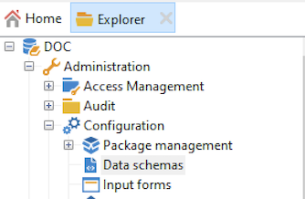

# 새 스키마 만들기{#create-new-schema}

스키마를 편집, 생성 및 구성하려면 Adobe Campaign 클라이언트 콘솔의 **[!UICONTROL Administration > Configuration > Data schemas]** 노드를 클릭합니다.

>[!NOTE]
>
>기본 제공 데이터 스키마는 Adobe Campaign Classic 콘솔 관리자만 삭제할 수 있습니다.



**[!UICONTROL Edit]** 탭에는 스키마의 XML 내용이 표시됩니다.


>[!NOTE]
>
>이름 편집 컨트롤을 사용하면 이름 및 네임스페이스로 구성된 스키마 키를 입력할 수 있습니다. 스키마의 루트 요소의 &quot;name&quot; 및 &quot;namespace&quot; 속성은 스키마의 XML 편집 영역에서 자동으로 업데이트됩니다. 일부 네임스페이스는 내부용입니다. [자세히 알아보기](schemas.md#reserved-namespaces)

**[!UICONTROL Preview]** 탭은 확장 스키마를 자동으로 생성합니다.


>[!NOTE]
>
>소스 스키마가 저장되면 확장 스키마 생성이 자동으로 시작됩니다.

스키마의 전체 구조를 확인해야 하는 경우 **[!UICONTROL Preview]** 탭을 사용할 수 있습니다. 스키마가 확장되면 모든 확장을 시각화할 수 있습니다. 보충 자료로 **[!UICONTROL Documentation]** 탭에는 모든 스키마 속성 및 요소와 속성(SQL 필드, 유형/길이, 레이블, 설명)이 표시됩니다. **[!UICONTROL Documentation]** 탭은 생성된 스키마에만 적용됩니다.

## 사용 사례:계약 테이블 {#example--creating-a-contract-table} 만들기

다음 예제에서는 데이터베이스에 **contracts**&#x200B;에 대한 새 테이블을 만듭니다. 이 테이블을 사용하면 각 계약에 대해 소유자 및 공동 소유자의 이름과 전자 메일 주소를 저장할 수 있습니다.

이렇게 하려면 테이블의 스키마를 만들고 데이터베이스 구조를 업데이트하여 해당 테이블을 생성해야 합니다. 자세한 단계는 아래에 나와 있습니다.

1. Adobe Campaign 트리의 **[!UICONTROL Administration > Configuration > Data schemas]** 노드를 편집하고 **[!UICONTROL New]** 를 클릭합니다.
1. **[!UICONTROL Create a new table in the data template]** 옵션을 선택하고 **[!UICONTROL Next]** 를 클릭합니다.

   

1. 테이블 이름과 네임스페이스를 지정합니다.

   

   >[!NOTE]
   >
   >기본적으로 사용자가 만든 스키마는 &#39;cus&#39; 네임스페이스에 저장됩니다. 자세한 내용은 [스키마 식별](extend-schema.md#identification-of-a-schema)을 참조하십시오.

1. 표의 컨텐츠를 만듭니다. 설정이 누락되지 않았는지 확인하려면 전용 도우미를 사용하는 것이 좋습니다. 이렇게 하려면 **[!UICONTROL Insert]** 버튼을 클릭하고 추가할 설정 유형을 선택합니다.

   

1. 계약 테이블에 대한 설정을 정의합니다.

   ```
   <srcSchema created="YYYY-MM-DD HH:MM:SS.TZ" desc="Active contracts" img="crm:crm/mscrm/mscrm_account_16x16.png"
           label="Contracts" labelSingular="Contract" lastModified="YYYY-MM-DD HH:MM:SS.TZ"
           mappingType="sql" name="Contracts" namespace="cus" xtkschema="xtk:srcSchema">
      <element dataSource="nms:extAccount:ffda" desc="Active contracts" img="crm:crm/mscrm/mscrm_account_16x16.png"
           label="Contracts" labelSingular="Contract" name="Contracts">
           <attribute name="holderName" label="Holder last name" type="string"/>
           <attribute name="holderFirstName" label="Holder first name" type="string"/>
           <attribute name="holderEmail" label="Holder email" type="string"/>
           <attribute name="co-holderName" label="Co-holder last name" type="string"/>           
           <attribute name="co-holderFirstName" label="Co-holder first name" type="string"/>           
           <attribute name="co-holderEmail" label="Co-holder email" type="string"/>    
           <attribute name="date" label="Subscription date" type="date"/>     
           <attribute name="noContract" label="Contract number" type="long"/> 
      </element>
   </srcSchema>
   ```

   계약 열거형의 유형을 추가합니다.

   ```
   <srcSchema created="AA-MM-DD HH:MM:SS.TZ" desc="Active contracts" img="crm:crm/mscrm/mscrm_account_16x16.png" label="Contracts" labelSingular="Contract" AA-MM-DD HH:MM:SS.TZ"mappingType="sql" name="Contracts" namespace="cus" xtkschema="xtk:srcSchema">
      <enumeration basetype="byte" name="typeContract">
         <value label="Home" name="home" value="0"/>
         <value label="Car" name="car" value="1"/>
         <value label="Health" name="health" value="2"/>
         <value label="Pension fund" name="pension fund" value="2"/>
      </enumeration>
      <element dataSource="nms:extAccount:ffda" desc="Active contracts" img="crm:crm/mscrm/mscrm_account_16x16.png"
           label="Contracts" labelSingular="Contract" name="Contracts">
           <attribute name="holderName" label="Holder last name" type="string"/>
           <attribute name="holderFirstName" label="Holder first name" type="string"/>
           <attribute name="holderEmail" label="Holder email" type="string"/>
           <attribute name="co-holderName" label="Co-holder last name" type="string"/>           
           <attribute name="co-holderFirstName" label="Co-holder first name" type="string"/>           
           <attribute name="co-holderEmail" label="Co-holder email" type="string"/>    
           <attribute name="date" label="Subscription date" type="date"/>     
           <attribute name="noContract" label="Contract number" type="long"/> 
      </element>
   </srcSchema>
   ```

1. 스키마를 저장하고 **[!UICONTROL Structure]** 탭을 클릭하여 구조를 생성합니다.

   

1. 데이터베이스 구조를 업데이트하여 스키마가 연결될 테이블을 만듭니다. 이 작업에 대한 자세한 정보는 [이 섹션](update-database-structure.md)을 참조하십시오.

