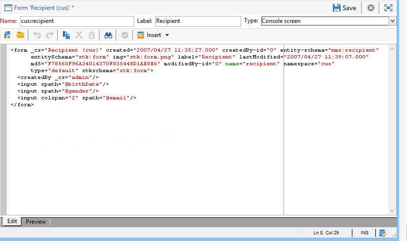

# 입력 양식 시작 {#gs-ac-forms}

스키마를 만들거나 확장할 때 관련 입력 양식을 만들거나 수정하여 최종 사용자가 해당 변경 사항을 볼 수 있도록 해야 합니다.

입력 양식을 사용하면 Adobe Campaign 클라이언트 콘솔에서 데이터 스키마와 연결된 인스턴스를 편집할 수 있습니다. 양식은 이름과 네임스페이스로 식별됩니다.

양식의 식별 키는 네임스페이스와 콜론으로 구분된 이름으로 구성된 문자열입니다(예: &quot;cus:contact&quot;).

## 입력 양식 편집

다음에서 입력 양식 만들기 및 구성 **[!UICONTROL Administration]> [!UICONTROL Configuration] >[!UICONTROL Input forms]** 클라이언트 콘솔의 폴더:


편집 영역을 사용하면 입력 양식의 XML 내용을 입력할 수 있습니다.



미리 보기는 입력 양식의 표시를 생성합니다.


## 양식 구조

양식의 설명은 양식 스키마의 문법을 관찰하는 구조화된 XML 문서입니다 **xtk:form**.

입력 양식의 XML 문서에는 `<form>` 루트 요소  **이름** 및  **네임스페이스** 속성을 사용하여 양식 이름과 네임스페이스를 채웁니다.

```
<form name="form_name" namespace="name_space">
...
</form>
```

기본적으로 양식은 이름과 네임스페이스가 동일한 데이터 스키마와 연결됩니다. 양식을 다른 이름과 연결하려면 **entity-schema** 속성 `<form>` 요소를 스키마 키 이름으로 바꿉니다. 입력 양식의 구조를 설명하기 위해 &quot;cus:recipient&quot; 예제 스키마를 사용하는 인터페이스를 설명하겠습니다.

```
<srcSchema name="recipient" namespace="cus">
  <enumeration name="gender" basetype="byte">    
    <value name="unknown" label="Not specified" value="0"/>    
    <value name="male" label="Male" value="1"/>   
    <value name="female" label="Female" value="2"/>   
  </enumeration>

  <element name="recipient">
    <attribute name="email" type="string" length="80" label="Email" desc="E-mail address of recipient"/>
    <attribute name="birthDate" type="datetime" label="Date"/>
    <attribute name="gender" type="byte" label="Gender" enum="gender"/>
  </element>
</srcSchema>
```

예제 스키마를 기반으로 하는 입력 양식:


```
<form name="recipient" namespace="cus">
  <input xpath="@gender"/>
  <input xpath="@birthDate"/>
  <input xpath="@email"/>
</form>
```

편집 컨트롤에 대한 설명은 `<form>` 루트 요소입니다. 편집 컨트롤은 다음에 입력됩니다. **`<input>`** 요소가 **xpath** 스키마에 있는 필드의 경로를 포함하는 속성입니다.

편집 컨트롤은 해당 데이터 유형에 자동으로 적응하고 스키마에 정의된 레이블을 사용합니다.

>[!NOTE]
>
>를 추가하여 데이터 스키마에 정의된 레이블을 덮어쓸 수 있습니다. **레이블** 속성 `<input>` 요소:\
>`<input label="E-mail address" xpath="@name" />`

기본적으로 각 필드는 한 줄에 표시되며 데이터 유형에 따라 사용 가능한 모든 공간을 차지합니다.

 모든 양식 속성이에 나열됨 [Campaign Classic v7 설명서](https://experienceleague.adobe.com/developer/campaign-api/api/control-Button.html){target="_blank"}.

## 양식화 {#formatting}

컨트롤의 레이아웃은 HTML 테이블에 사용된 레이아웃과 비슷하며 컨트롤을 여러 열로 나누거나 요소를 교차시키거나 사용 가능한 공간 위치를 지정할 수 있습니다. 그러나 이 서식을 지정하면 영역을 비례로만 나눌 수 있습니다. 객체에 대해 고정 치수를 지정할 수 없습니다.

위의 예의 컨트롤을 두 열에 표시하려면 다음을 수행합니다.


```
<form name="recipient" namespace="cus">
  <container colcount="2">
    <input xpath="@gender"/>
    <input xpath="@birthDate"/>
    <input xpath="@email"/>
  </container>
</form>
```

다음 **`<container>`** 요소가 **colcount** 특성을 사용하면 자식 컨트롤을 두 열에 강제로 표시할 수 있습니다.

다음 **열 범위** 컨트롤의 특성은 해당 값에 입력한 열의 수만큼 컨트롤을 확장합니다.


```
<form name="recipient" namespace="cus">
  <container colcount="2">
    <input xpath="@gender"/>
    <input xpath="@birthDate"/>
    <input xpath="@email" colspan="2"/>
  </container>
</form> 
```

을(를) 채우면 **type=&quot;frame&quot;** 속성을 지정하면 컨테이너에 레이블이 포함된 자식 컨트롤 주위에 프레임이 추가됩니다 **레이블** 특성:


```
<form name="recipient" namespace="cus">
  <container colcount="2" type="frame" label="General">
    <input xpath="@gender"/>
    <input xpath="@birthDate"/>
    <input xpath="@email" colspan="2"/>
  </container>
</form>
```

A **`<static>`** 요소를 사용하여 입력 양식 서식을 지정할 수 있습니다.


```
<form name="recipient" namespace="cus">
  <static type="separator" colspan="2" label="General"/>
  <input xpath="@gender"/>
  <input xpath="@birthDate"/>
  <input xpath="@email" colspan="2"/>
  <static type="help" label="General information about recipient with date of birth, gender, and e-mail address." colspan="2"/>
</form>
```

다음 **`<static>`** 을 사용하여 태그 지정 **분리자** 유형을 사용하면 레이블이있는 구분자를 추가할 수 있습니다. **레이블** 특성.

다음을 사용하여 도움말 텍스트가 추가되었습니다. `<static>` 도움말 유형이 포함된 태그. 텍스트 컨텐트가에 입력됩니다. **레이블** 특성.

## 컨테이너 사용 {#containers}

사용 **컨테이너** 을 클릭하여 컨트롤 집합을 그룹화합니다. 이는 다음과 같이 표시됩니다. **`<container>`** 요소를 생성하지 않습니다. 위에서 여러 열에 대한 컨트롤 서식을 지정하는 데 사용되었습니다.

다음 **xpath** 다음에 대한 속성 `<container>` 자식 컨트롤의 참조를 단순화할 수 있습니다. 그런 다음 컨트롤 참조는 상위를 기준으로 합니다 `<container>` 상위.

&quot;xpath&quot;가 없는 컨테이너의 예:

```
<container colcount="2">
  <input xpath="location/@zipCode"/>
  <input xpath="location/@city"/>
</container>
```

&quot;위치&quot;라는 요소에 &quot;xpath&quot;를 추가하는 예:

```
<container colcount="2" xpath="location">
  <input xpath="@zipCode"/>
  <input xpath="@city"/>
</container>
```

컨테이너는 페이지 형식의 필드 집합을 사용하여 복잡한 컨트롤을 만드는 데 사용됩니다.

### 탭(전자 필기장) 추가 {#tab-container}

사용 **notebook** 탭에서 액세스할 수 있는 페이지의 데이터 형식을 지정하는 컨테이너입니다.


```
<container type="notebook">
  <container colcount="2" label="General">
    <input xpath="@gender"/>
    <input xpath="@birthDate"/>
    <input xpath="@email" colspan="2"/>
  </container>
  <container colcount="2" label="Location">
    ...
  </container>
</container>
```

기본 컨테이너는 **type=&quot;notebook&quot;** 특성. 탭은 하위 컨테이너에 선언되고 탭의 레이블은 **레이블** 특성.

추가 **style=&quot;down&quot;** 컨트롤 아래에 탭 레이블의 세로 위치를 강제 지정하는 특성입니다. 이 속성은 선택 사항입니다. 기본값은 입니다. **&quot;위&quot;**.


`<container style="down" type="notebook">  ... </container>`

### 아이콘 추가(아이콘 상자) {#icon-list}

이 컨테이너를 사용하여 표시할 페이지를 선택할 수 있는 세로 아이콘 막대를 표시합니다.


```
<container type="iconbox">
  <container colcount="2" label="General" img="xtk:properties.png">
    <input xpath="@gender"/>
    <input xpath="@birthDate"/>
    <input xpath="@email" colspan="2"/>
  </container>
  <container colcount="2" label="Location" img="nms:msgfolder.png">
    ...
  </container>
</container>
```

기본 컨테이너는 **type=&quot;iconbox&quot;** 특성. 아이콘과 연관된 페이지는 하위 컨테이너에 선언됩니다. 아이콘의 레이블은 **레이블** 특성.

페이지의 아이콘은에서 채워집니다. `img="<image>"` attribute, 여기서 `<image>` 는 이름 및 네임스페이스로 구성된 키에 해당하는 이미지 이름입니다(예: &quot;xtk:properties.png&quot;).

이미지는 다음 위치에서 사용할 수 있습니다. **[!UICONTROL Administration > Configuration > Images]** 노드.

### 컨테이너 숨기기(visibleGroup) {#visibility-container}

동적 조건을 통해 컨트롤 집합을 숨길 수 있습니다.

다음 예에서는 &quot;성별&quot; 필드의 값에 대한 컨트롤의 가시성을 보여 줍니다.

```
<container type="visibleGroup" visibleIf="@gender=1">
  ...
</container>
<container type="visibleGroup" visibleIf="@gender=2">
  ...
</container>
```

가시성 컨테이너는 속성으로 정의됩니다 **type=&quot;visibleGroup&quot;**. 다음 **visibleIf** 속성에 가시성 조건이 포함됩니다.

조건 구문의 예:

* **visibleIf=&quot;@email=&#39;peter.martinezATneeolane.net&#39;&quot;**: 문자열 유형 데이터에 대한 같음을 테스트합니다. 비교 값은 따옴표로 묶어야 합니다.
* **visibleIf=&quot;@gender >= 1 및 @gender != 2&quot;**: 숫자 값에 대한 조건입니다.
* **visibleIf=&quot;@boolean1=true 또는 @boolean2=false&quot;**: 부울 필드를 테스트합니다.

### 조건부 표시(enabledGroup) {#enabling-container}

이 컨테이너를 사용하여 동적 조건에서 데이터 세트를 활성화하거나 비활성화할 수 있습니다. 컨트롤을 비활성화하면 편집할 수 없습니다. 다음 예제에서는 &quot;Gender&quot; 필드의 값에서 컨트롤을 사용하는 방법을 보여 줍니다.

```
<container type="enabledGroup" enabledIf="@gender=1">
  ...
</container>
<container type="enabledGroup" enabledIf="@gender=2">
  ...
</container>
```

활성화 컨테이너는 **type=&quot;enabledGroup&quot;** 특성. 다음 **enabledIf** 속성에 활성화 조건이 포함됩니다.

## 링크 편집 {#editing-a-link}

링크는 다음과 같이 데이터 스키마에서 선언됩니다.

```
<element label="Company" name="company" target="cus:company" type="link"/>
```

입력 양식에서 링크의 편집 컨트롤은 다음과 같습니다.


```
<input xpath="company"/>
```

타겟 선택은 편집 필드를 통해 액세스할 수 있습니다. 입력 시 자동 완성 기능이 지원되므로 처음 입력한 몇 문자에서 대상 요소를 쉽게 찾을 수 있습니다. 그런 다음 검색은 **계산 문자열** 대상 스키마에 정의되어 있습니다. 컨트롤에서 유효성 검사 후 스키마가 존재하지 않으면 즉시 대상 만들기에 대한 확인 메시지가 표시됩니다. 이 확인란은 대상 테이블에 새 레코드를 만들고 이를 링크와 연결합니다.

드롭다운 목록은 이미 생성된 레코드 목록에서 대상 요소를 선택하는 데 사용됩니다.

다음 **[!UICONTROL Modify the link]** (폴더) 아이콘은 타겟팅된 요소 목록과 필터 영역이 있는 선택 양식을 시작합니다.

다음 **[!UICONTROL Edit link]** (돋보기) 아이콘으로 연결된 요소의 편집 양식이 실행됩니다. 사용된 양식은 타겟팅된 스키마의 키에서 기본적으로 추론됩니다. 다음 **양식** 속성을 사용하면 편집 양식의 이름을 강제 적용할 수 있습니다(예: &quot;cus:company2&quot;).

다음을 추가하여 대상 요소의 선택을 제한할 수 있습니다. **`<sysfilter>`** 입력 양식에 있는 링크 정의의 요소:

```
<input xpath="company">
  <sysFilter>
    <condition expr="[location/@city] =  'Newton"/>
  </sysFilter>
</input>
```

다음을 사용하여 목록을 정렬할 수도 있습니다. **`<orderby>`** 요소:

```
<input xpath="company">
  <orderBy>
    <node expr="[location/@zipCode]"/>
  </orderBy>
</input>
```

## 컨트롤 속성 {#control-properties}

* **noAutoComplete**: 자동 완성 기능을 비활성화합니다(&quot;true&quot; 값 사용).
* **createMode**: 링크가 없는 경우 바로 링크를 만듭니다. 가능한 값:

   * **없음**: 생성을 비활성화합니다. 링크가 없는 경우 오류 메시지가 표시됩니다
   * **인라인**: 편집 필드에 콘텐츠가 있는 링크를 만듭니다.
   * **에디션**: 링크에 편집 양식을 표시합니다. 양식의 유효성을 검사하면 데이터가 저장됩니다(기본 모드).

* **noZoom**: 링크에 편집 양식 없음(값이 &quot;true&quot;인)
* **양식**: 타깃팅된 요소의 편집 양식을 오버로드합니다.

## 링크 목록 추가(바인딩되지 않음) {#list-of-links}

데이터 스키마에 컬렉션 요소(바인딩되지 않음=&quot;true&quot;)로 입력한 링크가 목록을 통과해야 연결된 모든 요소를 볼 수 있습니다.

이 원칙은 데이터 로드가 최적화된 연결된 요소 목록을 표시하는 데 있습니다(데이터 배치로 다운로드, 표시되는 경우에만 목록 실행).

스키마의 컬렉션 링크 예:

```
<element label="Events" name="rcpEvent" target="cus:event" type="link" unbound="true">
...
</element>
```

입력 양식의 목록:

```
 <input xpath="rcpEvent" type="linklist">
  <input xpath="@label"/>
  <input xpath="@date"/>
</input>
```

목록 컨트롤은 다음에 의해 정의됩니다. **type=&quot;linklist&quot;** 특성. 목록 경로는 컬렉션 링크를 참조해야 합니다.

열은 **`<input>`** 목록에 있는 요소입니다. 다음 **xpath** 속성은 대상 스키마에 있는 필드의 경로를 나타냅니다.

레이블(스키마의 링크에 정의됨)이 있는 도구 모음은 자동으로 목록 위에 배치됩니다.

목록을 필터링하려면 **[!UICONTROL Filters]** 단추를 누르고 열을 추가하고 정렬하도록 구성되었습니다.

다음 **[!UICONTROL Add]** 및 **[!UICONTROL Delete]** 단추를 사용하면 링크에서 컬렉션 요소를 추가 및 삭제할 수 있습니다. 기본적으로 요소를 추가하면 대상 스키마의 편집 양식이 실행됩니다.

다음 **[!UICONTROL Detail]** 다음 경우에 단추가 자동으로 추가됩니다. **zoom=&quot;true&quot;** 속성이에 완료되었습니다. **`<input>`** 목록의 태그: 선택한 행의 편집 양식을 시작할 수 있습니다.

필터링 및 정렬은 목록이 로드될 때 적용할 수 있습니다.

```
 <input xpath="rcpEvent" type="linklist">
  <input xpath="@label"/>
  <input xpath="@date"/>
  <sysFilter>
    <condition expr="@type = 1"/>
  </sysFilter>
  <orderBy>
    <node expr="@date" sortDesc="true"/>
  </orderBy>
</input>
```

## 관계 테이블 정의 {#relationship-table}

관계 테이블을 사용하면 두 테이블을 N-N 카디널리티로 연결할 수 있습니다. 관계 테이블에는 두 테이블에 대한 링크만 포함되어 있습니다.

따라서 목록에 요소를 추가하면 관계 테이블의 두 링크 중 하나에서 목록을 완료할 수 있습니다.

스키마의 관계 테이블 예:

```
<srcSchema name="subscription" namespace="cus">
  <element name="recipient" type="link" target="cus:recipient" label="Recipient"/>
  <element name="service" type="link" target="cus:service" label="Subscription service"/>
</srcSchema>
```

이 예제에서는 &quot;cus:recipient&quot; 스키마의 입력 양식으로 시작합니다. 목록에는 서비스 구독에 대한 연결이 표시되어야 하며 기존 서비스를 선택하여 구독을 추가할 수 있도록 허용해야 합니다.


```
<input type="linklist" xpath="subscription" xpathChoiceTarget="service" xpathEditTarget="service" zoom="true">
  <input xpath="recipient"/>
  <input xpath="service"/>
</input>
```

다음 **xpathChoiceTarget** 속성을 사용하면 입력한 링크에서 선택 양식을 시작할 수 있습니다. 관계 테이블 레코드를 만들면 현재 수신자와 선택한 서비스에 대한 링크가 자동으로 업데이트됩니다.

>[!NOTE]
>
>다음 **xpathEditTarget** 속성을 사용하면 입력한 링크에서 선택한 줄을 강제로 편집할 수 있습니다.

### 목록 속성 {#list-properties}

* **noToolbar**: 도구 모음을 숨깁니다(값 &quot;true&quot; 사용)
* **toolbarCaption**: 도구 모음 레이블을 오버로드합니다
* **toolbarAlign**: 도구 모음의 세로 또는 가로 형상을 수정합니다(가능한 값: &quot;세로&quot;|&quot;가로&quot;)
* **img**: 목록과 연결된 이미지를 표시합니다
* **양식**: 타깃팅된 요소의 편집 양식을 오버로드합니다.
* **확대/축소**: 를 추가합니다. **[!UICONTROL Zoom]** 타겟팅된 요소를 편집하는 버튼
* **xpathEditTarget**: 입력한 링크에서 편집을 설정합니다.
* **xpathChoiceTarget**: 또한 입력한 링크에서 선택 양식을 시작합니다

## 메모리 목록 컨트롤 추가 {#memory-list-controls}

메모리 목록을 사용하면 목록 데이터 미리 로드를 사용하여 컬렉션 요소를 편집할 수 있습니다. 이 목록은 필터링하거나 구성할 수 없습니다.

이러한 목록은 XML 매핑 컬렉션 요소 또는 낮은 볼륨 링크에 사용됩니다.

## 열 목록 추가 {#column-list}

이 컨트롤에는 추가 및 삭제 단추가 포함된 도구 모음이 있는 편집 가능한 열 목록이 표시됩니다.

```
<input xpath="rcpEvent" type="list">
  <input xpath="@label"/>
  <input xpath="@date"/>
</input>
```

목록 컨트롤에는 **type=&quot;list&quot;** 속성 및 목록의 경로는 컬렉션 요소를 참조해야 합니다.

열은 자식에 선언됩니다 **`<input>`** 목록의 태그. 열 레이블 및 크기는 **레이블** 및 **colSize** 속성.

>[!NOTE]
>
>정렬 순서 화살표는 **ordered=&quot;true&quot;** 속성이 데이터 스키마의 컬렉션 요소에 추가됩니다.

도구 모음 단추를 가로로 정렬할 수 있습니다.

```
<input nolabel="true" toolbarCaption="List of events" type="list" xpath="rcpEvent" zoom="true">
  <input xpath="@label"/>
  <input xpath="@date"/>
</input>
```

다음 **toolbarCaption** 속성은 도구 모음의 가로 맞춤을 강제 적용하고 목록 위에 제목을 입력합니다.

### 목록에서 확대/축소 활성화 {#zoom-in-a-list}

목록의 데이터 삽입 및 편집은 별도의 편집 양식에 입력할 수 있습니다.

```
<input nolabel="true" toolbarCaption="List of events" type="list" xpath="rcpEvent" zoom="true" zoomOnAdd="true">
  <input xpath="@label"/>
  <input xpath="@date"/>

  <form colcount="2" label="Event">
    <input xpath="@label"/>
    <input xpath="@date"/>
  </form>
</input>
```

양식 편집은 다음 위치에서 완료되었습니다. `<form>`  요소를 추가합니다. 구조는 입력 양식의 구조와 동일합니다. 다음 **[!UICONTROL Detail]** 다음 경우에 단추가 자동으로 추가됩니다. **zoom=&quot;true&quot;** 속성이에 완료되었습니다. **`<input>`** 태그에 가깝게 포함했습니다. 이 속성을 사용하면 선택한 행의 편집 양식을 시작할 수 있습니다.

>[!NOTE]
>
>추가 **zoomOnAdd=&quot;true&quot;** 속성은 목록 요소가 삽입되면 편집 양식을 호출하도록 강제합니다.

### 목록 속성 {#list-properties-1}

* **noToolbar**: 도구 모음을 숨깁니다(값 &quot;true&quot; 사용)
* **toolbarCaption**: 도구 모음 레이블을 오버로드합니다
* **toolbarAlign**: 도구 모음의 위치를 수정합니다(가능한 값: &quot;수직&quot;|&quot;수평&quot;)
* **img**: 목록과 연결된 이미지를 표시합니다
* **양식**: 타깃팅된 요소의 편집 양식을 오버로드합니다.
* **확대/축소**: 를 추가합니다. **[!UICONTROL Zoom]** 타겟팅된 요소를 편집하는 버튼
* **확대/축소 추가**: 추가에서 편집 양식 시작
* **xpathChoiceTarget**: 또한 입력한 링크에서 선택 양식을 시작합니다

## 편집할 수 없는 필드 추가 {#non-editable-fields}

필드를 표시하고 편집할 수 없도록 하려면 **`<value>`** 태그 지정 또는 완료 **readOnly=&quot;true&quot;** 속성 **`<input>`** 태그에 가깝게 배치하십시오.

&quot;성별&quot; 필드의 예:


```
<value value="@gender"/>
<input xpath="@gender" readOnly="true"/>
```

## 라디오 단추 추가 {#radio-button}

라디오 버튼을 사용하면 여러 옵션 중에서 선택할 수 있습니다. 다음 **`<input>`** 태그는 가능한 옵션을 나열하는 데 사용됩니다. **checkedValue** attribute는 선택 사항과 연결된 값을 지정합니다.

&quot;성별&quot; 필드의 예:

```
<input type="RadioButton" xpath="@gender" checkedValue="0" label="Choice 1"/>
<input type="RadioButton" xpath="@gender" checkedValue="1" label="Choice 2"/>
<input type="RadioButton" xpath="@gender" checkedValue="2" label="Choice 3"/>
```


## 확인란 추가 {#checkbox}

확인란은 부울 상태(선택 여부에 상관없이)를 반영합니다. 기본적으로 이 컨트롤은 &quot;부울&quot;(true/false) 필드에 사용됩니다. 기본값이 0 또는 1인 변수를 이 단추와 연결할 수 있습니다. 이 값은 다음을 통해 오버로드될 수 있습니다. **checkValue** 속성.

```
<input xpath="@boolean1"/>
<input xpath="@field1" type="checkbox" checkedValue="Y"/>
```


## 탐색 계층 편집 {#navigation-hierarchy-edit}

이 컨트롤은 편집할 필드 집합에 트리를 만듭니다.

편집할 컨트롤은 **`<container>`** 아래에 입력됨 **`<input>`** 트리 컨트롤의 태그:

```
<input nolabel="true" type="treeEdit">
  <container label="Text fields">
    <input xpath="@text1"/>
    <input xpath="@text2"/>
  </container>
  <container label="Boolean fields">
    <input xpath="@boolean1"/>
    <input xpath="@boolean2"/>
  </container>
</input>
```


## 표현식 필드 추가 {#expression-field}

표현식 필드는 표현식에서 필드를 동적으로 업데이트합니다. **`<input>`** 태그는 **xpath** 업데이트할 필드의 경로를 입력할 속성 **expr** update 표현식이 포함된 속성입니다.

```
<!-- Example: updating the boolean1 field from the value contained in the field with path /tmp/@flag -->
<input expr="Iif([/tmp/@flag]=='On', true, false)" type="expr" xpath="@boolean1"/>
<input expr="[/ignored/@action] == 'FCP'" type="expr" xpath="@launchFCP"/>
```

## 양식 컨텍스트 {#context-of-forms}

입력 양식을 실행하면 편집 중인 엔티티 데이터가 포함된 XML 문서가 초기화됩니다. 이 문서는 양식의 컨텍스트를 나타내며 작업 공간으로 사용할 수 있습니다.

### 컨텍스트 업데이트 {#updating-the-context}

양식 컨텍스트를 수정하려면 `<set expr="<value>" xpath="<field>"/>` 태그, 위치 `<field>` 은 대상 필드이고, `<value>` 는 업데이트 표현식 또는 값입니다.

사용 예 `<set>` 태그:

* **`<set expr="'Test'" xpath="/tmp/@test" />`**: 임시 위치 /tmp/@test1에 &#39;Test&#39; 값을 배치합니다.
* **`<set expr="'Test'" xpath="@lastName" />`**: &quot;lastName&quot; 특성의 엔티티를 &#39;Test&#39; 값으로 업데이트합니다.
* **`<set expr="true" xpath="@boolean1" />`**: &quot;boolean1&quot; 필드의 값을 &quot;true&quot;로 설정합니다.
* **`<set expr="@lastName" xpath="/tmp/@test" />`**: &quot;lastName&quot; 속성의 콘텐츠로 업데이트됩니다

를 통해 양식을 초기화하고 닫을 때 양식의 컨텍스트를 업데이트할 수 있습니다. **`<enter>`** 및 **`<leave>`** 태그 사이에 코드를 삽입하지 마십시오.

```
<form name="recipient" namespace="cus">
  <enter>
    <set...
  </enter>
  ...
  <leave>
    <set...
  </leave>
</form>
```

>[!NOTE]
>
>다음 `<enter>`  및  `<leave>`   태그는에서 사용할 수 있습니다. `<container>` / 페이지 (&quot;notebook&quot; 및 &quot;iconbox&quot; 유형)

### 표현식 언어 {#expression-language-}

조건부 테스트를 수행하기 위해 폼 정의에 매크로 언어를 사용할 수 있습니다.

다음 **`<if expr="<expression>" />`** 태그는 표현식이 확인되면 태그 아래에 지정된 명령을 실행합니다.

```
<if expr="([/tmp/@test] == 'Test' or @lastName != 'Doe') and @boolean2 == true">
  <set xpath="@boolean1" expr="true"/>
</if>
```

다음 **`<check expr="<condition>" />`** 와 결합된 태그 **`<error>`** 태그는 양식 유효성 검사를 방지하고 조건이 충족되지 않으면 오류 메시지를 표시합니다.

```
<leave>
  <check expr="/tmp/@test != ''">
    <error>You must populate the 'Test' field!</error> 
  </check>
</leave>
```

## 길잡이(마법사) {#wizards}

도우미는 페이지 형태로 데이터 입력 단계 집합을 안내합니다. 입력한 데이터는 양식의 유효성을 검사할 때 저장됩니다.

도우미를 추가하려면 다음 유형의 구조를 사용합니다.

```
<form type="wizard" name="example" namespace="cus" img="nms:rcpgroup32.png" label="Wizard example" entity-schema="nms:recipient">
  <container title="Title of page 1" desc="Long description of page 1">
    <input xpath="@lastName"/>
    <input xpath="comment"/>
  </container>
  <container title="Title of page 2" desc="Long description of page 2">
    ...
  </container>
  ...
</form>
```

의 존재 **type=&quot;wizard&quot;** 속성 `<form>` 요소를 사용하면 양식 구성에서 마법사 모드를 정의할 수 있습니다. 페이지 작성일: `<container>` 요소: 의 하위 항목 `<form>` 요소를 생성하지 않습니다. 다음 `<container>` 페이지의 요소는 제목에 대한 제목 속성으로 채워지고 설명은 페이지 제목 아래에 표시됩니다. 다음 **[!UICONTROL Previous]** 및 **[!UICONTROL Next]** 페이지 간 탐색을 허용하도록 버튼이 자동으로 추가됩니다.

다음 **[!UICONTROL Finish]** 단추는 입력한 데이터를 저장하고 양식을 닫습니다.

### SOAP 메서드 {#soap-methods}

SOAP 메서드 실행은 채워진 **`<leave>`** 태그로 묶습니다.

다음 **`<soapcall>`** 태그에는 다음 입력 매개 변수와 함께 메서드에 대한 호출이 포함되어 있습니다.

```
<soapCall name="<name>" service="<schema>">
  <param type="<type>" exprIn="<xpath>"/>  
  ...
</soapCall>
```

서비스 이름 및 해당 구현 스키마는 **이름** 및 **서비스** 의 속성 **`<soapcall>`** 태그에 가깝게 배치하십시오.

입력 매개변수는 다음에 설명되어 있습니다. **`<param>`** 아래에 있는 요소 **`<soapcall>`** 태그에 가깝게 배치하십시오.

매개 변수 유형은 다음을 통해 지정해야 합니다. **유형** 특성. 가능한 유형은 다음과 같습니다.

* **문자열**: 문자열
* **부울**: 부울
* **바이트**: 8비트 정수
* **짧음**: 16비트 정수
* **길게**: 32비트 정수
* **짧음**: 16비트 정수
* **더블**: 배정밀도 부동 소수점 숫자
* **DOMELEMENT**: 요소 유형 노드

다음 **exprIn** 속성에는 매개 변수로 전달할 데이터의 위치가 포함됩니다.

**예제**:

```
<leave>
  <soapCall name="RegisterGroup" service="nms:recipient">         
    <param type="DOMElement" exprIn="/tmp/entityList"/>         
    <param type="DOMElement" exprIn="/tmp/choiceList"/>         
    <param type="boolean"    exprIn="true"/>       
  </soapCall>
</leave>
```
