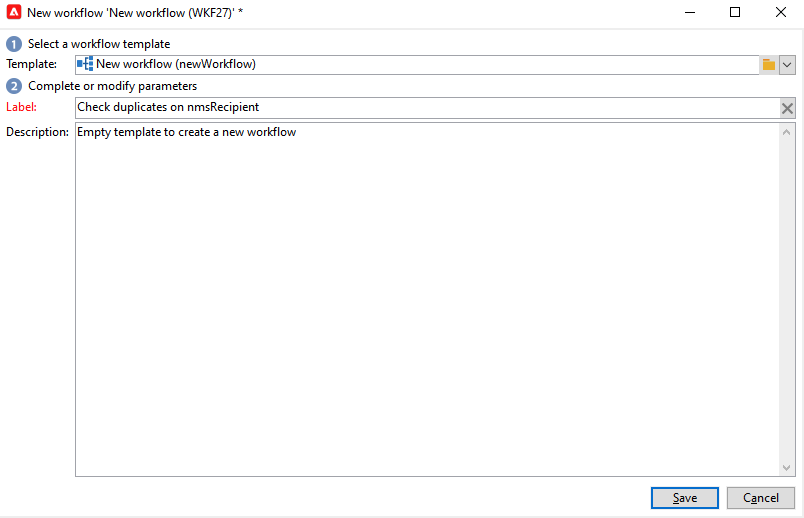

# 키 관리 및 독자성 {#key-management}

Campaign v8에서 기본 키는 문자 문자열인 UUID(Universally Unique IDentifier)입니다. 이 UUID를 만들려면 스키마의 기본 요소에 **autouid** 및 **자동** 으로 설정된 속성 **true**.

Adobe Campaign v8에는 핵심 데이터베이스로 Snowflake가 포함되어 있습니다. Snowflake 데이터베이스의 분산 아키텍처에서는 테이블 내의 키 특성을 관리하는 메커니즘을 제공하지 않습니다. 최종 사용자는 Adobe Campaign 데이터베이스 내의 키 일관성을 유지할 책임이 있습니다.

관계형 데이터베이스 일관성을 유지하려면 키에 대한 중복 방지, 특히 기본 키에 대한 중복을 방지해야 합니다. 기본 키에 중복되면 다음과 같은 데이터 관리 워크플로우 활동에 문제가 발생합니다. **쿼리**, **조정**, **데이터 업데이트**, 등.

가장 좋은 방법은 Adobe이 [검색](#detect-duplicates) 및 [수정](#correct-duplicates) 전략은 전체 데이터 관리 프로세스의 일부로, 중복되는 키가 데이터베이스에 로드되는 경우 사용됩니다.

## 중복 검색{#detect-duplicates}

Campaign에는 게재를 준비하는 동안 대상자에서 자동으로 복제된 UUID를 제거하는 새로운 보호 기능이 포함되어 있습니다. 이 새 메커니즘은 게재를 준비하는 동안 오류가 발생하지 않도록 합니다.

>[!CAUTION]
>
>중복되는 키는 UUID로 제한되지 않습니다. 사용자 지정 테이블에서 만들어진 사용자 지정 키를 포함하여 ID에서 발생할 수 있습니다.

최종 사용자는 게재 로그에서 이 정보를 확인할 수 있습니다. 중복 키로 인해 일부 수신자는 기본 대상에서 제외할 수 있습니다. 이 경우 다음 경고가 표시됩니다. `Exclusion of duplicates (based on the primary key or targeted records)`.


이런 경우 워크플로우를 만들어 중복 키를 식별할 수 있습니다. 그러면 이 키를 수정할 수 있습니다. 이렇게 하려면 아래 단계를 수행하십시오.

1. 새 워크플로우를 만듭니다.

   

1. 추가 **쿼리** 활동
1. 을(를) 선택합니다 **수신자** 표

   

1. 추가 **중복 제거** 활동을 수행하고 기본 키(UUID)에서 중복을 제거합니다. 한 개만 복제하고  **보완 생성** 중복에 대한 아웃바운드 전환을 만드는 옵션입니다.

   

1. 목록 업데이트 활동을 사용하여 중복 항목을 목록에 저장합니다.

   

이제 목록에서 직접 중복 수신자에 액세스할 수 있습니다. 전환에 복제된 행 중 하나만 포함되어 있어도 모든 중복을 목록에 기록합니다.


## 중복 수정{#correct-duplicates}

중복을 수정하려면 고객이 Campaign 데이터를 업데이트해야 합니다. 작업 유형은 중복 및 구현의 속성과 밀접하게 연결되어 있습니다. 다른 완화 전략(제거, 병합 또는 업데이트)이 필요한 여러 가지 사례에 직면할 수 있습니다.

>[!IMPORTANT]
>
>기본 키가 중복되면 기본 제공 워크플로우 활동을 사용하여 하나의 특정 행을 선택하거나 업데이트할 수 없습니다. 중복 UUID로 인해 데이터 중복 제거가 실패하고 데이터베이스 무결성에 영향을 줄 수 있습니다. 따라서 중복 항목을 수정하는 것이 좋습니다.

예제:

* **사례 1** - 동일한 UUID 및 동일한 프로필 정보(동일한 이메일, 이름 등)를 사용하여 복제한 수신자 : 수신자는 &quot;실제&quot; 중복과 유사하며 중복 중 하나를 제거하는 것일 수 있습니다.
한 수신자의 정보를 다른 수신자에게 병합하는 방법도 있습니다.

* **사례 2** - UUID가 같지만 프로필 정보가 다른 중복 수신자 (다른 이메일, 이름 등): 이번에는 프로필이 다른 것 같고 두 프로필을 모두 Campaign 데이터베이스에 유지하려는 것 같습니다. 즉, 새 UUID를 생성하는 중복 중 하나를 업데이트하기만 하면 됩니다. [이 예에서 자세히 알아보기](#deduplicate-sample).

완화 전략에 따라 항상 다른 워크플로우에서 목록을 쿼리하고 필요에 따라 업데이트를 적용할 수 있습니다. 자세한 지침은 Adobe에게 문의하십시오.

### 중복 제거 샘플{#deduplicate-sample}

중복 수신자의 경우 두 레코드를 모두 Campaign 데이터베이스에 유지할 수 있습니다. 이 경우 이러한 중 하나를 새 UUID로 업데이트해야 합니다.

따라서 클라우드 데이터베이스에서 SQL 업데이트 쿼리를 실행하려면 **SQL 데이터 관리** 워크플로우 활동 및 다음 SQL 업데이트를 실행합니다.

```sql
update nmsrecipient set urecipientid = uuid_string()
where semail = 'bretta37@adobe.com'
and urecipientid = 'c04d93f2-6012-4668-b523-88db1262cd46';
```


선택한 행이 새 UUID로 업데이트되면 인터페이스에서 업데이트된 행을 확인하고 UUID가 예상대로 업데이트되었음을 알 수 있습니다. 를 실행하여 데이터베이스에서 중복을 감지할 수도 있습니다 **중복 검색** 워크플로우 [여기에 설명된 대로](#detect-duplicates).
