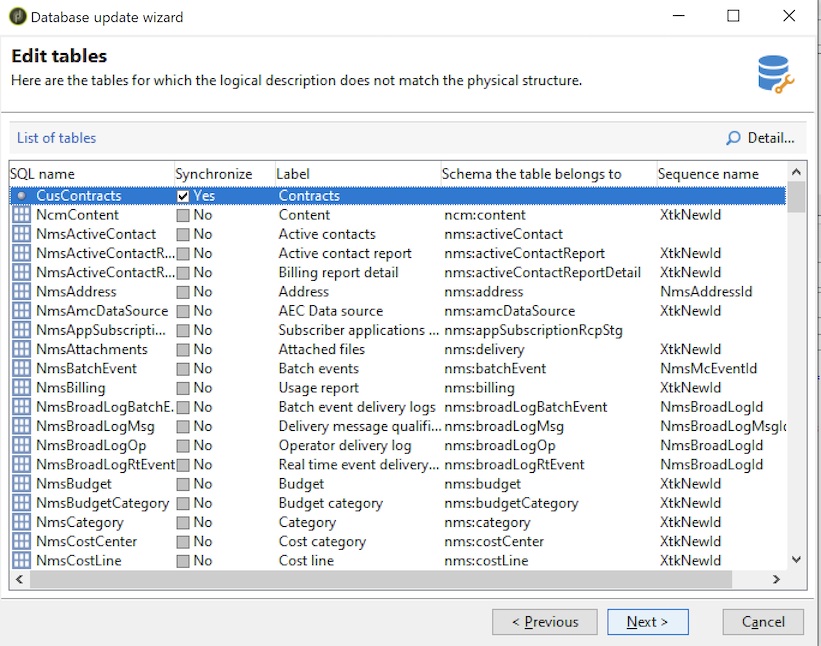
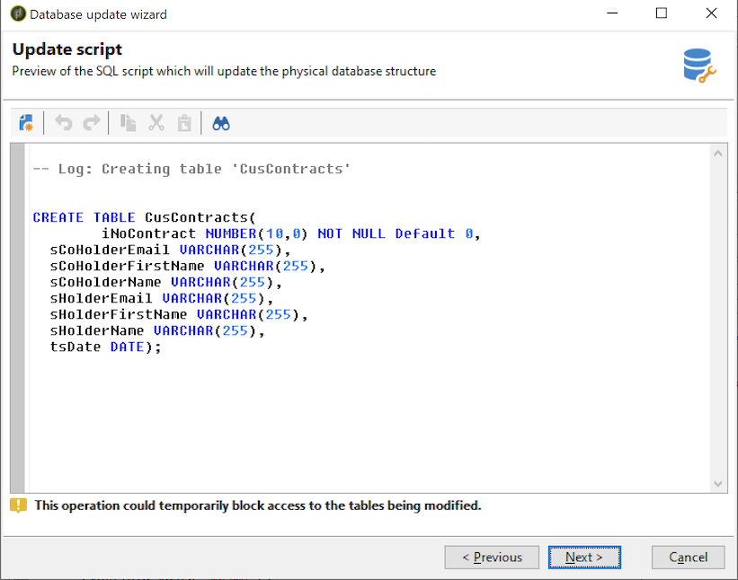

# 데이터베이스 구조 업데이트 {#updating-the-database-structure}

스키마에 대한 수정 사항을 적용하려면 데이터베이스 업데이트 마법사를 시작합니다. 이 도우미는 **[!UICONTROL Tools > Advanced > Update database structure]**&#x200B;을(를) 통해 액세스할 수 있습니다. 데이터베이스의 물리적 구조가 논리적 설명과 일치하는지 확인하고 SQL 업데이트 스크립트를 실행합니다.

데이터베이스의 모듈은 자동으로 채워지고 활성화됩니다.

다음 단계에 따라 데이터베이스 업데이트 SQL 스크립트를 봅니다.

>[!NOTE]
>
>편집 필드에 있으며 SQL 코드를 삭제하거나 추가하기 위해 수정할 수 있습니다.

그런 다음 데이터베이스 업데이트를 시작합니다.

