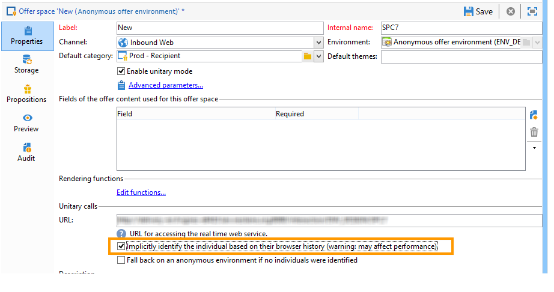

# 익명의 상호 작용{#anonymous-interactions}

## 익명의 상호 작용을 위한 환경 {#environment-for-anonymous-interactions}

기본적으로 Campaign **상호 작용** 모듈에는 기본 제공 수신자 테이블(식별된 오퍼)을 타겟팅하기 위해 사전 구성된 환경이 포함되어 있습니다. 예를 들어 다른 테이블, 익명 오퍼용 방문자 테이블 또는 사용자 지정 수신자 테이블을 타깃팅해야 하는 경우 대상 매핑 마법사를 사용하여 환경을 만들어야 합니다. [환경에 대해 자세히 알아보기](interaction-env.md).

매핑 생성 마법사를 통해 익명 환경을 만들면 **[!UICONTROL Environment dedicated to incoming anonymous interactions]** 이 상자는 환경의 **[!UICONTROL General]** 탭.

다음 **[!UICONTROL Targeting dimension]** 은(는) 자동으로 완료됩니다. 기본적으로 방문자 테이블로 연결됩니다.

다음 **[!UICONTROL Visitor folder]** 필드가 나타납니다. 에 연결하려면 자동으로 완료됩니다 **[!UICONTROL Visitors]** 폴더를 입력합니다. 이 필드에서는 방문자 프로필을 저장할 위치를 선택할 수 있습니다.

>[!NOTE]
>
>예를 들어 하나 이상의 브랜드에 대해 제공되는 익명의 오퍼의 경우 여러 유형의 방문자를 필터링하려면 각 브랜드에 대한 환경과 **[!UICONTROL Visitors]** 각 환경에 대한 폴더를 입력합니다.

## 익명의 상호 작용에 대한 오퍼 카탈로그 {#offer-catalog-for-anonymous-interactions}

아웃바운드 상호 작용과 마찬가지로 인바운드 상호 작용은 카테고리 및 오퍼로 구성된 오퍼 카탈로그에서 구성됩니다.

카테고리 및 공백을 만들려면 식별된 방문자에 대해 와 동일한 프로세스를 적용합니다. 을(를) 참조하십시오. [오퍼 카테고리 만들기](interaction-offer-catalog.md#creating-offer-categories) 및 [오퍼 환경 만들기](interaction-env.md#creating-an-offer-environment)).

## 익명의 방문자 {#anonymous-visitors}

익명의 방문자가 연결되면 쿠키 식별 프로세스에 전송될 수 있습니다. 이 암시적 인식은 방문자의 브라우저 기록을 기반으로 합니다.

이 단계에서는 쿠키로 복구된 데이터와 데이터베이스의 데이터 간에 비교됩니다. 어떤 경우에는 방문자가 인식됩니다(그런 다음 암시적으로 식별됨). 다른 경우 방문자가 인식되지 않으며 따라서 익명 상태로 유지됩니다.

이 분석을 실행하려면 오퍼 공간에 대해 **[!UICONTROL Implicitly identify the individual based on their browser history]** 선택 사항입니다.

## 식별되지 않은 익명 방문자 처리 {#processing-unidentified-anonymous-visitors}

분석 후 익명의 방문자가 식별되지 않으면 해당 공간에 데이터를 저장할 수 있습니다. 이렇게 하면 지정된 유형화 규칙과 일치하는 이 유형의 방문자를 대상으로 특정 오퍼를 제안할 수 있습니다.

연락처를 식별할 수 있는 요소가 없거나, 암묵적으로 식별할 수 있는 연락처에 식별된 오퍼를 제안하지 않으려는 경우 익명 환경에서 대체 작업을 수행하도록 선택할 수 있습니다.

이렇게 하려면 **[!UICONTROL Fall back on an anonymous environment if no individuals were identified]**&#x200B;그런 다음,에서 식별되지 않은 이러한 방문자에 대한 전용 환경을 지정합니다 **[!UICONTROL Linked anonymous space]** 오퍼 공간을 지정할 때 사용됩니다.

