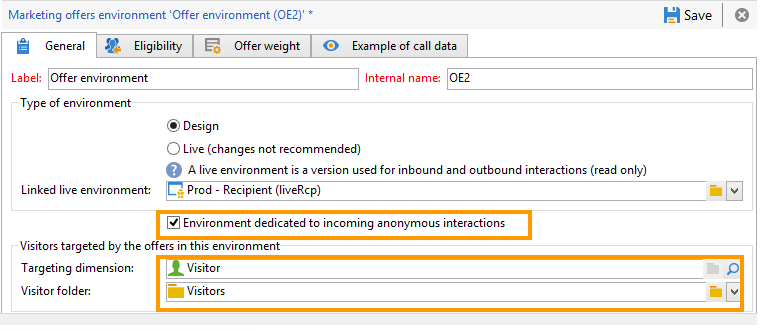

# 익명의 상호 작용 {#anonymous-interactions}

## 익명 상호 작용을 위한 환경 {#environment-for-anonymous-interactions}

기본적으로 Campaign **상호 작용** 모듈에는 기본 제공 수신자 테이블(식별된 오퍼)을 타깃팅하기 위해 사전 구성된 환경이 제공됩니다. 예를 들어 다른 테이블, 익명 오퍼에 대한 방문자 테이블 또는 사용자 지정 수신자 테이블을 타겟팅해야 하는 경우 타겟 매핑 마법사를 사용하여 환경을 만들어야 합니다. [환경에 대해 자세히 알아보기](interaction-env.md).

매핑 만들기 마법사를 통해 익명 환경을 만들면 환경의 **[!UICONTROL General]** 탭에서 **[!UICONTROL Environment dedicated to incoming anonymous interactions]** 상자가 자동으로 선택됩니다.

**[!UICONTROL Targeting dimension]**&#x200B;이(가) 자동으로 완료되었습니다. 기본적으로 방문자 테이블에 연결됩니다.

**[!UICONTROL Visitor folder]** 필드가 나타납니다. **[!UICONTROL Visitors]** 폴더에 연결하려면 자동으로 완료됩니다. 이 필드에서는 방문자 프로필을 저장할 위치를 선택할 수 있습니다.

>[!NOTE]
>
>여러 유형의 방문자를 필터링하려면(예를 들어 하나 이상의 브랜드에 대해 제공된 익명 오퍼의 경우) 각 브랜드에 대한 환경을 만들고 각 환경에 대해 **[!UICONTROL Visitors]** 유형 폴더를 만들어야 합니다.

## 익명 상호 작용을 위한 오퍼 카탈로그 {#offer-catalog-for-anonymous-interactions}

인바운드 상호 작용은 아웃바운드 상호 작용과 마찬가지로 범주와 오퍼로 구성된 오퍼 카탈로그로 구성됩니다.

카테고리 및 공간을 만들려면 식별된 방문자에 대해 과 동일한 프로세스를 적용합니다. [오퍼 범주 만들기](interaction-offer-catalog.md#creating-offer-categories) 및 [오퍼 환경 만들기](interaction-env.md#creating-an-offer-environment)를 참조하세요.

## 익명 방문자 {#anonymous-visitors}

익명 방문자는 연결 시 쿠키 식별 프로세스에 제출할 수 있습니다. 이러한 암시적 인식은 방문자의 브라우저 기록을 기반으로 합니다.

이 단계에서는 쿠키로 복구한 데이터와 데이터베이스의 데이터를 비교합니다. 경우에 따라 방문자가 인식되며(그런 다음 암묵적으로 식별됨), 다른 경우에는 인식되지 않으므로 익명으로 유지됩니다.

이 분석을 실행하려면 오퍼 공간에 대해 **[!UICONTROL Implicitly identify the individual based on their browser history]** 옵션을 선택하십시오.

## 미확인된 익명 방문자 처리 중 {#processing-unidentified-anonymous-visitors}

분석 후 익명의 방문자가 식별되지 않으면 주어진 공간에 데이터를 저장할 수 있습니다. 이렇게 하면 지정된 유형화 규칙과 일치하는 이 유형의 방문자를 특별히 겨냥한 오퍼를 제안할 수 있습니다.

연락처를 식별할 수 있는 요소가 없거나 암시적으로 식별할 수 있는 연락처에 식별된 오퍼를 제안하고 싶지 않은 경우 익명 환경에서 대체 항목을 수행하도록 선택할 수 있습니다.

이렇게 하려면 **[!UICONTROL Fall back on an anonymous environment if no individuals were identified]**&#x200B;을(를) 확인한 다음 오퍼 공간을 지정할 때 **[!UICONTROL Linked anonymous space]**&#x200B;에서 이러한 미확인 방문자 전용 환경을 지정하십시오.

