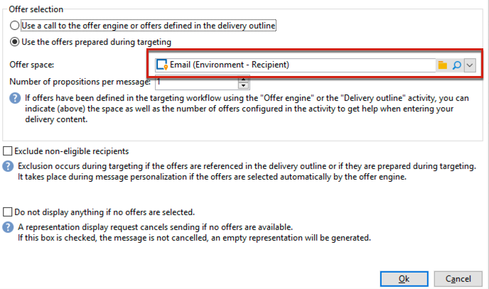

# 상호 작용 모범 사례{#interaction-best-practices}

## 일반 권장 사항 {#general-recommendations}

Adobe Campaign에서 오퍼를 관리하려면 효율적으로 운영되기 위해 세심한 관리가 필요합니다. 문제를 방지하려면 연락처 수와 오퍼 범주 및 오퍼 수 간에 균형을 찾아야 합니다.

이 섹션에서는 를 관리하는 우수 사례를 제공합니다. **상호 작용** 자격 규칙, 사전 정의된 필터, 워크플로우 활동 및 데이터베이스 옵션을 포함한 Adobe Campaign의 모듈입니다.

* 날짜 **상호 작용 구현 및 구성**, 다음 권장 사항을 알고 있어야 합니다.

   * 배치 엔진(일반적으로 이메일과 같은 아웃바운드 통신에서 사용됨)의 경우 여러 연락처를 동시에 처리할 수 있으므로 처리량이 주요 문제입니다. 일반적인 병목 현상은 데이터베이스 성능입니다.
   * 단일 엔진에 대한 주요 제한 사항(일반적으로 웹 사이트의 배너와 같은 인바운드 통신에서 사용됨)은 누군가가 답변을 기대하기 때문에 지연입니다. 일반적인 병목 현상은 CPU 성능입니다.
   * 오퍼 카탈로그 디자인은 Adobe Campaign 성능에 큰 영향을 줍니다.
   * 많은 오퍼를 사용하여 작업할 때 가장 좋은 방법은 여러 오퍼 카탈로그로 분할하는 것입니다.

* 다음은 를 사용하여 작업할 때의 몇 가지 모범 사례입니다 **자격 규칙**:

   * 규칙을 단순화합니다. 규칙 복잡성은 조회수를 늘림에 따라 성능에 영향을 줍니다. 복잡한 규칙은 5개 이상의 조건이 있는 모든 규칙입니다.
   * 성능을 향상시키기 위해 여러 오퍼에서 공유되는 미리 정의된 개별 필터에서 규칙을 구분할 수 있습니다.
   * 가장 제한적인 오퍼 카테고리 규칙을 트리에서 가장 높은 위치에 배치하십시오. 이렇게 하면 가장 많은 연락처를 먼저 필터링하여 대상 번호를 줄이고 추가 규칙에 의해 처리되지 않도록 할 수 있습니다.
   * 시간이나 처리 측면에서 가장 비싼 규칙을 트리의 맨 아래에 놓습니다. 이렇게 하면 나머지 타겟 대상자에서만 이러한 규칙이 실행됩니다.
   * 전체 트리를 스캔하지 않도록 특정 카테고리에서 시작하십시오.
   * 처리 시간을 절약하려면 조인으로 복잡한 규칙을 작성하는 대신 합계를 미리 계산합니다. 이렇게 하려면 자격 규칙 내에서 조회할 수 있는 참조 테이블에 고객 데이터를 저장해 보십시오.
   * 쿼리 수를 제한하려면 최소 가중치 수를 사용하십시오.
   * 오퍼 공간당 제한된 오퍼 수를 갖는 것이 좋습니다. 이렇게 하면 주어진 공간에서 오퍼를 보다 빠르게 검색할 수 있습니다.
   * 특히 자주 사용하는 조회 열에서 인덱스를 사용합니다.

* 다음은 와 관련된 몇 가지 모범 사례입니다. **제안 테이블**:

   * 가능한 한 빨리 처리할 수 있도록 최소 규칙 수를 사용하십시오.
   * 제안 테이블의 레코드 수 제한: 상태 업데이트 및 규칙에 필요한 사항을 추적하는 데 필요한 레코드만 유지한 다음 다른 시스템에 보관합니다.
   * 제안 테이블에서 인덱스 다시 작성 또는 테이블 다시 생성과 같은 데이터베이스 유지 관리를 집중적으로 수행합니다.
   * 대상당 요청한 제안 수를 제한합니다. 실제로 사용할 것보다 더 많이 설정하지 마십시오.
   * 규칙 기준에서 가능한 한 조인을 피하십시오.

## 오퍼 관리 시 팁 {#tips-managing-offers}

이 섹션에는 오퍼 관리 및 Adobe Campaign의 상호 작용 모듈 사용에 대한 자세한 조언이 포함되어 있습니다.

### 이메일의 여러 오퍼 공간 {#multiple-offer-spaces}

게재에 오퍼를 포함할 때 오퍼는 일반적으로 를 통해 Campaign 워크플로우에서 업스트림으로 선택됩니다. **데이터 보강** 워크플로우 활동(또는 다른 유사한 활동).

에서 오퍼를 선택할 때 **데이터 보강** 활동에서 사용할 오퍼 공간을 선택할 수 있습니다. 그러나 선택한 오퍼 공간에 관계없이 게재 사용자 지정 메뉴는 게재에서 설정된 오퍼 공간에 따라 다릅니다.

아래 예에서 게재에서 선택한 오퍼 공간은 입니다. **[!UICONTROL Email (Environment - Recipient)]**:



게재에서 선택한 HTML 공간에 오퍼 렌더링 기능이 설정되어 있지 않으면 게재 메뉴에 표시되지 않고 선택할 수 없습니다. 에서 선택한 오퍼 공간과 독립적입니다. **데이터 보강** 활동.

아래 예에서 HTML에서 선택한 오퍼 공간에는 렌더링 기능이 있으므로 드롭다운 목록에서 오퍼 렌더링 기능을 사용할 수 있습니다.


이 함수는 다음과 같은 코드를 삽입합니다. `<%@ include proposition="targetData.proposition" view="rendering/html" %>`.

제안을 선택할 때 의 값은 **[!UICONTROL view]** 속성은 다음과 같습니다.
* &quot;rendering/html&quot;: html 렌더링. HTML 렌더링 기능을 사용합니다.
* &quot;offer/view/html&quot;: html 콘텐츠입니다. HTML 렌더링 기능을 사용하지 않습니다. HTML 필드만 포함됩니다.

단일 이메일 게재에 여러 오퍼 공간을 포함할 때, 일부 오퍼 공간에는 렌더링 기능이 있고 일부 오퍼 공간에는 렌더링 기능이 없는 경우, 어떤 오퍼가 어떤 오퍼 공간을 사용하는지, 어떤 오퍼 공간에 렌더링 기능이 있는지 기억해야 합니다.

따라서 오퍼 공간에 HTML 콘텐츠만 필요하더라도 문제를 방지하려면 모든 오퍼 공간에 HTML 렌더링 기능이 정의되어 있는 것이 좋습니다.

### 제안 로그 테이블의 등급 설정 {#rank-proposition-log-table}

오퍼 공간에는 제안이 생성되거나 수락될 때 제안 테이블에 데이터를 저장할 수 있는 기능이 있습니다.


그러나 이는 인바운드 상호 작용에만 적용됩니다.

아웃바운드 상호 작용을 사용할 때와 상호 작용 모듈 없이 아웃바운드 오퍼를 사용할 때도 제안 테이블에 추가 데이터를 저장할 수 있습니다.

워크플로우 임시 테이블의 이름이 제안 테이블의 필드 이름과 일치하는 모든 필드는 제안 테이블의 동일한 필드에 복사됩니다.

예를 들어, 에서 오퍼를 수동으로(상호 작용 없이) 선택하는 경우 **데이터 보강** 워크플로우 활동, 표준 필드는 다음과 같이 정의됩니다.


다음과 같은 추가 필드를 추가할 수 있습니다. `@rank` 필드:


왜냐하면 명제 테이블에 이름이 인 필드가 있기 때문입니다 `@rank`워크플로 임시 테이블의 값이 복사됩니다.

제안 테이블에 추가 필드를 저장하는 방법에 대한 자세한 내용은 [이 섹션](interaction-send-offers.md#storing-offer-rankings-and-weights).

상호 작용이 있는 아웃바운드 오퍼의 경우 여러 오퍼를 선택하고 이를 이메일에 표시할 순서를 기록하려는 경우 유용합니다.

또한 현재 지출 수준과 같은 추가 메타데이터를 제안 테이블에 직접 저장하여 오퍼가 생성된 시점의 지출에 대한 기록 레코드를 유지할 수 있습니다.

아웃바운드 상호 작용을 사용할 때 `@rank` 위의 예제와 같이 필드를 추가할 수 있지만 해당 값은 상호 작용에서 반환된 순서를 기반으로 자동으로 설정됩니다. 예를 들어 상호 작용을 사용하여 3개의 오퍼를 선택하는 경우 `@rank` 필드에는 값 1, 2 및 3이 반환됩니다.

상호 작용을 사용하고 오퍼를 수동으로 선택할 때 사용자는 두 접근 방식을 모두 결합할 수 있습니다. 예를 들어, 사용자는 `@rank` 수동으로 선택한 오퍼에 대해 1이 되는 필드를 사용하고, 다음과 같은 표현식을 사용합니다 `"1 + @rank"` 인터랙션에서 반환된 오퍼에 대해 설명합니다. 상호 작용에서 세 개의 오퍼를 선택한다고 가정할 경우 두 접근 방식으로 반환된 오퍼의 등급은 1~4입니다.


### nms:offer 스키마 확장 {#extending-nms-offer-schema}

nms:offer 스키마를 확장할 때 이미 설정된 기본 구조를 따라야 합니다.
* 아래에 콘텐츠 저장을 위한 새 필드 정의 `<element name="view">`.
* 각 새 필드를 두 번 정의해야 합니다. 한 번은 일반 XML 필드로 사용하고 한 번은 이름에 &quot;_jst&quot;가 추가된 CDATA XML 필드로 사용합니다. 예제:

  ```
  <element label="Price" name="price" type="long" xml="true"/>
  <element advanced="true" label="Script price" name="price_jst" type="CDATA" xml="true"/>
  ```

* 추적할 URL이 포함된 모든 필드는 `<element name="trackedUrls">` 다음에서 찾을 수 있음 `<element name="view" >`.
