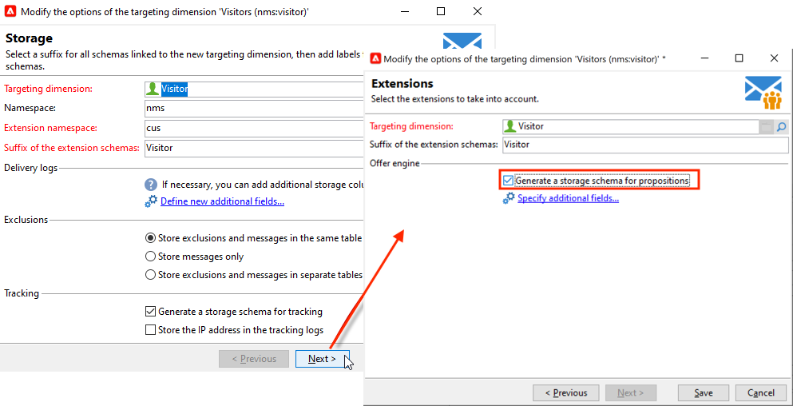

# 환경 작업{#work-with-environments}

## 라이브 및 디자인 환경{#live-design-environments}

상호 작용은 두 가지 유형의 오퍼 환경에서 작동합니다.

* **[!UICONTROL Design]** 편집 중이며 변경할 수 있는 오퍼가 포함된 오퍼 환경. 이러한 오퍼는 승인 주기를 거치지 않았으므로 연락처에 전달되지 않습니다.
* **[!UICONTROL Live]** 승인된 오퍼가 연락처에 표시될 때 오퍼를 포함하는 오퍼 환경. 이 환경의 오퍼는 읽기 전용입니다.

각 **[!UICONTROL Design]** 환경이 다음에 연결됨 **[!UICONTROL Live]** 환경. 오퍼가 완료되면 해당 콘텐츠 및 자격 규칙이 승인 주기에 영향을 받습니다. 이 주기가 완료되면 관련 오퍼가 자동으로 **[!UICONTROL Live]** 환경. 지금부터는 배달이 가능할 겁니다.

기본적으로 Campaign에는 **[!UICONTROL Design]** 환경 및 **[!UICONTROL Live]** 연결된 환경입니다. 두 환경 모두 을(를) 타깃팅하도록 사전 구성되어 있습니다. [기본 제공 수신자 테이블](../dev/datamodel.md#ootb-profiles).

>[!NOTE]
>
>수신자 테이블을 타겟팅하려면 타겟 매핑 도우미를 사용하여 환경을 만들어야 합니다. [자세히 알아보기](#creating-an-offer-environment)

게재 관리자만 볼 수 있음 **[!UICONTROL Live]** 환경 및 오퍼를 활용하여 오퍼를 제공합니다. 오퍼 관리자는에서 **[!UICONTROL Design]** 환경 및 보기 **[!UICONTROL Live]** 환경. [자세히 알아보기](interaction-operators.md)

## 익명 상호 작용을 위한 환경 만들기{#create-an-offer-environment}

기본적으로 Campaign에는 수신자 테이블(식별된 오퍼)을 타겟팅하기 위한 기본 제공 환경이 제공됩니다. 인바운드 상호 작용을 위해 웹 사이트를 방문하는 익명 프로필과 같은 다른 테이블을 타겟팅하려면 구성을 업데이트해야 합니다.

아래의 단계를 수행하십시오.

1. 다음으로 이동 **[!UICONTROL Administration]** > **[!UICONTROL Campaign management]** > **[!UICONTROL Target mappings]**, 사용할 대상 매핑을 마우스 오른쪽 단추로 클릭하고 를 선택합니다 **[!UICONTROL Actions]** > **[!UICONTROL Modify the options of the targeting dimension]**.

   

1. 클릭 **[!UICONTROL Next]**&#x200B;를 선택하고 **[!UICONTROL Generate a storage schema for propositions]** 옵션 및 클릭 **[!UICONTROL Save]**.

   

   >[!NOTE]
   >
   >옵션이 이미 선택되어 있다면 선택을 취소한 다음 다시 선택합니다.

1. Adobe Campaign은 두 가지 환경을 생성합니다. **[!UICONTROL Design]** 및 **[!UICONTROL Live]** - 이전에 활성화한 타겟 매핑의 타겟팅 정보가 포함된 경우 환경은 타겟팅 정보로 사전 구성되어 있습니다.

을 활성화한 경우 **[!UICONTROL Visitor]** 매핑, **[!UICONTROL Environment dedicated to incoming anonymous interactions]** 이(가) 환경의 **[!UICONTROL General]** 탭.

이 옵션을 사용하면 특히 환경 오퍼 공간을 구성할 때 익명 상호 작용 특정 함수를 활성화할 수 있습니다. &quot;식별된&quot; 환경에서 &quot;익명&quot; 환경으로 전환할 수 있는 옵션을 구성할 수도 있습니다.

예를 들어 수신자 환경 오퍼 공간(확인된 연락처)을 방문자 환경(미확인된 연락처)과 일치하는 오퍼 공간과 연결할 수 있습니다. 이러한 방식으로, 이 연락처가 식별되는지 여부에 따라 연락처가 다른 오퍼를 사용할 수 있게 됩니다. 자세한 내용은 다음을 참조하십시오. [오퍼 공간 만들기](interaction-offer-spaces.md).

>[!NOTE]
>
>인바운드 채널에서의 익명 상호 작용에 대한 자세한 내용은 [익명의 상호 작용](anonymous-interactions.md).
