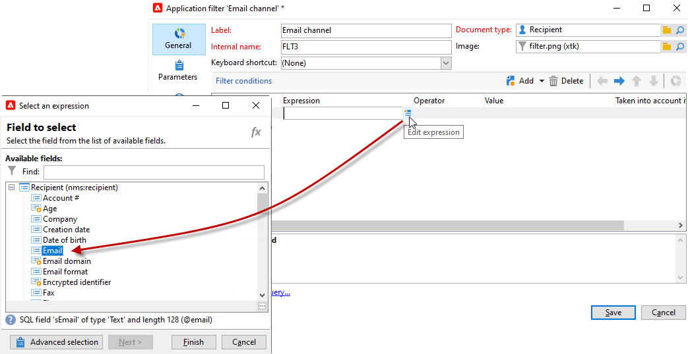

# 사전 정의 필터 만들기{#creating-pre-defined-filters}

사전 정의된 필터를 만들어 오퍼 생성 중 쉽게 다시 사용할 수 있는 대상 모집단의 자격 규칙을 정의합니다. 각 환경에 따라 다르며 오퍼 매개 변수를 고려합니다.

>[!NOTE]
>
>Adobe Campaign Web UI는 특정 요구 사항에 맞게 사전 정의된 필터를 손쉽게 관리하고 사용자 정의할 수 있는 사용자 친화적인 인터페이스를 제공합니다. 한 번 만들고 나중에 사용할 수 있도록 저장하십시오. 웹 UI용 사전 정의된 필터에 대한 자세한 내용은 [Adobe Campaign 웹 UI 설명서](https://experienceleague.adobe.com/en/docs/campaign-web/v8/start/predefined-filters){target=_blank}를 참조하세요.

사전 정의된 필터를 만들려면 다음 프로세스를 적용합니다.

1. **[!UICONTROL Administration]** 폴더를 찾은 다음 **[!UICONTROL Pre-defined offer filters]**&#x200B;을(를) 선택합니다.

   

1. **[!UICONTROL New]**&#x200B;을(를) 클릭합니다.

   

1. 나중에 필터를 식별할 수 있도록 레이블을 변경합니다.

   

1. 필터링 조건과 관련된 필드를 선택합니다.

   

1. 필요한 경우 연산자 및 값을 선택한 다음 쿼리를 저장합니다.

   

1. 필터 결과를 보려면 **[!UICONTROL Preview]**&#x200B;을(를) 클릭하십시오.

   
