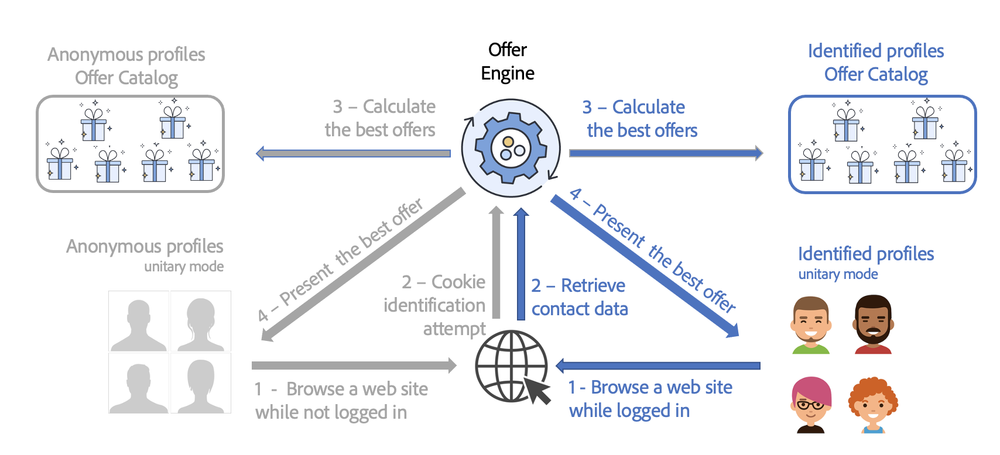

# 최상의 오퍼 제공{#interaction-present-offers}

오퍼는 [인바운드 또는 아웃바운드 채널](interaction-architecture.md#interaction-types). 이 장에서는 인바운드 채널에 대한 몇 가지 특정 기능에 대해 자세히 설명합니다.

오퍼 엔진에서 오퍼를 선택하려면 오퍼를 승인하고 라이브 환경에서 사용할 수 있어야 합니다.

 자세한 내용은 [Campaign Classic v7 설명서](https://experienceleague.adobe.com/docs/campaign-classic/using/managing-offers/managing-an-offer-catalog/approving-and-activating-an-offer.html?lang=en#approving-offer-content)를 참조하세요

인바운드 연락처 컨텍스트에서 연락처를 탐색하는 사용자는 웹 사이트에서 식별할 수 있습니다. 오퍼 엔진은 식별된 프로필 및 익명의 프로필에 대해 서로 다른 오퍼를 제공합니다.

인바운드 채널에 오퍼를 표시할 수 있으려면 먼저 오퍼를 표시할 오퍼 엔진 호출을 구성해야 합니다. 인바운드 상호 작용에 대한 대부분의 경우 웹 페이지입니다.

>[!NOTE]
>
>인바운드 상호 작용의 경우 하나 또는 여러 오퍼를 제공하고 업데이트하도록 오퍼 엔진을 특별히 구성해야 합니다.
>
>또한 오퍼 공간에서 단일 모드를 활성화해야 합니다. 자세한 정보는 이 [페이지](interaction-offer-spaces.md)를 참조하십시오.
