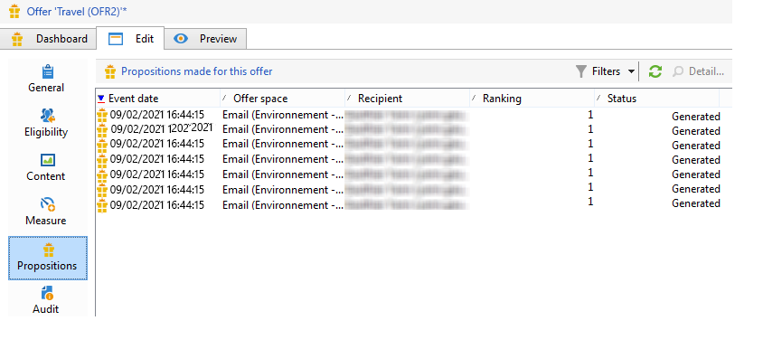

# 실시간 상호 작용 내역 및 보고

>[!NOTE]
>
>이러한 기능은 온라인으로만 볼 수 있으며 **게재 관리자**.

## 오퍼 제안 내역{#offer-proposition-history}

오퍼 제안이 작성되면 프레젠테이션 기록을 볼 수 있습니다.

* 오퍼 수준에서 **[!UICONTROL Edit]** 탭을 클릭하고 **[!UICONTROL Propositions]**.

  

* 수신자 프로필에서 **[!UICONTROL Propositions]** 탭.

  

* 오퍼 공간 수준에서 **[!UICONTROL Propositions]** 탭.

  

## 오퍼 분석 보고서{#offer-analysis-report}

다음 **[!UICONTROL Offer analysis]** 보고서는 수락되거나 거부된 제안 수에 대한 개요를 제공합니다.

통계는 다음 세 가지 기준에 따라 정렬됩니다.

* 날짜별:

  

* 스페이스별:

  

* 게재별:

  

데이터는 보고서의 상단 섹션에서 사용할 수 있는 다양한 기준을 기반으로 필터링할 수 있습니다. 원하는 기준을 선택한 후 **[!UICONTROL Refresh]** 링크를 클릭하여 보고서에 적용합니다.
