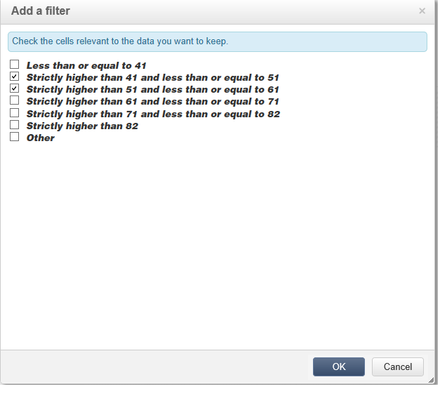
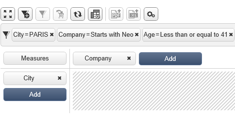

# 큐브를 사용한 구현 및 우수 사례{#cube-best-practices}

## 데이터 바인딩 {#data-binning}

기준에 따라 값을 그룹화하여 데이터 표시를 간소화합니다. 사용 가능한 정보에 따라 페이지 그룹을 정의하고, 전자 메일 도메인을 함께 그룹화하고, 값 열거형으로 제한하며, 표시할 데이터를 명시적으로 제한하고, 전용 줄이나 열에 있는 다른 모든 데이터를 그룹화하는 등의 작업을 수행할 수 있습니다.

전체적으로 세 가지 유형의 이닝을 사용할 수 있습니다.

1. 수동으로 정의된 값 범위 사용. 예를 들어 연령, 평균 장바구니, 열린 게재 수 등이 있습니다. 자세한 내용은 [각 저장소 정의](#defining-each-bin).
1. 열거형의 값에 따라 동적으로 다음을 수행합니다. 열거형에 포함된 값만 표시합니다. 다른 모든 값은 &#39;Others&#39;로 그룹화됩니다. 자세한 내용은 [동적으로 저장소 관리](#dynamically-managing-bins).
1. 값 범위를 사용하여 그룹화하는 다른 항목은 모두 예를 들어, 18세에서 25세, 26세에서 59세, 그리고 다른 아이들이 있습니다. 자세한 내용은 [값 범위 만들기](#creating-value-ranges).

시작하기를 활성화하려면 차원을 생성할 때 적절한 상자를 선택합니다.

저장소를 수동으로 만들거나 기존 열거형에 연결할 수 있습니다.

Adobe Campaign은 자동 이닝을 위한 도우미도 제공합니다. 값은 N 그룹으로 분류하거나 데이터베이스에서 가장 자주 사용하는 값에 따라 그룹화할 수 있습니다.

### 각 저장소 정의 {#define-each-bin}

각 저장소를 개별적으로 만들려면 **[!UICONTROL Define each bin]** 옵션을 선택하고 테이블을 사용하여 다양한 저장소를 만듭니다.

을(를) 클릭합니다. **[!UICONTROL Add]** 새 저장소를 만들고 bin으로 그룹화할 값을 나열하는 단추

다음 예제에서는 언어를 세 가지 범주로 그룹화합니다. 영어/독일어/네덜란드어, 프랑스어/이탈리아어/스페인어 및 기타.

SQL 마스크를 사용하여 여러 값을 필터에 결합할 수 있습니다. 이렇게 하려면 다음을 확인하십시오 **[!UICONTROL Yes]** 에서 **[!UICONTROL Use an SQL mask]** 열을 입력하고 다음에 적용할 SQL 필터를 입력합니다. **[!UICONTROL Value or expression]** 열.

아래 예에서는 로 시작하는 모든 이메일 도메인 **yahoo** (yahoo.fr, yahoo.com, yahoo.be 등) 또는 **이메일** (ymail.com, ymail.eu 등) 레이블 아래에 그룹화됩니다. **야후!**&#x200B;및 를 사용하여 주소를 추가할 수 있습니다. **rocketmail.com** 도메인.

### 동적으로 저장소 관리 {#dynamically-manage-bins}

열거형을 통해 값을 동적으로 관리할 수 있습니다. 즉, 열거에 포함된 값만 표시됩니다. 열거형 값이 변경되면 큐브의 내용이 자동으로 조정됩니다.

이 유형의 값 바인딩을 만들려면 다음 단계를 적용합니다.

1. 새 차원을 만들고 시작하기를 활성화합니다.
1. 을(를) 선택합니다 **[!UICONTROL Dynamically link the values to an enumeration]** 옵션을 선택하고 일치하는 열거형을 선택합니다.

   

   열거형 값이 업데이트될 때마다 일치하는 저장소가 자동으로 조정됩니다.

### 값 범위 만들기 {#create-value-ranges}

원하는 간격을 기준으로 값을 범위로 그룹화할 수 있습니다.

범위를 수동으로 정의하려면 **[!UICONTROL Add]** 단추를 누르고 선택합니다. **[!UICONTROL Define a range]** :

그런 다음 하한과 상한을 지정하고 **[!UICONTROL Ok]** 확인합니다.

### 자동으로 저장소 생성 {#generate-bins-automatically}

또한 자동으로 저장소를 생성할 수 있습니다. 이렇게 하려면 **[!UICONTROL Generate bins...]** 링크를 클릭합니다.

다음 중 하나를 수행할 수 있습니다.

* **[!UICONTROL Recover the most frequently used values]**

   4개의 저장소를 생성하는 경우 가장 자주 사용되는 4개의 값이 표시되는 반면, 다른 값은 &#39;기타&#39; 카테고리에서 계산되고 그룹화됩니다.

* **[!UICONTROL Generate bins in the form of slots]**

   동일한 샘플의 경우 Adobe Campaign은 자동으로 같은 크기의 값 슬롯 4개를 만들어 데이터베이스의 값을 표시합니다.

이 경우 팩트 스키마에서 선택한 필터는 무시됩니다.

### 열거형 {#enumerations}

보고서의 관련성과 가독성을 향상시키기 위해 Adobe Campaign에서 특정 열거형을 만들어 다른 값을 동일한 저장소에 다시 그룹화할 수 있습니다. 시작용으로 예약된 이러한 열거형은 큐브에서 참조된 다음 보고서에 표시됩니다.

Adobe Campaign은 또한 다음 예와 같이 데이터베이스에 있는 모든 연락처의 전자 메일 도메인 목록을 ISP별로 다시 그룹화하는 도메인 열거도 제공합니다.

이 템플릿은 다음 템플릿을 사용하여 작성됩니다.

이 열거형을 사용하여 보고서를 만들려면 **[!UICONTROL Email domain]** 차원. 을(를) 선택합니다 **[!UICONTROL Enable binning]** 옵션을 선택한 후 **[!UICONTROL Dynamically link the values to an enumeration]**. 그런 다음 **도메인** 열거형은 위에 표시된 대로 열거됩니다. 지정된 별칭이 없는 모든 값은 **기타** 레이블.

그런 다음 이 큐브를 기반으로 보고서를 만들어 값을 표시합니다.

관련 보고서를 업데이트하려면 열거형만 수정해야 합니다. 예를 들어 **Adobe** 값과 추가 **adobe.com** 별칭 및 보고서가 열거형 수준의 Adobe 값으로 자동으로 업데이트됩니다.

다음 **[!UICONTROL Domains]** 열거형은 도메인 목록을 표시하는 기본 제공 보고서를 생성하는 데 사용됩니다. 이러한 보고서의 컨텐츠를 조정하기 위해 이 목록을 편집할 수 있습니다.

시작 예약된 다른 열거형을 만들어 다른 큐브에 사용할 수 있습니다. 모든 별칭 값은 첫 번째 열거형 탭에 지정된 저장소에 다시 그룹화됩니다.

## 큐브의 합계 {#calculate-and-use-aggregates}

집계에서 가장 큰 데이터 볼륨을 계산할 수 있습니다.

집계는 대량의 데이터를 조작할 때 유용합니다. 최신 데이터를 지표에 통합하기 위해 전용 워크플로우 상자에 정의된 설정을 기반으로 자동으로 업데이트됩니다

집계는 각 큐브의 관련 탭에 정의됩니다.

>[!NOTE]
>
>합계 계산 업데이트 워크플로우는 합계 자체에서 구성할 수 있으며 합계를 관련 큐브에 연결된 외부 워크플로우를 통해 업데이트할 수 있습니다.

새 합계를 만들려면 다음 단계를 적용합니다.

1. 을(를) 클릭합니다. **[!UICONTROL Aggregates]** 큐브의 탭을 클릭한 다음 **[!UICONTROL Add]** 버튼을 클릭합니다.
1. 합계에 대한 레이블을 입력한 다음 계산할 차원을 추가합니다.
1. 차원 및 수준을 선택합니다. 각 차원 및 각 수준에 대해 이 프로세스를 반복합니다.
1. 을(를) 클릭합니다. **[!UICONTROL Workflow]** 탭을 클릭하여 합계 워크플로우를 만듭니다.

   * 다음 **[!UICONTROL Scheduler]** 활동을 통해 계산 업데이트 빈도를 정의할 수 있습니다. 스케줄러는 [이 섹션](../../automation/workflow/scheduler.md).
   * 다음 **[!UICONTROL Aggregate update]** 활동을 사용하면 적용할 업데이트 모드를 선택할 수 있습니다. 전체 또는 일부.

      기본적으로 각 계산 중에 전체 업데이트가 수행됩니다. 부분 업데이트를 활성화하려면 관련 옵션을 선택하고 업데이트 조건을 정의합니다.

## 측정값 정의 {#define-measures}

측정 유형은 **[!UICONTROL Measures]** 큐브의 탭입니다. 합계, 평균, 편차 등을 계산할 수 있습니다.

필요한 만큼 조치를 생성할 수 있습니다. 그런 다음 테이블에 표시하거나 숨길 측정값을 선택합니다. 이 작업에 대한 자세한 정보는 [이 섹션](#displaying-measures)을 참조하십시오.

새 측정 단위를 정의하려면 다음 단계를 적용합니다.

1. 을(를) 클릭합니다. **[!UICONTROL Add]** 측정 단위 목록 위에 있는 버튼을 누르고 측정 유형 및 계산할 공식을 선택합니다.

   

1. 필요한 경우 연산자에 따라 작업이 관련되는 표현식을 선택합니다.

   다음 **[!UICONTROL Advanced selection]** 버튼을 사용하면 복잡한 계산 공식을 생성할 수 있습니다. 이 작업에 대한 자세한 정보는 [이 섹션](../../automation/workflow/query.md)을 참조하십시오.

1. 다음 **[!UICONTROL Filter the measure data...]** 링크를 사용하면 계산 필드를 제한할 수 있고 데이터베이스의 특정 데이터에만 적용할 수 있습니다.

   

1. 측정 단위 레이블을 입력하고 설명을 추가한 다음 **[!UICONTROL Finish]** 만들 수 있습니다.

## 측정 사용자 지정 {#display-measures}

필요에 따라 테이블에서 측정 단위 표시를 구성할 수 있습니다.

* 측정 단위의 표시 순서. [자세히 알아보기](#display-sequence)
* 보고서에 표시/숨길 정보. [자세히 알아보기](#configuring-the-display)
* 표시할 측정값: 백분율, 총, 소수 수 등 [자세히 알아보기](#changing-the-type-of-measure-displayed)

### 표시 시퀀스 {#display-sequence}

큐브에서 계산된 측정 단위는 를 통해 구성됩니다 **[!UICONTROL Measures]** 버튼을 클릭합니다.

표시 순서를 변경하려면 라인을 이동합니다. 다음 예제에서는 프랑스어 데이터를 목록의 맨 아래로 이동합니다. 즉, 마지막 열에 표시됩니다.

### 디스플레이 구성 {#configuring-the-display}

측정값, 라인 및 열의 구성은 각 측정값 또는 전체에 대해 개별적으로 수행할 수 있습니다. 특정 아이콘을 사용하면 표시 모드 선택 창에 액세스할 수 있습니다.

* 을(를) 클릭합니다. **[!UICONTROL Edit the configuration of the pivot table]** 아이콘을 클릭하여 구성 창에 액세스합니다.

   측정 단위 레이블을 표시할지 여부를 선택하고 레이아웃(선 또는 열)을 구성할 수 있습니다.

색상 옵션을 사용하면 중요한 값을 강조 표시하여 쉽게 읽을 수 있습니다.

### 표시되는 측정값 유형 변경 {#changing-the-type-of-measure-displayed}

각 측정값 내에서 적용할 단위와 형식을 정의할 수 있습니다.

## 보고서 공유 {#share-a-report}

보고서가 구성되면 저장하고 다른 연산자와 공유할 수 있습니다.

이렇게 하려면 **[!UICONTROL Show the report properties]** 아이콘 및 활성화 **[!UICONTROL Share this report]** 선택 사항입니다.

보고서가 속한 카테고리와 관련성을 지정합니다. <!--For more on this, refer in [this page](../../reporting/using/configuring-access-to-the-report.md#report-display-context) to the **Display sequence** and **Defining the filtering options** sections.-->

이러한 변경 사항을 확인하려면 보고서를 저장해야 합니다.

## 필터 만들기 {#create-filters}

데이터의 섹션을 보기 위한 필터를 만들 수 있습니다.

방법은 다음과 같습니다.

1. 을(를) 클릭합니다. **[!UICONTROL Add a filter]** 아이콘.

   

1. 필터가 관련된 차원을 선택합니다

1. 필터 유형 및 정밀도 수준을 선택합니다.

   

1. 필터가 만들어지면 보고서 위에 표시됩니다.

   필터를 클릭하여 편집합니다. 십자가를 클릭하여 삭제합니다.

   필요한 만큼 필터를 결합할 수 있습니다. 그들은 모두 이 지역에서 보여질 것입니다.

   

필터를 수정할 때마다(추가, 제거, 변경) 보고서를 다시 계산해야 합니다.

선택 항목을 기반으로 필터를 만들 수도 있습니다. 이렇게 하려면 소스 셀, 선 및 열을 선택한 다음 **[!UICONTROL Add a filter]** 아이콘.

행, 열 또는 셀을 선택하려면 마우스 왼쪽 단추로 클릭합니다. 선택을 취소하려면 을 다시 클릭합니다.

필터가 자동으로 적용되어 보고서 위의 필터 영역에 추가됩니다.

