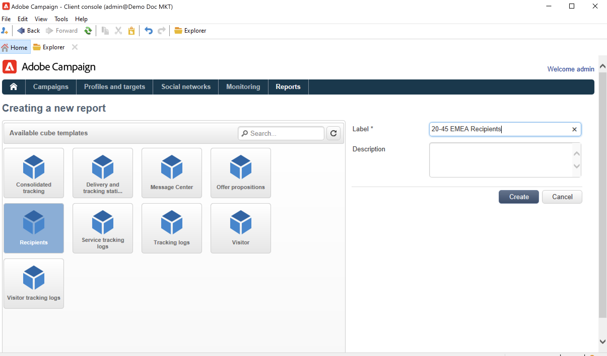

# 큐브 만들기{#create-a-cube}

## 큐브 작업 공간 {#cube-workspace}

큐브에 액세스하려면 다음 위치로 이동하십시오 **[!UICONTROL Administration > Configuration > Cubes]** Campaign Explorer에서 생성합니다.

큐브를 사용하여 다음을 수행할 수 있습니다.

* 보고서에서 직접 데이터 내보내기, **[!UICONTROL Reports]** Adobe Campaign 플랫폼의 탭입니다.

   이렇게 하려면 새 보고서를 만들고 사용할 큐브를 선택합니다.

   

   큐브는 보고서를 만들 때 사용하는 템플릿과 같습니다. 템플릿을 선택한 후에는 **[!UICONTROL Create]** 새 보고서를 구성하고 보려면 다음을 수행하십시오.

   측정을 조정하거나, 표시 모드를 변경하거나, 테이블을 구성한 다음, 기본 버튼을 사용하여 보고서를 표시할 수 있습니다.

   

* 에서 큐브 참조 **[!UICONTROL Query]** 아래와 같이 지표를 사용할 보고서 상자:

   

* 큐브를 기반으로 하는 피벗 테이블을 보고서의 페이지에 삽입합니다. 이렇게 하려면 **[!UICONTROL Data]** 관련 페이지의 피벗 테이블 탭

   

   자세한 내용은 [보고서에서 데이터 탐색](cube-tables.md#explore-the-data-in-a-report).

>[!CAUTION]
>
>큐브를 만들려면 관리 권한이 필요합니다.

## 큐브 만들기{#cube-create}

큐브 보고서 작성을 시작하기 전에 관련 차원 및 측정값을 식별하고 큐브에서 생성합니다.

큐브를 만들려면 다음 단계를 적용합니다.

1. 작업 테이블을 선택합니다. [자세히 알아보기](#select-the-work-table)
1. 차원을 정의합니다. [자세히 알아보기](#define-dimensions)
1. 측정 단위를 정의합니다. [자세히 알아보기](#build-indicators)
1. 합계 만들기(선택 사항). [자세히 알아보기](customize-cubes.md#calculate-and-use-aggregates)

아래 예에서는 보고서에서 간단한 큐브를 빠르게 만들어 측정 단위를 내보내는 방법을 알아봅니다.

### 작업 테이블을 선택합니다 {#select-the-work-table}

큐브를 만들려면 아래 단계를 수행하십시오.

1. 을(를) 클릭합니다. **[!UICONTROL New]** 큐브 목록 위에 있는 단추.

   

1. 탐색할 요소가 포함된 스키마(&#39;팩트 스키마&#39;라고도 함)를 선택합니다. 이 예에서 기본값을 선택합니다 **수신자** 테이블.
1. 클릭 **[!UICONTROL Save]** 큐브를 만들려면 다음을 수행하십시오. 큐브 목록에 추가됩니다. 이제 탭을 사용하여 구성할 수 있습니다.

1. 을(를) 클릭합니다. **[!UICONTROL Filter the source data...]** 이 큐브의 계산을 데이터베이스의 데이터에 적용하는 링크입니다.

   

### 차원 정의 {#define-dimensions}

큐브가 생성되면 해당 차원을 정의합니다. Dimension은 관련 팩트 스키마를 기반으로 각 큐브에 대해 정의된 분석 축입니다. 시간(년, 월, 날짜), 제품 또는 계약 분류(가족, 참조 등), 모집단 세그먼트(도시, 연령 그룹, 상태 등)와 같이 분석에서 탐색된 차원입니다.

차원을 만들려면 아래 단계를 수행하십시오.

1. 다음 위치로 이동합니다. **[!UICONTROL Dimension]** 큐브의 탭을 클릭하고 **[!UICONTROL Add]** 새 차원을 만드는 단추입니다.
1. 에서 **[!UICONTROL Expression field]**&#x200B;를 클릭하고 **[!UICONTROL Edit expression]** 아이콘을 클릭하여 관련 데이터가 포함된 필드를 선택합니다.

   

1. 이 예제에서는 수신자를 선택합니다 **연령**. 이 필드의 경우 페이지를 그룹화하고 정보를 더 쉽게 읽을 수 있도록 하는 이닝을 정의할 수 있습니다. 여러 개의 개별 값이 있을 가능성이 있는 경우 이닝을 사용하는 것이 좋습니다.

이렇게 하려면 **[!UICONTROL Enable binning]** 선택 사항입니다. [자세히 알아보기](customize-cubes.md#data-binning)

1. 추가 **날짜** 유형 차원. 여기에서는 수신자 프로필 생성 날짜를 표시하려고 합니다. 이렇게 하려면 **[!UICONTROL Add]** 을(를) 선택하고 을(를) 선택합니다. **[!UICONTROL Creation date]** 수신자 테이블의 필드.
날짜 표시 모드를 사용자 지정할 수 있습니다. 이렇게 하려면 사용할 계층 및 생성할 레벨을 선택합니다.

이 예제에서는 연도, 월 및 일만 표시하려고 합니다. 주/학기/월을 동시에 사용할 수는 없습니다. 이러한 수준은 호환되지 않습니다.

1. 수신자의 도시를 기준으로 데이터를 분석할 다른 차원을 만듭니다. 이렇게 하려면 새 차원을 추가하고 의 시를 선택합니다 **[!UICONTROL Location]** 수신자 스키마의 노드.

바닝을 활성화하여 정보 읽기를 쉽게 만들고 해당 값을 열거형에 연결할 수 있습니다.

드롭다운 목록에서 열거형을 선택합니다. 이 열거형은 다음과 같이 정의해야 합니다. **[!UICONTROL Reserved for binning]**.

열거형의 값만 표시됩니다. 다른 항목은 **[!UICONTROL Label of the other values]** 필드.

이 작업에 대한 자세한 정보는 [이 섹션](customize-cubes.md#dynamically-manage-bins)을 참조하십시오.

### 지표 작성 {#build-indicators}

차원이 정의되면 셀에 표시할 값에 대한 계산 모드를 지정합니다.

이렇게 하려면 **[!UICONTROL Measures]** 탭. 이 큐브를 기준으로 보고서에 표시할 열이 있는 만큼 측정값을 만듭니다.

지표를 만들려면 아래 단계를 수행하십시오.

1. 다음 위치로 이동합니다. **[!UICONTROL Measures]** 탭을 클릭하고 **[!UICONTROL Add]** 버튼을 클릭합니다.
1. 적용할 측정값 유형과 공식을 선택합니다. 이 예에서는 수신자간 여성 수를 계산하고 있습니다. Adobe의 측정은 사실 스키마를 기반으로 하며 **[!UICONTROL Count]** 연산자를 사용할 수 있습니다.

   

   를 사용하십시오 **[!UICONTROL Filter the measure data...]** 여성만 선택할 수 있습니다. [자세히 알아보기](customize-cubes.md#define-measures)

   

1. 측정 단위 레이블을 입력하고 저장합니다.

   

1. 큐브를 저장합니다.

이제 이 큐브를 기반으로 보고서를 만들 수 있습니다. [자세히 알아보기](cube-tables.md)
