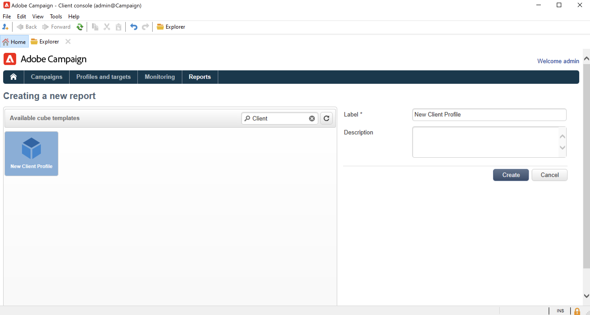
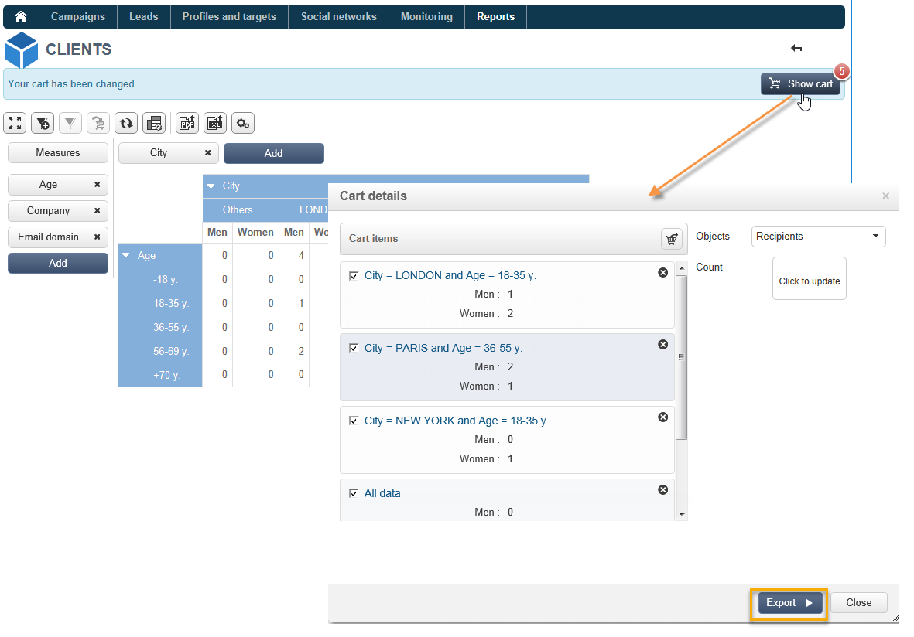

# 큐브로 데이터 탐색{#use-cubes-to-create-reports}

큐브를 사용하여 보고서를 만들고 데이터베이스에서 데이터를 식별하고 선택합니다. 다음을 수행할 수 있습니다.

* 큐브를 기반으로 보고서를 만듭니다. [자세히 알아보기](#explore-the-data-in-a-report)
* 타겟과 게재를 식별하고 작성하기 위해, 데이터베이스의 데이터를 수집하고 목록으로 그룹화합니다. [자세히 알아보기](#build-a-target-population)
* 보고서에 피벗 테이블을 삽입하고 보고서의 기존 큐브를 참조합니다. [자세히 알아보기](#insert-a-pivot-table-into-a-report)

## 보고서에서 데이터 탐색 {#explore-the-data-in-a-report}

### 1단계 - 큐브를 기반으로 보고서 만들기 {#step-1---create-a-report-based-on-a-cube}

한 번 [큐브가 구성됨](cube-indicators.md)새 보고서를 만들기 위해 템플릿으로 사용할 수 있습니다.

기존 큐브를 기반으로 보고서를 만들려면 아래 단계를 수행하십시오.

1. 을(를) 클릭합니다. **[!UICONTROL Create]** 버튼 **[!UICONTROL Reports]** 탭하고 방금 만든 큐브를 선택합니다.

   

1. 을(를) 클릭합니다. **[!UICONTROL Create]** 확인할 단추: 보고서 구성 및 보기 페이지로 이동합니다.

   기본적으로 사용 가능한 처음 두 차원은 행과 열로 제공되지만 테이블에 값이 표시되지 않습니다. 테이블을 생성하려면 기본 아이콘을 누릅니다.

   

1. 차원의 축을 전환하거나 삭제하고 새 측정 단위를 추가할 수 있습니다. 이렇게 하려면 적절한 아이콘을 사용합니다.

   

   이러한 작업은 아래에 자세히 설명되어 있습니다.

### 2단계 - 라인 및 열 선택 {#step-2---select-lines-and-columns}

기본 표시에는 큐브의 처음 두 차원(이 경우 연령 및 도시)이 표시됩니다.

다음 **[!UICONTROL Add]** 각 축의 단추를 사용하여 차원을 추가할 수 있습니다.

1. 테이블의 행과 열에 표시할 차원을 선택합니다. 이렇게 하려면 사용 가능한 차원을 끌어서 놓습니다.
1. 목록에서 테이블에 추가할 차원을 선택합니다.
   

1. 그런 다음 이 차원의 매개 변수를 선택합니다.

   

   이러한 매개 변수는 선택한 차원의 데이터 유형에 따라 다릅니다.

   예를 들어, 날짜의 경우 몇 가지 수준을 사용할 수 있습니다. 자세한 내용은 [측정값 표시](cube-best-practices.md#display-measures).

   이 경우 다음 옵션을 사용할 수 있습니다.

   

   다음 중 하나를 수행할 수 있습니다.

   * 로드하는 동안 데이터를 확장합니다. 보고서가 업데이트될 때마다 기본적으로 값이 표시됩니다(기본값: 아니요).
   * 라인 끝에 합계를 표시합니다. 데이터가 열에 표시되면 추가 옵션을 사용하여 라인 끝에서 합계를 표시할 수 있습니다. 열이 테이블에 추가됩니다(기본값: 예)
   * 정렬 적용: 열의 값은 값, 레이블 또는 측정값(기본값: 값 기준).
   * 값을 오름차순(a-z, 0-9) 또는 내림차순(z-a, 9-0) 순서로 표시합니다.
   * 로드 시 표시할 열 수를 변경합니다(기본적으로: 200).

1. 클릭 **[!UICONTROL Ok]** 확인하려면: 차원이 기존 차원에 추가됩니다.

   표 위의 노란색 배너에 변경한 내용이 표시됩니다. 를 클릭합니다. **[!UICONTROL Save]** 단추를 클릭하여 저장합니다.

   

### 3단계 - 표시할 측정 단위 구성 {#step-3---configure-the-measures-to-display}

라인과 열이 정의되면 표시할 측정값을 선택합니다. 기본적으로 하나의 측정값만 표시됩니다.

측정값을 추가하고 구성하려면 아래 단계를 수행하십시오.

1. **[!UICONTROL Measures]** 버튼을 클릭합니다.

   

1. 사용 **[!UICONTROL Use a measure]** 버튼을 클릭하고 기존 측정값 중 하나를 선택합니다.

   

   표시할 정보와 서식 옵션을 선택합니다. 옵션 목록은 측정 유형에 따라 다릅니다.

   

   전체 측정 구성은 을 통해 사용할 수도 있습니다 **[!UICONTROL Edit the configuration of the pivot table]** 아이콘 사용)할 수도 있습니다.

   

   그런 다음 측정값 레이블을 표시할지 여부를 선택할 수 있습니다. [자세히 알아보기](cube-best-practices.md#configure-the-display)

1. 기존 측정값을 기반으로 새 측정값을 작성할 수 있습니다. 이렇게 하려면 **[!UICONTROL Create a measure]** 그리고 구성합니다.

   

   다음 유형의 측정 단위를 사용할 수 있습니다.

   * 측정 단위 조합: 이 유형의 측정값을 사용하면 기존 측정값을 사용하여 새 측정값을 작성할 수 있습니다.

      사용 가능한 연산자는 다음과 같습니다. 합계, 차이, 곱하기 및 비율.

   * 비율: 이 유형의 측정 단위를 사용하여 주어진 차원에 대해 측정된 레코드 수를 계산할 수 있습니다. 차원이나 하위 차원을 기반으로 비례 단위를 계산할 수 있습니다.
   * 변형: 이 측정값을 통해 레벨 값의 변형을 계산할 수 있습니다.
   * 표준 편차: 이 유형의 측정을 사용하면 값의 평균과 비교하여 각 셀 그룹 내의 편차를 계산할 수 있습니다. 예를 들어 모든 기존 세그먼트에 대한 구매 볼륨을 비교할 수 있습니다.

   측정값이 만들어지면 보고서에 측정값이 추가됩니다.

   

   측정을 생성한 후에는 편집하고 구성을 변경할 수 있습니다. 이렇게 하려면 **[!UICONTROL Measures]** 버튼을 클릭한 다음 편집할 측정 단위의 탭을 찾습니다.

   그런 다음 **[!UICONTROL Edit the dynamic measure]** 를 클릭하여 설정 메뉴에 액세스합니다.

## 대상 모집단 작성 {#build-a-target-population}

큐브를 사용하여 보고서를 작성할 수 있으므로 테이블에서 데이터를 수집하고 목록에 저장할 수 있습니다.

모집단을 목록으로 그룹화하려면 아래 단계를 따르십시오.

1. 수집할 모집단이 포함된 셀을 클릭하여 선택한 다음 **[!UICONTROL Add to cart]** 아이콘.

   

   이를 위해 다양한 프로필을 수집하는 데 필요한 만큼 여러 번 수행합니다

1. 을(를) 클릭합니다. **[!UICONTROL Show cart]** 버튼을 클릭하여 내보내기를 실행하기 전에 콘텐츠를 확인합니다.

   

1. 를 사용하십시오 **[!UICONTROL Export]** 단추를 클릭하여 장바구니의 항목을 목록으로 그룹화합니다.

   목록의 이름을 입력하고 수행할 내보내기 유형을 선택합니다.

   

   클릭 **[!UICONTROL Start]** 내보내기를 실행하려면

1. 내보내기가 완료되면 메시지가 실행과 처리된 레코드 수를 확인합니다.

   

   장바구니의 컨텐츠를 저장하거나 비울 수 있습니다.

   새 목록은 **[!UICONTROL Profiles and targets]** 탭.

   

## 보고서에 피벗 테이블 삽입 {#insert-a-pivot-table-into-a-report}

테이블을 만들고 큐브에서 데이터를 탐색하려면 아래 단계를 수행하십시오.

1. 하나의 페이지로 새 보고서를 만들고 피벗 테이블을 여기에 삽입합니다.

   

1. 에서 **[!UICONTROL Data]** 페이지의 탭에서 큐브를 선택하여 포함된 차원을 처리하고 계산된 측정 단위를 표시합니다.

   

   이를 통해 표시할 보고서를 작성할 수 있습니다. 자세한 내용은 [2단계 - 라인 및 열 선택](#step-2---select-lines-and-columns).
