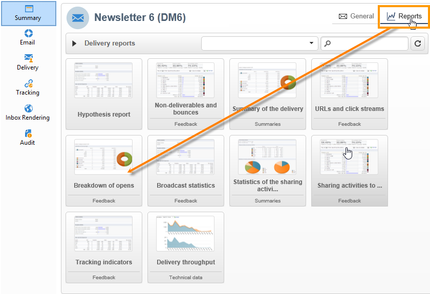
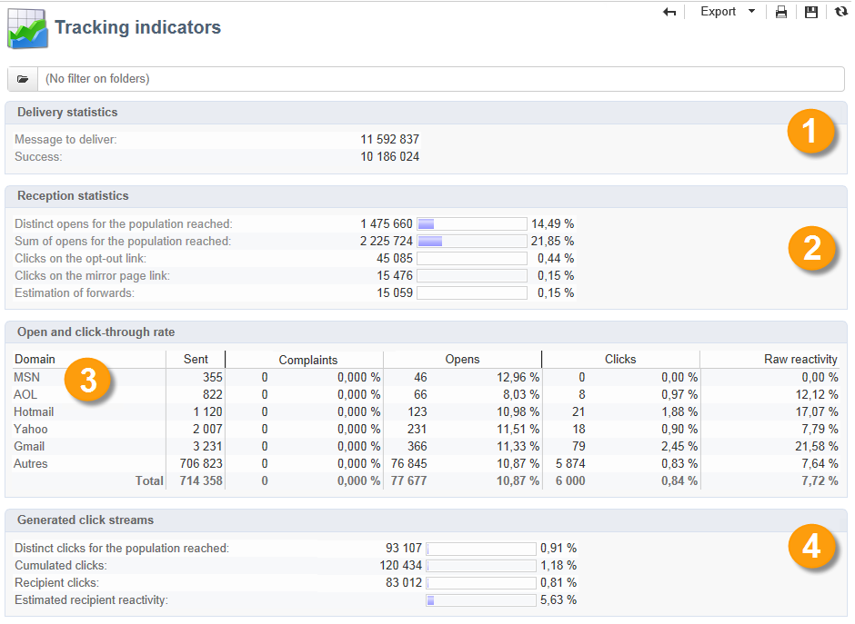

# 게재 보고서 {#delivery-reports}

게재 개요에서 액세스할 수 있는 다양한 보고서를 통해 게재 실행을 추적할 수 있습니다.

보고서에 액세스하려면 아래 단계를 따르십시오.

1. **[!UICONTROL Campaigns]** 탭으로 이동하여 **[!UICONTROL Delivery]** 링크를 클릭하여 게재 목록을 표시합니다.
1. 액세스할 보고서의 게재 이름을 클릭합니다.
1. **[!UICONTROL Summary]** 탭을 선택하고 **[!UICONTROL Reports]** 링크를 클릭하여 게재와 관련된 보고서에 액세스합니다.

   

   기본적으로 다음 보고서를 사용할 수 있습니다.

   * **[!UICONTROL Delivery throughput]**
   * **[!UICONTROL Sharing to social networks]**
   * **[!UICONTROL Statistics on sharing activities]**
   * **[!UICONTROL Hot clicks]**
   * **[!UICONTROL Tracking statistics]**
   * **[!UICONTROL URLs and click streams]**
   * **[!UICONTROL Tracking indicators]**
   * **[!UICONTROL Non-deliverables and bounces]**
   * **[!UICONTROL User activities]**
   * **[!UICONTROL Delivery summary]**
   * **[!UICONTROL Subscription tracking]**
   * **[!UICONTROL Delivery statistics]**
   * **[!UICONTROL Breakdown of opens]**

## 지표 추적 {#tracking-indicators}

이 보고서는 게재를 받을 때 수신자의 행동을 추적하기 위한 주요 지표를 결합합니다. 게재 및 수신 통계, 열람 및 클릭스루 비율, 생성된 클릭 스트림에 대한 액세스 뿐만 아니라 소셜 네트워크에 대한 활동 공유를 제공합니다.

>[!NOTE]
>
>텍스트 형식의 전자 메일에 연결된 오류 여백으로 인해 메시지 열기를 기반으로 계산된 값은 항상 예상 값입니다. **[!UICONTROL Distinct opens/Sum of opens for the population reached]** 표시기는 이 오류 여백을 고려합니다. [자세히 알아보기](metrics-calculation.md#tracking-opens-)

**[!UICONTROL 1. Delivery statistics]**

* **[!UICONTROL Messages to deliver]**: 게재 분석 후 게재할 총 메시지 수
* **[!UICONTROL Success]**: 성공적으로 처리된 메시지 수입니다.

**[!UICONTROL 2. Reception statistics]**

>[!NOTE]
>
>관련 백분율은 성공적으로 전달된 메시지 수를 기반으로 계산됩니다.

* **[!UICONTROL Distinct opens for the population reached]**: 메시지를 한 번 이상 연 대상 받는 사람 수 예상. 링크를 클릭하려면 이메일을 열어야 하므로 추적된 URL에 대한 클릭 수가 고려됩니다.
* **[!UICONTROL Sum of opens for the population reached]**: 대상 수신자의 총 열람 수 예상.
* **[!UICONTROL Clicks on opt-out link]**: 구독 취소 링크의 클릭 수입니다.
* **[!UICONTROL Clicks on the mirror page link]**: [미러 페이지](../send/mirror-page.md) 링크를 클릭한 횟수 고려하려면 게재 마법사(추적된 URL)에서 링크를 이와 같이 정의해야 합니다.
* **[!UICONTROL Estimation of forwards]**: 대상 받는 사람이 전달한 전자 메일 수를 예상합니다. 이 값은 고유 사람 수와 이메일을 클릭한 고유 수신자 수를 빼서 계산합니다.

  >[!NOTE]
  >
  >고유 사용자와 대상 받는 사람 간의 차이에 대한 자세한 내용은 [대상 사용자/받는 사람](metrics-calculation.md#targeted-persons---recipients)을 참조하세요.

**[!UICONTROL 3. Open and click-through rate]**

이 값 표에는 인터넷 도메인별 게재, 열기, 클릭 수 및 원시 재활동 분류가 표시됩니다. 다음 지표가 사용됩니다.

* **[!UICONTROL Sent]**: 이 도메인에서 보낸 총 메시지 수
* **[!UICONTROL Complaints]**: 받는 사람이 원치 않는 것으로 보고한 이 도메인에 대한 메시지 수입니다. 이 비율은 이 도메인에서 보낸 총 메시지 수를 기반으로 계산됩니다.
* **[!UICONTROL Opens]**: 이 도메인에 대해 최소 한 번 이상 메시지를 연 고유한 대상 받는 사람의 수입니다. 이 비율은 이 도메인에서 보낸 총 메시지 수를 기반으로 계산됩니다.
* **[!UICONTROL Clicks]**: 동일한 게재를 한 번 이상 클릭한 고유한 타깃팅된 받는 사람 수입니다. 이 비율은 이 도메인에서 보낸 총 메시지 수를 기반으로 계산됩니다
* **[!UICONTROL Raw reactivity]**: 게재를 한 번 이상 클릭한 수신자 수와 게재를 한 번 이상 연 수신자 수의 백분율입니다.

>[!NOTE]
>
>이 보고서에 표시되는 도메인 이름은 큐브 수준에서 사용되는 항목별 목록에 정의됩니다. 기본 도메인을 변경, 추가 또는 제거하려면 **[!UICONTROL Domains]** 항목별 목록을 편집하고 값과 별칭을 수정합니다. **[!UICONTROL Others]** 범주에 항목별 목록의 값에 속하지 않는 도메인 이름이 포함되어 있습니다.
>
>[이 페이지](../config/enumerations.md)에서 열거형에 액세스하고 구성하는 방법을 알아보세요.

**[!UICONTROL 4. Generated click streams]**

>[!NOTE]
>
>관련 백분율은 성공적으로 전달된 메시지 수를 기반으로 계산됩니다.

* **[!UICONTROL Distinct clicks for the population reached]**: 게재를 한 번 이상 클릭한 고유 사용자 수입니다.
* **[!UICONTROL Cumulated clicks]**: 구독 취소 링크 및 미러 페이지를 제외한 타깃팅된 수신자의 총 클릭 수입니다.
* **[!UICONTROL Recipient clicks]**: 동일한 게재를 한 번 이상 클릭한 고유한 타깃팅된 받는 사람 수입니다.
* **[!UICONTROL Estimated recipient reactivity]**: 게재를 한 번 이상 클릭한 수신자 수와 게재를 한 번 이상 연 예상 수신자 수의 비율입니다. 옵트아웃 및 미러 페이지 링크에 대한 클릭은 고려되지 않습니다.
<!--
**[!UICONTROL 5. Web tracking]**

* **[!UICONTROL Visited pages]**: Number of web pages visited following message reception.
* **[!UICONTROL Transactions]**: Number of purchases following message reception.
* **[!UICONTROL Total amount]**: Total amount of purchases following message reception. 
* **[!UICONTROL Average transaction amount]**: Average purchase made by distinct delivery recipients. 
* **[!UICONTROL Articles]**: Number of articles purchased by the delivery recipients. 
* **[!UICONTROL Average count of articles per transaction]**: Average number of items per purchase made by distinct recipients.
* **[!UICONTROL Average amount per message]**: Average amount of purchases generated per message.

  >[!NOTE]
  >
  >In order for a visited page, transaction, amount or article to be taken into account, a webtracking tag must be inserted into the matching web page. Webtracking configuration is presented in [this section](../../configuration/using/about-web-tracking.md).

**[!UICONTROL 6. Sharing activities to email and social networks]**

This section shows the number of messages shared on each social network. For more on this, refer to [Sharing to social networks](../../reporting/using/global-reports.md#sharing-to-social-networks).

## URLs and click streams {#urls-and-click-streams}

This report shows the list of pages visited following a delivery. 

You can configure the contents of this report by selecting: the score chart to be displayed, the time filter (since the action launch, over the first 6 hours following launch, etc.) and the data display mode (by label, by URL, by category. Click **[!UICONTROL Refresh]** to confirm your selection.

The following rates are displayed in the upper section of the report:

* **[!UICONTROL Reactivity]**: Ratio of the number of targeted recipients having clicked in a delivery, in relation to the estimated number of targeted recipients having opened a delivery. Clicks on the opt-out link and on the mirror page are not taken into account.

  >[!NOTE]
  >
  >For more information on tracking opens, refer to [this section](metrics-calculation.md#tracking-opens-).

* **[!UICONTROL Distinct clicks]**: Number of distinct people having clicked at least once (excluding unsubscription link and mirror page) in a delivery. The rate displayed is calculated based on the number of messages delivered successfully. 
* **[!UICONTROL Cumulated clicks]**: Total number of clicks by targeted recipients (excluding unsubscription link and mirror page). The rate displayed is calculated based on the number of messages forwarded successfully.

**[!UICONTROL Platform average]**: This average rate, displayed under each rate (reactivity, distinct clicks, and cumulated clicks), is calculated for deliveries sent over the previous six months. Only deliveries with the same typology and on the same channel are taken into account. Proofs are excluded.

The central table provides the following information:

* **[!UICONTROL Clicks]**: Number of cumulated clicks, per link. 
* **[!UICONTROL Clicks (in %)]**: Breakdown of the number of clicks per link, in relation to the total number of cumulated clicks.

**[!UICONTROL Breakdown of clicks in time]**

This chart shows the breakdown of cumulated clicks per day.
-->

## 게재 요약 {#delivery-summary}

이 보고서는 게재에 대한 모든 기본 정보를 제공합니다.

**[!UICONTROL Target population]**

이 섹션에는 두 개의 표시기가 있습니다.

* **[!UICONTROL Initial population]**: 게재를 대상으로 하는 총 받는 사람 수
* **[!UICONTROL Messages rejected by the rule]**: 유형화 규칙을 적용할 때 분석 중에 무시된 주소 수: 주소 누락, 격리됨, 차단 목록 등 <!--For more information on typology rules, refer to this [page](../../delivery/using/steps-validating-the-delivery.md#validation-process-with-typologies).-->

**[!UICONTROL Causes of exclusion]**

중간 차트는 분석 중에 거부된 메시지의 규칙별 분류를 보여 줍니다.

**[!UICONTROL Delivery statistics]**

이 섹션에는 다음 지표가 포함됩니다.

* **[!UICONTROL Messages to be delivered]**: 게재 분석 후 게재할 총 메시지 수
* **[!UICONTROL Success]**: 처리된 메시지 수입니다. 결합된 비율은 게재될 메시지 수에 대한 비율입니다.
* **[!UICONTROL Errors]**: 게재 및 자동 반동 처리 중 누적된 총 오류 수 결합된 비율은 게재될 메시지 수에 대한 비율입니다.
* **[!UICONTROL New quarantines]**: 게재 실패 후 격리된 주소 수(사용자 알 수 없음, 잘못된 도메인). 결합된 비율은 게재될 메시지 수에 대한 비율입니다.

## 핫 클릭 {#hot-clicks}

이 보고서에는 메시지 콘텐츠(HTML 및/또는 텍스트)와 각 링크의 링크 클릭 비율이 표시됩니다. 개인 맞춤화 블록 구독 취소 링크, 미러 페이지 링크 및 오퍼 링크는 총 누적 클릭 수 계산에 포함되지만 보고서에는 표시되지 않습니다.

>[!NOTE]
>
>게재에 오퍼(상호 작용)가 포함된 경우 오퍼에 대한 클릭 비율을 표시하는 상자가 보고서 위 부분에 나타납니다.

## 추적 통계 {#tracking-statistics}

이 보고서는 열기, 클릭 및 트랜잭션에 대한 통계를 제공합니다.

게재의 마케팅 효과를 추적할 수 있습니다. 시간표(1시간, 3시간 또는 24시간 보기 등)를 변경하여 값이 표시되는 방식을 구성할 수 있습니다. **[!UICONTROL Refresh]**&#x200B;을(를) 클릭하여 선택 내용을 확인합니다.

이 보고서는 게재가 최대 효율에 도달하는 데 필요한 시간을 표시하는 값 테이블과 파레토 차트를 제공합니다. 다음 지표가 사용됩니다.

* **[!UICONTROL Opens]**: 열린 총 메시지 수의 비율에 도달하는 데 필요한 시간을 예상합니다. 텍스트 형식의 이메일은 고려되지 않습니다. [자세히 알아보기](metrics-calculation.md#tracking-opens-)
* **[!UICONTROL Clicks]**: 기록된 총 클릭 수의 비율에 도달하는 데 필요한 시간을 예상합니다. 옵트아웃 링크 및 미러 페이지 클릭 수는 고려되지 않습니다.
<!--
* **[!UICONTROL Transactions]**: Time required to achieve a percentage of the total number of transactions following message reception. In order for a transaction to be taken into account, a transaction type webtracking tag must be inserted into the matching web page. Webtracking configuration is presented in [this section](../../configuration/using/about-web-tracking.md).
-->

## 누적 보고서 {#cumulated-reports}

게재에 대해 누적된 보고서를 표시할 수 있습니다. 이렇게 하려면 비교할 게재를 선택하여 이러한 게재에 대한 보고서 목록을 가져옵니다.

목록에서 인접하지 않은 게재를 선택하려면 Ctrl 키를 누른 상태에서 선택합니다.

다른 폴더에 저장된 게재를 선택하려면 도구 모음에서 액세스할 수 있는 **[!UICONTROL Display sub-levels]** 아이콘을 클릭합니다. 그런 다음 동일한 목록에 표시됩니다.
