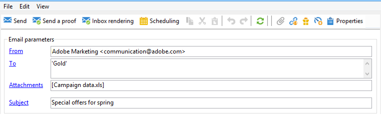

# 이메일에 파일 첨부{#attaching-files}

## 이메일 첨부 파일 정보 {#about-email-attachments}

하나 이상의 파일을 이메일 게재에 첨부할 수 있습니다.

>[!NOTE]
>
>성능 문제를 방지하려면 이메일당 두 개 이상의 첨부 파일을 포함하지 않는 것이 좋습니다. Campaign 옵션 목록에서 권장 임계값을 구성할 수 있습니다. [Campaign Classic 설명서](https://experienceleague.adobe.com/docs/campaign-classic/using/installing-campaign-classic/appendices/configuring-campaign-options.html#delivery)를 참조하세요.

두 가지 가능한 경우가 있습니다.

* 파일을 선택하여 그대로 게재에 첨부합니다.
* 각 수신자에 대한 첨부 파일의 콘텐츠를 개인화합니다. 이 경우 **계산된 첨부 파일**&#x200B;을 만들어야 합니다. 첨부 파일의 이름은 받는 사람에 따라 각 메시지의 게재 시 계산됩니다. **가변 디지털 인쇄** 옵션이 있는 경우 게재 시 콘텐츠를 개인화하고 PDF 형식으로 변환할 수도 있습니다.

>[!NOTE]
>
>이러한 유형의 구성은 일반적으로 게재 템플릿에서 수행됩니다. 자세한 내용은 [Campaign Classic 설명서](https://experienceleague.adobe.com/docs/campaign-classic/using/sending-messages/using-delivery-templates/about-templates.html?lang=ko)를 참조하세요.

## 보호 기능 {#attachments-guardrails}

성능 문제를 방지하기 위해 이메일에 포함된 이미지는 100KB를 초과할 수 없습니다. 기본적으로 설정된 이 제한은 `NmsDelivery_MaxDownloadedImageSize` 옵션에서 변경할 수 있습니다. 그러나 Adobe에서는 이메일 게재에 큰 이미지를 사용하지 않는 것이 좋습니다.

Adobe은 첨부 파일의 크기와 수를 제한하는 것을 권장합니다. 기본적으로 하나의 파일만 전자 메일에 첨부 파일로 추가할 수 있습니다. 이 임계값은 `NmsDelivery_MaxRecommendedAttachments` 옵션에서 구성할 수 있습니다.

[Campaign Classic 설명서](https://experienceleague.adobe.com/docs/campaign-classic/using/installing-campaign-classic/appendices/configuring-campaign-options.html#delivery)의 Campaign 옵션 목록에서 자세히 알아보세요.

## 로컬 파일 첨부 {#attaching-a-local-file}

게재에 로컬 파일을 첨부하려면 아래 단계를 수행합니다.

>[!NOTE]
>
>여러 파일을 게재에 첨부할 수 있습니다. 첨부 파일은 모든 형식일 수 있으며 압축 형식이 포함되어 있습니다.

1. **[!UICONTROL Attachments]** 링크를 클릭합니다.
1. **[!UICONTROL Add]** 버튼을 클릭합니다.
1. 게재에 첨부할 파일을 선택하려면 **[!UICONTROL File...]**&#x200B;을(를) 클릭하십시오.

   

배달 **[!UICONTROL Attachments]** 필드에 파일을 직접 끌어서 놓거나 배달 도우미 도구 모음에서 **[!UICONTROL Attach]** 아이콘을 사용할 수도 있습니다.

파일이 선택되면 즉시 서버에 업로드되어 게재 시 사용할 수 있게 됩니다. **[!UICONTROL Attachments]** 필드에 나열됩니다.

## 계산된 첨부 파일 만들기 {#creating-a-calculated-attachment}

계산된 첨부 파일을 생성할 때 첨부 파일의 이름은 각 메시지의 분석 또는 게재 중에 계산되며 수신자에 따라 달라질 수 있습니다. 또한 개인화하고 PDF으로 변환할 수 있습니다.

개인화된 첨부 파일을 생성하려면 다음 단계를 수행합니다.

1. **[!UICONTROL Attachments]** 링크를 클릭합니다.
1. **[!UICONTROL Add]** 단추를 클릭한 다음 **[!UICONTROL Calculated attachment]**&#x200B;을(를) 선택합니다.
1. **[!UICONTROL Type]** 드롭다운 목록에서 계산 유형을 선택합니다.

다음 옵션을 사용할 수 있습니다.

* 게재 템플릿을 만들 때 **파일 이름이 지정됨**
* **각 메시지를 배달하는 동안 파일의 내용이 개인화되고 PDF으로 변환됩니다**
* **게재 분석 중에 파일 이름이 계산됩니다(받는 사람 프로필에 따라 달라질 수 없음)**
* **각 받는 사람에 대한 배달 시 파일 이름이 계산됩니다(받는 사람에 따라 다를 수 있음)**

### 로컬 파일 첨부 {#attach-a-local-file}

첨부 파일이 로컬 파일인 경우 옵션을 선택합니다. **[!UICONTROL File name is specified when creating the delivery template]**. 파일이 로컬로 선택되고 서버에 업로드됩니다. 아래의 단계를 수행하십시오.

1. **[!UICONTROL Local file]** 필드에서 업로드할 파일을 선택하십시오.
1. 필요한 경우 레이블을 지정합니다. 이 레이블은 메시징 시스템에서 볼 때 파일 이름을 대체합니다. 아무것도 지정하지 않으면 기본적으로 파일 이름이 사용됩니다.

   

1. 필요한 경우 **[!UICONTROL Upload file on the server]**&#x200B;을(를) 선택한 다음 **[!UICONTROL Update on server]**&#x200B;을(를) 클릭하여 전송을 시작합니다.

   

그런 다음 서버에서 이 템플릿에서 만든 다른 게재에 첨부할 파일을 사용할 수 있습니다.

### 개인화된 메시지 첨부 {#attach-a-personalized-message}

**[!UICONTROL The file content is personalized and converted into PDF format at the time of delivery for each message]** 옵션을 사용하면 의도한 수신자의 성 및 이름과 같은 개인화 필드가 있는 파일을 선택할 수 있습니다.

이 유형의 첨부 파일에 대해 다음 구성 단계를 적용합니다.

1. 업로드할 파일을 선택합니다.
1. 필요한 경우 레이블을 지정합니다.
1. **[!UICONTROL Upload file on the server]**&#x200B;을(를) 선택한 다음 **[!UICONTROL Update on server]**&#x200B;을(를) 클릭하여 전송을 시작합니다.
1. 미리보기를 표시할 수 있습니다. 이렇게 하려면 수신자를 선택합니다.

   

1. 게재를 분석한 다음 시작합니다.

   각 수신자는 게재에 첨부된 개인화된 PDF을 수신합니다.

   

### 계산된 파일 첨부 {#attach-a-calculated-file}

게재를 준비하는 동안 첨부 파일 이름을 계산할 수 있습니다. 이렇게 하려면 **[!UICONTROL The file name is calculated during delivery analysis (it cannot depend on the recipient)]** 옵션을 선택하십시오.

>[!NOTE]
>
>이 옵션은 외부 프로세스 또는 워크플로우에서 게재를 보낼 때만 사용됩니다.

1. 첨부 파일에 적용할 레이블을 지정합니다.
1. 정의 창에서 파일의 액세스 경로와 정확한 이름을 지정합니다.

   >[!IMPORTANT]
   >
   >파일이 서버에 있어야 합니다.

   

1. 분석을 수행한 다음 게재를 시작합니다.

   파일 이름 계산은 분석 로그에서 볼 수 있습니다.

   

### 개인화된 파일 첨부 {#attach-a-personalized-file}

첨부 파일을 선택할 때 **[!UICONTROL The file name is calculated during delivery for each recipient (it can depend on the recipient)]** 옵션을 선택할 수 있습니다. 그런 다음 수신자 개인화 데이터를 전송할 파일의 이름과 매핑할 수 있습니다.

>[!NOTE]
>
>이 옵션은 외부 프로세스 또는 워크플로우에서 게재를 보낼 때만 사용됩니다.

1. 첨부 파일에 적용할 레이블을 지정합니다.
1. 정의 창에서 파일의 액세스 경로와 정확한 이름을 지정합니다. 파일 이름이 개인화된 경우 관련 값에 대한 개인화 필드를 사용할 수 있습니다.

   

   >[!IMPORTANT]
   >
   >파일이 서버에 있어야 합니다.

1. 분석을 수행한 다음 게재를 시작합니다.

   아래 예에서 첨부 파일은 병합 필드를 사용하여 정의된 이름에 따라 선택되었습니다.

   

### 첨부 파일 설정 {#attachment-settings}

처음 두 옵션은 적절한 옵션을 선택하여 **[!UICONTROL Upload file on the server]**&#x200B;을(를) 선택할 수 있습니다. **[!UICONTROL Update the file on the server]** 링크를 사용하여 업로드를 시작할 수 있습니다.

파일이 서버에 업로드되었다는 메시지가 표시됩니다.

파일을 변경하면 다음과 같은 경고 메시지가 표시됩니다.

**[!UICONTROL Advanced]** 탭에서는 첨부 파일에 고급 옵션을 정의할 수 있습니다.

* 모든 수신자에게 첨부 파일을 보내지 않도록 필터 옵션을 정의할 수 있습니다. **[!UICONTROL Enable filtering of recipients who will receive the attachment]** 옵션은 JavaScript에 입력해야 하는 수신자 선택 스크립트를 정의하는 데 사용되는 입력 필드를 활성화합니다.
* 파일 이름을 스크립팅하여 개인화할 수 있습니다.

  창에 텍스트를 입력하고 드롭다운 목록에서 사용할 수 있는 개인화 필드를 사용합니다. 다음 예제에서는 파일 이름이 오늘의 날짜와 수신자의 이름을 포함하도록 개인화됩니다.

  
