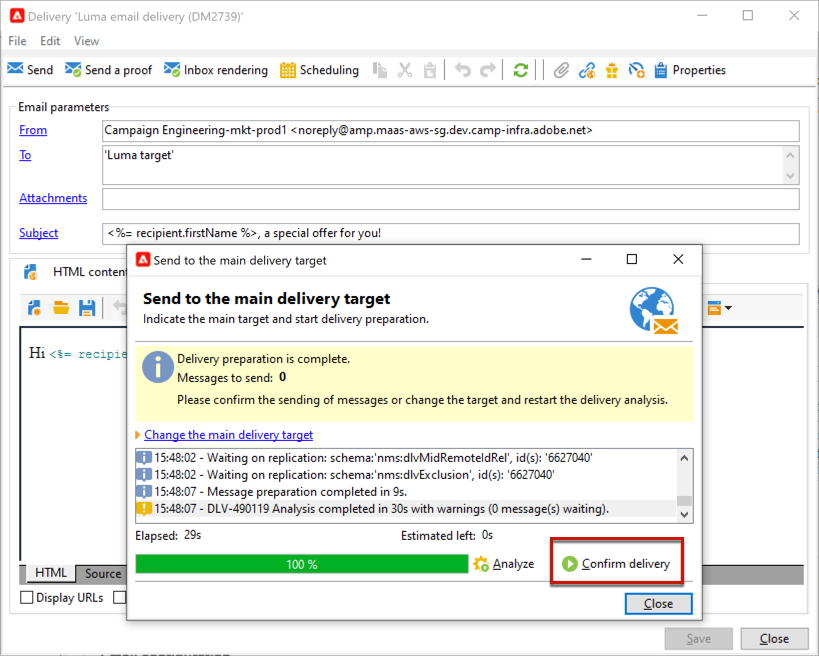

# 게재 구성 및 보내기 {#configure-delivery}

## 추가 매개 변수 설정 {#delivery-additional-parameters}

게재를 보내기 전에 를 통해 게재 속성에서 전송 매개 변수를 정의할 수 있습니다. **[!UICONTROL Delivery]** 탭.

* **[!UICONTROL Delivery priority]**: 이 옵션을 사용하여 우선 순위 수준을 설정하여 게재 전송 순서를 변경할 수 있습니다. **[!UICONTROL Very low]** 끝 **[!UICONTROL Very high]** (기본값: **[!UICONTROL Normal]**).

* **[!UICONTROL Message batch quantity]**: 이 옵션을 사용하여 동일한 XML 게재 패키지 내에 그룹화된 메시지 수를 정의합니다. 매개 변수를 0으로 설정하면 메시지가 자동으로 그룹화됩니다. 패키지 크기는 계산에 의해 정의됩니다 `<delivery size>/1024`패키지로 최소 8개, 최대 256개의 메시지 전송

  >[!IMPORTANT]
  >
  >기존 게재를 복제하여 게재를 만들 때 이 매개 변수는 재설정됩니다.

* **[!UICONTROL Send using multiple waves]**: 이 옵션을 사용하여 메시지를 전체 대상자에게 한 번에 보내지 않고 일괄적으로 보낼 수 있습니다. [자세히 알아보기](#sending-using-multiple-waves)

* **[!UICONTROL Test SMTP delivery]**: SMTP를 통한 전송을 테스트하려면 이 옵션을 사용합니다. 게재는 SMTP 서버에 연결될 때까지 처리되지만 전송되지는 않습니다. 게재의 모든 수신자에 대해 Campaign은 SMTP 공급자 서버에 연결하고 SMTP RCPT TO 명령을 실행한 다음 SMTP DATA 명령 전에 연결을 종료합니다.

  >[!NOTE]
  >
  >* 중간 소싱에서는 이 옵션을 설정하지 않아야 합니다.
  >
  >* 에서 SMTP 서버 구성에 대해 자세히 알아보기 [Campaign Classic v7 설명서](https://experienceleague.adobe.com/docs/campaign-classic/using/installing-campaign-classic/additional-configurations/configure-delivery-settings.html#smtp-relay){target="_blank"}.

* **[!UICONTROL Email BCC]**: 이 옵션을 사용하여 BCC 이메일 주소를 메시지 타겟에 추가하여 BCC를 통해 외부 시스템에 이메일을 저장합니다. [자세히 알아보기](email-parameters.md)

## 예약된 일괄 처리를 사용해 보내기 {#sending-using-multiple-waves}

로드 밸런싱을 위해 게재를 여러 배치로 나눌 수 있습니다. 전체 게재에 대한 배치 수와 배치 비율을 구성합니다.

>[!NOTE]
>
>크기와 두 연속 예약된 예약된 예약된 일괄 처리 사이의 지연 시간만 정의할 수 있습니다. 각 웨이브에 대한 수신자 선택 기준을 구성할 수 없습니다.

1. 게재 속성 창을 열고 **[!UICONTROL Delivery]** 탭.
1. 다음 항목 선택 **[!UICONTROL Send using multiple waves]** 옵션을 클릭하고 **[!UICONTROL Define waves...]** 링크를 클릭합니다.

   

1. 웨이브를 구성하려면 다음 중 하나를 수행할 수 있습니다.

   * 각 웨이브의 크기를 정의합니다. 예를 들어, **[!UICONTROL 30%]** 해당 필드에서 각 웨이브는 게재에 포함된 메시지의 30%를 나타내며, 마지막 웨이브는 메시지의 10%를 나타냅니다.

     다음에서 **[!UICONTROL Period]** 필드에서는 연속되는 두 예약된 일괄 처리 시작 사이의 지연 시간을 지정합니다. 예를 들어, **[!UICONTROL 2d]**&#x200B;이제 곧 바로 첫 번째 물결이 시작될 것이고 두 번째 물결이 이틀 만에, 세 번째 물결이 나흘 만에 시작될 것이다.

     

   * 각 웨이브를 보내는 달력을 정의합니다.

     다음에서 **[!UICONTROL Start]** 열에서 연속되는 두 예약된 일괄 처리 시작 사이의 지연 시간을 지정합니다. 다음에서 **[!UICONTROL Size]** 열에서 고정 숫자 또는 백분율을 입력합니다.

     아래 예에서 첫 번째 웨이브는 게재에 포함된 총 메시지 수의 25%를 나타내며 즉시 시작됩니다. 다음 두 파동은 배달을 완료하고 6시간 간격으로 시작하도록 설정된다.

     

   특정 유형화 규칙, **[!UICONTROL Wave scheduling check]**&#x200B;를 사용하면 게재 유효성 검사 제한 전에 마지막 웨이브가 계획되도록 할 수 있습니다. 캠페인 유형화 및 해당 규칙, **[!UICONTROL Typology]** 게재 속성의 탭은에 표시됩니다. [이 섹션](../../automation/campaign-opt/campaign-typologies.md#typology-rules)<!--ref TBC-->.

   >[!IMPORTANT]
   >
   >마지막 예약된 일괄 처리가 **[!UICONTROL Validity]** 탭. 그렇지 않으면 일부 메시지가 전송되지 않을 수 있습니다.
   >
   >마지막 웨이브를 구성할 때 재시도 시간도 충분히 허용해야 합니다. <!--See [this section]().-->

1. 전송을 모니터링하려면 게재 로그로 이동합니다. [이 페이지](send.md)<!--ref TBC-->를 참조하십시오.

   처리된 웨이브에서 이미 전송된 게재를 볼 수 있습니다(**[!UICONTROL Sent]** 상태) 및 나머지 웨이브로 전송할 게재(**[!UICONTROL Pending]** 상태).

아래의 두 가지 예는 다중 웨이브를 사용하는 가장 일반적인 사용 사례입니다.

* **램프 업 프로세스 중**

  새로운 플랫폼을 사용해 이메일을 보낼 때 인터넷 서비스 제공자(ISP)는 인지되지 않은 IP 주소를 의심하게 된다. 대량의 이메일이 갑자기 전송되면 ISP는 해당 이메일을 스팸으로 표시하는 경우가 많습니다.

  스팸으로 표시되지 않도록 하기 위해 웨이브를 사용하여 전송된 볼륨을 점진적으로 늘릴 수 있습니다. 이를 통해 시작 단계를 원활하게 발전시키고 잘못된 주소의 전체 비율을 줄일 수 있습니다.

  이렇게 하려면 **[!UICONTROL Schedule waves according to a calendar]** 옵션을 선택합니다. 예를 들어 첫 번째 물결을 10%로 설정하고 두 번째 물결을 15%로 설정하는 식입니다.

  

* **콜 센터 관련 캠페인**

  전화 충성도 캠페인을 관리할 때 조직에서는 구독자에게 연락하는 호출 수를 처리하는 데 제한이 있습니다.

  웨이브를 사용하여 메시지 수를 콜센터의 일일 처리 용량인 하루에 20개로 제한할 수 있습니다.

  이렇게 하려면 **[!UICONTROL Schedule multiple waves of the same size]** 옵션을 선택합니다. 입력 **[!UICONTROL 20]** 파도의 크기와 **[!UICONTROL 1d]** 다음에서 **[!UICONTROL Period]** 필드.

  

## 게재 확인 {#confirm-delivery}

게재가 구성되어 전송할 준비가 되면 전송을 확인하기 전에 게재 분석을 실행했는지 확인하십시오.

이렇게 하려면 아래 단계를 수행합니다.

1. 클릭 **[!UICONTROL Send]**&#x200B;를 클릭하고 원하는 작업을 선택합니다.

   * 게재를 즉시 보내려면 [**가능한 한 빨리 제공**].
   * 전송을 이후 날짜로 예약하려면 다음을 선택합니다. **[!UICONTROL Postpone the delivery]**. [자세히 알아보기](#schedule-delivery-sending)

1. **[!UICONTROL Analyze]**&#x200B;을(를) 클릭합니다. 자세한 내용은 [이 섹션](delivery-analysis.md)을 참조하십시오.

   

1. 완료되면 다음을 클릭합니다. **[!UICONTROL Confirm delivery]** 메시지 게재를 시작합니다.

   

1. 게재 마법사를 닫고 다음에서 게재 실행을 추적할 수 있습니다 **[!UICONTROL Delivery]** 탭입니다. 이 게재의 세부 정보 또는 게재 목록을 통해 액세스할 수 있습니다.

   자세한 내용은 아래 섹션을 참조하십시오.

   * [게재 모니터링](send.md)
   * [게재 실패 이해](delivery-failures.md)

<!--About message tracking-->

## 게재 전송 예약 {#schedule-delivery-sending}

게재 예약이나 판매 압력을 관리하고 모집단을 지나치게 모집하지 않기 위해 메시지 게재를 연기할 수 있습니다.

1. 다음을 클릭합니다. **[!UICONTROL Send]** 버튼을 클릭하고 다음을 선택합니다. **[!UICONTROL Postpone delivery]** 옵션을 선택합니다.

1. 에서 시작 날짜 지정 **[!UICONTROL Contact date]** 필드.

   

1. 게재 분석을 시작하고 게재 전송을 확인합니다. 그러나 게재 전송은 에 지정된 날짜까지 시작되지 않습니다. **[!UICONTROL Contact date]** 필드.

   >[!IMPORTANT]
   >
   >분석을 시작하면 정의한 연락 날짜가 수정됩니다. 이 날짜를 수정하는 경우 수정 사항을 고려하기 위해 분석을 다시 시작해야 합니다.

   

게재 목록에는 게재가 다음과 같이 표시됩니다. **[!UICONTROL Pending]** 상태.

예약을 업스트림으로 구성할 수도 있습니다. **[!UICONTROL Scheduling]** 게재 단추.

이 옵션을 사용하면 게재를 나중 날짜로 연기하거나 임시 캘린더에 게재를 저장할 수 있습니다.

* 다음 **[!UICONTROL Schedule delivery (no automatic execution)]** 옵션을 사용하면 게재의 임시 분석을 예약할 수 있습니다.

  이 구성이 저장되면 게재가 다음으로 변경됩니다. **[!UICONTROL Targeting pending]** 상태. 분석은 지정된 날짜에 시작됩니다.

* 다음 **[!UICONTROL Schedule delivery (automatic execution on planned date)]** 옵션을 사용하면 배달 날짜를 지정할 수 있습니다.

  클릭 **[!UICONTROL Send]** 및 선택 **[!UICONTROL Postpone delivery]** 그런 다음 분석을 시작하고 게재를 확인합니다. 분석이 완료되면 게재 대상이 준비되고 지정된 날짜에 메시지가 자동으로 전송됩니다.

날짜 및 시간은 현재 연산자의 시간대로 표시됩니다. 다음 **[!UICONTROL Time zone]** 연락 날짜 입력 필드 아래에 있는 드롭다운 목록을 사용하면 입력한 날짜 및 시간을 선택한 시간대로 자동으로 변환할 수 있습니다.

예를 들어 런던 시간 8시에 자동으로 게재를 실행하도록 예약하는 경우 시간은 선택한 시간대로 자동 변환됩니다.

<!--
## Adjust delivery failure management {#delivery-failure-management}

### Configure retries {#configure-retries}

Temporarily undelivered messages due to a **Soft** or **Ignored** error are subject to an automatic retry. The delivery failure types and reasons are presented in this [section](../../delivery/using/understanding-delivery-failures.md#delivery-failure-types-and-reasons).

>[!IMPORTANT]
>
>For hosted or hybrid installations, if you have upgraded to the [Enhanced MTA](../../delivery/using/sending-with-enhanced-mta.md), the retry settings in the delivery are no longer used by Campaign. Soft bounce retries and the length of time between them are determined by the Enhanced MTA based on the type and severity of the bounce responses coming back from the message's email domain.

For on-premise installations and hosted/hybrid installations using the legacy Campaign MTA, the central section of the **[!UICONTROL Delivery]** tab for delivery parameters indicates how many retries should be performed the day after the delivery and the minimum delay between retries.

By default, five retries are scheduled for the first day of the delivery with a minimum interval of one hour spread out over the 24 hours of the day. One retry per day is programmed after that and until the delivery deadline, which is defined in the **[!UICONTROL Validity]** tab (see [Defining validity period](#defining-validity-period)).

### Define the validity period {#define-validity-period}

When the delivery has been launched, the messages (and any retries) can be sent until the delivery deadline. This is indicated in the delivery properties, via the **[!UICONTROL Validity]** tab.

* The **[!UICONTROL Delivery duration]** field lets you enter the limit for global delivery retries. This means that Adobe Campaign sends the messages beginning on the start date, and then, for messages returning an error only, regular, configurable retries are performed until the validity limit is reached.

  You can also choose to specify dates. To do this, select **[!UICONTROL Explicitly set validity dates]**. In this case, the delivery and validity limit dates also let you specify the time. The current time is used by default, but you can modify this directly in the input field.

  >[!IMPORTANT]
  >
  >For hosted or hybrid installations, if you have upgraded to the [Enhanced MTA](../../delivery/using/sending-with-enhanced-mta.md), the **[!UICONTROL Delivery duration]** setting in your Campaign email deliveries will be used only if set to **3.5 days or less**. If you define a value higher than 3.5 days, it will not be taken into account.

* **Validity limit of resources**: The **[!UICONTROL Validity limit]** field is used for uploaded resources, mainly for the mirror page and images. The resources on this page are valid for a limited time (to save disk space).

  The values in this field can be expressed in the units listed in [this section](../../platform/using/adobe-campaign-workspace.md#default-units).
-->
