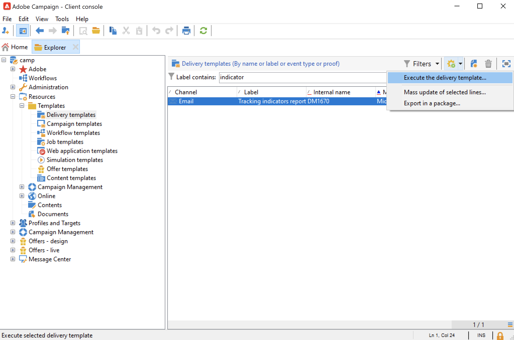

# 게재 템플릿으로 작업{#work-with-delivery-template}

캠페인 실행 및 실행을 보다 신속하게 하기 위해 게재 템플릿을 사용하여 창의적인 모양과 느낌을 표준화할 수 있습니다.

템플릿에는 다음을 체계적으로 포함할 수 있습니다.

* 유형화
* 보낸 사람 및 회신 주소
* 기본 개인화 블록
* 링크 대상 [미러 페이지](../send/mirror-page.md) 및 구독 취소 링크
* 콘텐츠, 회사 로고 또는 서명
* 리소스 유효성, 다시 시도 매개 변수 또는 격리 설정과 같은 기타 게재 속성입니다.

 [비디오에서 이 기능 살펴보기](#delivery-template-video)

## 템플릿 만들기{#create-a-delivery-template}

게재 템플릿을 만들려면 기본 제공 템플릿을 복제하거나, 기존 게재를 템플릿으로 변환하거나, 게재 템플릿을 처음부터 만들 수 있습니다.

### 기존 템플릿 복제{#copy-an-existing-template}

Campaign에는 각 채널에 대한 기본 제공 템플릿 세트가 포함되어 있습니다. 이메일, 푸시, SMS, DM 등

게재 템플릿을 만드는 가장 쉬운 방법은 기본 제공 템플릿을 복제하고 사용자 지정하는 것입니다.

게재 템플릿을 복제하려면 아래 단계를 수행하십시오.

1. 찾아보기 **[!UICONTROL Resources > Templates > Delivery templates]** Adobe Campaign 탐색기 을 통해 검색할 수 있습니다.
1. 기본 제공 게재 템플릿을 선택합니다. 기본 제공 템플릿은 목록에 굵게 표시됩니다.
1. 마우스 오른쪽 단추를 클릭하고 을 선택합니다 **[!UICONTROL Duplicate]**.

   

1. 템플릿 설정을 정의하고 새 템플릿을 저장합니다.

   

템플릿이 게재 템플릿 목록에 추가됩니다. 이제 새 게재를 만들 때 선택할 수 있습니다.

### 기존 게재를 템플릿으로 변환 {#convert-an-existing-delivery}

게재를 새로운 반복 게재 작업을 위해 템플릿으로 변환할 수 있습니다.

게재를 템플릿으로 변환하려면 아래 단계를 수행하십시오.

1. 게재 목록에서 게재를 선택하고, **[!UICONTROL Campaign management]** Campaign 탐색기의 노드.

1. 마우스 오른쪽 단추를 클릭하고 을 선택합니다 **[!UICONTROL Actions > Save as template...]**.

   

1. 게재 속성을 편집하고 새 템플릿을 저장해야 하는 폴더( **[!UICONTROL Folder]** 필드) 및 이 템플릿을 기반으로 만든 게재를 만들어야 하는 폴더(에서 **[!UICONTROL Execution folder]** 필드)만 로드하는 것입니다.

   

### 새 템플릿 만들기 {#create-a-new-template}

>[!NOTE]
>
>구성 오류를 방지하려면 다음을 수행하는 것이 좋습니다 [기본 제공 템플릿 복제](#copy-an-existing-template) 새 템플릿을 만들지 않고 속성을 사용자 지정합니다.

처음부터 게재 템플릿을 구성하려면 아래 단계를 수행하십시오.

1. 다음 위치로 이동합니다. **리소스** 폴더를 만든 다음 **템플릿** 그런 다음 **게재 템플릿**.
1. 클릭 **새로 만들기** 을 클릭하여 새 게재 템플릿을 만듭니다.
1. 설정 **레이블** 그리고 **내부 이름** 섹션에 있는 마지막 항목이 될 필요가 없습니다.
1. 템플릿을 저장하고 다시 엽니다.
1. 에서 **속성** 버튼을 클릭하여 설정을 조정합니다.
1. 에서 **일반** 탭에서 선택한 위치를 확인하거나 변경합니다 **실행 폴더**, **폴더**, 및 **라우팅** 드롭다운 메뉴
1. 을(를) 완료합니다 **전자 메일 매개 변수** 카테고리에는 이메일 제목과 타겟팅된 모집단이 있습니다.
1. 추가 **HTML 컨텐츠** 템플릿을 개인화하려면 다음을 표시할 수 있습니다 [미러 페이지 링크](../send/mirror-page.md) 및 구독 취소 링크.
1. 을(를) 선택합니다 **미리 보기** 탭. 에서 **개인화 테스트** 드롭다운 메뉴에서 **수신자** 템플릿을 선택한 프로필로 미리 보려면
1. 클릭 **저장**. 이제 템플릿을 게재에서 사용할 수 있습니다.

## 템플릿 사용{#use-a-delivery-template}

### 템플릿에서 게재 만들기{#create-a-delivery-from-a-template}

기존 템플릿을 기반으로 게재를 만들려면 사용 가능한 게재 템플릿 목록에서 템플릿을 선택합니다.

템플릿이 표시되지 않으면 **[!UICONTROL Select link]** 폴더 을 클릭합니다.

에서 원하는 디렉토리를 선택합니다 **[!UICONTROL Folder]** 필드를 클릭하거나 **[!UICONTROL Display sub-levels]** 아이콘 - 현재 디렉토리의 하위 트리에 디렉토리 내용을 표시합니다.

사용할 게재 템플릿을 선택하고 을(를) 클릭합니다 **[!UICONTROL Ok]**.

### 템플릿 실행 {#execute-a-template}

먼저 게재를 만들지 않고 템플릿 목록에서 직접 템플릿 실행을 시작할 수 있습니다.

이렇게 하려면 실행할 템플릿을 선택하고 마우스 오른쪽 버튼을 클릭합니다. **[!UICONTROL Actions>Execute the delivery template...]**&#x200B;을(를) 선택합니다.

를 사용할 수도 있습니다 **[!UICONTROL File>Actions>Execute the delivery template...]**.

게재 매개 변수를 입력하고 을(를) 클릭합니다 **[!UICONTROL Send]**.

이 작업은 템플릿과 연결된 폴더에 게재를 생성합니다. 이 게재의 이름은 게재를 만든 게재 템플릿의 이름입니다.

## 튜토리얼 비디오 {#delivery-template-video}

### 게재 템플릿을 구성하는 방법

다음 비디오에서는 임시 게재용 템플릿을 구성하는 방법을 보여 줍니다.

>[!VIDEO](https://video.tv.adobe.com/v/342082?quality=12)

### 게재 템플릿 속성을 설정하는 방법

다음 비디오에서는 게재 템플릿 속성을 설정하는 방법을 보여 주고 각 속성에 대해 자세히 설명합니다.

>[!VIDEO](https://video.tv.adobe.com/v/338969?quality=12)

### 임시 게재 템플릿을 배포하는 방법

이 비디오에서는 임시 이메일 게재 템플릿을 배포하는 방법을 설명하고 이메일 게재와 게재 워크플로우의 차이점을 설명합니다.

>[!VIDEO](https://video.tv.adobe.com/v/338965?quality=12)

추가 Campaign 방법 비디오를 사용할 수 있습니다 [여기](https://experienceleague.adobe.com/docs/campaign-learn/tutorials/getting-started/introduction-to-adobe-campaign.html){target="_blank"}.
