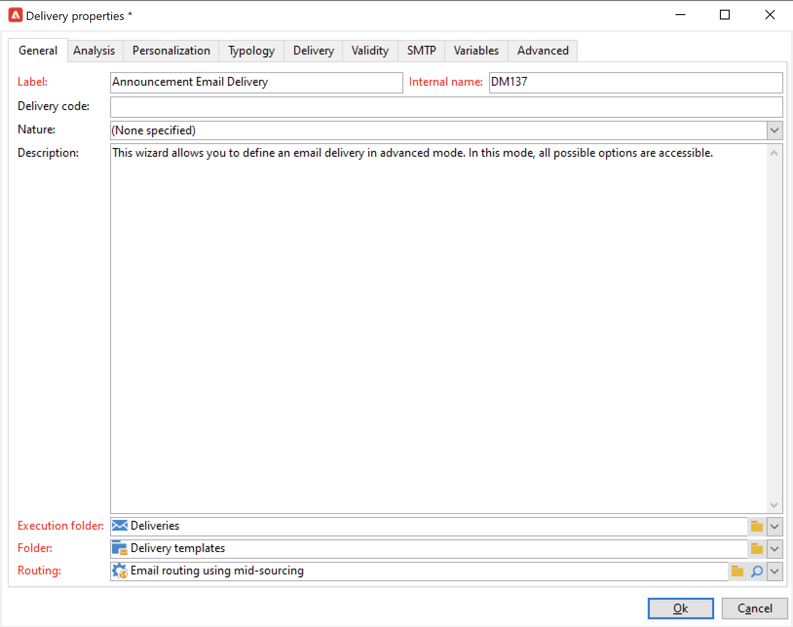

# 게재 템플릿 작업 {#work-with-delivery-template}

## 게재 템플릿 시작

각 게재는 템플릿을 기반으로 만들어집니다. 템플릿은 구현을 용이하게 하고 표준화하는 데 재사용할 수 있는 구성입니다. 기본 제공 또는 사용자 지정 템플릿을 사용할 수 있습니다.

템플릿에는 다음과 같은 부분 또는 전체 구성 설정이 포함될 수 있습니다.

* [유형화 규칙](../../automation/campaign-opt/campaign-typologies.md)
* 보낸 사람 및 회신 주소
* 기본 [개인화 블록](../send/personalization-blocks.md)
* [미러 페이지](../send/mirror-page.md) 링크 및 구독 취소 링크
* 콘텐츠, 회사 로고 또는 서명
* 리소스 유효성, 재시도 매개 변수 또는 격리 설정 등 다른 게재 속성입니다.

 [비디오에서 이 기능 살펴보기](#delivery-template-video)

게재 템플릿은 Explorer의 **[!UICONTROL Resources > Templates > Delivery templates]** 폴더에 저장됩니다. Adobe Campaign에서는 두 가지 유형의 템플릿으로 작업할 수 있습니다.

1. Adobe Campaign **기본 제공** 게재 템플릿 - 각 채널마다 기본 제공 템플릿을 사용할 수 있습니다. 수정하거나 삭제할 수 없습니다. 여기에는 각 게재 채널에 대한 기본 구성이 포함됩니다. 관리자는 기본값을 설정하거나 추적 매개 변수, 보낸 사람 이메일 주소 수정 등과 같은 특정 기능을 최종 사용자에게 제한할 수 있습니다. 기본 제공 템플릿은 템플릿 목록에 굵게 표시됩니다.

1. **사용자 지정** 게재 템플릿 - Adobe Campaign 관리자는 새 게재 템플릿을 만들 수 있습니다. 가장 좋은 방법은 템플릿을 처음부터 새로 만드는 것이 아니라 기본 제공 템플릿을 복제하고 업데이트하는 것입니다. 예를 들어 이메일 게재 템플릿을 구성할 수 있으며, 사용자가 이 템플릿에서 게재를 만들 때는 텍스트 또는 HTML 콘텐츠만 입력하면 됩니다. 다른 모든 설정은 이미 정의되어 있습니다.

>[!NOTE]
>
>사용 가능한 템플릿은 액세스 권한, 인스턴스 구성 및 컨텍스트에 따라 다릅니다. 예를 들어, 정보 서비스를 생성할 때 확인 메시지에 대한 전달 템플릿을 연결할 수 있습니다. 그런 다음 대상 매핑이 구독 매핑인 템플릿에만 액세스할 수 있습니다. 이 컨텍스트에서는 다른 템플릿이 표시되지 않습니다. 자세한 내용은 [대상 매핑 작업](../audiences/target-mappings.md) 및 [구독 및 구독 취소 관리](../start/subscriptions.md)를 참조하세요.

## 템플릿 만들기 {#create-a-delivery-template}

게재 템플릿을 만들려면 기본 제공 템플릿을 복제하거나 기존 게재를 템플릿으로 변환할 수 있습니다. 처음부터 게재 템플릿을 만들 수도 있지만 권장되지는 않습니다. 이러한 방법은 아래에 자세히 설명되어 있습니다.

### 기존 템플릿 복제{#copy-an-existing-template}

Campaign에는 각 채널용 이메일, 푸시, SMS, DM 등의 기본 제공 템플릿 세트가 포함되어 있습니다.

게재 템플릿을 만드는 가장 쉬운 방법은 기본 제공 템플릿을 복제하고 사용자 지정하는 것입니다.

게재 템플릿을 복제하려면 아래 단계를 수행합니다.

1. Adobe Campaign 탐색기에서 **[!UICONTROL Resources > Templates > Delivery templates]**(으)로 이동합니다.
1. 기본 제공 게재 템플릿을 선택합니다. 기본 제공 템플릿은 목록에서 굵게 표시됩니다.
1. 마우스 오른쪽 단추를 클릭하고 **[!UICONTROL Duplicate]**&#x200B;을(를) 선택합니다.

   

1. 템플릿 설정을 정의하고 새 템플릿을 저장합니다.

   

템플릿이 게재 템플릿 목록에 추가됩니다. 이제 새 게재를 만들면 선택할 수 있습니다.

### 기존 게재를 템플릿으로 전환 {#convert-an-existing-delivery}

게재를 템플릿으로 변환하여 반복된 새로운 게재 작업을 수행할 수 있습니다.

게재를 템플릿으로 전환하려면 아래 단계를 수행합니다.

1. 게재 목록에서 게재를 선택합니다. Campaign 탐색기의 **[!UICONTROL Campaign management]** 노드를 통해 액세스할 수 있습니다.

1. 마우스 오른쪽 단추를 클릭하고 **[!UICONTROL Actions > Save as template...]**&#x200B;을(를) 선택합니다.

   

1. 게재 속성을 편집하고 새 템플릿을 저장해야 하는 폴더(**[!UICONTROL Folder]** 필드)와 이 템플릿을 기반으로 만들어진 게재를 만들어야 하는 폴더(**[!UICONTROL Execution folder]** 필드)를 선택합니다.

   

### 새 템플릿 만들기 {#create-a-new-template}

>[!NOTE]
>
>구성 오류를 방지하려면 [기본 제공 템플릿을 복제하고](#copy-an-existing-template) 새 템플릿을 만드는 대신 해당 속성을 사용자 지정하는 것이 좋습니다.

처음부터 게재 템플릿을 구성하려면 아래 단계를 수행합니다.

1. Campaign 탐색기에서 **리소스** 폴더로 이동한 다음 **템플릿**, **게재 템플릿**&#x200B;을 선택합니다.
1. 도구 모음에서 **새로 만들기**&#x200B;를 클릭하여 새 게재 템플릿을 만듭니다.
1. 폴더의 **레이블** 및 **내부 이름**&#x200B;을 설정합니다.
1. 템플릿을 저장하고 다시 엽니다.
1. **속성** 단추에서 설정을 조정합니다.
1. **일반** 탭에서 **실행 폴더**, **폴더** 및 **라우팅** 드롭다운 메뉴에서 선택한 위치를 확인하거나 변경합니다.
1. 전자 메일 제목과 대상 모집단을 사용하여 **전자 메일 매개 변수** 범주를 완료합니다.
1. **HTML 콘텐츠**&#x200B;를 추가하여 템플릿을 개인화하십시오. [미러 페이지 링크](../send/mirror-page.md) 및 구독 취소 링크를 표시할 수 있습니다.
1. **미리 보기** 탭을 선택합니다. **개인화 테스트** 드롭다운 메뉴에서 **수신자**&#x200B;를 선택하여 선택한 프로필로 템플릿을 미리 봅니다.
1. **저장**&#x200B;을 클릭합니다. 이제 템플릿을 게재에서 사용할 준비가 되었습니다.

## 템플릿 사용 {#use-a-delivery-template}

### 템플릿에서 게재 만들기 {#create-a-delivery-from-a-template}

기존 템플릿을 기반으로 게재를 만들려면 사용 가능한 게재 템플릿 목록에서 템플릿을 선택합니다.

템플릿을 볼 수 없는 경우 필드 오른쪽의 **[!UICONTROL Select link]** 폴더를 클릭하여 Campaign 폴더를 찾습니다.

**[!UICONTROL Folder]** 필드에서 원하는 디렉터리를 선택하거나 **[!UICONTROL Display sub-levels]** 아이콘을 클릭하여 현재 디렉터리의 하위 트리에 있는 디렉터리의 내용을 표시합니다.

사용할 게재 템플릿을 선택하고 **[!UICONTROL Ok]**&#x200B;을(를) 클릭합니다.

### 템플릿 실행 {#execute-a-template}

먼저 게재를 만들지 않고 템플릿 목록에서 직접 템플릿 실행을 시작할 수 있습니다. [이 섹션](https://experienceleague.adobe.com/ko/docs/campaign/automation/workflows/wf-activities/action-activities/delivery)에 설명된 대로 게재 템플릿을 수동으로 실행하거나 아래에 자세히 설명하거나 이벤트에 의해 트리거할 수 있습니다(서버에서 파일을 사용할 수 있을 때 설정된 시간에 실행됨).

템플릿을 수동으로 실행하려면 다음 단계를 수행하십시오.

1. 실행할 템플릿을 선택하고 마우스 오른쪽 버튼을 클릭합니다. **[!UICONTROL Actions>Execute the delivery template...]**&#x200B;을(를) 선택합니다.

   **[!UICONTROL File>Actions>Execute the delivery template...]**&#x200B;을(를) 사용할 수도 있습니다.

   

1. 게재 매개 변수를 입력하고 **[!UICONTROL Send]**&#x200B;을(를) 클릭합니다.

이 작업은 템플릿에 연결된 폴더에서 게재를 생성합니다. 이 게재 이름은 이 게재를 만든 게재 템플릿의 이름입니다.

## 튜토리얼 비디오 {#delivery-template-video}

### 게재 템플릿 구성 방법

다음 비디오에서는 임시 게재용 템플릿을 구성하는 방법을 보여 줍니다.

>[!VIDEO](https://video.tv.adobe.com/v/342082?quality=12)

### 게재 템플릿 속성을 설정하는 방법

다음 비디오는 게재 템플릿 속성을 설정하는 방법을 보여 주며 각 속성에 대해 자세히 설명합니다.

>[!VIDEO](https://video.tv.adobe.com/v/338969?quality=12)

### 임시 게재 템플릿을 배포하는 방법

이 비디오에서는 임시 이메일 게재 템플릿을 배포하는 방법을 설명하고 이메일 게재와 게재 워크플로우의 차이점을 설명합니다.

>[!VIDEO](https://video.tv.adobe.com/v/338965?quality=12)

추가 캠페인 사용 방법 비디오를 [여기](https://experienceleague.adobe.com/docs/campaign-learn/tutorials/getting-started/introduction-to-adobe-campaign.html?lang=ko){target="_blank"}에서 사용할 수 있습니다.
