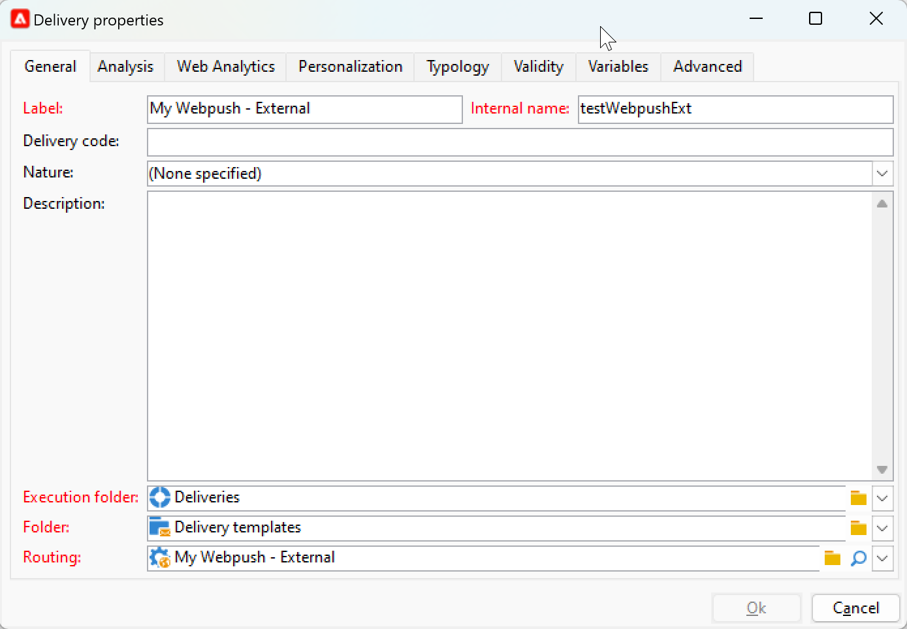

# 사용자 지정 채널 시작 {#gs-custom-channel}

Adobe Campaign을 사용하면 서드파티와 통합된 사용자 지정 외부 또는 API 채널을 만들 수 있습니다. 그런 다음 이러한 채널을 기반으로 게재를 오케스트레이션하고 실행할 수 있습니다.

게재 만들기와 전송은 클라이언트 콘솔과 웹 UI 모두에서 수행할 수 있습니다. 하지만 사용자 지정 채널 구성은 클라이언트 콘솔에서만 수행됩니다.

사용자 지정 채널을 기반으로 게재를 만들고 보내는 방법을 알아보려면 이 [페이지](https://experienceleague.adobe.com/docs/campaign-web/v8/msg/gs-custom-channel.html?lang=ko){target="_blank"}를 참조하세요.

다음은 클라이언트 콘솔에서 새 사용자 지정 채널을 구성하는 단계입니다. 이러한 단계는 사용자 지정 외부 및 API 채널에 공통됩니다.

1. 스키마를 구성하십시오. [자세한 내용](#configure-schema)
1. 새 외부 계정을 만드십시오. [자세한 내용](#create-ext-account)
1. 새 게재 템플릿 만들기, [자세히 보기](#create-template)

사용자 지정 API 채널에는 추가 구성이 필요합니다. [자세히 보기](#api-additional)

## 스키마 구성{#configure-schema}

먼저 사용 가능한 채널 목록에 새 채널을 추가하도록 스키마를 구성해야 합니다.

1. Campaign 탐색기에서 **관리** > **구성** > **데이터 스키마**&#x200B;를 선택합니다.

1. 스키마 확장을 만들어 messageType 열거형을 새 채널로 확장합니다.

   예제:

   ```
   <enumeration basetype="byte" default="mail" label="Channel" name="messageType">
   <value desc="My Webpush" img="ncm:channels.png" label="My Webpush" name="webpush"
          value="122"/>
   </enumeration>
   ```

   {zoomable="yes"}

## 새 외부 계정 만들기{#create-ext-account}

그런 다음 새 라우팅 외부 계정을 만들어야 합니다.

1. Campaign 탐색기에서 **관리** > **플랫폼** > **외부 계정**&#x200B;을 선택합니다.

1. 새 외부 계정을 만듭니다.

1. 채널을 선택하고 게재 모드를 변경합니다. 사용자 지정 외부 채널에는 **외부**&#x200B;를 선택하고 사용자 지정 API 채널에는 **대량**&#x200B;을(를) 선택하십시오.

   {zoomable="yes"}

## 새 게재 템플릿 만들기{#create-template}

이제 새 채널과 연결된 새 템플릿을 만들어 보겠습니다.

1. Campaign 탐색기에서 **리소스** > **템플릿** > **게재 템플릿**&#x200B;을 선택합니다.

1. 새 템플릿을 만듭니다.

1. **속성**&#x200B;을 클릭하고 올바른 폴더와 라우팅을 선택하십시오.

   {zoomable="yes"}

이제 새 채널을 사용할 수 있습니다. 이 채널을 기반으로 하여 게재를 만들고 실행할 수 있습니다.

## 사용자 정의 API 추가 구성{#api-additional}

사용자 정의 API 채널을 구성하는 주요 추가 단계는 다음과 같습니다.

### 스키마 확장{#api-additional-schema}

클라이언트 콘솔에서 사용자 지정 채널에 필요한 모든 추가 속성을 사용하여 **게재** 스키마를 확장합니다.

스키마 확장에 대한 자세한 내용은 이 [페이지](../dev/extend-schema.md)를 참조하세요.

### 사용자 정의 화면 정의 설정{#api-additional-screen}

Campaign 웹 UI에서 사용자 정의 화면 정의를 설정합니다.

1. **게재** 스키마를 열고 **화면 편집**&#x200B;을 클릭합니다.

   {zoomable="yes"}

1. 채널에 해당하는 탭을 선택하고 게재의 콘텐츠 화면에 필드가 표시되는 방법을 정의합니다. 화면 편집에 대한 자세한 내용은 이 [페이지](https://experienceleague.adobe.com/docs/campaign-web/v8/conf/schemas.html?lang=ko#fields){target="_blank"}를 참조하세요.

   {zoomable="yes"}

1. **콘텐츠 시뮬레이션 미리 보기** 섹션에서 전용 JSPP를 선택합니다. 선택 사항입니다. 이렇게 하면 게재 시뮬레이션 화면에서 미리보기가 활성화됩니다. [자세히 보기](#api-additional-preview)

### 미리보기 구성{#api-additional-preview}

이 구성은 선택 사항입니다. 웹 UI에서 미리 보기를 활성화하려면 게재 시뮬레이션 화면에서 클라이언트 콘솔에서 전용 JSSP를 구성해야 합니다.

웹 UI의 게재 시뮬레이션 화면에서 **미리 보기 열기**&#x200B;를 클릭하면 URL에 다음 매개 변수가 전달됩니다.

`https://adobe.campaign.adobe.com/cus/webPushMessagePreview.jssp?deliveryId=%40ToPzTurO9aGzQxYcMArBbA%3D%3D&id=%40oF8Fi17txuLmtiOFj4OIjQ%3D%3D`

* `deliveryId`: 게재 식별자
* `id`: 프로필 식별자

클라이언트 콘솔에서 **관리** > **구성** > **동적 JavaScript 페이지**&#x200B;를 선택하고 새 JSSP를 만듭니다. 다음은 검색해야 하는 매개 변수와 관련된 예입니다.

```
<%@ page import="xtk:shared/nl.js"
%><%
  NL.require("/nl/core/shared/core.js")
    .require('/nl/core/jsspcontext.js')
    .require('/nl/core/shared/dataTypes.js')
    .require('/nl/core/schema.js');
    
  //response.setContentType("text/plain");
  var parameters = request.parameters;
  var deliveryId = decryptString(parameters.deliveryId);
  var oldUserContext = logonEscalation("neolane")
  
   var delivery = xtk.queryDef.create(<queryDef schema="nms:delivery" operation="getIfExists">
                                         <select>
                                           <node expr="[WebpushParameters/@richMediaOptions]" alias="@richMediaOptions"/>
                                           <node expr="[WebpushParameters/@mediaUrlInfo]" alias="@mediaUrlInfo"/>
                                           <node expr="[WebpushParameters/@WebpushMessageType]"/>
                                         </select>
                                         <where>
                                           <condition expr={"@id = " + NL.XTK.toXTKString(deliveryId)}/>
                                         </where>
                                       </queryDef>).ExecuteQuery();

  // Restore previous context
  logonWithContext(oldUserContext)
%>

<!DOCTYPE html ...
```

### 기술 구현{#api-additional-technical}

사용자 지정 채널에 따라 외부 계정, 타겟 매핑, API용 Javascript 코드 등과 같은 다른 애플리케이션 부분을 구성해야 합니다.

