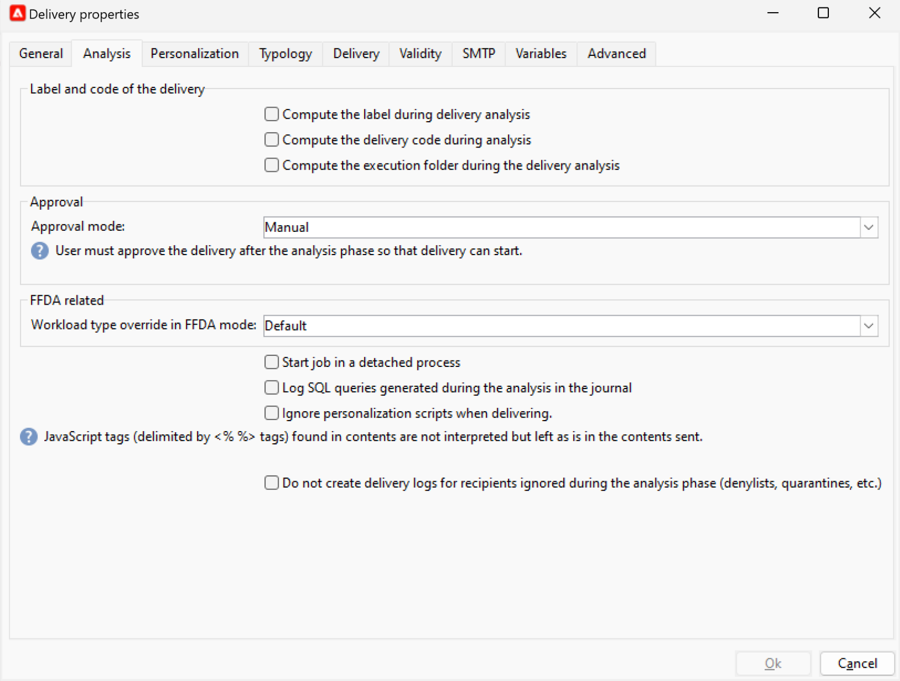

# 게재 분석 {#analyze-delivery}

분석은 게재 준비 단계입니다. 타겟 대상자를 정의하고 메시지 콘텐츠를 준비하고 테스트하면 시작할 수 있습니다. 게재 분석 중에 대상 모집단을 계산하고 게재 콘텐츠를 준비합니다. 완료되면 게재를 보낼 수 있습니다.

## 분석 시작 {#start-the-analysis}

게재를 준비하려면 게재 콘텐츠 및 타겟이 정의되었는지 확인하고 아래 단계를 수행합니다.

1. 게재 창에서 **[!UICONTROL Send]** 단추를 클릭합니다.
1. 대상 계산 및 즉시 전송을 위한 콘텐츠 준비를 수행하려면 **[!UICONTROL Deliver as soon as possible]**&#x200B;을(를) 선택하십시오. 게재를 나중 날짜로 연기하거나 콘텐츠를 준비하지 않고 예상 모집단을 얻을 수도 있습니다.

   

1. 분석을 수동으로 시작하려면 **[!UICONTROL Analyze]**&#x200B;을(를) 클릭하십시오. 진행률 표시줄에는 분석 진행률이 표시됩니다.

   게재 분석 시 설정된 확인 규칙이 적용됩니다. 이러한 규칙은 게재 속성의 **[!UICONTROL Typology]** 탭에서 선택한 **유형화**&#x200B;에 정의되어 있습니다. [이 섹션](../../automation/campaign-opt/campaign-typologies.md)에서 유형화에 대해 자세히 알아보세요.

   기본적으로 이메일의 경우, 분석은 다음 사항을 다룹니다.

   * 객체 승인
   * URL 및 이미지 승인
   * URL 레이블 승인
   * 구독 취소 링크 승인
   * 증명 크기 확인
   * 유효 기간 확인
   * 예약된 예약된 예약된 일괄 처리 확인

1. 언제든지 **[!UICONTROL Stop]** 단추를 클릭하여 분석을 중지할 수 있습니다.

   준비 단계 동안 메시지가 전송되지 않습니다. 따라서 위험 없이 분석을 시작하거나 취소할 수 있습니다.

   >[!IMPORTANT]
   >
   >실행 시 분석이 게재(또는 증명)를 중지합니다. 게재(또는 증명)에 대한 모든 변경 후에는 적용되기 전에 다른 분석이 뒤따라야 합니다.

   분석이 완료되면 창의 위쪽 섹션에 게재 준비가 완료되었는지 또는 오류가 발생했는지 여부가 표시됩니다. 모든 유효성 검사 단계, 경고 및 오류가 나열됩니다. 색상이 지정된 아이콘은 메시지 유형을 나타냅니다.

   * 파란색 아이콘은 정보 메시지를 나타냅니다.
   * 노란색 아이콘은 중요하지 않은 처리 오류를 나타냅니다.
   * 빨간색 아이콘은 게재를 보낼 수 없는 심각한 오류를 나타냅니다.

   {width="800" align="left"}

1. 오류가 있는 경우 오류를 수정하려면 **[!UICONTROL Close]**&#x200B;을(를) 클릭하십시오. 변경한 후 **[!UICONTROL Analyze]**&#x200B;을(를) 클릭하여 분석을 다시 시작합니다.

   >[!NOTE]
   >
   >보낼 메시지 수가 예상과 일치하지 않으면 **[!UICONTROL Change the main delivery target]** 링크를 클릭하십시오. 이 옵션을 사용하면 대상 모집단의 정의를 변경하고 분석을 다시 시작할 수 있습니다.
   >

1. 분석 결과를 확인한 후 **[!UICONTROL Confirm delivery]**&#x200B;을(를) 클릭하여 메시지를 기본 대상으로 보냅니다.

## 분석 설정 {#analysis-settings}

게재 속성의 **[!UICONTROL Analysis]** 탭으로 이동하여 분석 단계 동안 메시지 준비에 대한 설정을 정의합니다.

{width="800" align="left"}

이 탭에서는 다음 옵션에 액세스할 수 있습니다.

* **[!UICONTROL Label and code of the delivery]**: 이 섹션의 옵션은 게재 분석 단계에서 이러한 필드의 값을 계산하는 데 사용됩니다. **[!UICONTROL Compute the execution folder during the delivery analysis]** 필드는 분석 단계 동안 이 게재 작업을 포함할 폴더의 이름을 계산합니다.

* **[!UICONTROL Approval mode]**: 분석이 완료되면 수동 또는 자동 배달을 정의할 수 있습니다.

  분석 중에 경고가 생성되는 경우(예: 특정 문자가 게재 주제에 강조 표시되는 경우 등) 게재를 구성하여 계속 실행할지 여부를 정의할 수 있습니다. 사용자는 기본적으로 분석 단계가 끝나면 메시지 전송을 확인해야 합니다. 이를 **수동** 유효성 검사라고 합니다.

  해당 필드의 드롭다운 목록에서 다른 승인 모드를 선택합니다.

  다음 승인 모드를 사용할 수 있습니다.

   * **[!UICONTROL Manual]**: 분석 단계가 끝날 때 사용자는 전송을 확인해야 전송을 시작할 수 있습니다. 이렇게 하려면 **[!UICONTROL Start]** 단추를 클릭하여 게재를 시작합니다.
   * **[!UICONTROL Semi-automatic]**: 분석 단계에서 경고 메시지가 생성되지 않으면 전송이 자동으로 시작됩니다.
   * **[!UICONTROL Automatic]**: 결과에 관계없이 분석 단계가 끝날 때 전송이 자동으로 시작됩니다.

* **[!UICONTROL Start job in a detached process]**: 이 옵션을 사용하면 배달 분석을 별도의 프로세스에서 시작할 수 있습니다. 분석 함수는 기본적으로 Adobe Campaign 애플리케이션 서버 프로세스(web nlserver)를 사용합니다. 이 옵션을 선택하면 애플리케이션 서버에 장애가 발생하더라도 분석이 완료됩니다.
* **[!UICONTROL Log SQL queries generated during the analysis in the journal]**: 이 옵션은 분석 단계 동안 SQL 쿼리 로그를 게재 저널에 추가합니다.
* **[!UICONTROL Ignore personalization scripts during sending]**: 이 옵션을 사용하면 HTML 콘텐츠에 있는 JavaScript 지시문을 해석하지 않아도 됩니다. 전달된 콘텐츠에 있는 그대로 표시됩니다. 이러한 지시문은 `<%=` 태그와 함께 도입됩니다.
