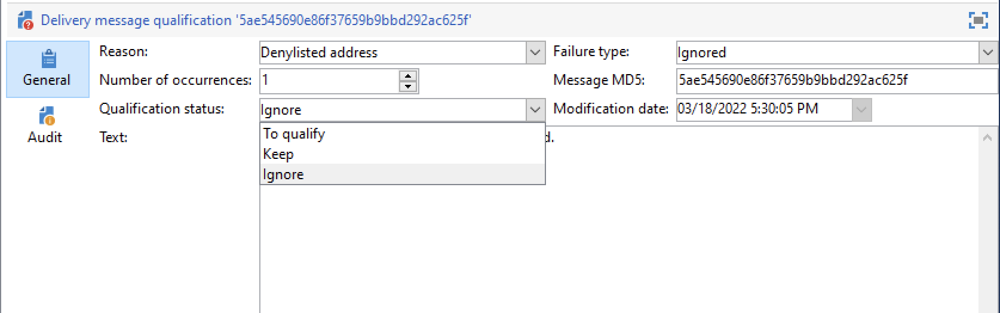

# 게재 실패 이해 {#delivery-failures}

바운스 수는 ISP가 백 실패 알림을 제공하는 게재 시도 및 실패의 결과입니다. 바운스 처리 프로세싱은 목록 안전 상태의 중요한 부분입니다. 지정된 이메일이 여러 번 연속적으로 반송된 후 이 프로세스는 해당 이메일에 대해 비표시 플래그를 지정합니다.

이 프로세스를 수행하면 시스템이 잘못된 이메일 주소를 계속 보내지 못합니다. 바운스 수는 ISP가 IP 평판을 확인하는 데 사용하는 주요 데이터 중 하나입니다. 이 지표를 주시하는 것이 중요합니다. &quot;전달됨&quot;과 &quot;바운스됨&quot;은 마케팅 메시지 전달을 측정하는 가장 일반적인 방법입니다. 전달률이 높을수록 좋습니다.

메시지를 프로필로 보낼 수 없는 경우 원격 서버는 자동으로 Adobe Campaign에 오류 메시지를 보냅니다. 이 오류는 이메일 주소, 전화 번호 또는 장치를 격리해야 하는지 여부를 결정할 수 있습니다. [바운스 메일 관리](#bounce-mail-qualification)를 참조하세요.

메시지가 전송되면 게재 로그에서 각 프로필에 대한 게재 상태 및 관련 실패 유형과 이유를 확인할 수 있습니다.

차단 목록에 추가하다 이메일 주소가 격리되거나 프로필이 게재 중인 경우, 수신자는 게재 준비 단계에서 제외됩니다. 제외된 메시지는 게재 대시보드에 나열됩니다.

## 메시지 게재가 실패한 이유 {#delivery-failure-reasons}

메시지가 실패하는 경우 두 가지 유형의 오류가 있습니다. 각 게재 실패 유형에 따라 주소가 [격리](quarantines.md#quarantine-reason)(으)로 전송되는지 여부가 결정됩니다.

* **하드 바운스**
하드 바운스는 ISP가 전달할 수 없는 구독자 주소에 대한 메일링 시도를 결정한 후 생성된 영구적인 실패입니다. Adobe Campaign 내에서 하드 바운스는 전달할 수 없는 것으로 분류되어 격리 목록에 추가되므로 다시 시도하지 않습니다. 실패 원인을 알 수 없는 경우 하드 바운스가 무시되는 경우가 있습니다.

  하드 바운스의 일반적인 예는 다음과 같습니다. 주소가 존재하지 않음, 계정이 비활성화됨, 잘못된 구문, 잘못된 도메인

* **소프트 바운스**
소프트 바운스는 ISP가 메일을 전달하기 어려울 때 생성하는 일시적인 실패입니다. 소프트 실패는 성공적인 전달을 시도하기 위해 [다시 시도](#retries)합니다(사용자 지정 또는 기본 전달 설정의 사용에 따라 달라짐). 소프트 바운스가 지속적인 주소는 최대 다시 시도 횟수가 시도될 때까지(설정에 따라 다시 달라짐) 격리에 추가되지 않습니다.

  소프트 바운스의 몇 가지 일반적인 원인은 다음과 같습니다. 사서함 가득 참, 이메일 서버 작동 중지 수신, 보낸 사람 신뢰도 문제

**무시됨** 유형의 오류는 &quot;부재 중&quot;과 같은 일시적인 오류이거나 예를 들어 발신자 유형이 &quot;postmaster&quot;인 경우와 같은 기술적인 오류로 알려져 있습니다.

피드백 루프는 바운스 이메일과 같이 작동합니다. 사용자가 이메일을 스팸 처리하면 Adobe Campaign에서 이메일 규칙을 구성하여 이 사용자에게 전달되는 모든 것을 차단할 수 있습니다. 이러한 사용자의 주소는 구독 취소 링크를 클릭하지 않았더라도 차단 목록에 추가된으로 제공됩니다. 주소는 **[!UICONTROL Denylisted]** 상태의 (**NmsRecipient**) 받는 사람 테이블이 아니라 (**NmsAddress**) 격리 테이블에 추가됩니다. [Adobe 전달성 모범 사례 안내서](https://experienceleague.adobe.com/docs/deliverability-learn/deliverability-best-practice-guide/transition-process/infrastructure.html?lang=ko#feedback-loops){target="_blank"}에서 피드백 루프 메커니즘에 대해 자세히 알아보세요.

## 동기 및 비동기 오류 {#synchronous-and-asynchronous-errors}

메시지 게재가 즉시 실패할 수 있으며, 이 경우 동기 오류로 간주됩니다. 메시지를 보낸 후 나중에 메시지를 보내지 못하는 경우 오류는 비동기적으로 발생합니다.

이러한 유형의 오류는 다음과 같이 관리됩니다.

* **동기 오류**: Adobe Campaign 게재 서버가 접속한 원격 서버에서 즉시 오류 메시지를 반환합니다. 프로필 서버로 게재를 보낼 수 없습니다. MTA(메일 전송 에이전트)는 반송 유형을 결정하고 오류를 검증하며, 관련 이메일 주소를 격리해야 하는지 여부를 결정하기 위해 해당 정보를 Campaign으로 다시 보냅니다. [바운스 메일 선별](#bounce-mail-qualification)을 참조하십시오.

* **비동기 오류**: 반송 메일 또는 SR이 나중에 수신 서버에 의해 다시 전송됩니다. 이 오류는 오류와 관련된 레이블로 확인됩니다. 게재를 보낸 후 1주일까지 비동기 오류가 발생할 수 있습니다.

>[!NOTE]
>
>Managed Cloud Services 사용자는 Adobe에서 바운스 사서함 구성을 수행합니다.

## 반송 메일 조건 {#bounce-mail-qualification}

<!--NO LONGER WITH MOMENTUM - Rules used by Campaign to qualify delivery failures are listed in the **[!UICONTROL Administration > Campaign Management > Non deliverables Management > Delivery log qualification]** node. It is non-exhaustive, and is regularly updated by Adobe Campaign and can also be managed by the user.

-->

Adobe Campaign에서 바운스 메일 자격이 처리되는 방식은 오류 유형에 따라 다릅니다.

* **동기 오류**: MTA가 바운스 유형 및 자격을 결정하고 해당 정보를 Campaign으로 다시 보냅니다. **[!UICONTROL Delivery log qualification]** 테이블의 반송 조건은 **동기** 게재 실패 오류 메시지에 사용되지 않습니다.

* **비동기 오류**: Campaign에서 비동기 게재 실패를 확인하기 위해 사용하는 규칙이 **[!UICONTROL Administration > Campaign Management > Non deliverables Management > Delivery log qualification]** 노드에 나열됩니다. 비동기 바운스는 **[!UICONTROL Inbound email]** 규칙을 통해 inMail 프로세스에 의해 검증됩니다. 자세한 내용은 [Adobe Campaign Classic v7 설명서](https://experienceleague.adobe.com/docs/campaign-classic/using/sending-messages/monitoring-deliveries/understanding-delivery-failures.html?lang=ko#bounce-mail-qualification){target="_blank"}를 참조하세요.

<!--NO LONGER WITH MOMENTUM - The message returned by the remote server on the first occurrence of this error type is displayed in the **[!UICONTROL First text]** column of the **[!UICONTROL Audit]** tab.


Adobe Campaign filters this message to delete the variable content (such as IDs, dates, email addresses, phone numbers, etc.) and displays the filtered result in the **[!UICONTROL Text]** column. The variables are replaced with **`#xxx#`**, except addresses that are replaced with **`*`**.

This process allows to bring together all failures of the same type and avoid multiple entries for similar errors in the Delivery log qualification table.
  
>[!NOTE]
>
>The **[!UICONTROL Number of occurrences]** field displays the number of occurrences of the message in the list. It is limited to 100 000 occurrences. You can edit the field, if you want, for example, to reset it.

Bounce mails can have the following qualification status:

* **[!UICONTROL To qualify]**: the bounce mail could not be qualified. Qualification must be assigned to the Deliverability team to guarantee efficient platform deliverability. As long as it is not qualified, the bounce mail is not used to enrich the list of email management rules.
* **[!UICONTROL Keep]**: the bounce mail was qualified and will be used by the **Refresh for deliverability** workflow to be compared to existing email management rules and enrich the list.
* **[!UICONTROL Ignore]**: the bounce mail is ignored, meaning that this bounce will never cause the recipient's address to be quarantined. It will not be used by the **Refresh for deliverability** workflow and it will not be sent to client instances.



>[!NOTE]
>
>In case of an outage of an ISP, emails sent through Campaign will be wrongly marked as bounces. To correct this, you need to update bounce qualification.-->


## 관리 다시 시도 {#retries}

일시적인 오류(**소프트** 또는 **무시됨**) 후 메시지 배달이 실패하면 Campaign에서 전송을 다시 시도합니다. 이러한 재시도는 게재 기간이 끝날 때까지 수행할 수 있습니다.

소프트 바운스 재시도 및 재시도 간 시간은 메시지 이메일 도메인에서 돌아오는 바운스 응답의 유형 및 심각도에 따라 MTA에 의해 결정됩니다.

>[!NOTE]
>
>게재 속성의 다시 시도 설정은 Campaign에서 사용되지 않습니다.

## 유효 기간 {#valid-period}

Campaign 게재의 유효 기간 설정이 **3.5일 이하**(으)로 제한됩니다. 게재의 경우 Campaign에서 3.5일보다 큰 값을 정의하면 고려되지 않습니다.

예를 들어 Campaign에서 유효 기간을 기본값 5일로 설정하면 소프트 바운싱 메시지는 MTA 다시 시도 대기열로 이동하며 해당 메시지가 MTA에 도달한 시점부터 최대 3.5일 동안만 다시 시도됩니다. 이 경우 Campaign에 설정된 값은 사용되지 않습니다.

메시지가 3.5일 동안 MTA 큐에 있고 배달하지 못하면 시간이 초과되고 게재 로그에서 **[!UICONTROL Sent]**&#x200B;에서 **[!UICONTROL Failed]**(으)로 상태가 업데이트됩니다.

<!--For more on the validity period, see the [Adobe Campaign Classic v7 documentation](https://experienceleague.adobe.com/docs/campaign-classic/using/sending-messages/key-steps-when-creating-a-delivery/steps-sending-the-delivery.html?lang=ko#defining-validity-period){target="_blank"}.-->


## 이메일 오류 유형 {#email-error-types}

이메일 채널에 대해 게재 실패의 가능한 이유는 아래에 나와 있습니다.

<table> 
 <tbody> 
  <tr> 
   <td> 오류 레이블 </td> 
   <td> 오류 유형 </td> 
   <td> 기술적 가치 </td> 
   <td> 설명 </td> 
  </tr> 
  <tr> 
   <td> 계정 비활성화 </td> 
   <td> 소프트/하드 </td> 
   <td> 4 </td> 
   <td> 주소에 연결된 계정이 더 이상 활성화되지 않습니다. IAP(인터넷 접속 제공자)가 장기간 동안 비활성화 상태를 감지하면 사용자의 계정을 닫을 수 있습니다. 그러면 사용자의 주소로 배달이 불가능합니다. 6개월 동안 활동이 없어 계정이 일시적으로 비활성화되고 아직 활성화될 수 있는 경우 오류 포함 상태가 할당되고 오류 카운터가 5에 도달할 때까지 계정이 다시 시도됩니다. 이 오류가 계정이 영구적으로 비활성화되었음을 나타내는 경우 해당 계정은 바로 Quarantine으로 설정됩니다.<br /> </td> 
  </tr> 
  <tr> 
   <td> 격리에 보관된 주소 </td> 
   <td> 하드 </td> 
   <td> 9 </td> 
   <td> 주소가 격리되었습니다.<br /> </td> 
  </tr> 
  <tr> 
   <td> 주소가 지정되지 않음 </td> 
   <td> 하드 </td> 
   <td> 7 </td> 
   <td> 받는 사람에 대한 주소가 없습니다.<br /> </td> 
  </tr> 
  <tr> 
   <td> 잘못된 품질 주소 </td> 
   <td> 무시됨 </td> 
   <td> 14 </td> 
   <td> 이 주소의 품질 등급이 너무 낮습니다.<br /> </td> 
  </tr> 
  <tr> 
   <td> 차단 목록에 추가된 주소 </td> 
   <td> 하드 </td> 
   <td> 8 </td> 
   <td> 발송 시 주소가 차단 목록에 추가하다에 추가되었습니다. 이 상태는 외부 목록과 외부 시스템에서 Adobe Campaign 격리 목록으로 데이터를 가져오는 데 사용됩니다.<br /> </td> 
  </tr> 
  <tr> 
   <td> 컨트롤 주소 </td> 
   <td> 무시됨 </td> 
   <td> 127 </td> 
   <td> 받는 사람의 주소가 컨트롤 그룹의 일부입니다.<br /> </td> 
  </tr> 
  <tr> 
   <td> 더블 </td> 
   <td> 무시됨 </td> 
   <td> 10 </td> 
   <td> 받는 사람의 주소가 이미 이 게재에 있습니다.<br /> </td> 
  </tr> 
  <tr> 
   <td> 무시된 오류 </td> 
   <td> 무시됨 </td> 
   <td> 25 </td> 
   <td> 주소는 허용 목록에 추가하다에 있습니다. 따라서 오류가 무시되고 전자 메일이 전송됩니다.<br /> </td> 
  </tr> 
  <tr> 
   <td> 중재 후 제외됨 </td> 
   <td> 무시됨 </td> 
   <td> 12 </td> 
   <td> 수신자가 '중재' 유형 캠페인 유형화 규칙에 의해 제외되었습니다.<br /> </td> 
  </tr> 
  <tr> 
   <td> SQL 규칙에 의해 제외됨 </td> 
   <td> 무시됨 </td> 
   <td> 11 </td> 
   <td> 받는 사람이 'SQL' 유형 캠페인 유형화 규칙에 의해 제외되었습니다.<br /> </td> 
  </tr> 
  <tr> 
   <td> 잘못된 도메인 </td> 
   <td> 소프트 </td> 
   <td> 2 </td> 
   <td> 이메일 주소의 도메인이 잘못되었거나 더 이상 존재하지 않습니다. 이 프로필은 오류 수가 5개에 도달할 때까지 다시 타겟팅됩니다. 이후 레코드가 격리 상태로 설정되며 다시 시도되지 않습니다.<br /> </td> 
  </tr> 
  <tr> 
   <td> 사서함 가득 참 </td> 
   <td> 소프트 </td> 
   <td> 5 </td> 
   <td> 이 사용자의 사서함이 가득 차서 더 이상의 메시지를 받을 수 없습니다. 이 프로필은 오류 수가 5개에 도달할 때까지 다시 타겟팅됩니다. 이후 레코드가 격리 상태로 설정되며 다시 시도되지 않습니다.<br /> 이 유형의 오류는 정리 프로세스에서 관리되며, 주소는 30일 후 유효한 상태로 설정됩니다.<br /> 경고: 격리된 주소 목록에서 주소를 자동으로 제거하려면, 데이터베이스 정리 기술 워크플로우를 시작해야 합니다.<br /> </td> 
  </tr> 
  <tr> 
   <td> 연결되지 않음 </td> 
   <td> 무시됨 </td> 
   <td> 6 </td> 
   <td> 메시지를 보낼 때 받는 사람의 휴대폰이 꺼져 있거나 네트워크에 연결되어 있지 않습니다.<br /> </td> 
  </tr> 
  <tr> 
   <td> 정의되지 않음 </td> 
   <td> 정의되지 않음 </td> 
   <td> 0 </td> 
   <td> 오류가 아직 증가하지 않았기 때문에 주소가 유효합니다. 이 유형의 오류는 서버에서 새 오류 메시지를 보낼 때 발생합니다. 이는 격리된 오류일 수 있지만 다시 발생하면 오류 카운터가 증가하여 기술 팀에 알립니다. 그런 다음 트리 구조의 <span class="uicontrol">관리</span> / <span class="uicontrol">캠페인 관리</span> / <span class="uicontrol">비게재 항목 관리</span> 노드를 통해 메시지 분석을 수행하고 이 오류를 검증할 수 있습니다.<br /> </td> 
  </tr> 
  <tr> 
   <td> 오퍼에 적합하지 않음 </td> 
   <td> 무시됨 </td> 
   <td> 16 </td> 
   <td> 받는 사람이 게재에서 오퍼에 적합하지 않습니다.<br /> </td> 
  </tr> 
  <tr> 
   <td> 거부됨 </td> 
   <td> 소프트/하드 </td> 
   <td> 20 </td> 
   <td> 스팸 보고서로 보안 피드백이 발생하여 주소가 격리되었습니다. 오류에 따라 오류 카운터가 5에 도달할 때까지 주소를 다시 시도하거나 격리로 직접 전송됩니다.<br /> </td> 
  </tr> 
  <tr> 
   <td> 크기가 제한된 대상 </td> 
   <td> 무시됨 </td> 
   <td> 17 </td> 
   <td> 받는 사람의 최대 게재 크기에 도달했습니다.<br /> </td> 
  </tr> 
  <tr> 
   <td> 부적격 주소 </td> 
   <td> 무시됨 </td> 
   <td> 15 </td> 
   <td> 우편 주소가 정규화되지 않았습니다.<br /> </td> 
  </tr> 
  <tr> 
   <td> 연결할 수 없음 </td> 
   <td> 소프트/하드 </td> 
   <td> 3 </td> 
   <td> 메시지 게재 체인에서 오류가 발생했습니다. SMTP 릴레이, 일시적으로 연결할 수 없는 도메인 등에 문제가 있을 수 있습니다. 오류에 따라 오류 카운터가 5에 도달할 때까지 주소를 다시 시도하거나 격리로 직접 전송됩니다.<br /> </td> 
  </tr> 
  <tr> 
   <td> 사용자 알 수 없음 </td> 
   <td> 하드 </td> 
   <td> 1 </td> 
   <td> 주소가 존재하지 않습니다. 이 프로필에 대해 더 이상 게재를 시도하지 않습니다.<br /> </td> 
  </tr> 
 </tbody> 
</table>


## 푸시 알림 오류 유형 {#push-error-types}

모바일 앱 채널의 경우 게재 실패의 가능한 이유가 아래에 나와 있습니다.

### iOS 격리 {#ios-quarantine}

HTTP/V2 프로토콜을 통해 각 푸시 게재에 대한 직접 피드백 및 상태를 사용할 수 있습니다. HTTP/V2 프로토콜 커넥터를 사용하는 경우 **[!UICONTROL mobileAppOptOutMgt]** 워크플로우에서 더 이상 피드백 서비스를 호출하지 않습니다. 모바일 애플리케이션을 제거하거나 다시 설치하면 토큰이 등록 취소된 것으로 간주됩니다.

동기적으로 APNs가 메시지에 대해 &quot;등록되지 않음&quot; 상태를 반환하면 대상 토큰이 즉시 격리됩니다.

<table> 
 <tbody> 
  <tr> 
   <td> <strong>시나리오</strong><br /> </td> 
   <td> <strong>상태</strong><br /> </td> 
   <td> <strong>오류 메시지</strong><br /> </td> 
   <td> <strong>실패 유형</strong><br /> </td> 
   <td> <strong>실패 이유</strong><br /> </td> 
   <td> <strong>다시 시도</strong><br /> </td> 
  </tr> 
  <tr> 
   <td> <br /> 전원이 켜진 대상 장치 </td> 
   <td> 확인<br /> </td> 
   <td> </td> 
   <td> </td> 
   <td> </td> 
   <td> </td> 
  </tr> 
  <tr> 
   <td> 대상 장치 전원이 꺼짐<br /> </td> 
   <td> 확인<br /> </td> 
   <td> </td> 
   <td> </td> 
   <td> </td> 
   <td> </td> 
  </tr> 
  <tr> 
   <td> 사용자가 <br /> 응용 프로그램에 대한 알림을 사용하지 않도록 설정합니다. </td> 
   <td> 확인<br /> </td> 
   <td> </td> 
   <td> </td> 
   <td> </td> 
   <td> </td> 
  </tr> 
  <tr> 
   <td> 메시지 만들기/분석 단계 - 페이로드가 너무 큼<br /> </td> 
   <td> 실패<br /> </td> 
   <td> 페이로드가 너무 깁니다<br /> </td> 
   <td> 소프트<br /> </td> 
   <td> 거부됨<br /> </td> 
   <td> <br /> 없음 </td> 
  </tr> 
  <tr> 
   <td> 메시지 만들기/분석 단계 - 예기치 않은 콘텐츠 형식 문제<br /> </td> 
   <td> 실패<br /> </td> 
   <td> 오류 <br />에 따른 다양한 오류 메시지 </td> 
   <td> 소프트<br /> </td> 
   <td> 정의되지 않음<br /> </td> 
   <td> <br /> 없음 </td> 
  </tr> 
  <tr> 
   <td> 인증서 문제(암호, 손상 등) 및 APNs 문제 연결 테스트<br /> </td> 
   <td> 실패<br /> </td> 
   <td> 오류 <br />에 따른 다양한 오류 메시지 </td> 
   <td> 소프트<br /> </td> 
   <td> 거부됨<br /> </td> 
   <td> <br /> 없음 </td> 
  </tr> 
  <tr> 
   <td> 보내는 동안 네트워크 연결이 끊어졌습니다.<br /> </td> 
   <td> 실패<br /> </td> 
   <td> 연결 오류<br /> </td> 
   <td> 정의되지 않음<br /> </td> 
   <td> 연결할 수 없음<br /> </td> 
   <td> 예<br /> </td> 
  </tr> 
  <tr> 
   <td> APNs 메시지 거부: 등록 취소<br /> 사용자가 애플리케이션을 제거했거나 토큰이 만료되었습니다<br /> </td> 
   <td> 실패<br /> </td> 
   <td> 등록되지 않음<br /> </td> 
   <td> 하드<br /> </td> 
   <td> 알 수 없는 사용자<br /> </td> 
   <td> <br /> 없음 </td> 
  </tr> 
  <tr> 
   <td> APNs 메시지 거부: 다른 모든 오류<br /> </td> 
   <td> 실패<br /> </td> 
   <td> 오류 거부 원인이 오류 메시지<br />에 있습니다. </td> 
   <td> 소프트<br /> </td> 
   <td> 거부됨<br /> </td> 
   <td> <br /> 없음 </td> 
  </tr> 
 </tbody> 
</table>

### Android 격리 {#android-quarantine}

**Android V1용**

각 알림에 대해 Adobe Campaign은 FCM 서버로부터 직접 동기 오류를 수신합니다. Adobe Campaign은 즉시 오류를 처리하고 오류의 심각도에 따라 하드 또는 소프트 오류를 생성하며 재시도를 수행할 수 있습니다.

* 페이로드 길이 초과, 연결 문제, 서비스 가용성 문제: 다시 시도, 소프트 오류, 실패 이유는 **[!UICONTROL Refused]**&#x200B;입니다.
* 장치 할당량 초과: 다시 시도 없음, 소프트 오류, 실패 이유는 **[!UICONTROL Refused]**&#x200B;입니다.
* 토큰이 잘못되었거나 등록되지 않았습니다. 예기치 않은 오류, 보낸 사람 계정 문제: 다시 시도 안 함, 하드 오류, 실패 이유는 **[!UICONTROL Refused]**&#x200B;입니다.

**[!UICONTROL mobileAppOptOutMgt]** 워크플로는 6시간마다 실행되어 **AppSubscriptionRcp** 테이블을 업데이트합니다. 등록이 취소되었거나 더 이상 유효하지 않다고 선언된 토큰의 경우 필드 **Disabled**&#x200B;이(가) **True**(으)로 설정되고 해당 장치 토큰에 연결된 구독은 향후 게재에서 자동으로 제외됩니다.

게재 분석 중에 대상에서 제외된 모든 장치가 **excludeLogAppSubRcp** 테이블에 자동으로 추가됩니다.

>[!NOTE]
>
>Baidu 커넥터를 사용하는 고객의 경우 다음과 같은 다양한 유형의 오류가 있습니다.
>
>* 게재 시작 시 연결 문제: 실패 유형 **[!UICONTROL Undefined]**, 실패 이유 **[!UICONTROL Unreachable]**, 다시 시도됩니다.
>* 게재 중 연결이 끊어졌습니다. 소프트 오류, 실패 이유 **[!UICONTROL Refused]**, 다시 시도합니다.
>* 보내는 동안 Baidu에서 동기 오류를 반환했습니다. 하드 오류, 오류 원인 **[!UICONTROL Refused]**, 다시 시도하지 않습니다.
>
>Adobe Campaign은 10분마다 Baidu 서버에 연결하여 보낸 메시지의 상태를 검색하고 broadlogs를 업데이트합니다. 메시지가 보낸 것으로 선언되면 브로드로그의 메시지 상태가 **[!UICONTROL Received]**(으)로 설정됩니다. Baidu에서 오류를 선언하면 상태가 **[!UICONTROL Failed]**(으)로 설정됩니다.

**Android V2용**

Android V2 격리 메커니즘은 Android V1과 동일한 프로세스를 사용하므로 구독 및 제외 업데이트에도 동일하게 적용됩니다. 자세한 내용은 [Android V1](#android-quarantine) 섹션을 참조하세요.

<table> 
 <tbody> 
  <tr> 
   <td> <strong>시나리오</strong><br /> </td> 
   <td> <strong>상태</strong><br /> </td> 
   <td> <strong>오류 메시지</strong><br /> </td> 
   <td> <strong>실패 유형</strong><br /> </td> 
   <td> <strong>실패 이유</strong><br /> </td> 
   <td> <strong>다시 시도</strong><br /> </td> 
  </tr> 
  <tr> 
   <td> 메시지 만들기/분석 단계: 사용자 지정 필드에 잘못된 키워드가 사용되었습니다.<br /> </td> 
   <td> 실패<br /> </td> 
   <td> 다음 키워드를 사용할 수 없습니다. {1}<br /> </td> 
   <td> 소프트<br /> </td> 
   <td> </td> 
   <td> <br /> 없음 </td> 
  </tr> 
  <tr> 
   <td> 메시지 만들기/분석 단계: 페이로드가 너무 큼<br /> </td> 
   <td> 실패<br /> </td> 
   <td> 알림이 너무 큽니다. {1}비트이지만 {2}만 승인됩니다.<br /> </td> 
   <td> 소프트<br /> </td> 
   <td> 거부됨<br /> </td> 
   <td> <br /> 없음 </td> 
  </tr> 
  <tr> 
   <td> 보내는 동안 네트워크 연결이 끊어졌습니다.<br /> </td> 
   <td> 실패<br /> </td> 
   <td> {1}<br /> 주소에 대한 Firebase Cloud Messaging 서비스의 응답이 없습니다. </td> 
   <td> 소프트<br /> </td> 
   <td> 연결할 수 없음<br /> </td> 
   <td> 예<br /> </td> 
  </tr> 
  <tr> 
   <td> FCM 메시지 거부: FCM 서버를 일시적으로 사용할 수 없습니다(예: 시간 초과). <br /> </td> 
   <td> 실패<br /> </td> 
   <td> Firebase Cloud Messaging 서비스를 일시적으로 사용할 수 없습니다<br /> </td> 
   <td> 소프트<br /> </td> 
   <td> 연결할 수 없음<br /> </td> 
   <td> 예<br /> </td> 
  </tr> 
  <tr> 
   <td> FCM 메시지 거부: 보낸 사람 계정 <br />을(를) 인증하는 동안 오류가 발생했습니다. </td> 
   <td> 실패<br /> </td> 
   <td> 개발자 계정을 식별하지 못했습니다. ID 및 암호를 확인하십시오.<br /> </td> 
   <td> 소프트<br /> </td> 
   <td> 거부됨<br /> </td> 
   <td> <br /> 없음 </td> 
  </tr> 
  <tr> 
   <td> FCM 메시지 거부: 장치 할당량이 <br />을(를) 초과했습니다. </td> 
   <td> 실패<br /> </td> 
   <td> </td> 
   <td> 소프트<br /> </td> 
   <td> 거부됨<br /> </td> 
   <td> 예<br /> </td> 
  </tr> 
  <tr> 
   <td> FCM 메시지 거부: 등록이 잘못되었거나 등록되지 않음<br /> </td> 
   <td> 실패<br /> </td> 
   <td> </td> 
   <td> 하드<br /> </td> 
   <td> 알 수 없는 사용자<br /> </td> 
   <td> <br /> 없음 </td> 
  </tr> 
  <tr> 
   <td> FCM 메시지 거부: 다른 모든 오류<br /> </td> 
   <td> 실패<br /> </td> 
   <td> Firebase 클라우드 메시징 서버에서 예기치 않은 오류 코드를 반환했습니다. {1} </td> 
   <td> </td> 
   <td> 거부됨<br /> </td> 
   <td> <br /> 없음 </td> 
  </tr> 
    <tr> 
   <td> FCM 메시지 거부: 잘못된 인수<br /> </td> 
   <td> 실패<br /> </td> 
   <td> 잘못된 인수 </td> 
   <td> 무시됨</td> 
   <td> 정의되지 않음<br /> </td> 
   <td> <br /> 없음 </td> 
  </tr>
    <tr> 
   <td> FCM 메시지 거부: 서드파티 인증 오류<br /> </td> 
   <td> 실패<br /> </td> 
   <td> THIRD_PARTY_AUTH_ERROR </td> 
   <td> 무시됨</td>
   <td> 거부됨<br /> </td> 
   <td> 예<br /> </td> 
  </tr>
    <tr> 
   <td> FCM 메시지 거부: 보낸 사람 ID 불일치<br /> </td> 
   <td> 실패<br /> </td> 
   <td> SENDER_ID_MISMATCH </td> 
   <td> 소프트</td>
   <td> 알 수 없는 사용자<br /> </td> 
   <td> <br /> 없음 </td> 
  </tr>
    <tr> 
   <td> FCM 메시지 거부: 등록 취소됨<br /> </td> 
   <td> 실패<br /> </td>
   <td> 등록되지 않음 </td> 
   <td> 하드</td> 
   <td> 알 수 없는 사용자<br /> </td> 
   <td> <br /> 없음 </td> 
  </tr>
    <tr> 
   <td> FCM 메시지 거부: 내부 <br /> </td> 
   <td> 실패<br /> </td> 
   <td> 내부 </td> 
   <td> 무시됨</td> 
   <td> 거부됨<br /> </td> 
   <td> 예<br /> </td> 
  </tr>
    <tr> 
   <td> FCM 메시지 거부: 사용할 수 없음<br /> </td> 
   <td> 실패<br /> </td> 
   <td> 사용할 수 없음</td> 
   <td> 무시됨</td> 
   <td> 거부됨<br /> </td> 
   <td> 예<br /> </td> 
  </tr>
    <tr> 
   <td> FCM 메시지 거부: 예기치 않은 오류 코드<br /> </td> 
   <td> 실패<br /> </td> 
   <td> 예기치 않은 오류 코드</td> 
   <td> 무시됨</td> 
   <td> 거부됨<br /> </td> 
   <td> <br /> 없음 </td> 
  </tr>
  <tr> 
   <td> 인증: 연결 문제<br /> </td> 
   <td> 실패<br /> </td> 
   <td> 인증 서버에 연결할 수 없음 </td> 
   <td> 무시됨</td>
   <td> 거부됨<br /> </td> 
   <td> 예<br /> </td> 
  </tr>
    <tr> 
   <td> 인증: 요청에 승인되지 않은 클라이언트 또는 범위가 있습니다.<br /> </td> 
   <td> 실패<br /> </td> 
   <td> unauthorized_client </td> 
   <td> 무시됨</td>
   <td> 거부됨<br /> </td> 
   <td> <br /> 없음 </td> 
  </tr>
    <tr> 
   <td> 인증: 클라이언트가 이 메서드를 사용하여 액세스 토큰을 검색할 수 있는 권한이 없거나 요청된 범위에 대해 권한이 없는 클라이언트입니다.<br /> </td> 
   <td> 실패<br /> </td> 
   <td> unauthorized_client </td> 
   <td> 무시됨</td>
   <td> 거부됨<br /> </td> 
   <td> <br /> 없음 </td> 
  </tr>
    <tr> 
   <td> 인증: 액세스 거부됨<br /> </td> 
   <td> 실패<br /> </td>
   <td> access_denied</td> 
   <td> 무시됨</td>
   <td> 거부됨<br /> </td> 
   <td> <br /> 없음 </td> 
  </tr>
    <tr> 
   <td> 인증: 잘못된 전자 메일<br /> </td> 
   <td> 실패<br /> </td> 
   <td> invalid_grant </td> 
   <td> 무시됨</td> 
   <td> 거부됨<br /> </td> 
   <td> <br /> 없음 </td> 
  </tr>
    <tr> 
   <td> 인증: 잘못된 JWT<br /> </td> 
   <td> 실패<br /> </td> 
   <td> invalid_grant </td> 
   <td> 무시됨</td> 
   <td> 거부됨<br /> </td> 
   <td> <br /> 없음 </td> 
  </tr>
    <tr> 
   <td> 인증: 잘못된 JWT 서명<br /> </td> 
   <td> 실패<br /> </td> 
   <td> invalid_grant </td> 
   <td> 무시됨</td> 
   <td> 거부됨<br /> </td> 
   <td> <br /> 없음 </td> 
  </tr>
    <tr> 
   <td> 인증: 잘못된 OAuth 범위 또는 제공된 ID 토큰 대상자입니다<br /> </td> 
   <td> 실패<br /> </td> 
   <td> unauthorized_client</td> 
   <td> 무시됨</td> 
   <td> 거부됨<br /> </td> 
   <td> <br /> 없음 </td> 
  </tr>
    <tr> 
   <td> 인증: OAuth 클라이언트가 비활성화됨<br /> </td> 
   <td> 실패<br /> </td> 
   <td> disabled_client</td> 
   <td> 무시됨</td> 
   <td> 거부됨<br /> </td> 
   <td> <br /> 없음 </td> 
  </tr>
 </tbody> 
</table>

## SMS 격리 {#sms-quarantines}

**표준 커넥터용**

SMS 채널에 대한 특성은 아래에 나와 있습니다.

>[!NOTE]
>
>**[!UICONTROL Delivery log qualification]** 테이블은 **확장된 일반 SMPP** 커넥터에 적용되지 않습니다.

<table> 
 <tbody> 
  <tr> 
   <td> <strong>시나리오</strong><br /> </td> 
   <td> <strong>상태</strong><br /> </td> 
   <td> <strong>오류 메시지</strong><br /> </td> 
   <td> <strong>실패 유형</strong><br /> </td> 
   <td> <strong>실패 이유</strong><br /> </td> 
  </tr> 
  <tr> 
   <td> 공급자 <br />에게 전송됨 </td> 
   <td> 보냄<br /> </td> 
   <td> </td> 
   <td> </td> 
   <td> </td> 
  </tr> 
  <tr> 
   <td> 모바일에서 수신됨<br /> </td> 
   <td> <br /> 받음 </td> 
   <td> </td> 
   <td> </td> 
   <td> </td> 
  </tr> 
  <tr> 
   <td> 공급자가 오류를 반환했습니다.<br /> </td> 
   <td> 실패<br /> </td> 
   <td> 데이터(SR 또는 MO)를 받는 동안 오류가 발생했습니다.<br /> </td> 
   <td> 소프트<br /> </td> 
   <td> 연결할 수 없음<br /> </td> 
  </tr> 
  <tr> 
   <td> 잘못된 MT 승인<br /> </td> 
   <td> 실패<br /> </td> 
   <td> 송신 쿼리 <br />에 대한 승인 프레임을 처리하는 동안 오류 '{1}'이(가) 발생했습니다. </td> 
   <td> 소프트<br /> </td> 
   <td> 연결할 수 없음<br /> </td> 
  </tr> 
  <tr> 
   <td> MT<br />을(를) 보내는 동안 오류가 발생했습니다. </td> 
   <td> 실패<br /> </td> 
   <td> 메시지를 보내는 동안 오류 발생<br /> </td> 
   <td> 소프트<br /> </td> 
   <td> 연결할 수 없음<br /> </td> 
  </tr> 
 </tbody> 
</table>

**확장된 일반 SMPP 커넥터의 경우**

SMPP 프로토콜을 사용하여 SMS 메시지를 전송하는 경우 오류 관리가 다르게 처리됩니다.

SMPP 커넥터는 정규 표현식(정규 표현식)을 사용하여 반환되는 SR(상태 보고서) 메시지에서 데이터를 검색하여 해당 콘텐츠를 필터링합니다. 그런 다음 이 데이터는 **[!UICONTROL Delivery log qualification]** 테이블에 있는 정보와 일치합니다(**[!UICONTROL Administration]** > **[!UICONTROL Campaign Management]** > **[!UICONTROL Non deliverables Management]** 메뉴를 통해 사용 가능).

새로운 유형의 오류가 검증되기 전에 기본적으로 실패 이유는 항상 **거부됨**(으)로 설정됩니다.

>[!NOTE]
>
>실패 유형 및 실패 이유는 이메일과 동일합니다.
>
>게재 로그 자격 표에서 적절한 실패 유형 및 실패 이유를 설정하려면 공급자에게 상태 및 오류 코드 목록을 요청하십시오.

생성된 메시지의 예:

```
SR Generic DELIVRD 000|#MESSAGE#
```

* 모든 오류 메시지는 SMS 오류 코드와 전자 메일 오류 코드를 구별하기 위해 **SR**(으)로 시작합니다.
* 오류 메시지의 두 번째 부분(이 예제의 경우 **일반**)은 SMS 외부 계정의 **[!UICONTROL SMSC implementation name]** 필드에 정의된 것과 같은 SMSC 구현의 이름을 참조합니다.

  동일한 오류 코드는 각 공급자에 대해 다른 의미를 가질 수 있으므로 이 필드를 사용하면 오류 코드를 생성한 공급자를 알 수 있습니다. 그런 다음 관련 공급자의 설명서에서 오류를 찾을 수 있습니다.

* 오류 메시지의 세 번째 부분(이 예에서는 **DELIVRD**)은 SMS 외부 계정에 정의된 상태 추출 정규식을 사용하여 SR에서 검색한 상태 코드에 해당합니다.

  이 정규식은 외부 계정의 **[!UICONTROL SMSC specificities]** 탭에 지정됩니다.
기본적으로 정규 표현식은 **SMPP 3.4 사양**&#x200B;의 **부록 B** 섹션에서 정의한 **stat:** 필드를 추출합니다.

* 오류 메시지의 네 번째 부분(**000**)은 SMS 외부 계정에 정의된 오류 코드 추출 정규식을 사용하여 SR에서 추출된 오류 코드에 해당합니다.

  이 정규식은 외부 계정의 **[!UICONTROL SMSC specificities]** 탭에 지정됩니다.

  기본적으로 정규 표현식은 **SMPP 3.4 사양**&#x200B;의 **부록 B** 섹션에서 정의한 **err:** 필드를 추출합니다.

* 파이프 기호(|) 뒤에 오는 모든 항목은 **[!UICONTROL Delivery log qualification]** 테이블의 **[!UICONTROL First text]** 열에만 표시됩니다. 메시지가 표준화된 후 이 콘텐츠는 항상 **#MESSAGE#**(으)로 바뀝니다. 이 프로세스는 유사한 오류에 대해 여러 항목을 포함하지 않으며 이메일과 동일합니다.

확장된 일반 SMPP 커넥터는 추론을 적용하여 합리적인 기본값을 찾습니다. 상태가 **DELIV**&#x200B;로 시작하는 경우 대부분의 공급자가 사용하는 일반적인 상태 **DELIVRD** 또는 **DELIVERED**&#x200B;와(과) 일치하므로 성공한 것으로 간주됩니다. 그 밖의 어떤 상황도 하드 장애로 이어집니다.
