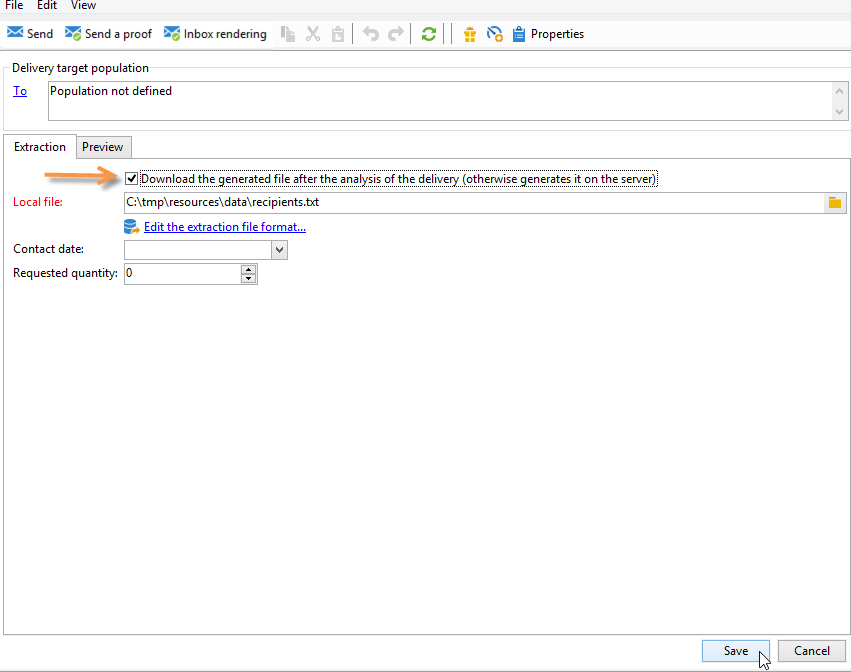

# DM 게재 만들기

DM 게재는 대상 모집단에서 데이터를 포함하는 추출 파일을 생성할 수 있습니다. 그런 다음 이 파일을 대상 모집단에 메시지를 전달할 공급자와 공유할 수 있습니다.

파일을 생성하는 단계는 다음과 같습니다.

1. [게재 만들기](#creating-a-direct-mail-delivery)
1. [대상자 정의](#defining-the-direct-mail-audience)
1. [파일 내용 정의](#defining-the-direct-mail-content)
1. [게재 유효성 검사](#validating)
1. [게재 시작](#start-delivery)

## 게재 만들기{#creating-a-direct-mail-delivery}

템플릿을 기반으로 DM 게재를 만듭니다. **[!UICONTROL Deliver by direct mail (paper)]** 기본 제공 템플릿을 복제하고 구성할 수 있습니다.

새 DM 게재를 만들려면 아래 단계를 수행합니다.

>[!NOTE]
>
>게재 만들기에 대한 전체 개념은 [이 섹션](../start/create-message.md)에 나와 있습니다.

1. 게재 대시보드 등에서 새 게재를 만듭니다.
1. 게재 템플릿 **DM(용지)으로 게재**&#x200B;을(를) 선택하십시오.

   

1. 레이블, 코드 및 설명을 사용하여 게재를 식별합니다. 이 작업에 대한 자세한 정보는 [이 섹션](../start/create-message.md#create-the-delivery)을 참조하십시오.
1. **계속**&#x200B;을 클릭하여 이 정보를 확인하고 메시지 구성 창을 표시합니다.

## 대상자 정의{#defining-the-direct-mail-audience}

수신자 프로필에는 적어도 이름과 우편 주소가 포함되어야 합니다.

우편 주소는 계산된 필드입니다. 주소는 기본적으로 최대 6줄을 포함할 수 있습니다. 첫 번째 줄에는 이름과 성, 다음 줄에는 우편 주소(도로명 등), 마지막 줄에는 우편 번호 및 구/군/시가 포함됩니다. 기본 계산된 postalAddress 필드의 정의는 nms:recipient 스키마에서 검토할 수 있습니다.

이름, ZIP/우편 번호 필드 및 구/군/시 필드가 비어 있지 않으면 주소는 완료된 것으로 간주됩니다. 주소가 불완전한 수신자는 DM 게재에서 제외됩니다.

[이 섹션](../start/create-message.md#target-population)에서 자세히 알아보십시오.

## 파일 내용 정의{#defining-the-direct-mail-content}

추출 마법사를 사용하여 출력 파일로 내보낼 정보(열)를 정의합니다.

추출된 데이터가 포함된 파일 이름이 **[!UICONTROL File]** 필드에 정의되어 있습니다. 필드 오른쪽에 있는 버튼을 사용하면 개인화 필드를 사용하여 파일 이름을 만들 수 있습니다.

기본적으로 추출 파일이 생성되어 서버에 저장됩니다. 컴퓨터에 저장할 수 있습니다. 이렇게 하려면 **[!UICONTROL Download the generated file after the analysis of the delivery]**&#x200B;을(를) 확인하십시오. 이 경우 파일 이름과 로컬 저장소 디렉토리에 대한 액세스 경로를 표시해야 합니다.

DM 게재의 경우 **[!UICONTROL Edit the extraction file format...]** 링크에 추출 콘텐츠가 정의되어 있습니다.

이 링크를 사용하면 추출 도우미에 액세스하고 출력 파일로 내보낼 정보(열)를 정의할 수 있습니다.

추출 파일에 개인화된 URL을 삽입할 수 있습니다. 자세한 내용은 Adobe Campaign Classic [설명서](https://experienceleague.adobe.com/docs/campaign-classic/using/designing-content/web-forms/publishing-a-web-form.html?lang=ko){target="_blank"}를 참조하세요.

>[!NOTE]
>
>이 도우미에는 내보내기 도우미의 단계가 포함되어 있습니다. 자세한 Adobe Campaign Classic [설명서](https://experienceleague.adobe.com/docs/campaign-classic/using/getting-started/importing-and-exporting-data/generic-imports-exports/executing-export-jobs.html?lang=ko){target="_blank"}..

## 게재 유효성 검사{#validating}

분석 결과와 출력 파일의 내용을 확인합니다.

마케팅 캠페인의 컨텍스트에서 추출 날짜에 추출 파일이 만들어집니다. 추출된 파일의 컨텐츠를 보거나 승인하거나 형식을 변경하고 필요한 경우 추출을 다시 시작할 수 있습니다. 파일이 승인되면 알림 이메일을 라우터로 보낼 수 있습니다. [이 페이지](https://experienceleague.adobe.com/docs/campaign/automation/campaign-orchestration/marketing-campaign-approval.html?lang=ko){target="_blank"}에서 자세히 알아보십시오.

게재 유효성 검사 시 전반적 개념은 [이 섹션](../start/create-message.md#validate-the-delivery)에 나와 있습니다.

DM 게재의 출력 파일은 게재 분석 중에 생성됩니다. 파일의 내용은 선택한 출력 열에 따라 다릅니다(이 [섹션 파일](#defining-the-direct-mail-content) 참조).

>[!NOTE]
>
>분석 단계는 이 [섹션](delivery-analysis.md)에 자세히 설명되어 있습니다.

분석 단계에서 파일은 생성되지만 수신자 관련 정보(즉, 게재 로그)는 업데이트되지 않습니다. 따라서 위험을 발생시키지 않고 이 작업을 취소할 수 있습니다.

**[!UICONTROL Confirm delivery]**&#x200B;을(를) 클릭하기 전에 분석 결과와 출력 파일의 내용을 확인하십시오. 확인 메시지를 통해 게재를 시작할 수 있습니다.

전송 확인이 지정된 파일에서 데이터 추출을 시작합니다.

그런 다음 도우미를 닫고 게재 세부 정보를 통해 액세스할 수 있는 **[!UICONTROL Delivery]** 탭을 통해 게재 로그를 확인할 수 있습니다.

게재 속성의 **[!UICONTROL Analysis]** 탭에서 게재 로그 검색 모드를 구성할 수 있습니다.

다음 두 가지 모드가 있습니다.

* **[!UICONTROL Messages are considered sent after validation]**(기본 모드): 이 함수 모드에서는 운영자가 전송을 확인하고(상태가 &#39;게재 보류 중&#39;에서 &#39;전송됨&#39;) 게재가 자동으로 **[!UICONTROL Finished]**(으)로 설정되면 모든 브로드로그가 업데이트됩니다.
* **[!UICONTROL A file of results determines the messages that are sent and those that have failed]** : 이 모드에서는 서비스 공급자가 보낸 외부 파일을 통해 브로드로그를 업데이트할 수 있습니다. 이 경우 브로드로그 상태를 업데이트하려면 이 정보를 처리하는 워크플로우를 사용해야 합니다.

  >[!NOTE]
  >
  >이 경우 브로드로그가 업데이트되는 즉시 사용자가 게재 상태를 **[!UICONTROL Finished]**(으)로 변경해야 합니다.

## 게재 시작{#start-delivery}

추출 파일의 유효성을 검사하면 **게재 확인**&#x200B;을 클릭합니다. 확인 메시지를 통해 게재를 시작할 수 있습니다.

확인이 지정된 파일에서 데이터 추출을 시작합니다.

마케팅 캠페인의 컨텍스트에서 모든 승인이 승인되면 DM 게재가 추출 보류 중일 때 기본 구성에서 자동으로 시작되는 특수 워크플로우를 통해 추출 파일이 만들어집니다. [이 섹션](https://experienceleague.adobe.com/docs/campaign/automation/campaign-orchestration/marketing-campaign-deliveries.html?lang=ko){target="_blank"}에서 자세히 알아보십시오.
