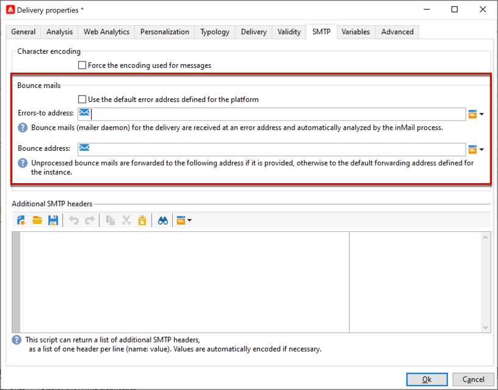

# 이메일 매개변수 {#email-parameters}

이 섹션에서는 이메일 게재와 관련된 게재 속성에서 사용할 수 있는 옵션 및 매개 변수를 제공합니다.

## 이메일 숨은 참조 사용 {#email-bcc}

<!--
>[!NOTE]
>
>This capability is available starting Campaign v8.3. To check your version, refer to [this section](../start/compatibility-matrix.md#how-to-check-your-campaign-version-and-buildversion)-->

플랫폼에서 전송된 이메일 사본을 유지하도록 Adobe Campaign을 구성할 수 있습니다.

Adobe Campaign 자체는 보관된 파일을 관리하지 않습니다. 이 옵션을 사용하면 원하는 메시지를 전용 BCC(숨은 참조) 이메일 주소로 전송할 수 있으며, 여기서 외부 시스템을 사용하여 메시지를 처리하고 보관할 수 있습니다. 보낸 이메일에 해당하는 .eml 파일은 SMTP 이메일 서버와 같은 원격 서버로 전송할 수 있습니다.

>[!CAUTION]
>
>개인정보 보호를 위해 BCC 이메일은 PII(개인 식별 정보)를 안전하게 저장할 수 있는 보관 시스템에 의해 처리되어야 합니다.

보관 대상은 선택한 BCC 이메일 주소이며 게재 수신자에게 표시되지 않습니다.

  관리 Cloud Services 사용자는 [연락처 Adobe](../start/campaign-faq.md#support){target="_blank"} 보관에 사용할 BCC 이메일 주소를 전달합니다.

BCC 이메일 주소가 정의되면 게재 수준에서 전용 옵션을 활성화해야 합니다.

>[!CAUTION]
>
>**[!UICONTROL Email BCC]** 은 기본적으로 활성화되어 있지 않습니다. 이메일 게재 또는 게재 템플릿에서 수동으로 활성화해야 합니다.

이렇게 하려면 아래 단계를 수행합니다:

1. 다음으로 이동 **[!UICONTROL Campaign Management]** > **[!UICONTROL Deliveries]**, 또는 **[!UICONTROL Resources]** > **[!UICONTROL Templates]** > **[!UICONTROL Delivery templates]**.
1. 선택한 게재를 선택하거나 즉시 사용할 수 있는 게재를 복제합니다. **[!UICONTROL Email delivery]** 템플릿을 선택한 다음 복제된 템플릿을 선택합니다.
1. **[!UICONTROL Properties]** 버튼을 클릭합니다.
1. **[!UICONTROL Delivery]** 탭을 선택합니다. 
1. **[!UICONTROL Email BCC]** 옵션을 선택합니다.

   

1. **[!UICONTROL Ok]**&#x200B;을(를) 선택합니다.

이 템플릿을 기반으로 각 게재에 대해 전송된 모든 메시지의 사본은 구성된 이메일 BCC 주소로 전송됩니다.

다음 특성 및 권장 사항에 유의하십시오.

* 숨은 참조 이메일 주소는 하나만 사용할 수 있습니다.

* BCC 주소에 전송된 모든 이메일을 보관할 수 있는 수신 용량이 충분한지 확인합니다.

* 이메일 BCC <!--with Enhanced MTA--> 는 수신자에게 전달하기 전에 BCC 이메일 주소에 전달합니다. 그러면 원래 게재가 반송되었더라도 BCC 메시지가 전송될 수 있습니다. 바운스에 대한 자세한 내용은 [게재 실패 이해](delivery-failures.md).

* BCC 주소로 전송된 이메일을 열고 클릭스루한 경우에서 이를 고려합니다. **[!UICONTROL Total opens]** 및 **[!UICONTROL Clicks]** (일부 계산 착오를 일으킬 수 있는 전송 분석에서)

<!--Only successfully sent emails are taken in account, bounces are not.-->

## 메시지 형식 선택 {#selecting-message-formats}

보낸 이메일 메시지 형식을 변경할 수 있습니다. 이렇게 하려면 게재 속성을 편집하고 **[!UICONTROL Delivery]** 탭.

창의 아래 섹션에서 전자 메일 형식을 선택합니다.

* **[!UICONTROL Use recipient preferences]** (기본 모드)

  메시지 형식은 수신자 프로필에 저장된 데이터에 따라 정의되며 기본적으로 **[!UICONTROL email format]** 필드(@emailFormat). 수신자가 특정 형식으로 메시지를 수신하려는 경우에 보내는 형식입니다. 필드를 입력하지 않으면 다중 파트 대체 메시지가 전송됩니다(아래 참조).

* **[!UICONTROL Let recipient mail client choose the most appropriate format]**

  메시지에는 텍스트 및 HTML 두 가지 형식이 모두 포함되어 있습니다. 수신에 표시되는 형식은 수신자의 메일 소프트웨어(다중 파트 대체)의 구성에 따라 다릅니다.

  >[!IMPORTANT]
  >
  >이 옵션에는 문서의 두 버전이 모두 포함됩니다. 따라서 메시지 크기가 더 크기 때문에 게재 처리량이 감소합니다.

* **[!UICONTROL Send all messages in text format]**

  메시지는 텍스트 형식으로 전송됩니다. HTML 형식은 전송되지 않지만 수신자가 메시지를 클릭할 때만 미러 페이지에 사용됩니다.

<!--
>[!NOTE]
>
>For more on defining the email content, see [this section]().-->

## 문자 인코딩 설정 {#character-encoding}

다음에서 **[!UICONTROL SMTP]** 게재 매개 변수 탭, **[!UICONTROL Character encoding]** 섹션에서는 특정 인코딩을 설정할 수 있습니다.

기본 인코딩은 UTF-8입니다. 수신자의 이메일 공급자 중 일부가 UTF-8 표준 인코딩을 지원하지 않는 경우 이메일 수신자에게 특수 문자를 제대로 표시하도록 특정 인코딩을 설정할 수 있습니다.

예를 들어 일본어 문자가 포함된 이메일을 보내려고 합니다. 모든 문자가 일본에 있는 수신자에게 올바르게 표시되도록 하려면 표준 UTF-8이 아닌 일본어 문자를 지원하는 인코딩을 사용할 수 있습니다.

이렇게 하려면 **[!UICONTROL Force the encoding used for messages]** 의 옵션 **[!UICONTROL Character encoding]** 을(를) 섹션에서 선택하고 표시되는 드롭다운 목록에서 인코딩을 선택합니다.

## 바운스 이메일 관리 {#managing-bounce-emails}

다음 **[!UICONTROL SMTP]** 게재 속성의 탭을 사용하여 바운스 메일 관리를 구성할 수도 있습니다.

* **[!UICONTROL Errors-to-address]**: 기본적으로 반송된 이메일은 플랫폼의 기본 오류 상자에 수신되지만 게재에 대한 특정 오류 주소를 정의할 수 있습니다.

* **[!UICONTROL Bounce address]**: 처리되지 않은 반송된 이메일이 전달되는 다른 주소를 정의할 수도 있습니다. 이 주소를 사용하면 애플리케이션에서 이메일을 자동으로 검증할 수 없을 때 반송 원인을 조사할 수 있습니다.

이러한 각 필드는 전용 아이콘을 사용하여 개인화할 수 있습니다. 의 개인화 필드에 대해 자세히 알아보기 [이 섹션](personalization-fields.md).

바운스 메일 관리에 대한 자세한 내용은 [이 섹션](delivery-failures.md#bounce-mail-management).

## SMTP 헤더 추가 {#adding-smtp-headers}

게재에 SMTP 헤더를 추가할 수 있습니다. 이렇게 하려면 의 관련 섹션을 사용합니다. **[!UICONTROL SMTP]** 게재 탭.

이 창에 입력한 스크립트는 다음 양식의 행당 하나의 헤더를 참조해야 합니다. **name:value**.

필요한 경우 값이 자동으로 인코딩됩니다.

>[!IMPORTANT]
>
>추가 SMTP 헤더 삽입을 위한 스크립트 추가는 고급 사용자를 위해 예약되어 있습니다.
>
>이 스크립트의 구문은 다음과 같은 이 콘텐츠 형식의 요구 사항을 준수해야 합니다: 사용하지 않은 공간, 빈 줄 등이 없음.

<!--
## Generate mirror page {#generating-mirror-page}

The mirror page is an HTML page accessible online via a web browser. Its content is identical to the email. It can be useful if your recipients are experiencing rendering issues or broken images when trying to view your email in their inbox.

Learn how to insert a link to the mirror page in [this section](mirror-page.md).-->