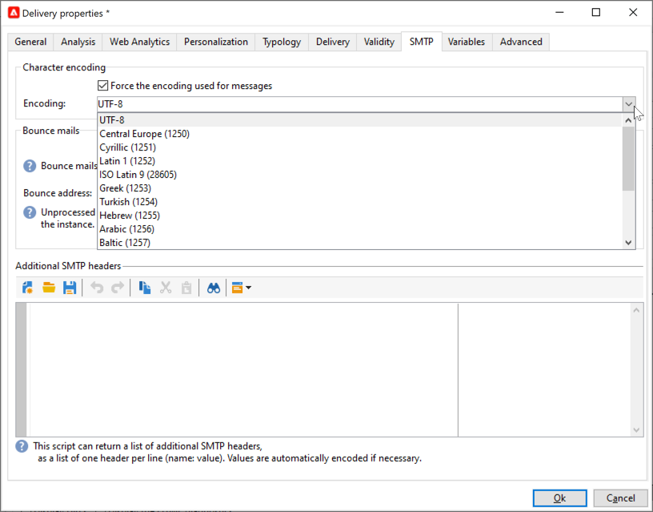

# 이메일 매개변수 {#email-parameters}

이 섹션에서는 이메일 게재와 관련된 게재 속성에서 사용할 수 있는 옵션 및 매개 변수를 제공합니다.

## 이메일 숨은 참조 사용 {#email-bcc}

플랫폼에서 전송된 이메일 사본을 유지하도록 Adobe Campaign을 구성할 수 있습니다. 이 옵션은 [이 페이지](email-bcc.md)에 자세히 설명되어 있습니다.

## 메시지 형식 선택 {#selecting-message-formats}

보낸 이메일 메시지 형식을 변경할 수 있습니다. 이렇게 하려면 게재 속성을 편집하고 **[!UICONTROL Delivery]** 탭을 클릭하십시오.

창의 아래 섹션에서 전자 메일 형식을 선택합니다.

* **[!UICONTROL Use recipient preferences]**(기본 모드)

  메시지 형식은 받는 사람 프로필에 저장된 데이터에 따라 정의되며 기본적으로 **[!UICONTROL email format]** 필드(@emailFormat)에 저장됩니다. 수신자가 특정 형식으로 메시지를 수신하려는 경우에 보내는 형식입니다. 필드를 입력하지 않으면 다중 파트 대체 메시지가 전송됩니다(아래 참조).

* **[!UICONTROL Let recipient mail client choose the most appropriate format]**

  메시지에는 텍스트 및 HTML 두 가지 형식이 모두 포함되어 있습니다. 수신에 표시되는 형식은 수신자의 메일 소프트웨어(다중 파트 대체)의 구성에 따라 다릅니다.

  >[!IMPORTANT]
  >
  >이 옵션에는 문서의 두 버전이 모두 포함됩니다. 따라서 메시지 크기가 더 크기 때문에 게재 처리량이 감소합니다.

* **[!UICONTROL Send all messages in text format]**

  메시지는 텍스트 형식으로 전송됩니다. HTML 형식은 전송되지 않지만 수신자가 메시지를 클릭할 때만 미러 페이지에 사용됩니다.

<!--
>[!NOTE]
>
>For more on defining the email content, see [this section]().-->

## 문자 인코딩 설정 {#character-encoding}

게재 매개 변수의 **[!UICONTROL SMTP]** 탭에서 **[!UICONTROL Character encoding]** 섹션을 사용하여 특정 인코딩을 설정할 수 있습니다.

기본 인코딩은 UTF-8입니다. 수신자의 이메일 공급자 중 일부가 UTF-8 표준 인코딩을 지원하지 않는 경우 이메일 수신자에게 특수 문자를 제대로 표시하도록 특정 인코딩을 설정할 수 있습니다.

예를 들어 일본어 문자가 포함된 이메일을 보내려고 합니다. 모든 문자가 일본에 있는 수신자에게 올바르게 표시되도록 하려면 표준 UTF-8이 아닌 일본어 문자를 지원하는 인코딩을 사용할 수 있습니다.

이렇게 하려면 **[!UICONTROL Character encoding]** 섹션에서 **[!UICONTROL Force the encoding used for messages]** 옵션을 선택하고 표시되는 드롭다운 목록에서 인코딩을 선택합니다.

## 바운스 이메일 관리 {#managing-bounce-emails}

게재 속성의 **[!UICONTROL SMTP]** 탭을 사용하여 바운스 메일 관리도 구성할 수 있습니다.

* **[!UICONTROL Errors-to-address]**: 기본적으로 반송된 이메일은 플랫폼의 기본 오류 상자에 수신되지만 게재에 대한 특정 오류 주소를 정의할 수 있습니다.

* **[!UICONTROL Bounce address]**: 처리되지 않은 반송된 전자 메일이 전달되는 다른 주소를 정의할 수도 있습니다. 이 주소를 사용하면 애플리케이션에서 이메일을 자동으로 검증할 수 없을 때 반송 원인을 조사할 수 있습니다.

이러한 각 필드는 전용 아이콘을 사용하여 개인화할 수 있습니다. [이 섹션](personalization-fields.md)의 개인화 필드에 대해 자세히 알아보세요.

바운스 메일 관리에 대한 자세한 내용은 [이 섹션](delivery-failures.md#bounce-mail-management)을 참조하세요.

## SMTP 헤더 추가 {#adding-smtp-headers}

게재에 SMTP 헤더를 추가할 수 있습니다. 이렇게 하려면 게재에서 **[!UICONTROL SMTP]** 탭의 관련 섹션을 사용합니다.

이 창에 입력한 스크립트는 **name:value** 형식의 한 줄에 하나의 헤더를 참조해야 합니다.

필요한 경우 값이 자동으로 인코딩됩니다.

>[!IMPORTANT]
>
>추가 SMTP 헤더 삽입을 위한 스크립트 추가는 고급 사용자를 위해 예약되어 있습니다.
>
>이 스크립트의 구문은 다음과 같은 이 콘텐츠 형식의 요구 사항을 준수해야 합니다: 사용하지 않은 공간, 빈 줄 등이 없음.

## 미러 페이지 생성 {#generating-mirror-page}

미러 페이지는 웹 브라우저를 통해 온라인으로 액세스할 수 있는 HTML 페이지입니다. 콘텐츠는 이메일과 동일합니다. 받은 편지함에서 전자 메일을 보려고 할 때 수신자에게 렌더링 문제가 발생하거나 이미지가 손상된 경우 유용합니다.

[이 섹션](mirror-page.md)에서 미러 페이지에 대한 링크를 삽입하는 방법을 알아봅니다.
