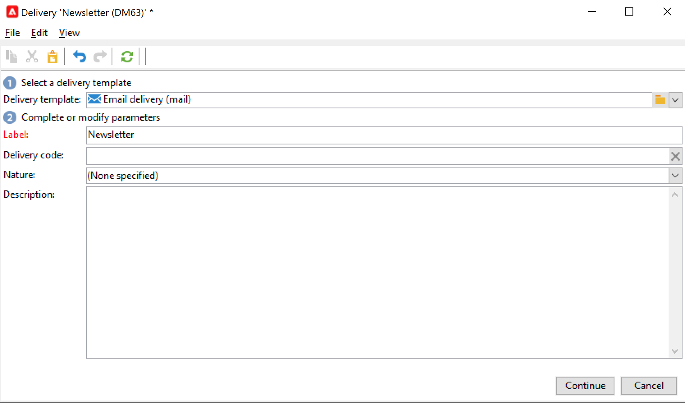

# 이메일 디자인 및 보내기

이메일 게재를 사용하면 개인화된 이메일을 대상 모집단으로 보낼 수 있습니다. [자세히 알아보기](../send/send.md)

## 첫 번째 이메일 게재 만들기

나머지 고객 경험과 일관적인 개인화된 상황별 관련 이메일을 만들 수 있습니다.

다음 샘플에서는 개인화된 데이터, 외부 URL에 대한 링크 및 미러 페이지에 대한 링크가 포함된 Adobe Campaign에서의 이메일 게재를 디자인하는 단계를 배웁니다.

1. **게재 만들기**

   새 게재를 만들려면 **캠페인** 탭을 클릭하고 **게재** 을(를) 클릭하고 **만들기** 기존 게재 목록 위에 있는 단추입니다.

   

1. **템플릿 선택**

   게재 템플릿을 선택한 다음 게재 이름을 지정합니다. 이 이름은 Adobe Campaign 콘솔의 사용자만 볼 수 있고 수신자는 볼 수 없지만 이 제목은 게재 목록에 표시됩니다. **[!UICONTROL Continue]**&#x200B;를 클릭합니다.

   

1. **콘텐츠 가져오기**

   다음을 클릭합니다. **소스** 탭으로 이동하여 HTML 컨텐츠를 붙여넣습니다.

   

1. **메시지 개인화**

   * 수신자의 이름과 성 추가

      메시지 콘텐츠에 타겟팅된 프로필의 이름과 성을 삽입하려면 삽입할 위치에 커서를 놓고 도구 모음에서 마지막 아이콘을 클릭한 다음 을 클릭합니다 **[!UICONTROL Include]** 및 선택 **[!UICONTROL Greetings]**.

      

      미리보기 탭으로 이동하여 수신자를 선택하여 개인화를 확인합니다.

      

      에서 개인화 옵션에 대해 자세히 알아보기 [이 섹션](personalize.md).

   * 추적된 링크 삽입

      이미지 또는 텍스트를 통해 게재 수신자를 외부 주소로 보내려면 해당 주소를 선택하고 **[!UICONTROL Add a link]** 아이콘을 클릭합니다.

      에 링크의 URL을 입력합니다. **URL** 다음 형식을 사용하는 필드 **https://www.myURL.com**&#x200B;를 클릭한 다음 확인합니다.

      

   * 미러 페이지 추가

      수신자가 웹 브라우저에서 게재 콘텐츠를 볼 수 있도록 하려면 [미러 페이지](../send/mirror-page.md) 메시지.

      이 링크를 삽입할 위치에 커서를 놓고 도구 모음에서 마지막 아이콘을 클릭한 다음 를 클릭합니다 **[!UICONTROL Include]** 및 선택 **[!UICONTROL link to mirror page]**.
   컨텐츠가 준비되면 을(를) 클릭합니다. **저장**: 이제 게재 목록의 **[!UICONTROL Campaigns > Deliveries]** 탭. 첫 번째 이메일 게재가 준비되었습니다. 이제 대상자를 정의하고 게재를 확인하고 전송해야 합니다.

에서 이메일 콘텐츠를 가져오는 방법 알아보기 [사용 사례](https://experienceleague.adobe.com/docs/campaign/automation/workflows/use-cases/deliveries/load-delivery-content.html).

다음 섹션에서 자세히 알아보세요.

* [Campaign에서 이메일 디자인](../send/email.md)
* [이메일 템플릿 만들기 및 사용](../send/create-templates.md)
* [이메일 대상자 선택](../audiences/gs-audiences.md)
* [게재 유효성 검사 및 증명 보내기](../send/preview-and-proof.md)

## 이메일 테스트 및 유효성 검사

Campaign은 대상자에게 이메일을 보내기 전에 테스트하고 유효성을 검사하는 여러 가지 방법을 제공합니다. 에서 이메일 콘텐츠를 미리 보고 테스트하는 방법을 알아봅니다. [이 페이지](../send/preview-and-proof.md).

다음을 수행할 수 있습니다.

* 게재 분석 로그 확인
* 증명 보내기
* 시드 주소 추가

[자세히 알아보기](../send/delivery-analysis.md)
