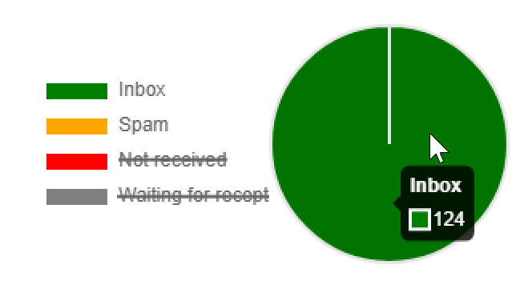

# 받은 편지함 렌더링{#inbox-rendering}

## 받은 편지함 렌더링 정보 {#about-inbox-rendering}

**보내기** 단추를 누르기 전에 메시지가 다양한 웹 클라이언트, 웹 메일 및 장치에서 최적의 방식으로 수신자에게 표시되는지 확인하십시오.

이를 위해 Adobe Campaign은 [Litmus](https://litmus.com/email-testing){target="_blank"} 웹 기반 전자 메일 테스트 솔루션을 활용하여 렌더링을 캡처하고 전용 보고서에서 사용할 수 있도록 합니다. 이렇게 하면 메시지가 수신될 수 있는 다른 컨텍스트에서 전송된 메시지를 미리 보고 주요 데스크톱 및 응용 프로그램의 호환성을 확인할 수 있습니다.

>[!CAUTION]
>받은 편지함 렌더링이 [반복 게재](../../automation/workflow/recurring-delivery.md)와(과) 호환되지 않습니다.

Litmus는 기능이 풍부한 이메일 유효성 검사 및 애플리케이션 미리보기입니다. 이를 통해 이메일 콘텐츠 작성자는 Gmail 받은 편지함 또는 Apple 메일 클라이언트와 같은 70개 이상의 이메일 렌더러에서 메시지 콘텐츠를 미리 볼 수 있습니다.

Adobe Campaign에서 **받은 편지함 렌더링**&#x200B;에 사용할 수 있는 모바일, 메시징 및 웹 메일 클라이언트는 [Litmus 웹 사이트](https://litmus.com/email-testing){target="_blank"}에 나열됩니다(**모든 이메일 클라이언트 보기** 클릭).

>[!NOTE]
>
>받은 편지함 렌더링은 게재에서 개인화를 테스트하는 데 필요하지 않습니다. Personalization은 **[!UICONTROL Preview]** 및 [증명](preview-and-proof.md#send-proofs)과 같은 Adobe Campaign 도구로 확인할 수 있습니다.

## Litmus 토큰 정보 {#about-litmus-tokens}

Litmus는 타사 서비스이므로 사용당 크레딧 모델을 기반으로 작동합니다. 사용자가 리트머스 기능을 호출할 때마다 크레딧이 공제됩니다.

Adobe Campaign에서 크레딧은 사용 가능한 렌더링(토큰으로 알려져 있음) 수에 해당합니다.

>[!NOTE]
>
>사용 가능한 Litmus 토큰의 수는 구입한 Campaign 라이선스에 따라 다릅니다. 사용권 계약을 확인하십시오.

게재에서 **[!UICONTROL Inbox rendering]** 기능을 사용할 때마다 생성되는 각 렌더링은 사용 가능한 토큰을 하나씩 감소시킵니다.

>[!IMPORTANT]
>
>토큰은 전체 받은 편지함 렌더링 보고서가 아닌 각 개별 렌더링을 고려합니다. 즉, 다음과 같습니다.
>
>* 받은 편지함 렌더링 보고서가 생성될 때마다 메시징 클라이언트당 하나의 토큰이 공제됩니다. Outlook 2000 렌더링용 토큰, Outlook 2010 렌더링용 토큰, Apple Mail 9 렌더링용 토큰 등이 있습니다.
>* 동일한 게재의 경우 받은 편지함 렌더링을 다시 생성하면 사용 가능한 토큰 수가 생성된 렌더링 수만큼 다시 감소합니다.
>

사용 가능한 나머지 토큰 수가 [받은 편지함 렌더링 보고서](#inbox-rendering-report)에 표시됩니다.

일반적으로 받은 편지함 렌더링 기능은 새로 디자인된 이메일의 HTML 프레임워크를 테스트하는 데 사용됩니다. 각 렌더링에는 일반적으로 테스트되는 환경의 수에 따라 약 최대 70개의 토큰이 필요합니다. 그러나 경우에 따라 게재를 완전히 테스트하기 위해 여러 받은 편지함 렌더링 보고서가 필요할 수 있습니다. 따라서 여러 검사를 완료하는 데 더 많은 토큰이 필요할 수 있습니다.

## 받은 편지함 렌더링 보고서 액세스 {#accessing-the-inbox-rendering-report}

전자 메일 게재를 만들고 타겟팅된 모집단과 해당 컨텐츠까지 정의했으면 아래 단계를 따르십시오.

게재 만들기, 디자인 및 타깃팅에 대한 자세한 내용은 이 [페이지](defining-the-email-content.md)를 참조하세요.

1. 게재 상단 표시줄에서 **[!UICONTROL Inbox rendering]** 단추를 클릭합니다.

1. 캡처 프로세스를 시작하려면 **[!UICONTROL Analyze]**&#x200B;을(를) 선택하십시오.

   

   증명이 전송되었습니다. 이메일을 보낸 후 몇 분 후에 해당 증명에서 렌더링 축소판에 액세스할 수 있습니다. 증명 전송에 대한 자세한 내용은 [이 섹션](preview-and-proof.md#send-proofs)을 참조하세요.

1. 전송되면 게재 목록에 증명이 표시됩니다. 두 번 클릭합니다.

   

1. 증명의 **받은 편지함 렌더링** 탭으로 이동합니다.

   

   받은 편지함 렌더링 보고서가 표시됩니다.

## 받은 편지함 렌더링 보고서 {#inbox-rendering-report}

이 보고서는 수신자에게 표시되는 받은 편지함 렌더링을 표시합니다. 렌더링은 브라우저, 모바일 디바이스 또는 이메일 애플리케이션 등 수신자가 이메일 게재를 여는 방법에 따라 다를 수 있습니다.

상단 섹션은 받은 메시지, 원치 않는 메시지(스팸), 받지 못한 메시지 또는 보류 중인 수신 수를 그래픽 색상으로 구분된 표현을 통해 다시 분할합니다.

{width="40%" align="left"}

차트 위로 마우스를 가져가면 각 색상에 대한 세부 정보가 표시됩니다. 목록에서 항목을 클릭하여 차트에서 해당 범주를 숨기거나 표시합니다.

보고서의 본문은 **[!UICONTROL Mobile]**, **[!UICONTROL Desktop]**, **[!UICONTROL Webmails]** 세 부분으로 나뉘어져 있습니다. 보고서를 아래로 스크롤하여 이 세 가지 범주로 그룹화된 모든 렌더링을 표시합니다.

각 보고서에 대한 세부 정보를 보려면 해당 카드를 클릭합니다. 선택한 수신 방법에 대해 렌더링이 표시됩니다.

