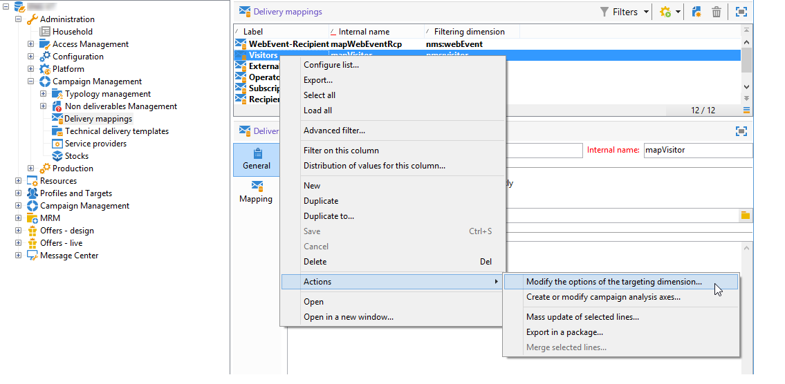

# 라이브 및 디자인 환경{#live-design-environments}

상호 작용은 두 가지 유형의 오퍼 환경에서 작동합니다.

* **[!UICONTROL Design]** 편집 중이며 변경할 수 있는 오퍼가 포함된 환경을 제공합니다. 이 오퍼는 승인 주기를 거치지 않았으며 연락처에 배달되지 않습니다.
* **[!UICONTROL Live]** 승인된 오퍼가 연락처에 표시될 때 포함된 환경을 제공합니다. 이 환경의 오퍼는 읽기 전용입니다.

각 **[!UICONTROL Design]** 환경은 **[!UICONTROL Live]** 환경에 연결되어 있습니다. 오퍼가 완료되면 컨텐트와 자격 조건 규칙은 승인 주기에 적용됩니다. 이 주기가 완료되면 관련 오퍼가 자동으로 **[!UICONTROL Live]** 환경에 배포됩니다. 지금부터 배송이 가능합니다

기본적으로 Campaign은 **[!UICONTROL Design]** 환경과 **[!UICONTROL Live]** 환경이 연결되어 있습니다. 두 환경 모두 [내장 받는 사람 테이블](../dev/datamodel.md#ootb-profiles)을(를) 대상으로 하도록 사전 구성되어 있습니다.

>[!NOTE]
>
>받는 사람 테이블을 대상으로 하려면 대상 매핑 도우미를 사용하여 환경을 만들어야 합니다. [자세히 알아보기](#creating-an-offer-environment)

배달 관리자는 **[!UICONTROL Live]** 환경만 보고 오퍼를 활용하여 전달할 수 있습니다. 오퍼 관리자는 **[!UICONTROL Design]** 환경을 보고 사용할 수 있으며 **[!UICONTROL Live]** 환경을 볼 수 있습니다. [자세히 알아보기](interaction-operators.md)

## 오퍼 환경 만들기 {#creating-an-offer-environment}

기본적으로 Campaign에는 수신자 테이블(식별된 오퍼)을 타깃팅하는 내장 환경이 포함되어 있습니다. 다른 테이블을 타깃팅하려면 아래 단계를 따르십시오.

1. **[!UICONTROL Administration]** > **[!UICONTROL Campaign management]** > **[!UICONTROL Delivery mappings]**&#x200B;로 이동하여 사용할 배달 매핑을 마우스 오른쪽 단추로 클릭하고 **[!UICONTROL Actions]** > **[!UICONTROL Modify the options of the targeting dimension]**&#x200B;를 선택합니다.

   

1. **[!UICONTROL Next]**&#x200B;을 클릭하고 **[!UICONTROL Generate a storage schema for propositions]** 옵션을 선택하고 **[!UICONTROL Save]**&#x200B;를 클릭합니다.

   

   >[!NOTE]
   >
   >옵션이 이미 선택되어 있으면 선택을 취소하고 다시 선택합니다.

1. Adobe Campaign은 이전에 활성화된 대상 매핑의 타깃팅 정보를 사용하여 **[!UICONTROL Design]** 및 **[!UICONTROL Live]** 등 두 개의 환경을 만듭니다. 환경은 타깃팅 정보로 미리 구성되어 있습니다.
