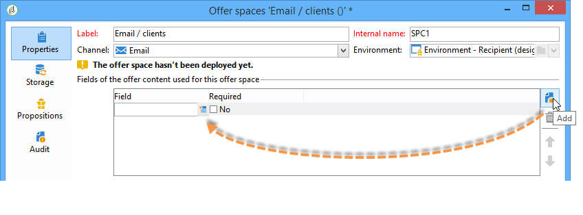
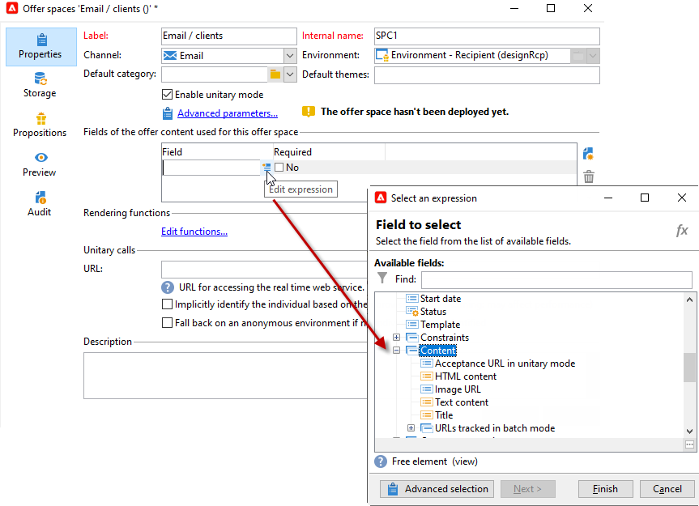

# 오퍼 공간 만들기{#creating-offer-spaces}

오퍼 카탈로그 컨텐츠는 오퍼 공간에 구성됩니다. 기본적으로 컨텐츠에는 다음 필드가 포함될 수 있습니다.**[!UICONTROL Title]**, **[!UICONTROL Destination URL]**, **[!UICONTROL Image URL]**, **[!UICONTROL HTML content]** 및 **[!UICONTROL Text content]**. 필드 시퀀스는 오퍼 공간에 구성됩니다.

**기술 관리자**&#x200B;는 디자인 환경에서 오퍼 공간을 만들 수 있습니다. 오퍼 공간 하위 폴더에 액세스할 수 있어야 합니다. 오퍼가 생성되면 이러한 오퍼 공간은 오퍼 승인 중에 라이브 환경에 자동으로 복제됩니다.

고급 매개 변수를 사용하면 연락처 식별 키(예: 다양한 요소, 이름 및 이메일 필드로 구성할 수 있음)를 지정할 수 있습니다. 자세한 내용은 [식별된 오퍼](../../interaction/using/integration-via-javascript--client-side-.md#presenting-an-identified-offer) 표시 섹션을 참조하십시오.

HTML 렌더링은 렌더링 함수를 통해 만들어집니다. 렌더링 함수에 정의된 필드의 시퀀스는 컨텐츠에 구성된 시퀀스와 동일해야 합니다.


새 오퍼 공간을 만들려면 아래 단계를 수행하십시오.

1. 오퍼 공간 목록에서 **[!UICONTROL New]**&#x200B;을 클릭합니다.

   

1. 사용할 채널을 선택하고 오퍼 공간의 레이블을 변경합니다.

   

1. **[!UICONTROL Enable unitary mode]** 옵션 확인

1. **[!UICONTROL Content field]** 창으로 이동하여 **[!UICONTROL Add]**&#x200B;을 클릭합니다.

   

1. **[!UICONTROL Content]** 노드로 이동하여 다음 순서로 필드를 선택합니다.**[!UICONTROL Title]**, **[!UICONTROL Image URL]**, **[!UICONTROL HTML content]**, **[!UICONTROL Destination URL]** 순으로 선택합니다.

   

1. 각 필드를 필수 필드로 만들려면 **[!UICONTROL Required]** 옵션을 선택합니다.

   >[!NOTE]
   >
   >이 옵션은 [미리 보기]에서 사용되며, 필수 필드 중 하나가 오퍼에서 누락된 경우 게시할 때 오퍼 공백이 잘못되었습니다. 하지만 오퍼가 이미 오퍼 공간에 존재하는 경우 이러한 기준은 고려되지 않습니다.

   

1. 렌더링 함수를 만들려면 **[!UICONTROL Edit functions]**&#x200B;을 클릭합니다.

   이러한 함수는 오퍼 공간에서 오퍼 표현을 생성하는 데 사용됩니다. 다음과 같은 몇 가지 형식을 사용할 수 있습니다.HTML 또는 텍스트.

   **참고**  - XML 형식은 일시적으로 사용할 수 없는 인바운드 상호 작용으로 제한됩니다. [자세히 알아보기](../start/capability-matrix.md#gs-unavailable-features)

   _

1. **[!UICONTROL HTML rendering]** 탭으로 이동하여 **[!UICONTROL Overload the HTML rendering function]**&#x200B;를 선택합니다.
1. 렌더링 함수를 삽입합니다.

   

필요한 경우 HTML 및 텍스트 렌더링 함수를 오버로드할 수 있습니다. [자세히 알아보기](../../interaction/using/about-inbound-channels.md)

## 제안 상태 {#offer-proposition-statuses}

오퍼 제안 상태는 타깃팅된 모집단과의 상호 작용에 따라 달라집니다. 캠페인 상호 작용 모듈에는 라이프 사이클 동안 제안 제안에 적용할 수 있는 값 세트가 포함되어 있습니다. 오퍼 제안이 만들어지고 수락될 때 상태가 변경되도록 플랫폼을 구성해야 합니다.

>[!NOTE]
>
>상태 업데이트는 비동기 프로세스입니다. 이것은 매 시간마다 트리거되는 추적 워크플로우에 의해 수행됩니다.

### 오퍼 상태 목록 {#status-list}

사용 가능한 오퍼 상태는 다음과 같습니다.

* **[!UICONTROL Accepted]**
* **[!UICONTROL Scheduled]**
* **[!UICONTROL Generated]**
* **[!UICONTROL Interested]**
* **[!UICONTROL Presented]**
* **[!UICONTROL Rejected]**

이러한 값은 기본적으로 적용되지 않습니다.구성해야 합니다.

>[!NOTE]
>
>오퍼가 &quot;전송&quot; 상태의 게재와 연결된 경우 제안 제안의 상태는 자동으로 &quot;제안&quot;으로 변경됩니다.

### 제안을 만들 때 제안 상태{#configuring-the-status-when-the-proposition-is-created}

제안 제안이 **created**&#x200B;이면 해당 상태가 업데이트됩니다.

**[!UICONTROL Design]** 환경에서 각 오퍼 공간에 대해 오퍼 보고서에 표시할 정보에 따라 제안이 생성될 때 적용할 상태를 구성합니다.

이렇게 하려면 아래 단계를 수행합니다:

1. 원하는 공간의 **[!UICONTROL Storage]** 탭으로 이동합니다.
1. 제안을 만들 때 해당 상태에 적용할 상태를 선택합니다.

   

### 제안 승인 시 제안 상태{#configuring-the-status-when-the-proposition-is-accepted}

제안 제안이 **수락**&#x200B;되면, 기본적으로 제공된 값 중 하나를 사용하여 제안의 새 상태를 구성합니다. 이 업데이트는 수신자가 오퍼의 링크를 클릭할 때 적용됩니다.

이렇게 하려면 아래 단계를 수행합니다:

1. 원하는 공간의 **[!UICONTROL Storage]** 탭으로 이동합니다.
1. 제안을 수락할 때 해당 제안에 적용할 상태를 선택합니다.

   

<!--
**Inbound interaction**

The **[!UICONTROL Storage]** tab lets you define statuses for **proposed** and **accepted** offer propositions only. For inbound interaction, the status of offer propositions should be specified directly in the URL for calling the offer engine, rather than through the interface. This way, you will be able to specify which status to apply in other cases, for example if an offer proposition is rejected.

```
<BASE_URL>?a=UpdateStatus&p=<PRIMARY_KEY_OF_THE_PROPOSITION>&st=<NEW_STATUS_OF_THE_PROPOSITION>&r=<REDIRECT_URL>
```

For instance, the proposition (identifier **40004**) that matches the **Home insurance** offer displayed on the **Neobank** site contains the following URL:

```
<BASE_URL>?a=UpdateStatus&p=<40004>&st=<3>&r=<"http://www.neobank.com/insurance/subscribe.html">
```

As soon as a visitor clicks the offer, and therefore the URL, the **[!UICONTROL Accepted]** status (value **3**) is applied to the proposition and the visitor is redirected to a new page of the **Neobank** site to take out the insurance contract.

>[!NOTE]
>
>If you want to specify another status in the url (for example if an offer proposition is rejected), use the value corresponding to the desired status. Example: **[!UICONTROL Rejected]** = "5", **[!UICONTROL Presented]** = "1" and so on.
>
>Statuses and their values can be retrieved in the **[!UICONTROL Offer propositions (nms)]** data schema. For more on this, refer to [this page](../../configuration/using/data-schemas.md).

**Outbound interaction**
-->

전달에 링크가 들어 있을 때 제안 제안에 **[!UICONTROL Interested]** 상태를 자동으로 적용할 수 있습니다. 링크에 **_urlType=&quot;11&quot;** 값을 추가하면 됩니다.

```
<a _urlType="11" href="<DEST_URL>">Link inserted into the delivery</a>
```

## 공간당 오퍼 미리 보기 {#offer-preview-per-space}

**[!UICONTROL Preview]** 탭에서 선택한 방법을 통해 수신자가 자격이 있는 오퍼를 볼 수 있습니다. 아래 예에서 수신자는 우편으로 3가지 제안 사항을 제출할 수 있습니다.


수신자가 오퍼에 적합하지 않을 경우 미리 보기에 표시됩니다.


<!--
The preview can ignore contexts when they are restricted to a space. This is the case when the interaction schema has been extended to add fields referenced in a space using an inbound channel (for more on this, refer to [Extension example](../../interaction/using/extension-example.md)).
-->
