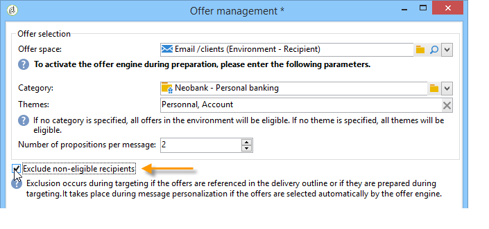

# 오퍼 보내기

오퍼 엔진에서 오퍼를 선택하려면 오퍼를 승인하고 다음 위치에서 사용할 수 있습니다 **라이브** 환경. [자세히 알아보기](interaction-offer.md#approve-offers)

아웃바운드 통신 채널을 통한 오퍼 프레젠테이션은 DM, 이메일 또는 모바일 게재를 통해 수행됩니다. 트랜잭션 메시지(메시지 센터)와 함께 단일 모드를 사용할 수도 있습니다.

## 게재에 오퍼 삽입 {#offer-into-a-delivery}

게재에 오퍼 제안을 삽입하려면 아래 단계를 수행하십시오.

1. 게재 창에서 **오퍼** 아이콘.

   

1. 오퍼 환경과 일치하는 공간을 선택합니다.

   

1. 엔진의 오퍼 선택 사항을 세분화하려면 제시할 오퍼가 속하는 카테고리 또는 하나/여러 개의 테마를 선택합니다. 제한 사항을 오버로드하지 않도록 이러한 필드 중 하나만 사용하는 것이 좋습니다.

   

   

1. 게재 본문에 삽입할 오퍼 수를 지정합니다.

   

1. 을(를) 선택합니다 **[!UICONTROL Exclude non-eligible recipients]** 필요한 경우 옵션을 선택합니다. [자세히 알아보기](#parameters-for-calling-offer-engine)

   

1. 필요한 경우 **[!UICONTROL Do not display anything if no offers are selected]** 선택 사항입니다. [자세히 알아보기](#parameters-for-calling-offer-engine)

   

1. 병합 필드를 사용하여 게재 콘텐츠에 속성을 삽입합니다. 사용 가능한 proposition 수는 엔진 호출이 구성되는 방식에 따라 다르며, 순서는 오퍼의 우선 순위에 따라 다릅니다.

   

1. 콘텐츠를 완료하고 게재를 테스트하고 보냅니다.

   

### 오퍼 엔진의 매개 변수 {#parameters-for-calling-offer-engine}

* **[!UICONTROL Space]** : 오퍼 엔진을 활성화하기 위해 선택해야 하는 오퍼 환경의 공간입니다.
* **[!UICONTROL Category]** : 오퍼가 정렬되는 특정 폴더입니다. 카테고리를 지정하지 않으면 테마를 선택하지 않은 한 환경에 포함된 모든 오퍼가 오퍼 엔진에서 고려됩니다.
* **[!UICONTROL Themes]** : 카테고리에서 업스트림으로 정의된 주요 단어입니다. 오퍼는 필터로서 작동하며 카테고리 집합에서 오퍼를 선택하여 표시할 오퍼의 수를 개선할 수 있도록 해줍니다.
* **[!UICONTROL Number of propositions]** : 게재 본문에 삽입할 수 있는 엔진에서 반환한 오퍼 수입니다. 오퍼가 메시지에 삽입되지 않으면 오퍼가 계속 생성되지만 표시되지 않습니다.
* **[!UICONTROL Exclude non-eligible recipients]** : 이 옵션을 사용하면 적합한 오퍼가 충분하지 않은 수신자의 제외를 활성화하거나 비활성화할 수 있습니다. 해당 Proposition 수는 요청된 Proposition 수보다 작을 수 있습니다. 이 확인란을 선택하면 적절한 위치가 없는 수신자는 게재에서 제외됩니다. 이 옵션을 선택하지 않으면 이러한 수신자는 제외되지 않지만 요청된 프로필 수가 없습니다.
* **[!UICONTROL Do not display anything if no offer is selected]** : 이 옵션을 사용하면 프로필 중 하나가 없는 경우 메시지를 처리하는 방법을 선택할 수 있습니다. 이 상자를 선택하면 누락된 제안 표시가 표시되지 않고 이 제안에 대한 메시지에 콘텐츠가 표시되지 않습니다. 상자를 선택하지 않으면 메시지 자체가 전송 중에 취소되고 수신자는 더 이상 메시지를 받지 않습니다.

## 워크플로우에서 오퍼 보내기{#offer-via-wf}

몇 가지 워크플로우 활동을 통해 오퍼를 표시하는 방식을 정의할 수 있습니다.

* 데이터 보강
* 오퍼 엔진
* 셀별 오퍼

### 데이터 보강 {#enrichment}

다음 **데이터 보강** 활동을 사용하면 게재 수신자를 위한 오퍼에 오퍼나 링크를 추가할 수 있습니다.

 데이터 보강 활동에 대한 자세한 내용은 [Campaign Classic v7 설명서](https://experienceleague.adobe.com/docs/campaign-classic/using/automating-with-workflows/targeting-activities/enrichment.html)

예를 들어 게재 전에 수신자 쿼리의 데이터를 보강할 수 있습니다.

오퍼 제안을 지정하는 방법에는 두 가지가 있습니다.

* 오퍼 또는 오퍼 엔진 호출 지정
* 오퍼 링크 참조.

#### 오퍼 엔진에 대한 호출 또는 오퍼를 지정합니다 {#specifying-an-offer-or-a-call-to-the-offer-engine}

구성 후 **쿼리** 활동:

1. 추가 및 열기 **데이터 보강** 활동.
1. **[!UICONTROL Enrichment]** 탭에서 **[!UICONTROL Add data]**&#x200B;를 선택합니다.
1. 선택 **[!UICONTROL An offer proposition]** 추가할 데이터 유형에서 을 참조하십시오.

   

1. 추가할 제안에 대한 레이블과 식별자를 지정합니다.
1. 오퍼 선택을 지정합니다. 다음 두 가지 옵션을 사용할 수 있습니다.

   * **[!UICONTROL Search for the best offer in a category]** : 이 옵션을 선택하고 오퍼 엔진 호출 매개 변수(오퍼 공간, 카테고리 또는 테마), 연락 날짜, 유지할 오퍼 수)를 지정합니다. 엔진은 이러한 매개 변수에 따라 추가할 오퍼를 자동으로 계산합니다. 다음 중 하나를 완료하는 것이 좋습니다 **[!UICONTROL Category]** 또는 **[!UICONTROL Theme]** 필드(동시에 둘 다 아님).

      

   * **[!UICONTROL A pre-defined offer]** : 오퍼 엔진을 호출하지 않고 추가할 오퍼를 직접 구성하려면 이 옵션을 선택하고 오퍼 공간, 특정 오퍼 및 연락 날짜를 지정합니다.

      

1. 그런 다음 선택한 채널에 해당하는 게재 활동을 구성합니다. [자세히 알아보기](#offer-into-a-delivery)

   >[!NOTE]
   >
   >미리 보기에 사용할 수 있는 proposition 수는 게재에서 직접 수행되는 구성 대신 데이터 보강 활동에서 수행되는 구성에 따라 다릅니다.

#### 오퍼에 대한 링크 참조 {#referencing-a-link-to-an-offer}

오퍼에 대한 링크를 **데이터 보강** 활동.

이렇게 하려면 아래 단계를 수행합니다:

1. 선택 **[!UICONTROL Add data]** 활동 **[!UICONTROL Enrichment]** 탭.
1. 추가할 데이터 유형을 선택하는 창에서 **[!UICONTROL A link]**.
1. 설정할 링크의 유형과 타겟을 선택합니다. 이 경우 대상은 오퍼 스키마입니다.

   

1. 데이터 보강 활동의 인바운드 테이블 데이터(여기에서 수신자 테이블)와 오퍼 테이블 간의 조인을 지정합니다. 예를 들어 오퍼 코드를 수신자에게 연결할 수 있습니다.

   

1. 그런 다음 선택한 채널에 해당하는 게재 활동을 구성합니다. [자세히 알아보기](#offer-into-a-delivery)

   >[!NOTE]
   >
   >미리 보기에 사용할 수 있는 proposition 수는 게재에서 수행된 구성에 따라 다릅니다.

#### 스토어 오퍼 등급 및 가중치 {#storing-offer-rankings-and-weights}

기본적으로 **데이터 보강** 활동은 오퍼를 전달하는 데 사용되며, 그 순위 및 가중치는 제안 테이블에 저장되지 않습니다.

>[!NOTE]
>
>다음 **[!UICONTROL Offer engine]** 활동은 기본적으로 이 정보를 저장합니다.

그러나 다음과 같이 이 정보를 저장할 수 있습니다.

1. 쿼리 뒤에, 게재 활동 전에 배치된 데이터 보강 활동에서 오퍼 엔진에 대한 호출을 만듭니다. [자세히 알아보기](#specifying-an-offer-or-a-call-to-the-offer-engine)
1. 활동의 기본 창에서 을(를) 선택합니다 **[!UICONTROL Edit additional data...]**.

   

1. 추가 **[!UICONTROL @rank]** 등급 및 열 **[!UICONTROL @weight]** 제안 가중치입니다.

   

1. 추가를 확인하고 워크플로우를 저장합니다.

게재는 오퍼의 등급 및 가중치를 자동으로 저장합니다. 이 정보는 게재의 **[!UICONTROL Offers]** 탭.

### 오퍼 엔진 {#offer-engine}

다음 **[!UICONTROL Offer engine]** 또한 활동을 사용하면 게재 전에 오퍼 엔진에 대한 호출을 지정할 수 있습니다.

 자세한 내용은 **오퍼 엔진** 활동, [Campaign Classic v7 설명서](https://experienceleague.adobe.com/docs/campaign-classic/using/automating-with-workflows/targeting-activities/offer-engine.html)

이 활동은 다음과 같은 원리로 작동합니다 **데이터 보강** 게재 전, 엔진에서 계산된 오퍼로 인바운드 모집단 데이터를 강화하여 엔진 호출을 사용한 활동.

구성 후 **쿼리** 활동:

1. 추가 및 열기 **[!UICONTROL Offer engine]** 활동.
1. 오퍼 엔진 매개 변수(오퍼 공간, 카테고리 또는 테마), 연락 날짜, 유지할 오퍼 수)에 대한 호출을 지정하려면 사용 가능한 다양한 필드를 완료하십시오. 엔진은 이러한 매개 변수에 따라 추가할 오퍼를 자동으로 계산합니다.

   >[!CAUTION]
   >
   >이 활동을 사용하는 경우 게재에 사용된 오퍼 포지션만 저장됩니다.

   

1. 그런 다음 선택한 채널에 해당하는 게재 활동을 구성합니다. [자세히 알아보기](#inserting-an-offer-proposition-into-a-delivery)

### 셀별 오퍼 {#offers-by-cell}

다음 **[!UICONTROL Offers by cell]** 활동을 사용하면 인바운드 모집단을 여러 세그먼트로(예: 쿼리에서) 배포하고 이러한 각 세그먼트에 대해 표시할 오퍼를 지정할 수 있습니다.

 자세한 내용은 **셀별 오퍼** 활동, [Campaign Classic v7 설명서](https://experienceleague.adobe.com/docs/campaign-classic/using/automating-with-workflows/targeting-activities/offers-by-cell.html)

이렇게 하려면 다음 프로세스를 사용합니다.

1. 추가 **[!UICONTROL Offers by cell]** 활동 모집단을 지정한 후 엽니다.
1. 에서 **[!UICONTROL General]** 탭에서 오퍼를 표시할 오퍼 공간을 선택합니다.
1. 에서 **[!UICONTROL Cells]** 탭에서 **[!UICONTROL Add]** 버튼:

   * 사용 가능한 필터링 및 제한 규칙을 사용하여 하위 집합 모집단을 지정합니다.
   * 그런 다음 하위 세트에 표시할 오퍼를 선택합니다. 사용 가능한 오퍼는 이전 단계에서 선택한 오퍼 환경에서 사용할 수 있는 오퍼입니다.

      

1. 그런 다음 선택한 채널에 해당하는 게재 활동을 구성합니다.

<!--

## Delivering with delivery outlines {#delivering-with-delivery-outlines}

You can also present offers in a delivery using delivery outlines.

For more information on delivery outlines, refer to the Campaign - MRM guide.

1. Create a new campaign or access an existing campaign.
1. Access the delivery outlines via the campaign's **[!UICONTROL Edit]** > **[!UICONTROL Documents]** tab.
1. Add an outline then insert as many offers as you like into it by right-clicking on the outline and selecting **[!UICONTROL New]** > **[!UICONTROL Offer]**, then save the campaign.

1. Create a delivery whose delivery outlines you have access to (for example, a direct mail delivery).
1. When editing the delivery, click **[!UICONTROL Select a delivery outline]**.

   >[!NOTE]
   >
   >Depending on the type of delivery, this option can be found in the **[!UICONTROL Properties]** > **[!UICONTROL Advanced]** menu (for email deliveries for example).

1. Using the **[!UICONTROL Offers]** button, you can then configure the offer space as well as the number of offers to present in the delivery.

1. Add the propositions into the delivery body using the personalization fields (for more on this, refer to the [Inserting an offer proposition into a delivery](#inserting-an-offer-proposition-into-a-delivery) section), or in the case of a direct mail delivery, by editing the extraction file format.

   Propositions will be selected from the offers referenced in the delivery outline.

   >[!NOTE]
   >
   >Information regarding the offer rankings and weights is only saved in the proposition table if the offers are generated directly in the delivery.
-->
