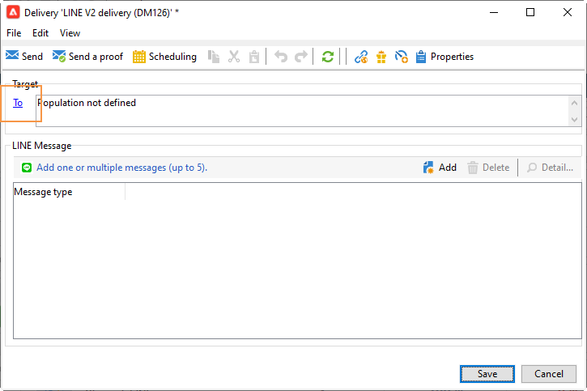
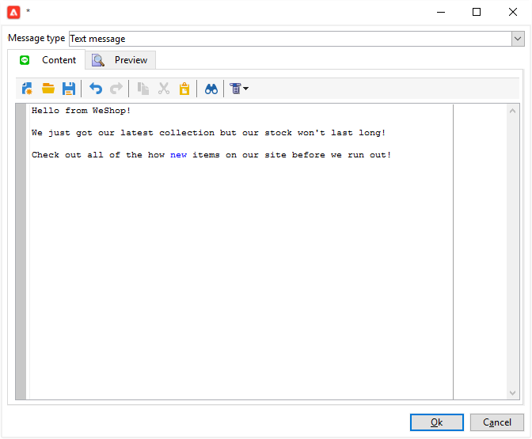
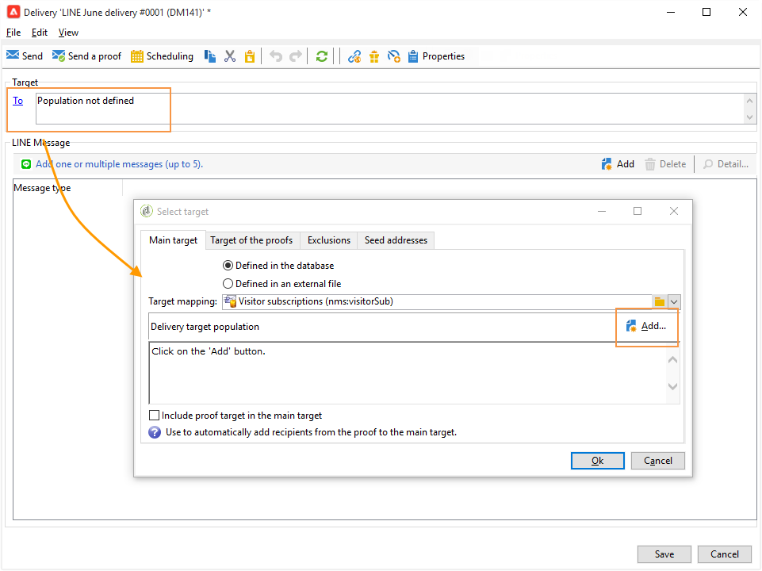

# LINE 게재 만들기

LINE은 모든 모바일 디바이스와 PC에서 사용할 수 있는 무료 인스턴트 메시지, 음성 및 영상 통화용 애플리케이션입니다. Adobe Campaign을 사용하여 LINE 메시지를 보낼 수 있습니다.

[!DNL LINE]을(를) 트랜잭션 메시지 모듈과 결합하여 소비자 모바일 장치에 설치된 [!DNL LINE] 앱에서 실시간 메시지를 보낼 수도 있습니다. 자세한 내용은 Campaign Classic v7 설명서에서 이 [페이지](https://experienceleague.adobe.com/en/docs/campaign-classic/using/transactional-messaging/configure-transactional-messaging/transactional-messaging-architecture#transactional-messaging-and-line)를 참조하세요.

[!DNL LINE] 채널을 사용하는 단계는 다음과 같습니다.

1. [LINE 채널 설정](#setting-up-line-channel)
1. [게재 만들기](#creating-the-delivery)
1. [콘텐츠 유형 구성](#defining-the-content)
1. [게재 모니터링(추적, 격리, 보고서 등)](#accessing-reports)

## LINE 채널 설정 {#setting-up-line-channel}

[!DNL LINE] 계정 및 외부 계정을 만들기 전에 인스턴스에 LINE 패키지를 설치해야 합니다. Adobe 담당자에게 문의하십시오.

먼저 [!DNL LINE] 계정을 만들어야 Adobe Campaign에 연결할 수 있습니다. 그런 다음 모바일 애플리케이션에서 [!DNL LINE] 계정을 추가한 사용자에게 [!DNL LINE]개의 메시지를 보낼 수 있습니다. 외부 계정 및 [!DNL LINE] 계정은 플랫폼의 기능 관리자만 관리할 수 있습니다.

[!DNL LINE] 계정을 만들고 구성하려면 [LINE 개발자 설명서](https://developers.line.me/)를 참조하십시오.

### LINE 서비스 만들기 및 구성 {#configure-line-service}

[!DNL LINE] 서비스를 만들려면:

1. Adobe Campaign Classic 홈 페이지에서 **[!UICONTROL Profiles and Targets]** 탭을 선택합니다.

1. 왼쪽 메뉴에서 **[!UICONTROL Services and Subscriptions]**&#x200B;을(를) 선택하고 **[!UICONTROL Create]**&#x200B;을(를) 클릭합니다.

   

1. 새 서비스에 **[!UICONTROL Label]** 및 **[!UICONTROL Internal name]**&#x200B;을(를) 추가합니다.

1. **[!UICONTROL LINE]** 드롭다운에서 **[!UICONTROL Type]** 선택.

   

1. **[!UICONTROL Save]**&#x200B;을(를) 클릭합니다.

구독 및 서비스에 대한 자세한 내용은 [구독 관리](../../start/subscriptions.md)를 참조하십시오.

### LINE 외부 계정 구성 {#configure-line-external}

[!DNL LINE] 서비스를 만든 후 Adobe Campaign에서 [!DNL LINE] 외부 계정을 구성해야 합니다.

1. **[!UICONTROL Administration]** > **[!UICONTROL Platform]** 트리 구조에서 **[!UICONTROL External Accounts]** 탭을 클릭합니다.

1. 기본 제공 **[!UICONTROL LINE V2 routing]** 외부 계정을 선택하십시오.

   

1. 외부 계정의 구성을 시작하려면 외부 계정에서 **[!UICONTROL LINE]** 탭을 클릭하십시오. 다음 필드를 채웁니다.

   

   * **[!UICONTROL Channel Alias]**: [!DNL LINE] > **[!UICONTROL Channels]** 탭에서 **[!UICONTROL Technical configuration]** 계정을 통해 제공됩니다.
   * **[!UICONTROL Channel ID]**: [!DNL LINE] > **[!UICONTROL Channels]** 탭에서 **[!UICONTROL Basic Information panel]** 계정을 통해 제공됩니다.
   * **[!UICONTROL Channel secret key]**: [!DNL LINE] > **[!UICONTROL Channels]** 탭에서 **[!UICONTROL Basic Information panel]** 계정을 통해 제공됩니다.
   * **[!UICONTROL Access token]**: 개발자 포털의 [!DNL LINE] 계정을 통해 또는 **[!UICONTROL Get access token]** 단추를 클릭하여 제공됩니다.
   * **[!UICONTROL Access token expiration date]**: 액세스 토큰의 만료 날짜를 지정할 수 있습니다.
   * **[!UICONTROL LINE subscription service]**: 사용자가 구독할 서비스를 지정할 수 있습니다.

1. 구성이 완료되면 **[!UICONTROL Save]**&#x200B;을(를) 클릭합니다.

1. **[!UICONTROL Explorer]**&#x200B;에서 **[!UICONTROL Administration]** > **[!UICONTROL Production]** > **[!UICONTROL Technical workflows]** > **[!UICONTROL LINE workflows]**&#x200B;을(를) 선택하여 **[!UICONTROL LINE V2 access token update (updateLineAccessToken)]** 및 **[!UICONTROL Delete blocked LINE users (deleteBlockedLineUsers)]** 워크플로우가 시작되었는지 확인합니다.

이제 [!DNL LINE]이(가) Adobe Campaign에 구성되었으므로 LINE 게재를 만들어 구독자에게 보낼 수 있습니다.

## LINE 게재 만들기 {#creating-the-delivery}

>[!NOTE]
>
>[!DNL LINE] 게재를 새 받는 사람에게 처음 보낼 때 사용 약관 및 동의와 관련된 공식 LINE 메시지를 게재에 추가해야 합니다. 공식 메시지는 [다음 링크](https://terms.line.me/OA_privacy/)에서 사용할 수 있습니다.

[!DNL LINE] 게재를 만들려면 다음 단계를 수행해야 합니다.

1. **[!UICONTROL Campaigns]** 탭에서 **[!UICONTROL Deliveries]**&#x200B;을(를) 선택한 다음 **[!UICONTROL Create]** 단추를 클릭합니다.

   

1. **[!UICONTROL LINE V2 delivery]** 게재 템플릿을 선택하십시오.

   

1. **[!UICONTROL Label]**, **[!UICONTROL Delivery code]** 및 **[!UICONTROL Description]**(으)로 게재를 식별합니다. 이 작업에 대한 자세한 정보는 [이 섹션](../../start/create-message.md#create-the-delivery)을 참조하십시오.

1. **[!UICONTROL Continue]**&#x200B;을(를) 클릭하여 게재를 만듭니다.

1. 게재 편집기에서 **[!UICONTROL To]**&#x200B;을(를) 선택하여 [!DNL LINE] 게재의 수신자를 타겟팅합니다. 타깃팅은 **[!UICONTROL Visitor subscriptions (nms:visitorSub)]**&#x200B;에 수행됩니다.

   자세한 정보는 [이 페이지](../../audiences/target-mappings.md)를 참조하십시오.

   

1. **[!UICONTROL Add]**&#x200B;을(를) 클릭하여 **[!UICONTROL Delivery target population]**&#x200B;을(를) 선택합니다.

   

1. [!DNL LINE] 구독자를 직접 타겟팅할지 또는 [!DNL LINE] 구독에 따라 사용자를 타겟팅할지 선택하고 **[!UICONTROL Next]**&#x200B;을(를) 클릭합니다. 이 예제에서는 **[!UICONTROL By LINE V2 subscription]**&#x200B;을(를) 선택했습니다.

1. **[!UICONTROL Line-V2]** 드롭다운에서 **[!UICONTROL Folder]**&#x200B;을(를) 선택한 다음 [!DNL LINE] 서비스를 선택합니다. 게재를 개인화하려면 **[!UICONTROL Finish]**&#x200B;을(를) 클릭한 다음 **[!UICONTROL Ok]**&#x200B;을(를) 클릭합니다.

   

1. 게재 편집기에서 **[!UICONTROL Add]**&#x200B;을(를) 클릭하여 하나 이상의 메시지를 추가하고 **[!UICONTROL Content type]**&#x200B;을(를) 선택합니다.

   사용 가능한 다른 **[!UICONTROL Content type]**&#x200B;에 대한 자세한 내용은 [콘텐츠 형식 정의](#defining-the-content)를 참조하세요.

   

1. 게재가 올바르게 생성 및 구성되면 이전에 정의된 타겟으로 보낼 수 있습니다.

   게재 전송에 대한 자세한 내용은 [메시지 보내기](../configure-and-send.md)를 참조하세요.

1. 메시지를 보낸 후 보고서에 액세스하여 게재의 효과를 측정합니다.

   [!DNL LINE] 보고서에 대한 자세한 내용은 [보고서 액세스](#accessing-reports)를 참조하세요.

## 콘텐츠 유형 정의 {#defining-the-content}

[!DNL LINE] 게재의 콘텐츠를 정의하려면 먼저 메시지 유형을 게재에 추가해야 합니다. 각 [!DNL LINE] 게재에는 최대 5개의 메시지가 포함될 수 있습니다.

다음 세 가지 메시지 유형 중에서 선택할 수 있습니다.

* [텍스트 메시지](#configuring-a-text-message-delivery)
* [이미지 및 링크](#configuring-an-image-and-link-delivery)
* [비디오 메시지](#configuring-a-video-message-delivery)

### 문자 메시지 게재 구성 {#configuring-a-text-message-delivery}

>[!NOTE]
>
>`<%@ include option='NmsServer_URL' %>/webApp/APP3?id=<%=escapeUrl(cryptString(visitor.id))%>` 구문을 사용하면 LINE 메시지에 웹 앱에 대한 링크를 포함할 수 있습니다.

**[!UICONTROL Text message]** [!DNL LINE] 게재는 텍스트 양식으로 받는 사람에게 보내는 메시지입니다.

이 유형의 메시지에 대한 구성은 전자 메일의 **[!UICONTROL Text]** 구성과 유사합니다. 자세한 정보는 이 [페이지](../defining-the-email-content.md#message-content)를 참조하세요.

### 이미지 및 링크 전달 구성 {#configuring-an-image-and-link-delivery}

**[!UICONTROL Image and link]** [!DNL LINE] 게재는 하나 이상의 URL이 포함될 수 있는 이미지 형식으로 받는 사람에게 보내는 메시지입니다.

다음을 사용할 수 있습니다.

* **[!UICONTROL Personalized image]**,

  >[!NOTE]
  >
  >**%SIZE%** 변수를 사용하여 받는 사람의 모바일 장치의 화면 크기에 따라 이미지 표시를 최적화할 수 있습니다.

  

* 장치 화면 크기당 **[!UICONTROL Image URL]**,

  

  **[!UICONTROL Define images per device screen size]** 옵션을 사용하면 다양한 이미지 해상도를 사용하여 모바일 장치에서 게재 가시성을 최적화할 수 있습니다. 높이와 너비가 같은 이미지만 지원됩니다.

  이미지는 화면 크기에 따라 정의할 수 있습니다.

   * 1040픽셀
   * 700픽셀
   * 460픽셀
   * 300픽셀
   * 240픽셀

  >[!CAUTION]
  >
  >1040x1040 픽셀 크기는 링크가 있는 모든 LINE 이미지에 필수입니다.

  그런 다음 수신자의 모바일 장치에 표시되는 대체 텍스트를 추가해야 합니다.

* 및 **[!UICONTROL Links]**.

  **[!UICONTROL Links]** 섹션을 사용하면 클릭 가능한 여러 영역에 이미지를 분할할 다른 레이아웃 중에서 선택할 수 있습니다. 그런 다음 각 사용자에게 전용 **[!UICONTROL Link URL]**&#x200B;을(를) 할당할 수 있습니다.

  

### 비디오 메시지 게재 구성 {#configuring-a-video-message-delivery}

**[!UICONTROL Video message]** [!DNL LINE] 게재는 URL을 포함할 수 있는 비디오 형식으로 받는 사람에게 보내는 메시지입니다.

**[!UICONTROL Preview Image URL]** 필드를 사용하면 문자 제한이 1,000인 미리 보기 이미지의 URL을 추가할 수 있습니다. JPEG 및 PNG는 파일 크기가 1MB로 제한되어 지원됩니다.

**[!UICONTROL Video Image URL]** 필드를 사용하면 문자 제한이 1,000인 비디오 파일의 URL을 추가할 수 있습니다. mp4 형식만 지원되며 파일 크기는 200MB로 제한됩니다.

일부 장치에서 재생할 때 넓은 비디오나 높은 비디오를 자를 수 있습니다.

## 보고서 액세스 {#accessing-reports}

게재를 보낸 후 [!DNL LINE]에서 메뉴 **[!UICONTROL Campaign Management]** > **[!UICONTROL Deliveries]**&#x200B;을(를) 통해 **[!UICONTROL Explorer]** 보고서를 볼 수 있습니다.

>[!NOTE]
>
>추적 보고서는 클릭스루 비율을 나타냅니다. [!DNL LINE]은(는) 열람율을 고려하지 않습니다.

[!DNL LINE] 서비스 보고서의 경우 **[!UICONTROL Profiles and Targets]** 탭에서 **[!UICONTROL Services and Subscriptions]** > **[!UICONTROL LINE-V2]** > **[!UICONTROL Explorer]** 메뉴에 액세스합니다. 그런 다음 **[!UICONTROL Reports]** 서비스에서 [!DNL LINE] 아이콘을 클릭합니다.

## 예: 개인화된 LINE 메시지 만들기 및 보내기 {#example--create-and-send-a-personalized-line-message}

이 예제에서는 수신자에 따라 개인화될 데이터가 포함된 이미지와 문자 메시지를 만들고 만들려고 합니다.

1. [!DNL LINE] 탭에서 **[!UICONTROL Create]** 단추를 클릭하여 **[!UICONTROL Campaign]** 게재를 만듭니다.

   

1. **[!UICONTROL LINE V2 delivery]** 게재 템플릿을 선택하고 게재 이름을 지정합니다.

   

1. 게재 구성 창에서 대상 모집단을 선택합니다.

   자세한 내용은 [대상 모집단 식별](../../start/create-message.md#target-population)을 참조하세요.

   

1. **[!UICONTROL Add]**&#x200B;을(를) 클릭하여 메시지를 만들고 **[!UICONTROL Content type]**&#x200B;을(를) 선택합니다.

   먼저 **[!UICONTROL Text message]**&#x200B;을(를) 만듭니다.

   

1. 개인화된 텍스트를 삽입할 위치에 커서를 놓고 드롭다운 아이콘을 클릭한 다음 **[!UICONTROL Visitor]** > **[!UICONTROL First name]**&#x200B;을(를) 선택합니다.

   

1. 동일한 절차에 따라 이미지를 추가하고 **[!UICONTROL Image and links]** 드롭다운에서 **[!UICONTROL Message type]**&#x200B;을(를) 선택합니다.

   **[!UICONTROL Image URL]**&#x200B;을(를) 추가합니다.

   

1. **[!UICONTROL Links]** 섹션에서 클릭 가능한 여러 영역에 이미지를 분할할 레이아웃을 선택합니다.

1. 이미지의 각 영역에 URL을 지정합니다.

   

1. 게재를 저장한 다음 **[!UICONTROL Send]**&#x200B;을(를) 클릭하여 분석하여 타겟으로 보냅니다.

   게재가 타겟에게 전송됩니다.

   

