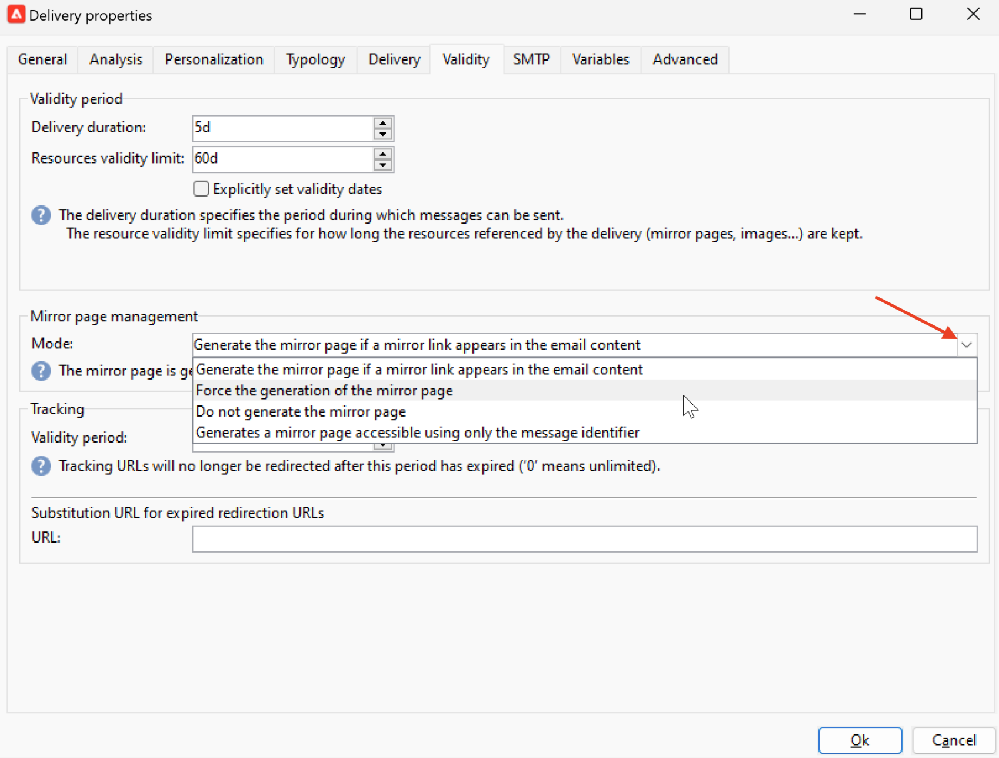
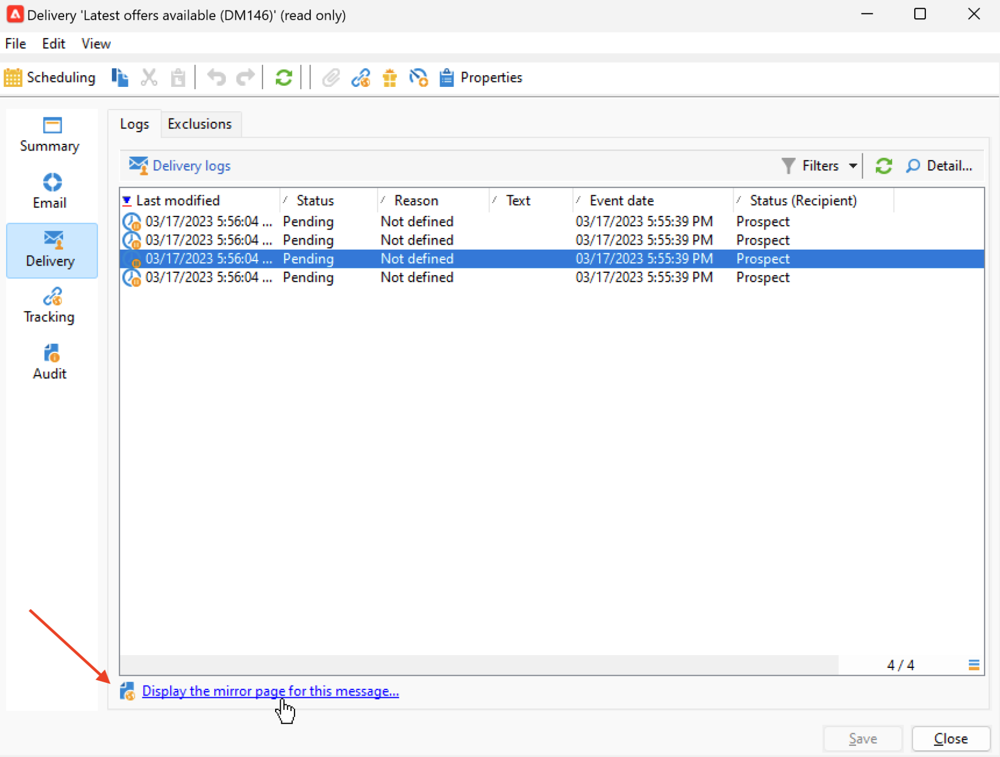

# 미러 페이지로 가는 링크 {#mirror-page}

## 미러 페이지 정보 {#about-mirror-page}

미러 페이지는 이메일의 온라인 버전입니다.

대부분의 이메일 클라이언트는 문제 없이 이미지를 렌더링하지만 일부 사전 설정 사용 시 보안상의 이유로 이미지를 표시하지 못할 수도 있습니다. 받은 편지함에서 이메일을 보려고 할 때 렌더링에 실패하거나 이미지가 깨지는 등의 문제가 발생하는 경우, 사용자는 이메일의 미러 페이지를 대신 탐색할 수 있습니다. 접근성 개선을 개선하거나 소셜 공유를 장려하기 위해서도 온라인 버전을 제공하는 것이 좋습니다.

Adobe Campaign에서 생성한 미러 페이지에는 모든 개인화 데이터가 포함되어 있습니다.

{width="600" align="left"}

## 미러 페이지에 대한 링크 추가 {#link-to-mirror-page}

미러 페이지에 대한 링크를 삽입하는 것이 좋습니다. 이 링크는 예컨대 “브라우저에서 이 이메일 보기” 또는 “온라인에서 읽기”일 수 있으며, 이메일의 머리글이나 바닥글에 있는 경우가 많습니다.

Adobe Campaign에서는 전용 **개인 맞춤화 블록**&#x200B;을 사용하여 이메일 콘텐츠에 미러 페이지에 대한 링크를 삽입할 수 있습니다. 기본 제공 **미러 페이지 링크** 개인 맞춤화 블록은 이메일 콘텐츠에 다음 코드를 삽입합니다. `<%@ include view='MirrorPage' %>`

{width="800" align="left"}

개인화 콘텐츠 블록 삽입에 대한 자세한 내용은 [개인화 블록](personalization-blocks.md)을 참조하세요.

## 미러 페이지 생성 관리 {#mirror-page-generation}

기본적으로 이메일 콘텐츠가 비어 있지 않고 미러 페이지에 대한 링크(미러 링크)가 포함된 경우 Adobe Campaign에서 미러 페이지가 자동으로 생성됩니다.

사용자는 이메일 미러 페이지의 생성 모드를 제어할 수 있습니다. 옵션은 게재 속성에서 사용할 수 있습니다. 다음 옵션에 액세스하려면:

1. 전자 메일 속성의 **[!UICONTROL Validity]** 탭으로 이동합니다.
1. **미러 페이지 관리** 섹션에서 **[!UICONTROL Mode]** 드롭다운 목록을 확인하십시오.

{width="800" align="left"}

기본 모드 외에 다음 옵션을 사용할 수 있습니다.

* **[!UICONTROL Force the generation of the mirror page]**: 게재에 미러 페이지 링크가 삽입되지 않은 경우에도 이 모드를 사용하여 미러 페이지를 생성하십시오.
* **[!UICONTROL Do not generate the mirror page]**: 링크가 게재에 있더라도 미러 페이지를 생성하지 않도록 하려면 이 모드를 사용하십시오.
* **[!UICONTROL Generates a mirror page accessible using only the message identifier]**: 미러 페이지 링크가 전자 메일 콘텐츠에 없는 경우 이 옵션을 사용하여 아래 설명된 대로 게재 로그 창에서 미러 페이지의 콘텐츠에 액세스할 수 있도록 설정하십시오.

## 수신자에 대한 미러 페이지 확인 {#mirror-page-access}

개인화 데이터를 사용하여 게재의 특정 수신자에 대한 미러 페이지의 콘텐츠에 액세스할 수 있습니다.

이 미러 페이지에 액세스하려면:

1. 게재가 전송되면 게재를 열고 **[!UICONTROL Delivery]** 탭으로 이동합니다.

1. 받는 사람을 선택하고 **[!UICONTROL Display the mirror page for this message...]** 링크를 클릭합니다.

   {width="800" align="left"}

   선택한 수신자에 대한 개인화 데이터가 포함된 전용 화면에 미러 페이지가 표시됩니다.
