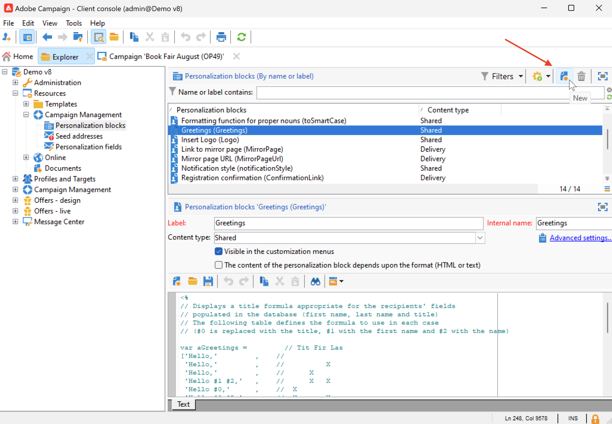

# 개인화 블록 사용{#personalization-blocks}

개인화 블록은 게재에 삽입할 수 있는 특정 렌더링을 포함하는 동적 콘텐츠입니다. 예를 들어 미러 페이지에 로고, 인사말 메시지 또는 링크를 추가할 수 있습니다.

개인화된 콘텐츠 블록에 액세스하려면 탐색기의 **[!UICONTROL Resources > Campaign Management > Personalization blocks]** 노드로 이동하십시오. 기본 제공 개인화 블록은 [이 섹션](#ootb-personalization-blocks)에 나열됩니다.

게재 개인화를 최적화하기 위해 새 블록을 정의할 수도 있습니다. [자세히 알아보기](#create-custom-personalization-blocks).

## 개인화 블록 삽입 {#insert-personalization-blocks}

메시지에 개인화 블록을 삽입하려면 아래 단계를 수행합니다.

1. 게재 마법사의 콘텐츠 편집기에서 개인화 아이콘을 클릭하고 **[!UICONTROL Include]** 메뉴를 선택합니다.
1. 목록에서 개인화 블록을 선택하거나 **[!UICONTROL Other...]** 메뉴를 클릭하여 전체 목록에 액세스합니다.

   

1. 그런 다음 개인화 블록이 스크립트로 삽입됩니다. 개인화가 생성되면 수신자 프로필에 자동으로 조정됩니다.
1. **[!UICONTROL Preview]** 탭으로 이동하여 특정 받는 사람에 대한 이 블록의 콘텐츠를 볼 받는 사람을 선택하십시오.

게재 콘텐츠에 개인화 블록의 소스 코드를 포함할 수 있습니다. 이렇게 하려면 선택할 때 **[!UICONTROL Include the HTML source code of the block]**&#x200B;을(를) 선택합니다.

## 기본 제공 개인화 블록 {#ootb-personalization-blocks}

기본 제공 개인화 블록은 다음과 같습니다.

* **[!UICONTROL Enabled by Adobe Campaign]**: &quot;Adobe Campaign 사용&quot; 로고를 삽입합니다.
* **[!UICONTROL Formatting function for proper nouns]**: 각 단어의 첫 글자를 대문자로 변경하는 **[!UICONTROL toSmartCase]** Javascript 함수를 생성합니다.
* **[!UICONTROL Greetings]**: 받는 사람의 전체 이름 뒤에 쉼표가 있는 인사말을 삽입합니다. 예: “안녕하세요 John Doe 님,”
* **[!UICONTROL Insert logo]**: 인스턴스 설정에 정의된 로고를 삽입합니다.
* **[!UICONTROL Link to mirror page]**: [미러 페이지](mirror-page.md)에 대한 링크를 삽입합니다. 기본 형식은 “이 메시지가 제대로 표시되지 않는 경우 여기를 클릭하십시오.”입니다.
* **[!UICONTROL Mirror page URL]**: 게재 디자이너가 링크를 확인할 수 있도록 미러 페이지 URL을 삽입합니다.
* **[!UICONTROL Offer acceptance URL in unitary mode]**: 오퍼를 **[!UICONTROL Accepted]**(으)로 설정할 수 있는 URL을 삽입합니다. 상호 작용 모듈이 활성화된 경우 이 블록을 사용할 수 있습니다.
* **[!UICONTROL Registration confirmation]**: 가입을 확인하는 데 사용할 수 있는 링크를 삽입합니다.
* **[!UICONTROL Registration link]**: 구독 링크를 삽입합니다. 이 링크는 인스턴스 설정에서 정의됩니다. 기본 콘텐츠는 “등록하려면 여기를 클릭하십시오.”입니다.
* **[!UICONTROL Registration link (with referrer)]**: 구독 링크를 삽입하여 방문자와 게재를 식별할 수 있도록 합니다. 이 링크는 인스턴스 설정에서 정의됩니다.
* **[!UICONTROL Registration page URL]**: 구독 URL을 삽입합니다
* **[!UICONTROL Style of content emails]** 및 **[!UICONTROL Notification style]**: 미리 정의된 HTML 스타일을 사용하여 전자 메일의 서식을 지정하는 코드를 생성합니다.
* **[!UICONTROL Unsubscription link]**: 모든 게재 구독 취소(차단 목록에 추가하다)를 가능하게 하는 링크를 삽입합니다. 기본 관련 콘텐츠는 다음과 같습니다. “귀하가 ***조직 이름***&#x200B;의 소식을 받고 있거나 제휴를 맺고 있기 때문에 이 메시지가 전송되었습니다. 더 이상 ***조직 이름***&#x200B;에서 메시지를 받지 않으려면 여기를 클릭하십시오.”

## 사용자 지정 개인화 블록 만들기 {#create-custom-personalization-blocks}

개인화 아이콘에서 삽입할 새로운 개인화된 콘텐츠 블록을 정의할 수 있습니다.

개인화 블록을 만들려면 아래 단계를 수행합니다.

1. Campaign 탐색기의 **[!UICONTROL Resources > Campaign Management > Personalization blocks]** 폴더를 찾습니다.
1. 기본 제공 블록 목록 위에서 **[!UICONTROL New]**&#x200B;을(를) 클릭합니다.

   

1. 개인화 블록의 설정을 입력합니다.

   

   * 블록의 레이블을 입력합니다. 이 레이블은 개인화 필드 삽입 창에 표시됩니다.
   * **게재** 콘텐츠 형식을 선택하십시오.
   * 개인화 필드 삽입 아이콘에서 이 블록에 액세스할 수 있도록 하려면 **[!UICONTROL Visible in the customization menus]** 옵션을 활성화하십시오.
   * 필요한 경우 **[!UICONTROL The content of the personalization block depends upon the format]** 옵션을 활성화하여 HTML 및 텍스트 전자 메일에 대해 서로 다른 두 개의 블록을 정의합니다.
   * 개인화 블록의 콘텐츠(HTML, 텍스트, JavaScript 등)를 입력하고 **[!UICONTROL Save]**&#x200B;을(를) 클릭합니다.

저장하면 게재 편집기에서 새 개인화 블록을 사용할 수 있습니다.

## 튜토리얼 비디오 {#personalization-blocks-video}

다음 비디오에서는 다이내믹 콘텐츠 블록을 만드는 방법과 이 블록을 사용하여 이메일 게재 콘텐츠를 개인화하는 방법을 알아봅니다.

>[!VIDEO](https://video.tv.adobe.com/v/342088?quality=12)
