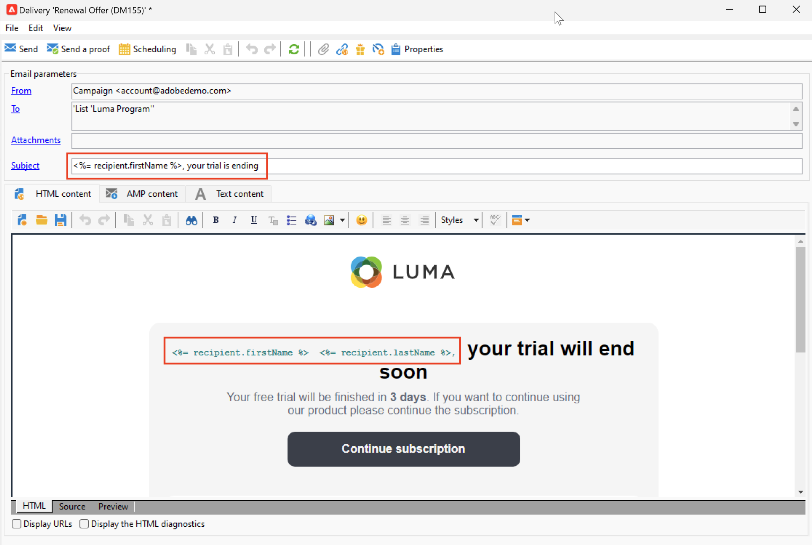

# 개인화 필드 추가{#personalization-fields}

개인화 필드를 사용하여 각 수신자에 대해 설정한 규칙을 기반으로 개인화된 콘텐츠를 일대일로 전달합니다.

개인화 필드는 특정 수신자에 대한 게재를 개인화할 때 사용되는 단일 데이터 필드 참조입니다. 게재 분석 단계 중에 실제 데이터 값이 삽입됩니다.

## 구문

개인화 태그는 항상 `<%=table.field%>` 구문을 사용합니다.

예를 들어 수신자 테이블에 저장된 수신자 이름을 삽입하려면 개인화 필드에서 `<%= recipient.lastName %>` 구문을 사용합니다.

>[!CAUTION]
>
>개인화 필드 콘텐츠는 1,024자를 초과할 수 없습니다.

## 개인화 필드 삽입 {#insert-a-personalization-field}

개인화 필드를 삽입하려면 헤더, 제목 또는 메시지 본문 필드에서 액세스할 수 있는 드롭다운 아이콘을 클릭합니다.

개인화 필드가 삽입되며 Adobe Campaign에 의해 해석될 준비가 되었습니다. 메시지를 준비하는 동안 필드는 지정된 수신자에 대한 해당 값으로 대체됩니다.

전자 메일의 

그런 다음 **[!UICONTROL Preview]** 탭에서 이 대체 항목을 테스트할 수 있습니다.

<!--Learn more about message preview in [this page]().-->

## 사용 사례: 이메일 제목 개인화 {#personalization-fields-uc}

아래 사용 사례에서는 수신자 데이터를 사용하여 이메일 제목 및 본문을 개인화하는 방법을 알아봅니다.

1. 새 게재를 만들거나 기존 이메일 게재를 엽니다.
1. **[!UICONTROL Subject]** 링크로 이동하여 메시지 제목을 편집합니다.
1. &quot; **특별 오퍼 for**&quot;을(를) 입력하고 도구 모음의 단추를 사용하여 개인화 필드를 삽입합니다. **[!UICONTROL Recipients>Title]**&#x200B;을(를) 선택합니다.
1. 받는 사람의 이름을 삽입하려면 작업을 반복합니다. 모든 개인화 필드 사이에 공백을 삽입합니다.
1. 유효성을 검사하려면 **[!UICONTROL OK]**&#x200B;을(를) 클릭하십시오.
1. 메시지 본문에 개인화를 삽입합니다. 이렇게 하려면 메시지 콘텐츠를 클릭하고 필드 삽입 버튼을 클릭합니다.
1. **[!UICONTROL Recipient>Other...]**&#x200B;을(를) 선택합니다.
1. 표시할 정보가 있는 필드를 선택하고 **[!UICONTROL OK]**&#x200B;을(를) 클릭합니다.
1. 개인화 결과를 보려면 **[!UICONTROL Preview]** 탭을 클릭하십시오. 수신자의 메시지를 표시할 수신자를 선택해야 합니다.

## 튜토리얼 비디오 {#personalization-field-video}

다음 비디오에서는 제목 줄과 이메일 게재 콘텐츠에 개인화 필드를 추가하는 방법을 알아봅니다.

>[!VIDEO](https://video.tv.adobe.com/v/31879?quality=12&captions=kor)
