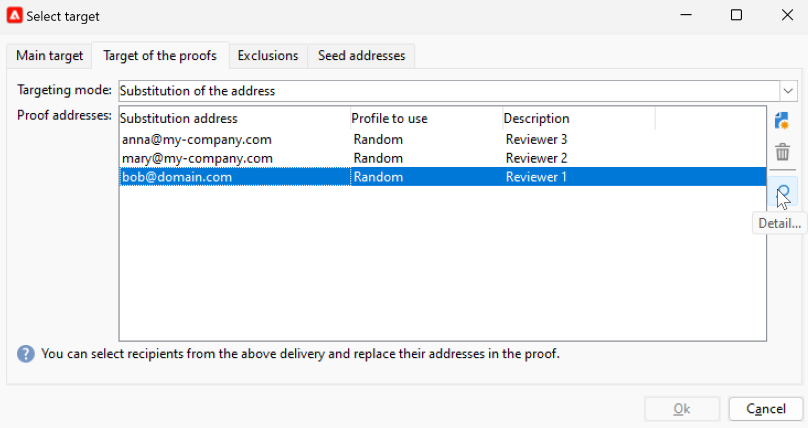

# 이메일 미리보기 및 테스트 {#preview-test}

메시지가 정의되면 테스트 프로필을 사용하여 미리 보고 테스트할 수 있습니다. 를 삽입한 경우 [개인화된 콘텐츠](personalize.md), 테스트 프로필 데이터를 사용하여 이 콘텐츠가 메시지에 어떻게 표시되는지 확인할 수 있습니다. 또한 메시지 콘텐츠나 개인화 설정에서 발생할 수 있는 오류를 탐지하려면 테스트 프로필로 증명을 보냅니다. 최신 콘텐츠의 유효성을 검사하려면 변경 사항이 있을 때마다 증명을 보내야 합니다.

## 콘텐츠 미리보기{#preview-content}

증명을 보내기 전에 게재 창의 미리보기 섹션에서 메시지 콘텐츠를 확인하는 것이 좋습니다.

메시지 콘텐츠를 미리 보려면 아래 단계를 따르십시오.

1. 다음으로 이동 **미리 보기** 게재 탭.
1. 다음을 클릭합니다. **[!UICONTROL Test personalization]** 버튼을 클릭하여 개인화 데이터를 채울 프로필을 선택합니다. 데이터베이스에서 특정 수신자를 선택하거나 시드 주소를 선택하거나 대상 모집단에서 프로필을 선택할 수 있습니다(이미 정의된 경우). 개인화하지 않고 콘텐츠를 확인할 수도 있습니다.

   

1. 메시지 렌더링을 확인할 수 있도록 미리 보기가 생성됩니다. 메시지 미리 보기에서 개인화된 요소는 선택한 테스트 프로필 데이터로 바뀝니다.

   

1. 다른 테스트 프로필을 선택하여 메시지의 각 변형에 대한 이메일 렌더링을 미리 봅니다.

## 증명 보내기 {#send-proofs}

이메일 게재의 경우 증명을 전송하여 메시지 콘텐츠를 확인할 수 있습니다. 증명을 보내면 옵트아웃 링크, 미러 페이지 및 기타 링크를 확인하고, 메시지의 유효성을 검사하고, 이미지가 표시되는지 확인하고, 가능한 오류를 감지하는 등의 작업을 수행할 수 있습니다. 다른 장치에서 디자인과 렌더링을 확인할 수도 있습니다.

증명은 메시지를 주요 대상에게 보내기 전에 테스트할 수 있는 특정 메시지입니다. 증명 수신자는 메시지 승인(렌더링, 콘텐츠, 개인화 설정, 구성)을 담당합니다.

### 증명 수신자 {#proofs-recipients}

증명 타겟은 게재 템플릿에서 정의하거나 게재별로 정의할 수 있습니다. 두 경우 모두 **[!UICONTROL To]** 링크를 클릭하고 **[!UICONTROL Target of the proofs]** 탭.

증명 대상 유형이 다음 중 선택됨: **[!UICONTROL Targeting mode]** 드롭다운 목록입니다.

* 사용 **[!UICONTROL Definition of a specific proof target]** 데이터베이스에서 증명 대상으로 수신자를 선택하는 옵션입니다.
* 사용 **[!UICONTROL Substitution of the address]** 이메일 주소를 입력하고 target 수신자 데이터를 사용하여 콘텐츠의 유효성을 검사하는 옵션입니다. 대체 주소는 수동으로 입력하거나 드롭다운 목록에서 선택할 수 있습니다. 연결된 열거형은 대체 주소(rcpAddress)입니다.
기본적으로 대체는 무작위로 수행되지만, 기본 타겟에서 다음을 통해 특정 수신자를 선택할 수 있습니다.  **[!UICONTROL Detail]** 아이콘.

   {width="800" align="left"}

   다음을 선택합니다. **[!UICONTROL Select a profile (must be included in the target)]** 을(를) 선택하고 수신자를 선택합니다.

   {width="800" align="left"}

* 사용 **[!UICONTROL Seed addresses]**  시드 주소를 증명 대상으로 사용하는 옵션입니다. 이러한 주소는 파일에서 가져오거나 수동으로 입력할 수 있습니다.

   >[!NOTE]
   >
   >시드 주소는 기본 수신자 테이블(nms:recipient)에 속하지 않으며, 별도의 테이블에 생성됩니다. 새 데이터로 수신자 테이블을 확장하는 경우 동일한 데이터로 시드 주소 테이블을 확장해야 합니다.

   의 시드 주소에 대해 자세히 알아보기 [Campaign Classic v7 설명서](https://experienceleague.adobe.com/docs/campaign-classic/using/sending-messages/using-seed-addresses/about-seed-addresses.html){target="_blank"}.

* 사용 **[!UICONTROL Specific target and Seed addresses]** 시드 주소와 특정 이메일 주소를 결합하는 옵션. 그런 다음 관련 구성이 두 개의 개별 하위 탭에서 정의됩니다.

### 증명 보내기{#proofs-send}

메시지 증명을 보내려면 아래 단계를 따르십시오.

1. 메시지 정의 화면에서 **[!UICONTROL Send a proof]** 단추를 클릭합니다.
1. 다음에서 **[!UICONTROL Send a proof]** 창에서 증명 수신자를 확인합니다.
1. 클릭 **[!UICONTROL Analyze]** 증명 메시지 준비를 시작합니다.

   {width="800" align="left"}

1. 게재 준비가 완료되면 **[!UICONTROL Confirm delivery]** 증명 메시지 보내기를 시작합니다.

다음으로 이동 **[!UICONTROL Audit]** 게재 탭 - 증명 사본 게재를 확인합니다.

메시지 콘텐츠를 수정할 때마다 증명을 보내는 것이 좋습니다.

>[!NOTE]
>
>보낸 증명에서 미러 페이지 링크가 활성화되지 않았습니다. 최종 메시지에서만 활성화됩니다.

### 증명 속성{#proofs-properties}

증명 속성은 다음 위치에 설정됩니다. **[!UICONTROL Advanced]** 게재 속성 창의 탭입니다. 다음으로 이동 **[!UICONTROL Proof properties...]** 링크하여 증명의 매개 변수와 레이블을 정의합니다. 다음을 유지하도록 선택할 수 있습니다.

* 증명 시 주소 복제
* 증명의 차단 목록에 추가된 주소
* 증명 시 격리된 주소

기본적으로 증명 메시지는 `Proof #N` 제목에 언급, 위치 `N` 는 증명 번호입니다. 이 숫자는 각 증명 게재 분석과 함께 증가합니다. 다음을 변경할 수 있습니다. `proof` 접두사로 사용됩니다.

{width="800" align="left"}

## 방법 비디오 {#video-proof}

이메일 게재에 대한 증명을 보내고 확인하는 방법을 알아봅니다.

>[!VIDEO](https://video.tv.adobe.com/v/333404)
