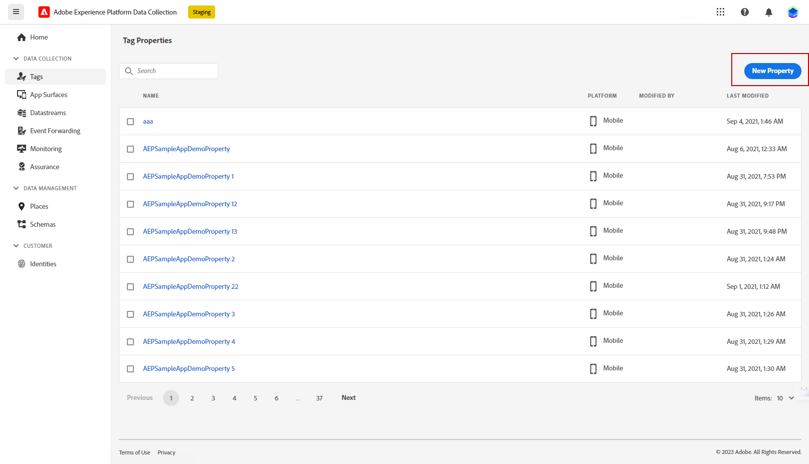
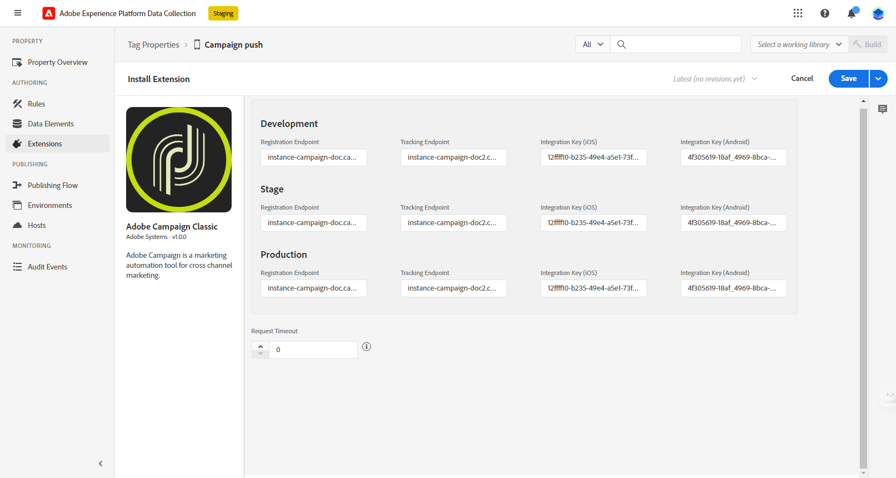

# 수정된 푸시 알림 구성 {#push-notifications-config}

Campaign v8.5는 최신 첨단 기술을 기반으로 구축된 강력한 프레임워크를 기반으로 하는 최신 푸시 알림 서비스를 도입했습니다. 이 서비스는 새로운 차원의 확장성을 제공하도록 설계되었으므로, 원활한 효율성으로 더 많은 대상자에게 알림이 전달될 수 있습니다. 향상된 인프라와 최적화된 프로세스를 통해 더 높은 규모와 신뢰성을 기대할 수 있으며, 이전과 달리 모바일 앱 사용자를 참여시키고 연결할 수 있는 역량을 확보할 수 있습니다.

>[!AVAILABILITY]
>
> 이 기능은 Campaign v8.5부터 시작하여 선택한 고객 세트로 점진적으로 배포되는 신규 고객에게만 제공됩니다. 2023년 6월 이전에 환경이 프로비저닝된 경우 이 페이지가 적용되지 않으므로 자세한 절차를 따라야 합니다 [이 페이지에서](push-settings.md).

이 업데이트된 구현의 맥락에서 Adobe Campaign에서 푸시 알림을 보내려면 다음 단계를 따르십시오.

1. [Adobe Experience Platform 데이터 수집에서 앱 표면 만들기](#create-app-surface)

1. [Adobe Campaign에서 애플리케이션 설정 구성](#push-config-campaign)

1. [Adobe Experience Platform 데이터 수집에서 모바일 속성 만들기 및 구성](#create-mobile-property)

1. [Adobe Adobe Experience Platform Assurance 확장 추가](https://developer.adobe.com/client-sdks/documentation/platform-assurance-sdk/){target="_blank"}(권장)

1. [모바일 애플리케이션에 Campaign Classic 추가](#campaign-mobile-ap)

1. [iOS 및 Android 모두에 대한 게재 만들기](##push-create)

>[!NOTE]
>
> 레거시 FCM 및 APNS p12는 데이터 수집에서 지원되지 않습니다.

## Adobe Experience Platform 데이터 수집에서 앱 표면 만들기 {#create-app-surface}

에서 모바일 애플리케이션 푸시 자격 증명을 추가해야 합니다. [!DNL Adobe Experience Platform Data Collection].

사용자를 대신하여 푸시 알림을 보낼 Adobe을 승인하려면 모바일 앱 푸시 자격 증명 등록이 필요합니다. 아래에 자세히 설명된 단계를 참조하십시오.

1. 출처: [!DNL Adobe Experience Platform Data Collection]를 선택하고 **[!UICONTROL App Surfaces]** 왼쪽 패널의 탭입니다.

1. 클릭 **[!UICONTROL Create App Surface]** 을 클릭하여 새 구성을 만듭니다.

   

1. 입력 **[!UICONTROL Name]** 구성.

1. 출처: **[!UICONTROL Mobile Application Configuration]**&#x200B;운영 체제를 선택합니다.

   * **iOS용**

     

      1. 모바일 앱 입력 **번들 ID** 다음에서 **[!UICONTROL App ID (iOS Bundle ID)]** 필드.

         앱 번들 ID는에서 찾을 수 있습니다. **일반** 의 기본 대상 탭 **XCode** Apple 개발자 계정

      1. 전환 **[!UICONTROL Push Credentials]** 자격 증명을 추가합니다.

      1. .p8 Apple 푸시 알림 인증 키 파일을 끌어서 놓습니다.

         이 키는 다음 위치에서 얻을 수 있습니다. **인증서**, **식별자** 및 **프로필** Apple 개발자 계정의 페이지입니다.

      1. 다음을 제공합니다 **키 ID**. p8 인증 키를 만드는 동안 할당된 10개의 문자열입니다.

         다음에서 찾을 수 있습니다 **키** 의 탭 **인증서**, **식별자** 및 **프로필** Apple 개발자 계정의 페이지입니다.

      1. 다음을 제공합니다 **팀 ID**. 문자열 값이며, 아래에 있습니다. **멤버십** 탭.

   * **Android용**

     

      1. 다음을 제공합니다 **[!UICONTROL App ID (Android package name)]**. 일반적으로 패키지 이름은 의 앱 ID입니다 `build.gradle` 파일.

      1. 전환 **[!UICONTROL Push Credentials]** 자격 증명을 추가합니다.

      1. FCM 푸시 자격 증명을 끌어서 놓습니다. 푸시 자격 증명을 가져오는 방법에 대한 자세한 내용은 을(를) 참조하십시오. [Google 설명서](https://firebase.google.com/docs/admin/setup#initialize-sdk){target="_blank"}.

1. 클릭 **[!UICONTROL Save]** 앱 구성을 만듭니다.

## Adobe Campaign에서 애플리케이션 설정 구성{#push-config-campaign}

### 서비스 만들기 {#create-service}

푸시 알림을 전송하기 전에 Adobe Campaign에서 iOS 및 Android 앱 설정을 정의해야 합니다.

푸시 알림은 전용 서비스를 통해 앱 사용자에게 전송됩니다. 사용자가 앱을 설치할 때 이 서비스에 가입합니다. Adobe Campaign은 이 서비스를 사용하여 앱 가입자만 타깃팅합니다. 이 서비스에서는 iOS 및 Android 장치에서 전송할 iOS 및 Android 앱을 추가해야 합니다.

푸시 알림을 전송하는 서비스를 만들려면 아래 단계를 수행하십시오.

1. 다음으로 이동 **[!UICONTROL Profiles and Targets > Services and Subscriptions]** 탭을 클릭하고 다음을 클릭합니다. **[!UICONTROL Create]**.

   {width="800" align="left"}

1. 입력 **[!UICONTROL Label]** 및 **[!UICONTROL Internal name]**&#x200B;을(를) 클릭하고 **[!UICONTROL Mobile application]** 유형.

   >[!NOTE]
   >
   >기본값 **[!UICONTROL Subscriber applications (nms:appSubscriptionRcp)]** 대상 매핑이 수신자 테이블에 연결됩니다. 다른 대상 매핑을 사용하려면 새 대상 매핑을 생성하고 **[!UICONTROL Target mapping]** 서비스 필드. 다음에서 대상 매핑에 대해 자세히 알아보기: [이 페이지](../audiences/target-mappings.md).

1. 그런 다음 **[!UICONTROL Add]** 아이콘을 클릭하면 이 서비스를 사용하는 모바일 애플리케이션을 정의할 수 있습니다.

   

### 모바일 애플리케이션 만들기 {#create-sapp}

서비스를 만든 후 이제 이 서비스를 사용할 모바일 애플리케이션을 정의해야 합니다.

>[!BEGINTABS]

>[!TAB iOS]

iOS 디바이스용 앱을 만들려면 다음 단계를 수행하십시오.

1. 서비스에서 를 클릭합니다. **[!UICONTROL Add]** 그런 다음 선택 **[!UICONTROL Create an iOS application]**. **[!UICONTROL Next]**&#x200B;를 클릭합니다.

   

1. 다음에서 **[!UICONTROL Launch app configurations list]** 창에서 이 섹션에서 이전에 만든 앱 표면을 선택합니다. **[!UICONTROL Next]**&#x200B;를 클릭합니다.

   

1. (선택 사항) 몇 가지 방법으로 푸시 메시지 콘텐츠를 보강할 수 있습니다 **[!UICONTROL Application variables]**. 이는 완전히 맞춤화가 가능하며 모바일 디바이스로 전송되는 메시지 페이로드의 일부입니다.

   아래 예에서는 **mediaURl** 및 **mediaExt** 변수가 추가되어 리치 푸시 알림을 만든 다음 애플리케이션에 알림 내에 표시할 이미지를 제공합니다.

   

1. 다음으로 이동 **[!UICONTROL Subscription parameters]** 탭을 사용하여 의 확장으로 매핑을 정의합니다. **[!UICONTROL Subscriber applications (nms:appsubscriptionRcp)]** 스키마.

1. 다음으로 이동 **[!UICONTROL Sounds]** 재생할 사운드를 정의하는 탭입니다. 클릭 **[!UICONTROL Add]** 및 채우기 **[!UICONTROL Internal name]** 응용 프로그램에 포함된 파일의 이름이나 시스템 사운드의 이름을 포함해야 하는 필드입니다.

1. 클릭 **[!UICONTROL Next]** 개발 응용 프로그램 구성을 시작합니다.

1. 다음 **[!UICONTROL Integration key]** 는 각 애플리케이션에 따라 다릅니다. 모바일 애플리케이션을 Adobe Campaign에 연결하며 Campaign 확장을 구성할 때 사용됩니다.

   동일한 **[!UICONTROL Integration key]** 는 Adobe Campaign 및 SDK를 통한 애플리케이션 코드에 정의되어 있습니다.

   다음에서 자세히 알아보기 [개발자 설명서](https://developer.adobe.com/client-sdks/documentation/adobe-campaign-classic/#configuration-keys){target="_blank"}

   >[!NOTE]
   >
   > 다음 **[!UICONTROL Integration key]** 는 문자열 값으로 완전히 사용자 지정할 수 있지만 SDK에 지정된 것과 정확히 동일해야 합니다.
   >
   > 애플리케이션의 개발 버전(샌드박스)과 프로덕션 버전에는 동일한 인증서를 사용할 수 없습니다.

   

1. 다음에서 아이콘을 선택합니다. **[!UICONTROL Application icon]** 서비스에서 모바일 애플리케이션을 개인화하는 필드입니다.

1. 클릭 **[!UICONTROL Next]** 프로덕션 애플리케이션 구성을 시작하고 위에 설명된 것과 동일한 단계를 수행합니다. 동일한 항목을 사용할 수 없습니다. **[!UICONTROL Integration key]** 애플리케이션의 개발 버전(샌드박스) 및 프로덕션 버전용입니다.

1. **[!UICONTROL Finish]**&#x200B;를 클릭합니다.

이제 iOS 애플리케이션을 Campaign에서 사용할 준비가 되었습니다.

>[!TAB Android]

Android 디바이스용 앱을 만들려면 다음 단계를 수행하십시오.

1. 서비스에서 를 클릭합니다. **[!UICONTROL Add]** 그런 다음 선택 **[!UICONTROL Create an Android application]**. **[!UICONTROL Next]**&#x200B;를 클릭합니다.

   

1. 다음에서 **[!UICONTROL Launch app configurations list]** 창에서 이 섹션에서 만든 앱 표면을 선택하고 **[!UICONTROL Next]**.

   

1. 통합 키는 각 애플리케이션에 따라 다릅니다. 모바일 애플리케이션을 Adobe Campaign에 연결하며 Campaign 확장을 구성할 때 사용됩니다.

   동일한 **[!UICONTROL Integration key]** 는 Adobe Campaign 및 SDK를 통한 애플리케이션 코드에 정의되어 있습니다.

   다음에서 자세히 알아보기 [개발자 설명서](https://developer.adobe.com/client-sdks/documentation/adobe-campaign-classic/#configuration-keys){target="_blank"}

   >[!NOTE]
   >
   > 다음 **[!UICONTROL Integration key]** 는 문자열 값으로 완전히 사용자 지정할 수 있지만 SDK에 지정된 것과 정확히 동일해야 합니다.

   

1. 다음에서 아이콘을 선택합니다. **[!UICONTROL Application icon]** 서비스에서 모바일 애플리케이션을 개인화하는 필드입니다.

1. (선택 사항) 몇 가지 방법으로 푸시 메시지 콘텐츠를 보강할 수 있습니다 **[!UICONTROL Application variables]** 필요한 경우. 이는 완전히 맞춤화가 가능하며 모바일 디바이스로 전송되는 메시지 페이로드의 일부입니다.

1. 다음으로 이동 **[!UICONTROL Subscription parameters]** 탭을 사용하여 의 확장으로 매핑을 정의합니다. **[!UICONTROL Subscriber applications (nms:appsubscriptionRcp)]** 스키마.

1. **[!UICONTROL Finish]**&#x200B;을(를) 클릭한 뒤 **[!UICONTROL Save]**&#x200B;을(를) 클릭합니다.

이제 Android 애플리케이션을 Campaign에서 사용할 준비가 되었습니다.

>[!ENDTABS]

다음은 푸시 알림을 추가로 개인화할 FCM 페이로드 이름입니다.

| 메시지 유형 | 구성 가능한 메시지 요소(FCM 페이로드 이름) | 구성 가능한 옵션(FCM 페이로드 이름) |
|:-:|:-:|:-:|
| 데이터 메시지 | N/A | validate_only |
| 알림 메시지 | 제목, 본문, android_channel_id, 아이콘, 사운드, 태그, 색상, click_action, 이미지, 티커, 고정, 가시성, notification_priority, notification_count   | validate_only |

## Adobe Experience Platform 데이터 수집에서 모바일 속성 구성 {#create-mobile-property}

1. 데이터 수집 홈페이지에서 태그 메뉴에 액세스합니다.

1. **[!UICONTROL New Property]**&#x200B;를 클릭합니다.

   

1. 속성의 이름을 입력하고 다음을 선택합니다. **[!UICONTROL Mobile]** 플랫폼으로

   

1. 클릭 **[!UICONTROL Save]** 모바일 속성을 만듭니다.

1. 새로 만든 모바일 속성에 액세스합니다.

1. 모바일 속성 대시보드에서 **[!UICONTROL Extensions]** 메뉴를 선택한 다음 **[!UICONTROL Catalog]** 탭.

   

1. 설치 **[!DNL Adobe Campaign Classic]** 확장명. [Campaign 확장에 대해 자세히 알아보기](https://developer.adobe.com/client-sdks/documentation/adobe-campaign-classic/#configure-campaign-classic-extension)

   

1. 인스턴스 세부 사항을 입력합니다.

   * **[!UICONTROL Registration endpoint]** 또는 **[!UICONTROL Tracking endpoint]** URL은 **[!UICONTROL Tools]** > **[!UICONTROL Advanced]** > **[!UICONTROL Deployment wizard]** campaign의 메뉴
   * **[!UICONTROL Integration keys]** 는에 구성된 모바일 앱에서 찾을 수 있습니다. [이 섹션](#create-app).

   

1. **[!UICONTROL Save]**&#x200B;를 클릭합니다.

1. 이제에서 구성을 게시해야 합니다. **[!UICONTROL Publishing flow]** 메뉴 아래의 제품에서 사용할 수 있습니다. [자세히 알아보기](https://developer.adobe.com/client-sdks/documentation/getting-started/create-a-mobile-property/#publish-the-configuration)

이제 모바일 속성이 과(와) 자동으로 동기화됩니다. **[!UICONTROL Adobe Experience Platform Data Collection]** 기술 워크플로우입니다. [자세히 알아보기](../../automation/workflow/technical-workflows.md#list-technical-workflows)

## 모바일 애플리케이션에 Campaign Classic 추가 {#campaign-mobile-app}

Adobe Experience Platform Mobile SDK는 모바일 앱에서 Adobe의 Experience Cloud 솔루션 및 서비스를 강화하는 데 도움이 됩니다. SDK 구성은 유연한 구성 및 확장 가능한 규칙 기반 통합을 위해 데이터 수집 UI를 통해 관리됩니다.

[Adobe Developer 설명서에서 자세히 알아보기](https://developer.adobe.com/client-sdks/documentation/adobe-campaign-classic/#add-campaign-classic-to-your-app){target="_blank"}.

## 푸시 알림 만들기{#push-create}

데이터 수집에서 모바일 애플리케이션을 성공적으로 구성했으면 이제 Adobe Campaign에서 푸시 알림을 만들고 전송할 수 있습니다.

을(를) 참조하십시오 [이 페이지](push.md#push-create) iOS 및 Android 알림 전달과 관련된 자세한 요소.
