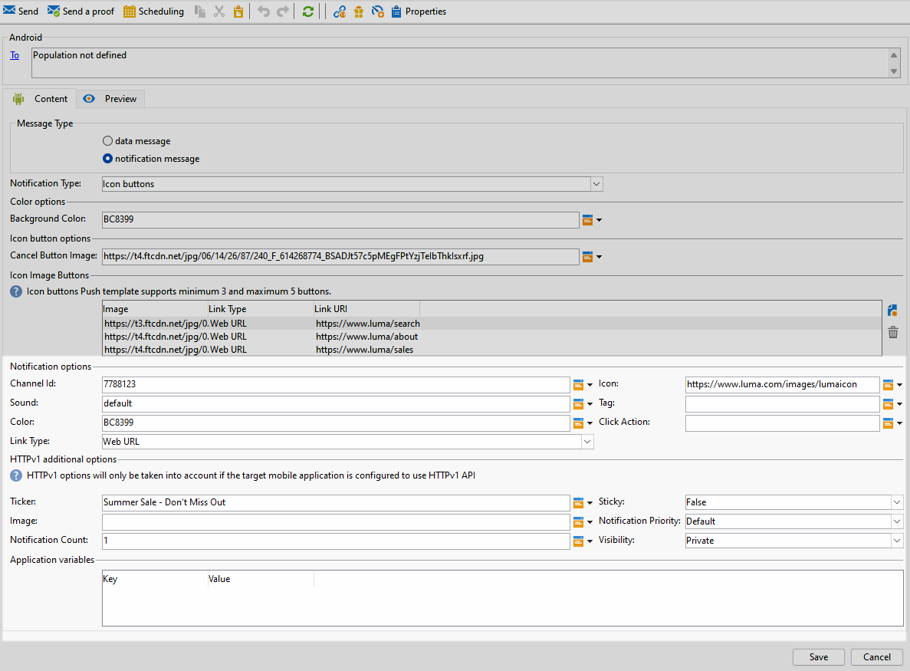
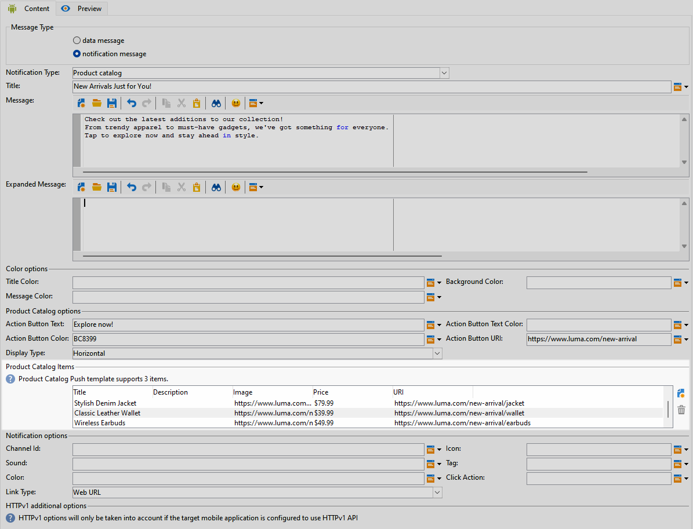
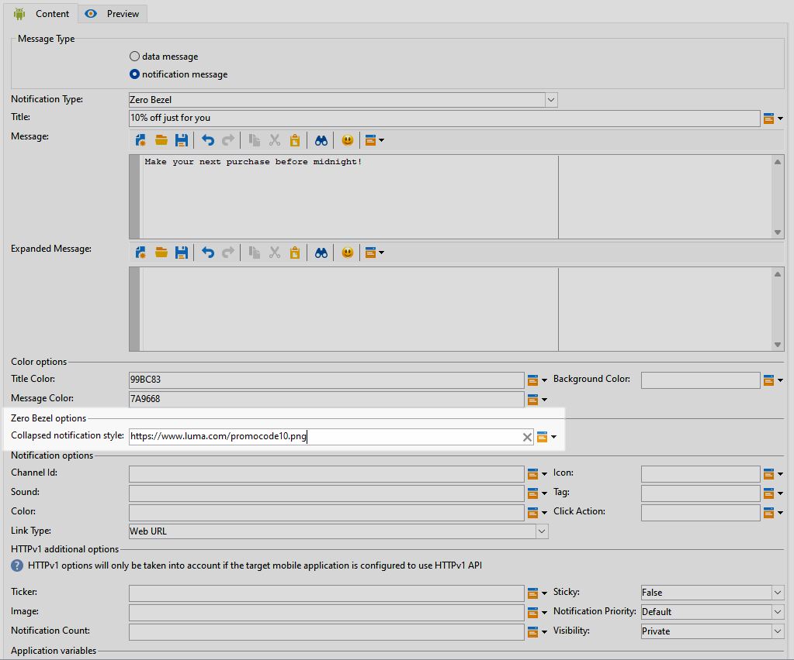

# Android 리치 푸시 게재 디자인 {#rich-push}

>[!IMPORTANT]
>
>리치 푸시 알림을 디자인하기 전에 먼저 V2 커넥터를 구성해야 합니다. 자세한 절차는 [이 페이지](https://experienceleague.adobe.com/en/docs/campaign-classic/using/sending-messages/sending-push-notifications/configure-the-mobile-app/configuring-the-mobile-application-android#configuring-external-account-android)를 참조하세요.

Firebase Cloud Messaging을 사용하면 두 가지 유형의 메시지 중에서 선택할 수 있습니다.

* **[!UICONTROL Data message]**&#x200B;은(는) 클라이언트 앱에서 처리됩니다. 이러한 메시지는 모바일 애플리케이션으로 직접 전송되며, 모바일 애플리케이션은 디바이스에 Android 알림을 생성하고 표시합니다. 데이터 메시지에는 사용자 정의 애플리케이션 변수만 포함됩니다.

* FCM SDK에 의해 자동으로 처리되는 **[!UICONTROL Notification message]**&#x200B;입니다. FCM은 클라이언트 앱을 대신하여 사용자의 장치에 메시지를 자동으로 표시합니다. 알림 메시지에는 사전 정의된 매개 변수 및 옵션 세트가 포함되어 있지만 사용자 지정 애플리케이션 변수를 사용하여 추가로 개인화할 수 있습니다.

인터페이스에서 스크롤 막대가 비활성화된 경우 **[!UICONTROL Administration]** `>` **[!UICONTROL Platform]** `>` **[!UICONTROL Options]**&#x200B;에 액세스하여 **[!UICONTROL XtkUseScrollBar]** 옵션을 1로 설정하십시오.

## Android 알림의 콘텐츠 정의 {#push-message}

푸시 게재가 만들어지면 다음 템플릿 중 하나를 사용하여 해당 콘텐츠를 정의할 수 있습니다.

* **기본값**&#x200B;을 사용하면 간단한 아이콘과 함께 제공되는 이미지를 사용하여 알림을 보낼 수 있습니다.

* **기본**&#x200B;은(는) 알림에 텍스트, 이미지 및 단추를 포함할 수 있습니다.

* **회전판**&#x200B;을 사용하면 사용자가 이동할 수 있는 텍스트 및 여러 이미지로 알림을 보낼 수 있습니다.

* **아이콘 단추**&#x200B;를 사용하면 아이콘과 해당 이미지를 사용하여 알림을 보낼 수 있습니다.

* **입력란**&#x200B;은(는) 알림을 통해 사용자 입력과 피드백을 직접 수집합니다.

* **제품 카탈로그**&#x200B;에는 다양한 제품 이미지가 표시됩니다.

* **제품 평가**&#x200B;를 통해 사용자는 피드백을 제공하고 제품에 대한 등급을 매길 수 있습니다.

* **타이머**&#x200B;에 알림에 실시간 카운트다운 타이머가 포함되어 있습니다.

* **베젤 제로**&#x200B;는 이미지의 전체 배경 표면을 사용하며 텍스트는 원활하게 오버레이됩니다.

이러한 템플릿을 개인화하는 방법에 대한 자세한 내용을 보려면 아래 탭으로 이동하십시오.

>[!BEGINTABS]

>[!TAB 기본값]

1. **[!UICONTROL Notification type]** 드롭다운에서 **[!UICONTROL Default]**&#x200B;을(를) 선택합니다.

   

1. 메시지를 작성하려면 **[!UICONTROL Title]** 및 **[!UICONTROL Message]** 필드에 텍스트를 입력하십시오.

   

1. 다이내믹 개인화 필드를 사용하여 콘텐츠를 정의하고, 데이터를 개인화하고, 다이내믹 콘텐츠를 추가합니다. [자세히 알아보기](../send/personalize.md)

1. 푸시 알림을 추가로 개인화하려면 푸시 알림의 **[!UICONTROL Notification options]** 및 **[!UICONTROL HTTPv1 additional options]**&#x200B;을(를) 구성합니다. [자세히 알아보기](#push-advanced)

   

메시지 콘텐츠를 정의했으면 테스트 구독자를 사용하여 메시지를 미리 보고 테스트할 수 있습니다.

>[!TAB 기본]

1. **[!UICONTROL Notification Type]** 드롭다운에서 **[!UICONTROL Basic]**&#x200B;을(를) 선택합니다.

   

1. 메시지를 작성하려면 **[!UICONTROL Title]**, **[!UICONTROL Message]** 및 **[!UICONTROL Expanded message]** 필드에 텍스트를 입력하십시오.

   알림을 확장할 때 **[!UICONTROL Expanded message]**&#x200B;이(가) 표시되는 동안 **[!UICONTROL Message]** 텍스트가 축소된 보기에 나타납니다.

   

1. 다이내믹 개인화 필드를 사용하여 콘텐츠를 정의하고, 데이터를 개인화하고, 다이내믹 콘텐츠를 추가합니다. [자세히 알아보기](../send/personalize.md)

1. **[!UICONTROL Color options]** 메뉴에서 **[!UICONTROL Title]**, **[!UICONTROL Message]** 및 **[!UICONTROL Background]**&#x200B;에 대한 16진수 색상 코드를 입력합니다.

1. 필요한 경우 **[!UICONTROL Remind later button]**&#x200B;을(를) 추가합니다. 해당 필드에 **[!UICONTROL Reminder Text]** 및 **날짜**&#x200B;를 입력합니다.

   **[!UICONTROL Reminder Date]** 필드에는 에포크(초)를 나타내는 값이 필요합니다.

1. **[!UICONTROL Add button]**&#x200B;을(를) 클릭하고 다음 필드를 채웁니다.

   * **[!UICONTROL Label]**: 단추에 표시되는 텍스트입니다.
   * **[!UICONTROL Link URI]**: 단추를 클릭할 때 실행할 URI를 지정합니다.

   푸시 알림에 최대 3개의 버튼을 포함할 수 있는 옵션이 있습니다. **[!UICONTROL Remind later button]**&#x200B;을(를) 선택하는 경우 최대 두 개의 단추만 포함할 수 있습니다.

1. 단추에 연결된 URL의 **[!UICONTROL Link type]** 선택:

   * **[!UICONTROL Web URL]**: 웹 URL은 사용자를 온라인 콘텐츠로 안내합니다. 클릭하면 디바이스의 기본 웹 브라우저에서 를 열고 지정된 URL로 이동하라는 메시지가 표시됩니다.

   * **[!UICONTROL Deeplink]**: 딥링크는 앱이 닫힌 경우에도 앱 내의 특정 섹션으로 사용자를 안내하는 URL입니다. 클릭하면 대화 상자가 표시되어 사용자가 링크를 처리할 수 있는 다양한 앱 중에서 선택할 수 있습니다.

   * **[!UICONTROL Open App]**: 앱 URL을 열면 응용 프로그램 내의 콘텐츠에 직접 연결할 수 있습니다. 이를 통해 애플리케이션이 명확화 대화 상자를 거치지 않고 특정 유형의 링크에 대한 기본 핸들러로 자리매김할 수 있습니다.

   Android 앱 링크를 처리하는 방법에 대한 자세한 내용은 [Android 개발자 설명서](https://developer.android.com/training/app-links)를 참조하세요.

   

1. 푸시 알림을 추가로 개인화하려면 푸시 알림의 **[!UICONTROL Notification options]** 및 **[!UICONTROL HTTPv1 additional options]**&#x200B;을(를) 구성합니다. [자세히 알아보기](#push-advanced)

   

메시지 콘텐츠를 정의했으면 테스트 구독자를 사용하여 메시지를 미리 보고 테스트할 수 있습니다.

>[!TAB 회전]

1. **[!UICONTROL Notification Type]** 드롭다운에서 **[!UICONTROL Carousel]**&#x200B;을(를) 선택합니다.

   

1. 메시지를 작성하려면 **[!UICONTROL Title]**, **[!UICONTROL Message]** 및 **[!UICONTROL Expanded message]** 필드에 텍스트를 입력하십시오.

   알림을 확장할 때 **[!UICONTROL Expanded message]**&#x200B;이(가) 표시되는 동안 **[!UICONTROL Message]** 텍스트가 축소된 보기에 나타납니다.

   

1. 표현식 편집기를 사용하여 콘텐츠를 정의하고, 데이터를 개인화하고, 다이내믹 콘텐츠를 추가합니다. [자세히 알아보기](../send/personalize.md)

1. **[!UICONTROL Color options]** 메뉴에서 **[!UICONTROL Title]**, **[!UICONTROL Message]** 및 **[!UICONTROL Background]**&#x200B;에 대한 16진수 색상 코드를 입력합니다.

1. **[!UICONTROL Carousel]** 작동 방식 선택:

   * **[!UICONTROL Auto]**: 이미지를 슬라이드로 자동 순환하며 미리 정의된 간격으로 전환합니다.
   * **[!UICONTROL Manual]**: 사용자가 슬라이드 사이를 수동으로 스와이프하여 이미지를 탐색할 수 있습니다.

1. **[!UICONTROL Layout]** 드롭다운에서 **[!UICONTROL Filmstrip]** 옵션을 선택하여 기본 슬라이드와 함께 이전 및 다음 이미지의 미리 보기를 포함합니다.

1. **[!UICONTROL Add image]**&#x200B;을(를) 클릭하고 이미지 URL, 텍스트 및 작업 URL을 입력합니다.

   최소 3개의 이미지와 최대 5개의 이미지를 포함해야 합니다.

   

1. 푸시 알림을 추가로 개인화하려면 푸시 알림의 **[!UICONTROL Notification options]** 및 **[!UICONTROL HTTPv1 additional options]**&#x200B;을(를) 구성합니다. [자세히 알아보기](#push-advanced)

   

메시지 콘텐츠를 정의했으면 테스트 구독자를 사용하여 메시지를 미리 보고 테스트할 수 있습니다.

>[!TAB 아이콘 단추]

1. **[!UICONTROL Notification Type]** 드롭다운에서 **[!UICONTROL Icon buttons]**&#x200B;을(를) 선택합니다.

   

1. **[!UICONTROL Color options]** 메뉴에서 **[!UICONTROL Background]**&#x200B;에 대한 16진수 색상 코드를 입력합니다.

   

1. **[!UICONTROL Cancel button image]**&#x200B;의 URL을 제공하십시오.

1. **[!UICONTROL Icon image buttons]**&#x200B;에서 **[!UICONTROL Add image]**&#x200B;을(를) 클릭합니다. **이미지 URL**, **링크 유형** 및 **링크 URI**&#x200B;를 입력하세요.

   최소 3개의 이미지와 최대 5개의 버튼을 포함해야 합니다.

   

1. 푸시 알림을 추가로 개인화하려면 푸시 알림의 **[!UICONTROL Notification options]** 및 **[!UICONTROL HTTPv1 additional options]**&#x200B;을(를) 구성합니다. [자세히 알아보기](#push-advanced)

   

메시지 콘텐츠를 정의했으면 테스트 구독자를 사용하여 메시지를 미리 보고 테스트할 수 있습니다.

>[!TAB 입력란]

1. **[!UICONTROL Notification Type]** 드롭다운에서 **[!UICONTROL Input box]**&#x200B;을(를) 선택합니다.

   

1. 메시지를 작성하려면 **[!UICONTROL Title]**, **[!UICONTROL Message]** 및 **[!UICONTROL Expanded message]** 필드에 텍스트를 입력하십시오.

   알림을 확장할 때 **[!UICONTROL Expanded message]**&#x200B;이(가) 표시되는 동안 **[!UICONTROL Message]** 텍스트가 축소된 보기에 나타납니다.

   

1. **[!UICONTROL Color options]** 메뉴에서 **[!UICONTROL Title]**, **[!UICONTROL Message]** 및 **[!UICONTROL Background]**&#x200B;에 대한 16진수 색상 코드를 입력합니다.

1. **[!UICONTROL Input box options]** 메뉴에서 다음 옵션을 입력합니다.

   * **[!UICONTROL Input receiver name]**: 입력 받는 사람의 이름 또는 식별자를 입력합니다.
   * **[!UICONTROL Input text]**: **입력 상자**&#x200B;에 대한 텍스트를 입력하십시오.
   * **[!UICONTROL Feedback text]**: 회신 뒤에 표시할 텍스트를 입력하십시오.
   * **[!UICONTROL Feedback image]**: 회신 뒤에 표시되는 이미지의 URL을 추가합니다.

   

1. 푸시 알림을 추가로 개인화하려면 푸시 알림의 **[!UICONTROL Notification options]** 및 **[!UICONTROL HTTPv1 additional options]**&#x200B;을(를) 구성합니다. [자세히 알아보기](#push-advanced)

   

메시지 콘텐츠를 정의했으면 테스트 구독자를 사용하여 메시지를 미리 보고 테스트할 수 있습니다.

>[!TAB 제품 카탈로그]

1. **[!UICONTROL Notification Type]** 드롭다운에서 **[!UICONTROL Product catalog]**&#x200B;을(를) 선택합니다.

   

1. 메시지를 작성하려면 **[!UICONTROL Title]**, **[!UICONTROL Message]** 및 **[!UICONTROL Expanded message]** 필드에 텍스트를 입력하십시오.

   알림을 확장할 때 **[!UICONTROL Expanded message]**&#x200B;이(가) 표시되는 동안 **[!UICONTROL Message]** 텍스트가 축소된 보기에 나타납니다.

   

1. **[!UICONTROL Color options]** 메뉴에서 **[!UICONTROL Title]**, **[!UICONTROL Message]** 및 **[!UICONTROL Background]**&#x200B;에 대한 16진수 색상 코드를 입력합니다.

1. **[!UICONTROL Product catalog options]** 메뉴에서 다음 옵션을 입력하십시오.

   * **[!UICONTROL Action button text]**: 단추에 표시되는 텍스트입니다.
   * **[!UICONTROL Action button text color]**: 작업 단추 텍스트의 색입니다.
   * **[!UICONTROL Action button color]**: 동작 단추의 색입니다.
   * **[!UICONTROL Action button URI]**: 단추를 클릭할 때 실행할 URI를 지정합니다.
   * **[!UICONTROL Display type]**: 세로 또는 가로 표시 중에서 선택합니다.

   

1. **[!UICONTROL Product catalog items]** 메뉴에서 **[!UICONTROL Add]**&#x200B;을(를) 클릭하고 각 항목에 대해 다음 세부 정보를 입력합니다.

   * **[!UICONTROL Title]**
   * **[!UICONTROL Description]**
   * **[!UICONTROL Image URL]**
   * **[!UICONTROL Price]**
   * **[!UICONTROL URI]**

   최대 3개의 항목을 포함해야 합니다.

   

1. 푸시 알림을 추가로 개인화하려면 푸시 알림의 **[!UICONTROL Notification options]** 및 **[!UICONTROL HTTPv1 additional options]**&#x200B;을(를) 구성합니다. [자세히 알아보기](#push-advanced)

메시지 콘텐츠를 정의했으면 테스트 구독자를 사용하여 메시지를 미리 보고 테스트할 수 있습니다.

>[!TAB 제품 등급]

1. **[!UICONTROL Notification Type]** 드롭다운에서 **[!UICONTROL Product rating]**&#x200B;을(를) 선택합니다.

   

1. 메시지를 작성하려면 **[!UICONTROL Title]**, **[!UICONTROL Message]** 및 **[!UICONTROL Expanded message]** 필드에 텍스트를 입력하십시오.

   알림을 확장할 때 **[!UICONTROL Expanded message]**&#x200B;이(가) 표시되는 동안 **[!UICONTROL Message]** 텍스트가 축소된 보기에 나타납니다.

   

1. **[!UICONTROL Color options]** 메뉴에서 **[!UICONTROL Title]**, **[!UICONTROL Message]** 및 **[!UICONTROL Background]**&#x200B;에 대한 16진수 색상 코드를 입력합니다.

1. **[!UICONTROL Product rating options]** 메뉴에서 **[!UICONTROL Rating icon in unselected state]** 및 **[!UICONTROL Rating icon in selected state]**&#x200B;의 URL을 입력하십시오.

   

1. **[!UICONTROL Product rating items]** 메뉴에서 **[!UICONTROL Add]**&#x200B;을(를) 클릭하고 **[!UICONTROL Link URI]**&#x200B;을(를) 입력한 다음 **[!UICONTROL Link type]**&#x200B;을(를) 선택합니다.

   * **[!UICONTROL Web URL]**: 웹 URL은 사용자를 온라인 콘텐츠로 안내합니다. 클릭하면 디바이스의 기본 웹 브라우저에서 를 열고 지정된 URL로 이동하라는 메시지가 표시됩니다.

   * **[!UICONTROL Deeplink]**: 딥링크는 앱이 닫힌 경우에도 앱 내의 특정 섹션으로 사용자를 안내하는 URL입니다. 클릭하면 대화 상자가 표시되어 사용자가 링크를 처리할 수 있는 다양한 앱 중에서 선택할 수 있습니다.

   * **[!UICONTROL Open App]**: 앱 URL을 열면 응용 프로그램 내의 콘텐츠에 직접 연결할 수 있습니다. 이를 통해 애플리케이션이 명확화 대화 상자를 거치지 않고 특정 유형의 링크에 대한 기본 핸들러로 자리매김할 수 있습니다.

   * **[!UICONTROL Dismiss]**: 단추와 연결된 URL이 없습니다. 클릭하면 대화 상자나 인터페이스가 닫힙니다.

   최소 3개의 값과 최대 5개의 값을 포함해야 합니다.

   

1. 푸시 알림을 추가로 개인화하려면 푸시 알림의 **[!UICONTROL Notification options]** 및 **[!UICONTROL HTTPv1 additional options]**&#x200B;을(를) 구성합니다. [자세히 알아보기](#push-advanced)

   

메시지 콘텐츠를 정의했으면 테스트 구독자를 사용하여 메시지를 미리 보고 테스트할 수 있습니다.

>[!TAB 타이머]

1. **[!UICONTROL Notification Type]** 드롭다운에서 **[!UICONTROL Timer]**&#x200B;을(를) 선택합니다.

   

1. 메시지를 작성하려면 **[!UICONTROL Title]**, **[!UICONTROL Message]** 및 **[!UICONTROL Expanded message]** 필드에 텍스트를 입력하십시오.

   알림을 확장할 때 **[!UICONTROL Expanded message]**&#x200B;이(가) 표시되는 동안 **[!UICONTROL Message]** 텍스트가 축소된 보기에 나타납니다.

   

1. **[!UICONTROL Alternate title]**, **[!UICONTROL Alternate message]** 및 **[!UICONTROL Alternate expanded message]** 필드에 타이머가 만료된 후 표시할 텍스트를 입력하십시오.

1. **[!UICONTROL Color options]** 메뉴에서 **[!UICONTROL Title]**, **[!UICONTROL Message]**, **[!UICONTROL Background]** 및 **[!UICONTROL Timer]**&#x200B;에 대한 16진수 색상 코드를 입력합니다.

   

1. **[!UICONTROL Timer duration]**(초) 또는 **[!UICONTROL Timer end timestamp]**&#x200B;을(를) 특정 에포크 타임스탬프로 설정하고 타이머가 만료된 후 표시될 **[!UICONTROL Alternate image]** URL을 추가하십시오.

   

1. 푸시 알림을 추가로 개인화하려면 푸시 알림의 **[!UICONTROL Notification options]** 및 **[!UICONTROL HTTPv1 additional options]**&#x200B;을(를) 구성합니다. [자세히 알아보기](#push-advanced)

메시지 콘텐츠를 정의했으면 테스트 구독자를 사용하여 메시지를 미리 보고 테스트할 수 있습니다.

>[!TAB 베젤 제로]

1. **[!UICONTROL Notification Type]** 드롭다운에서 **[!UICONTROL Zero bezel]**&#x200B;을(를) 선택합니다.

   

1. 메시지를 작성하려면 **[!UICONTROL Title]**, **[!UICONTROL Message]** 및 **[!UICONTROL Expanded message]** 필드에 텍스트를 입력하십시오.

   알림을 확장할 때 **[!UICONTROL Expanded message]**&#x200B;이(가) 표시되는 동안 **[!UICONTROL Message]** 텍스트가 축소된 보기에 나타납니다.

   

1. **[!UICONTROL Color options]** 메뉴에서 **[!UICONTROL Title]**, **[!UICONTROL Message]** 및 **[!UICONTROL Background]**&#x200B;에 대한 16진수 색상 코드를 입력합니다.

1. **[!UICONTROL Zero bezel options]** 메뉴에서 **[!UICONTROL Collapsed notification style]** 필드에 이미지 URL을 추가합니다.

   

1. 푸시 알림을 추가로 개인화하려면 푸시 알림의 **[!UICONTROL Notification options]** 및 **[!UICONTROL HTTPv1 additional options]**&#x200B;을(를) 구성합니다. [자세히 알아보기](#push-advanced)

메시지 콘텐츠를 정의했으면 테스트 구독자를 사용하여 메시지를 미리 보고 테스트할 수 있습니다.

>[!ENDTABS]

## 푸시 알림 고급 설정 {#push-advanced}

### 알림 옵션 {#notification-options}

| 매개변수 | 설명 |
|---------|---------|
| **[!UICONTROL Channel ID]** | 알림의 채널 ID를 설정합니다. 이 채널 ID의 알림을 수신하려면 먼저 앱에서 이 채널 ID로 채널을 만들어야 합니다. |
| **[!UICONTROL Icon]** | 알림의 아이콘을 설정하여 프로필 디바이스에 표시합니다. |
| **[!UICONTROL Sound]** | 장치에서 알림을 받을 때 소리가 재생되도록 설정합니다. |
| **[!UICONTROL Tag]** | 알림 대화 상자에서 기존 알림을 바꾸는 데 사용되는 식별자를 설정합니다. 이렇게 하면 여러 알림이 누적되는 것을 방지하고 최신 관련 알림만 표시됩니다. |
| **[!UICONTROL Color]** | 알림의 아이콘 색상을 16진수 색상 코드로 설정합니다. |
| **[!UICONTROL Click action]** | 사용자 알림의 사용자 클릭과 관련된 작업을 설정합니다. |
| **[!UICONTROL Notification background color]** | 16진수 색상 코드로 알림 배경의 색상을 설정합니다. |
| **[!UICONTROL Link type]** | <ul><li>웹 URL: 웹 URL은 사용자를 온라인 컨텐츠로 안내합니다. 클릭하면 디바이스의 기본 웹 브라우저에서 를 열고 지정된 URL로 이동하라는 메시지가 표시됩니다.</li><li>딥링크: 딥링크는 앱이 닫힌 경우에도 앱 내의 특정 섹션으로 사용자를 안내하는 URL입니다. 클릭하면 대화 상자가 표시되어 사용자가 링크를 처리할 수 있는 다양한 앱 중에서 선택할 수 있습니다.</li><li> 앱 열기: 앱 열기 URL을 사용하면 애플리케이션 내의 콘텐츠에 직접 연결할 수 있습니다. 이를 통해 애플리케이션이 명확화 대화 상자를 거치지 않고 특정 유형의 링크에 대한 기본 핸들러로 자리매김할 수 있습니다.</li></ul> |

### HTTPv1 추가 옵션 {#additional-options}

| 매개변수 | 설명 |
|---------|---------|
| **[!UICONTROL Ticker]** | 알림의 티커 텍스트를 설정합니다. Android 5.0 Lollipop으로 설정된 장치에만 사용할 수 있습니다. |
| **[!UICONTROL Sticky]** | 활성화되면 사용자가 알림을 클릭한 후에도 알림이 계속 표시됩니다.  비활성화되면 사용자가 알림과 상호 작용할 때 알림이 자동으로 해제됩니다. 고정 동작을 사용하면 중요한 알림을 더 오랜 시간 동안 화면에 유지할 수 있습니다. |
| **[!UICONTROL Image]** | 알림에 표시할 이미지의 URL을 설정합니다. |
| **[!UICONTROL Notification Priority]** | 알림의 우선 순위 수준을 기본, 최소, 낮음 또는 높음으로 설정합니다. 우선 순위 수준은 알림이 표시되는 방식과 특정 시스템 설정을 우회할 수 있는지 여부에 영향을 주며 알림의 중요도와 긴급도를 결정합니다. 자세한 내용은 [FCM 설명서](https://firebase.google.com/docs/reference/fcm/rest/v1/projects.messages#notificationpriority)를 참조하세요. |
| **[!UICONTROL Notification Count]** | 애플리케이션 아이콘에 직접 표시할 읽지 않은 새 정보의 수를 설정합니다. 사용자는 이를 통해 보류 중인 알림 수를 빠르게 확인할 수 있습니다. |
| **[!UICONTROL Visibility]** | 공개, 비공개 또는 비밀일 수 있는 알림의 가시성 수준을 설정합니다. 표시 수준은 잠금 화면 및 기타 중요 영역에 표시되는 알림 콘텐츠의 양을 결정합니다. 자세한 내용은 [FCM 설명서](https://firebase.google.com/docs/reference/fcm/rest/v1/projects.messages#visibility)를 참조하세요. |
| **[!UICONTROL Application variables]** | 알림 동작을 정의할 수 있습니다. 이러한 변수는 완전히 사용자 정의할 수 있으며 모바일 디바이스로 전송되는 메시지 페이로드의 일부로 포함됩니다. |

