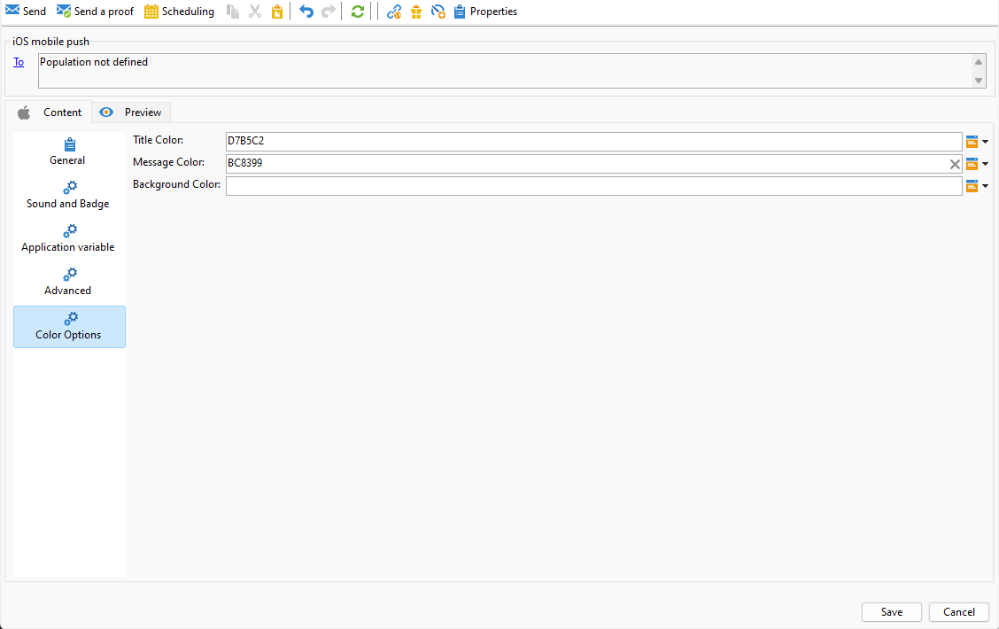
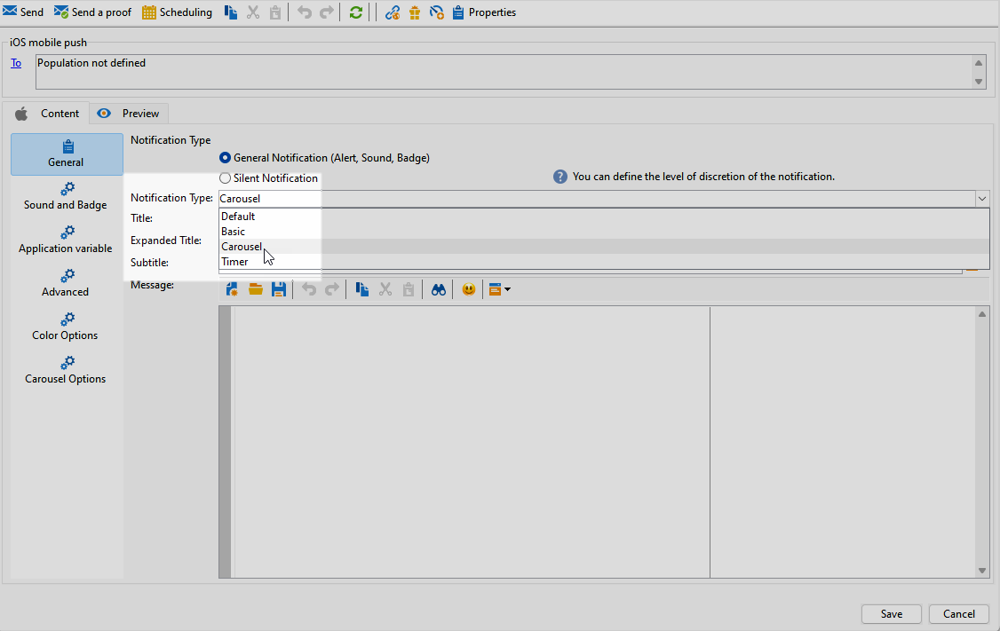

# iOS 리치 푸시 게재 디자인 {#rich-push}

>[!IMPORTANT]
>
>리치 푸시 알림을 디자인하기 전에 먼저 V2 커넥터를 구성해야 합니다. 자세한 절차는 [이 페이지](https://experienceleague.adobe.com/en/docs/campaign-classic/using/sending-messages/sending-push-notifications/configure-the-mobile-app/configuring-the-mobile-application)를 참조하세요.

## iOS 알림의 콘텐츠 정의 {#push-message}

푸시 게재가 만들어지면 다음 템플릿 중 하나를 사용하여 해당 콘텐츠를 정의할 수 있습니다.

* **기본값**&#x200B;을 사용하면 간단한 아이콘과 함께 제공되는 이미지를 사용하여 알림을 보낼 수 있습니다.

* **기본**&#x200B;은(는) 알림에 텍스트, 이미지 및 단추를 포함할 수 있습니다.

* **회전판**&#x200B;을 사용하면 사용자가 이동할 수 있는 텍스트 및 여러 이미지로 알림을 보낼 수 있습니다.

이러한 템플릿을 개인화하는 방법에 대한 자세한 내용을 보려면 아래 탭으로 이동하십시오.

>[!BEGINTABS]

>[!TAB 기본값]

1. **[!UICONTROL General notification (Alert, Sound, Badge)]**&#x200B;을(를) **[!UICONTROL Notification type]**(으)로 선택합니다.

1. **[!UICONTROL Notification Type]** 드롭다운에서 **[!UICONTROL Default]**&#x200B;을(를) 선택합니다.

   

1. 알림 센터에서 사용할 수 있는 알림 목록에 표시할 제목의 레이블을 **[!UICONTROL Title]** 필드에 입력합니다.

   이 필드에서는 iOS 알림 페이로드의 **title** 매개 변수의 값을 정의할 수 있습니다.

1. 선택적으로 iOS 알림 페이로드의 **자막** 매개 변수에 해당하는 **[!UICONTROL Subtitle]**&#x200B;을(를) 추가합니다.

1. 마법사의 **[!UICONTROL Message content]** 섹션에 메시지 내용을 입력합니다.

   

1. 알림에 대한 사운드 및 배지 옵션과 같은 추가 설정을 사용자 지정하려면 **[!UICONTROL Sound and Badge]** 탭으로 이동합니다. [자세히 알아보기](#sound-badge)

   

1. **[!UICONTROL Application variables]** 탭에서 **[!UICONTROL Application variables]**&#x200B;이(가) 자동으로 추가됩니다. 알림 동작을 정의할 수 있습니다. 예를 들어, 사용자가 알림을 활성화할 때 특정 애플리케이션 화면이 표시되도록 구성할 수 있습니다.

1. 추가 사용자 지정을 위해 푸시 알림에 사용할 수 있는 **[!UICONTROL Advanced options]**&#x200B;을(를) 살펴보십시오. [자세히 알아보기](#push-advanced)

   

1. 알림이 구성되면 알림을 미리 보려면 **[!UICONTROL Preview]** 탭을 클릭하십시오.

>[!TAB 기본]

1. **[!UICONTROL General notification (Alert, Sound, Badge)]**&#x200B;을(를) **[!UICONTROL Notification type]**(으)로 선택합니다.

1. **[!UICONTROL Notification Type]** 드롭다운에서 **[!UICONTROL Basic]**&#x200B;을(를) 선택합니다.

   

1. 메시지를 작성하려면 **[!UICONTROL Title]**,**[!UICONTROL Expanded message]**, **[!UICONTROL Message]** 및 **[!UICONTROL Expanded message]** 필드에 텍스트를 입력하십시오.

   알림을 확장할 때 **[!UICONTROL Expanded message]**&#x200B;이(가) 표시되는 동안 **[!UICONTROL Message]** 텍스트가 축소된 보기에 나타납니다.

   

1. 선택적으로 iOS 알림 페이로드의 **자막** 매개 변수에 해당하는 **[!UICONTROL Subtitle]**&#x200B;을(를) 추가합니다.

1. 알림에 대한 사운드 및 배지 옵션과 같은 추가 설정을 사용자 지정하려면 **[!UICONTROL Sound and Badge]** 탭으로 이동합니다. [자세히 알아보기](#sound-badge)

1. **[!UICONTROL Application variables]** 탭에서 **[!UICONTROL Application variables]**&#x200B;이(가) 자동으로 추가됩니다. 알림 동작을 정의할 수 있습니다. 예를 들어, 사용자가 알림을 활성화할 때 특정 애플리케이션 화면이 표시되도록 구성할 수 있습니다.

1. 추가 사용자 지정을 위해 푸시 알림에 사용할 수 있는 **[!UICONTROL Advanced options]**&#x200B;을(를) 살펴보십시오. [자세히 알아보기](#push-advanced)

   

1. **[!UICONTROL Color options]** 메뉴에서 **[!UICONTROL Title]**, **[!UICONTROL Message]** 및 **[!UICONTROL Background]**&#x200B;에 대한 16진수 색상 코드를 입력합니다.

   

메시지 콘텐츠를 정의했으면 테스트 구독자를 사용하여 메시지를 미리 보고 테스트할 수 있습니다.

>[!TAB 회전]

1. **[!UICONTROL General notification (Alert, Sound, Badge)]**&#x200B;을(를) **[!UICONTROL Notification type]**(으)로 선택합니다.

1. **[!UICONTROL Notification Type]** 드롭다운에서 **[!UICONTROL Carousel]**&#x200B;을(를) 선택합니다.

   

1. 메시지를 작성하려면 **[!UICONTROL Title]**, **[!UICONTROL Expanded Title]** 및 **[!UICONTROL Message]** 필드에 텍스트를 입력하십시오.

   

1. 알림에 대한 사운드 및 배지 옵션과 같은 추가 설정을 사용자 지정하려면 **[!UICONTROL Sound and Badge]** 탭으로 이동합니다. [자세히 알아보기](#sound-badge)

1. **[!UICONTROL Application variables]** 탭에서 **[!UICONTROL Application variables]**&#x200B;이(가) 자동으로 추가됩니다. 알림 동작을 정의할 수 있습니다. 예를 들어, 사용자가 알림을 활성화할 때 특정 애플리케이션 화면이 표시되도록 구성할 수 있습니다.

   

1. 추가 사용자 지정을 위해 푸시 알림에 사용할 수 있는 **[!UICONTROL Advanced options]**&#x200B;을(를) 살펴보십시오. [자세히 알아보기](#push-advanced)

1. **[!UICONTROL Color options]** 메뉴에서 **[!UICONTROL Title]**, **[!UICONTROL Message]** 및 **[!UICONTROL Background]**&#x200B;에 대한 16진수 색상 코드를 입력합니다.

1. **[!UICONTROL Carousel options]** 탭에서 **[!UICONTROL Carousel]**&#x200B;의 작동 방식 선택:

   * **[!UICONTROL Auto]**: 이미지를 슬라이드로 자동 순환하며 미리 정의된 간격으로 전환합니다.
   * **[!UICONTROL Manual]**: 사용자가 슬라이드 사이를 수동으로 스와이프하여 이미지를 탐색할 수 있습니다.

1. **[!UICONTROL Add image]**&#x200B;을(를) 클릭하고 **[!UICONTROL Image URL]**, **[!UICONTROL Text]** 및 **[!UICONTROL Action URL]**&#x200B;을(를) 입력합니다.

   최소 3개의 이미지와 최대 5개의 이미지를 포함해야 합니다.

   

메시지 콘텐츠를 정의했으면 테스트 구독자를 사용하여 메시지를 미리 보고 테스트할 수 있습니다.

>[!TAB 타이머]

1. **[!UICONTROL General notification (Alert, Sound, Badge)]**&#x200B;을(를) **[!UICONTROL Notification type]**(으)로 선택합니다.

1. **[!UICONTROL Notification Type]** 드롭다운에서 **[!UICONTROL Timer]**&#x200B;을(를) 선택합니다.

   

1. 메시지를 작성하려면 **[!UICONTROL Title]**,**[!UICONTROL Expanded title]**, **[!UICONTROL Message]** 및 **[!UICONTROL Expanded message]** 필드에 텍스트를 입력하십시오.

   알림을 확장할 때 **[!UICONTROL Expanded message]**&#x200B;이(가) 표시되는 동안 **[!UICONTROL Message]** 텍스트가 축소된 보기에 나타납니다.

   

1. 선택적으로 iOS 알림 페이로드의 **자막** 매개 변수에 해당하는 **[!UICONTROL Subtitle]**&#x200B;을(를) 추가합니다.

1. 알림에 대한 사운드 및 배지 옵션과 같은 추가 설정을 사용자 지정하려면 **[!UICONTROL Sound and Badge]** 탭으로 이동합니다. [자세히 알아보기](#sound-badge)

1. **[!UICONTROL Application variables]** 탭에서 **[!UICONTROL Application variables]**&#x200B;이(가) 자동으로 추가됩니다. 알림 동작을 정의할 수 있습니다. 예를 들어, 사용자가 알림을 활성화할 때 특정 애플리케이션 화면이 표시되도록 구성할 수 있습니다.

1. 추가 사용자 지정을 위해 푸시 알림에 사용할 수 있는 **[!UICONTROL Advanced options]**&#x200B;을(를) 살펴보십시오. [자세히 알아보기](#push-advanced)

1. **[!UICONTROL Color options]** 메뉴에서 **[!UICONTROL Title]**, **[!UICONTROL Message]** 및 **[!UICONTROL Background]**&#x200B;에 대한 16진수 색상 코드를 입력합니다.

   

1. **[!UICONTROL Timer]** 탭에서 **[!UICONTROL Timer duration]**(초) 또는 **[!UICONTROL Timer end timestamp]**&#x200B;을(를) 특정 에포크 타임스탬프로 설정합니다.

1. **[!UICONTROL Alternate title]**, **[!UICONTROL Alternate message]** 및 **[!UICONTROL Alternate image]** 필드에 타이머가 만료된 후 표시할 텍스트와 이미지를 입력하십시오.

   

메시지 콘텐츠를 정의했으면 테스트 구독자를 사용하여 메시지를 미리 보고 테스트할 수 있습니다.

>[!ENDTABS]

## 푸시 알림 고급 설정 {#push-advanced}

### 사운드 및 배지 옵션 {#sound-badge}

| 매개변수 | 설명 |
|---------|---------|
| **[!UICONTROL Clean Badge]** | 배지 값을 새로 고치려면 이 옵션을 활성화합니다. |
| **[!UICONTROL Value]** | 애플리케이션 아이콘에 읽지 않은 새 정보의 수를 직접 표시하는 데 사용할 숫자를 설정하십시오. |
| **[!UICONTROL Critical alert mode]** | 사용자의 전화기가 포커스 모드로 설정되어 있거나 iPhone이 음소거된 경우에도 알림에 사운드를 추가하려면 이 옵션을 활성화합니다. |
| **[!UICONTROL Name]** | 알림을 수신할 때 이동 단말기에서 재생할 사운드를 선택합니다. |
| **[!UICONTROL Volume]** | 사운드의 볼륨을 0에서 100으로 설정합니다. 사운드는 애플리케이션에 포함되어야 하며 서비스를 만들 때 정의되어야 합니다. |

### 고급 옵션 {#notification-options}

| 매개변수 | 설명 |
|---------|---------|
| **[!UICONTROL Mutable content]** | 모바일 애플리케이션에서 미디어 콘텐츠를 다운로드하도록 하려면 이 옵션을 활성화합니다. |
| **[!UICONTROL Thread-id]** | 관련 알림을 함께 그룹화하는 데 사용되는 식별자를 설정합니다. |
| **[!UICONTROL Category]** | 작업 단추를 표시할 범주 ID의 이름을 설정합니다. 이러한 알림은 사용자가 애플리케이션을 열거나 탐색하지 않고도 알림에 응답하여 다른 작업을 보다 빠르게 수행할 수 있도록 합니다. |
| **[!UICONTROL Target content ID]** | 알림을 열 때 앞으로 가져올 애플리케이션 창을 타겟팅하는 데 사용되는 식별자를 설정합니다. |
| **[!UICONTROL Launch image]** | 표시할 론치 이미지 파일의 이름을 설정합니다. 사용자가 응용 프로그램을 시작하도록 선택하면 응용 프로그램의 시작 화면 대신 선택한 이미지가 표시됩니다. |
| **[!UICONTROL Click action]** | 사용자 알림의 사용자 클릭과 관련된 작업을 설정합니다. |
| **[!UICONTROL Interruption level]** | <ul><li>활성: 기본적으로 설정되어 있으면 시스템에서 알림을 즉시 표시하고 화면을 켜며 사운드를 재생할 수 있습니다. 알림은 포커스 모드를 통과하지 않습니다.</li><li>수동: 화면에 불이 들어오거나 소리가 재생되지 않고 알림 목록에 알림이 추가됩니다. 알림은 포커스 모드를 통과하지 않습니다.</li><li> 시간에 민감함: 시스템에서 알림을 즉시 표시하고 화면을 켜며 사운드를 재생하고 포커스 모드를 중단할 수 있습니다. 이 수준에서는 Apple의 특별한 권한이 필요하지 않습니다.</li><li>심각: 시스템에서 알림을 즉시 표시하고 화면을 켜며 음소거 스위치나 포커스 모드를 무시합니다. 이 수준에는 Apple의 특별한 권한이 필요합니다.</li></ul> |
| **[!UICONTROL Relevance score]** | 관련성 점수를 0에서 100으로 설정합니다. 시스템은 이 옵션을 사용하여 알림 요약의 알림을 정렬합니다. |

