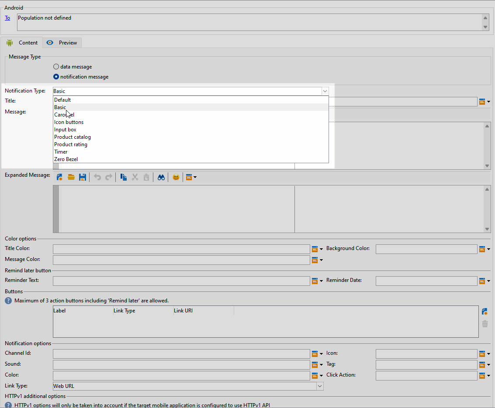
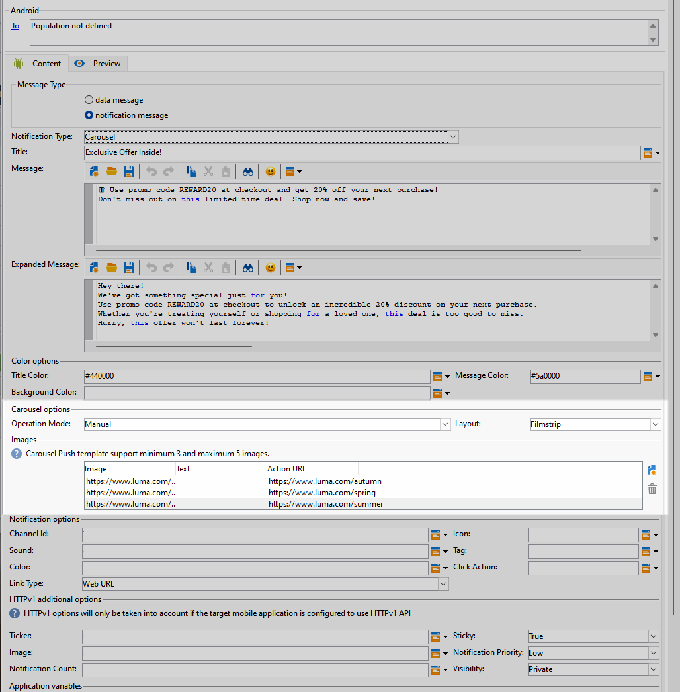

# Android 리치 푸시 게재 디자인 {#rich-push}

Firebase Cloud Messaging을 사용하면 두 가지 유형의 메시지 중에서 선택할 수 있습니다.

* 다음 **[!UICONTROL Data message]** 는 클라이언트 앱에서 처리됩니다. 이러한 메시지는 모바일 애플리케이션으로 직접 전송되며, 모바일 애플리케이션은 디바이스에 Android 알림을 생성하고 표시합니다. 데이터 메시지에는 사용자 정의 애플리케이션 변수만 포함됩니다.

* 다음 **[!UICONTROL Notification message]** FCM SDK에 의해 자동으로 처리됩니다. FCM은 클라이언트 앱을 대신하여 사용자의 장치에 메시지를 자동으로 표시합니다. 알림 메시지에는 사전 정의된 매개 변수 및 옵션 세트가 포함되어 있지만 사용자 지정 애플리케이션 변수를 사용하여 추가로 개인화할 수 있습니다.

## 알림 콘텐츠 정의 {#push-message}

푸시 게재가 만들어지면 해당 콘텐츠를 정의할 수 있습니다. 세 가지 템플릿을 사용할 수 있습니다.

* **기본 템플릿** 간단한 아이콘과 함께 제공되는 이미지를 사용하여 알림을 보낼 수 있습니다.

* **기본 템플릿** 알림에 텍스트, 이미지 및 버튼을 포함할 수 있습니다.

* **회전 템플릿** 사용자가 스와이프할 수 있는 텍스트 및 여러 이미지로 알림을 보낼 수 있습니다.

아래 탭을 탐색하여 각 템플릿에 대한 메시지를 작성하는 방법을 알아보십시오.

>[!BEGINTABS]

>[!TAB 기본 템플릿]

1. 다음에서 **[!UICONTROL Notification type]** 드롭다운, 선택 **[!UICONTROL Default]**.

   

1. 메시지를 작성하려면 **[!UICONTROL Title]** 및 **[!UICONTROL Message]** 필드.

   

1. 다이내믹 개인화 필드를 사용하여 콘텐츠를 정의하고, 데이터를 개인화하고, 다이내믹 콘텐츠를 추가합니다. [자세히 알아보기](../send/personalize.md)

1. 푸시 알림을 추가로 개인화하려면 **[!UICONTROL Notification options]** 및 **[!UICONTROL HTTPv1 additional options]** 푸시 알림. [자세히 알아보기](#push-advanced)

   

메시지 콘텐츠를 정의했으면 테스트 구독자를 사용하여 메시지를 미리 보고 테스트할 수 있습니다.

>[!TAB 기본 템플릿]

1. 다음에서 **[!UICONTROL Notification Type]** 드롭다운, 선택 **[!UICONTROL Basic]**.

   

1. 메시지를 작성하려면 **[!UICONTROL Title]**, **[!UICONTROL Message]** 및 **[!UICONTROL Expanded message]** 필드.

   다음 **[!UICONTROL Message]** 텍스트가 축소된 뷰에 나타나는 동안 **[!UICONTROL Expanded message]** 알림이 확장되면 표시됩니다.

   

1. 다이내믹 개인화 필드를 사용하여 콘텐츠를 정의하고, 데이터를 개인화하고, 다이내믹 콘텐츠를 추가합니다. [자세히 알아보기](../send/personalize.md)

1. 아래 **[!UICONTROL Color options]** 메뉴에 대한 16진수 색상 코드를 **[!UICONTROL Title]**, **[!UICONTROL Message]** 및 **[!UICONTROL Background]**.

1. 추가 **[!UICONTROL Remind later button]** 필요한 경우. 다음을 입력하십시오. **[!UICONTROL Reminder Text]** 및 **날짜** 을 참조하십시오.

   다음 **[!UICONTROL Reminder Date]** 필드에는 에포크(초)를 나타내는 값이 필요합니다.

1. 클릭 **[!UICONTROL Add button]** 다음 필드를 채웁니다.

   * **[!UICONTROL Label]**: 버튼에 표시되는 텍스트
   * **[!UICONTROL Link URI]**: 버튼을 클릭할 때 실행할 URI를 지정합니다.

   푸시 알림에 최대 3개의 버튼을 포함할 수 있는 옵션이 있습니다. 을(를) 선택한 경우 **[!UICONTROL Remind later button]**, 최대 2개의 버튼만 포함할 수 있습니다.

1. 다음 항목 선택 **[!UICONTROL Link type]** 단추에 연결된 URL:

   * **[!UICONTROL Web URL]**: 웹 URL은 사용자를 온라인 컨텐츠로 안내합니다. 클릭하면 디바이스의 기본 웹 브라우저에서 를 열고 지정된 URL로 이동하라는 메시지가 표시됩니다.

   * **[!UICONTROL Deeplink]**: 딥링크는 앱이 닫힌 경우에도 앱 내의 특정 섹션으로 사용자를 안내하는 URL입니다. 클릭하면 대화 상자가 표시되어 사용자가 링크를 처리할 수 있는 다양한 앱 중에서 선택할 수 있습니다.

   * **[!UICONTROL Open App]**: 앱 URL 열기를 사용하면 애플리케이션 내의 콘텐츠에 직접 연결할 수 있습니다. 이를 통해 애플리케이션이 명확화 대화 상자를 거치지 않고 특정 유형의 링크에 대한 기본 핸들러로 자리매김할 수 있습니다.

   Android 앱 링크를 처리하는 방법에 대한 자세한 내용은 을 참조하십시오. [Android 개발자 설명서](https://developer.android.com/training/app-links).

   

1. 푸시 알림을 추가로 개인화하려면 **[!UICONTROL Notification options]** 및 **[!UICONTROL HTTPv1 additional options]** 푸시 알림. [자세히 알아보기](#push-advanced)

   

메시지 콘텐츠를 정의했으면 테스트 구독자를 사용하여 메시지를 미리 보고 테스트할 수 있습니다.

>[!TAB 회전 템플릿]

1. 다음에서 **[!UICONTROL Notification Type]** 드롭다운, 선택 **[!UICONTROL Carousel]**.

   

1. 메시지를 작성하려면 **[!UICONTROL Title]**, **[!UICONTROL Message]** 및 **[!UICONTROL Expanded message]** 필드.

   다음 **[!UICONTROL Message]** 텍스트가 축소된 뷰에 나타나는 동안 **[!UICONTROL Expanded message]** 알림이 확장되면 표시됩니다.

   

1. 표현식 편집기를 사용하여 콘텐츠를 정의하고, 데이터를 개인화하고, 다이내믹 콘텐츠를 추가합니다. [자세히 알아보기](../send/personalize.md)

1. 아래 **[!UICONTROL Color options]** 메뉴에 대한 16진수 색상 코드를 **[!UICONTROL Title]**, **[!UICONTROL Message]** 및 **[!UICONTROL Background]**.

1. 방법 선택 **[!UICONTROL Carousel]** 운영됨:

   * **[!UICONTROL Auto]**: 이미지를 슬라이드로 자동 순환하여 사전 정의된 간격으로 전환합니다.
   * **[!UICONTROL Manual]**: 사용자가 슬라이드 사이를 수동으로 밀어 이미지를 탐색할 수 있습니다.

1. 다음에서 **[!UICONTROL Layout]** 드롭다운, 선택 **[!UICONTROL Filmstrip]** 기본 슬라이드와 함께 이전 및 다음 이미지의 미리 보기를 포함하는 옵션.

1. 클릭 **[!UICONTROL Add image]** 이미지 URL, 텍스트 및 작업 URL을 입력합니다.

   최소 3개의 이미지와 최대 5개의 이미지를 포함해야 합니다.

   

1. 푸시 알림을 추가로 개인화하려면 **[!UICONTROL Notification options]** 및 **[!UICONTROL HTTPv1 additional options]** 푸시 알림. [자세히 알아보기](#push-advanced)

   

메시지 콘텐츠를 정의했으면 테스트 구독자를 사용하여 메시지를 미리 보고 테스트할 수 있습니다.

>[!ENDTABS]

## 푸시 알림 고급 설정 {#push-advanced}

### 알림 옵션 {#notification-options}

| 매개변수 | 설명 |
|---------|---------|
| **[!UICONTROL Channel ID]** | 알림의 채널 ID를 설정합니다. 이 채널 ID의 알림을 수신하려면 먼저 앱에서 이 채널 ID로 채널을 만들어야 합니다. |
| **[!UICONTROL Icon]** | 알림의 아이콘을 설정하여 프로필 디바이스에 표시합니다. |
| **[!UICONTROL Sound]** | 장치에서 알림을 받을 때 소리가 재생되도록 설정합니다. |
| **[!UICONTROL Tag]** | 알림 대화 상자에서 기존 알림을 바꾸는 데 사용되는 식별자를 설정합니다. 이렇게 하면 여러 알림이 누적되는 것을 방지하고 최신 관련 알림만 표시됩니다. |
| **[!UICONTROL Color]** | 알림의 아이콘 색상을 16진수 색상 코드로 설정합니다. |
| **[!UICONTROL Click action]** | 사용자 알림의 사용자 클릭과 관련된 작업을 설정합니다. |
| **[!UICONTROL Notification background color]** | 16진수 색상 코드로 알림 배경의 색상을 설정합니다. |
| **[!UICONTROL Link type]** | <ul><li>웹 URL: 웹 URL은 사용자를 온라인 컨텐츠로 안내합니다. 클릭하면 디바이스의 기본 웹 브라우저에서 를 열고 지정된 URL로 이동하라는 메시지가 표시됩니다.</li><li>딥링크: 딥링크는 앱이 닫힌 경우에도 앱 내의 특정 섹션으로 사용자를 안내하는 URL입니다. 클릭하면 대화 상자가 표시되어 사용자가 링크를 처리할 수 있는 다양한 앱 중에서 선택할 수 있습니다.</li><li> 앱 열기: 앱 열기 URL을 사용하면 애플리케이션 내의 콘텐츠에 직접 연결할 수 있습니다. 이를 통해 애플리케이션이 명확화 대화 상자를 거치지 않고 특정 유형의 링크에 대한 기본 핸들러로 자리매김할 수 있습니다.</li></ul> |

### HTTPv1 추가 옵션 {#additional-options}

| 매개변수 | 설명 |
|---------|---------|
| **[!UICONTROL Ticker]** | 알림의 티커 텍스트를 설정합니다. Android 5.0 Lollipop으로 설정된 장치에서만 사용할 수 있습니다. |
| **[!UICONTROL Sticky]** | 활성화되면 사용자가 알림을 클릭한 후에도 알림이 계속 표시됩니다.  비활성화되면 사용자가 알림과 상호 작용할 때 알림이 자동으로 해제됩니다. 고정 동작을 사용하면 중요한 알림을 더 오랜 시간 동안 화면에 유지할 수 있습니다. |
| **[!UICONTROL Image]** | 알림에 표시할 이미지의 URL을 설정합니다. |
| **[!UICONTROL Notification Priority]** | 알림의 우선 순위 수준을 기본, 최소, 낮음 또는 높음으로 설정합니다. 우선 순위 수준은 알림이 표시되는 방식과 특정 시스템 설정을 우회할 수 있는지 여부에 영향을 주며 알림의 중요도와 긴급도를 결정합니다. 자세한 내용은 다음을 참조하십시오. [FCM 설명서](https://firebase.google.com/docs/reference/fcm/rest/v1/projects.messages#notificationpriority). |
| **[!UICONTROL Notification Count]** | 애플리케이션 아이콘에 직접 표시할 읽지 않은 새 정보의 수를 설정합니다. 사용자는 이를 통해 보류 중인 알림 수를 빠르게 확인할 수 있습니다. |
| **[!UICONTROL Visibility]** | 공개, 비공개 또는 비밀일 수 있는 알림의 가시성 수준을 설정합니다. 표시 수준은 잠금 화면 및 기타 중요 영역에 표시되는 알림 콘텐츠의 양을 결정합니다. 자세한 내용은 [FCM 설명서](https://firebase.google.com/docs/reference/fcm/rest/v1/projects.messages#visibility). |
| **[!UICONTROL Application variables]** | 알림 동작을 정의할 수 있습니다. 이러한 변수는 완전히 사용자 정의할 수 있으며 모바일 디바이스로 전송되는 메시지 페이로드의 일부로 포함됩니다. |
